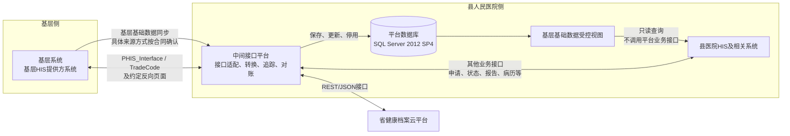

# 平台架构决策

- 状态：项目启动前基线
- 版本：V1.0
- 日期：2026年9月16日
- 合并来源：原DEC-0001至DEC-0005
- 适用范围：后台、管理端、嵌入端、数据库、接口适配、数据治理、部署和运维

本文统一记录项目已经确认的架构决策。完整业务范围和两条核心链路图见[总体方案](../plans/总体方案.md)，具体编码要求见[工程建设规范](../standards/engineering-guidelines.md)和[Java与AI Coding规范](../standards/java-coding-guidelines.md)。

## 1. 决策背景与目标

平台部署在县人民医院侧，连接县医院HIS及相关系统、基层系统和省健康档案云平台。核心团队规模有限，项目计划周期为八周，同时涉及旧版数据库、多个厂商、敏感医疗数据和不完整的参考接口合同。

架构需要满足以下目标：

1. 降低部署、联调和回退复杂度。
2. 明确县医院HIS厂商、基层系统提供方和平台的责任边界。
3. 支持SQL Server 2012 SP4既有环境。
4. 防止跨机构越权、重复写入和不确定结果被误判为成功。
5. 只保存平台职责所需的数据，避免形成新的完整临床数据副本。
6. 在正式合同未确认时保持可验证、可停止的工程状态。

## 2. 技术与部署基线

| 层次 | 决策 | 主要约束 |
| --- | --- | --- |
| 后台 | Java 17、Spring Boot 3.5、MyBatis模块化单体 | 一个后台制品统一构建、部署和回退；不按页面拆分微服务 |
| 页面 | Vue 3、TypeScript | 管理端与工作站嵌入端分开；服务端执行最终权限判断 |
| 数据库 | Microsoft SQL Server 2012 SP4、兼容级别110 | 安装医院批准的最新可用安全/GDR更新，并在同版本环境验证 |
| 数据库部署 | 医院Windows Server或现有SQL Server实例 | 不部署SQL Server Linux容器；平台应用可容器化并连接外部数据库 |
| 数据库变更 | Flyway版本化SQL脚本 | 测试与生产执行同一批次脚本，不允许人工直接改表代替迁移 |
| 接口合同 | 正式接口说明、OpenAPI/WSDL、字段映射和脱敏样例 | 参考资料不能直接视为生产合同，冲突项必须书面确认 |

选择模块化单体是为了减少两个月内的部署和跨服务协调成本。模块之间仍保持明确边界；只有出现独立扩容、独立发布或故障隔离的真实需求时，才评审拆分服务。

SQL Server 2012已经结束常规安全支持。医院必须通过网络隔离、最小权限、TLS、监控、备份恢复和升级计划控制剩余风险。JDBC驱动、Flyway、迁移、事务、锁、索引、字符集、时间精度和TLS必须在SQL Server 2012 SP4测试实例验证后才能上线。

## 3. 后台代码结构

Java基础包统一为`cn.zqkj.platform`：

| 层级 | 职责 |
| --- | --- |
| `common` | 统一响应、异常等跨业务且职责明确的基础类型，不包含业务规则 |
| `framework` | Spring、安全、过滤器和Web技术装配 |
| `system` | 机构、身份、权限、字典、参数及外部系统配置等平台管理能力 |
| `exchange` | 接口交换、运行记录和后续外部适配能力 |

业务域内部按实际需要使用`controller`、`domain`、`mapper`、`service`和`service.impl`分包，常规依赖方向为`controller -> service接口 -> service.impl -> mapper`；`domain/dto`保存输入，`domain/model`保存内部模型，`domain/vo`保存API输出且使用`VO`后缀，不依赖Spring、MyBatis或外部系统SDK。

业务域之间通过Service边界协作，不直接访问其他业务域的Mapper或数据表。一个数据表只允许一个业务域负责写入。不创建空包占位；`common`严格限制为统一响应和异常等明确基础类型，不引入无边界的`shared`或`utils`包。

## 4. 系统角色与交互边界

| 角色或系统 | 定义与责任 |
| --- | --- |
| 县人民医院 | 项目建设、数据使用和运行管理主体，确认范围、用途、权限和验收结论 |
| 县医院HIS | 县人民医院现行业务系统，通过平台库视图读取基层基础数据，通过正式接口参与其他业务 |
| 县医院HIS厂商 | 县医院HIS系统提供商，提出视图需求并完成HIS读取、业务接口和页面改造 |
| 基层卫生院 | 基层业务使用和数据来源机构，确认本机构业务、人员权限和验收结果 |
| 基层系统 | 上游接口资料描述的基层医疗卫生机构管理信息系统，提供权威基层数据及`PHIS_Interface`等能力 |
| 中间接口平台 | 汇聚基层基础数据、提供受控视图、适配业务接口，并负责追踪、对账、告警和审计 |

厂商名称只用于责任分工，不作为运行时数据流节点。接口台账必须填写实际源系统、目标系统、接口提供方和调用方。

### 4.1 总体关系图



### 4.2 基础数据读取链路

```text
基层系统
  -> 中间接口平台
  -> 平台数据库基础数据表
  -> 平台库受控只读视图
  -> 县医院HIS
```

该链路用于县医院HIS读取基层机构、人员、科室和目录等获批基础数据。平台负责取得、校验、保存、更新和核对基层基础数据；县医院HIS厂商根据正式字段合同在平台数据库上建立或维护受控视图；县医院HIS使用独立只读账号查询视图。

基础数据进入平台的具体方式尚未预设，必须根据正式来源合同逐类确认是接口、文件还是其他获批方式。县医院HIS读取平台基础数据的方式已经确定为数据库视图，不再为同一读取目的建设业务接口。

### 4.3 业务接口交互链路

```text
县医院HIS及相关系统
  ⇄ 中间接口平台
  ⇄ 基层系统PHIS_Interface及约定页面
```

该链路用于挂号缴费、双向转诊、电子病历、PACS、LIS、心电、分诊叫号、远程会诊和报告调阅等业务。通常由平台作为客户端调用基层系统提供的`PHIS_Interface`，按`TradeCode`完成查询或业务写入；电子病历、单点登录、远程会诊和报告调阅等场景还可能包含页面跳转或反向回写。

每项业务必须按正式合同登记实际源系统、目标系统、提供方、调用方、鉴权方式、交易码、成功条件、结果查询和异常处理规则。数据库视图不能替代业务接口，也不能绕过接口中的权限、校验、状态追踪和审计。

### 4.4 两条链路的强制边界

- 基层机构、人员、科室和目录等获批基础数据进入平台独立数据库。
- 县医院HIS厂商根据正式字段合同在平台库建立或维护受控视图，县医院HIS使用独立只读账号查询。
- 县医院HIS读取这些基层基础数据时使用数据库视图，不为同一目的重复建设平台业务接口。
- 挂号缴费、双向转诊、电子病历、PACS、LIS、心电、会诊和报告调阅等其他业务通过正式接口或约定页面交互。
- 任何系统不得通过视图写入平台基础表，也不得绕过接口规则直接修改另一方业务数据库。
- 平台从基层系统取得每类基础数据的具体方式仍以正式来源合同为准，不能根据视图需求反向编造接口。

## 5. 数据库与视图边界

平台数据库可以与县医院HIS数据库位于同一台服务器或同一SQL Server实例，但必须保持：

1. 平台库与HIS业务库为独立数据库。
2. 平台应用读写账号、HIS视图只读账号和视图DDL变更账号相互分离。
3. 平台库具有独立备份、恢复、容量和维护计划。
4. HIS运行账号只授予指定视图的`SELECT`权限，不授予平台基础表权限。
5. 视图DDL经过评审、版本化发布并具备回退方式。
6. 视图查询设置连接数、超时、批量、频率和运行时段限制，避免影响平台写入和HIS主业务。

基础数据来源合同必须确认字段、稳定主键、来源版本或更新时间、初始全量、增量、停用或删除语义和核对方式。视图合同至少确认用途、消费系统、字段类型、过滤范围、查询频率、数据量、性能基线、版本兼容期、授权清单、对账和回退方式。

缺少正式字段定义、来源更新语义、视图消费范围或权限清单时，相应同步和视图发布保持`CONTRACT_BLOCKED`。

## 6. 数据保存边界

平台长期保存以下数据：

- 经批准的基层机构、人员、科室、目录等基础数据及其来源和版本信息；
- 接口、机构、路由、版本、映射和留存配置；
- 不包含业务正文的交换状态、请求编号、业务引用、结果码和摘要校验值；
- 对账差异、告警、审计、清理结果和必要的运维记录。

平台默认不长期保存患者诊疗、病历、报告、影像、健康档案等业务正文。同步查询只在内存中转换和转发，响应结束后不持久化正文。

写入类接口只有在异步发送或故障恢复确有需要，并且逐接口批准最小字段、用途、期限、加密、访问和自动清理规则后，才能限时暂存正文。正文与交换记录逻辑隔离，以受控引用关联；普通列表、日志和错误响应不得展示正文。

密码、Token、Cookie、数据库密码、证书私钥和其他长期凭证不得进入数据库正文、代码、普通配置、日志、错误响应、前端包或浏览器本地存储。未脱敏生产报文不得进入代码仓库、测试样例或普通问题附件。

项目不预设未经医院批准的统一保存天数。留存期限、销毁方式、责任人和备份处理未确认时，接口不得上线。

## 7. 可靠性与状态规则

- 外部HTTP成功只代表通信完成，不自动代表业务成功。
- 超时或回执丢失进入“结果未知”，必须先查询目标系统或对账，不得直接重发。
- 写操作以机构、源系统、源业务主键、业务类型和版本建立防重复约束。
- 业务结果、发送任务进度和正文保存状态分别记录，不能互相替代。
- 暂存正文到期时停止新的发送并按批准规则清理；清理失败必须告警。
- 从旧备份恢复后先停止写入并核查备份点之后的目标结果，不能自动重放所有任务。
- 来源只能提供最新版本且无法证明原版本时，不得用新版本恢复旧请求。
- 人工操作只能登记证据、执行受控动作和协调责任，不能修改业务正文或覆盖权威结果。

## 8. 安全与权限决策

1. 所有管理和业务访问必须在服务端校验身份、角色、机构范围和接口权限。
2. 前端隐藏菜单或按钮不构成权限控制。
3. 外部调用优先使用专网；使用网络白名单和TLS，并限制报文及解压后大小。
4. SOAP/XML解析关闭外部实体，动态SQL只允许白名单字段。
5. 密钥和系统凭证集中管理，按环境和机构隔离并支持轮换。
6. 日志默认脱敏患者身份、地址、联系方式、病历和报告内容。
7. 单点登录票据短时、一次性，并绑定用户、机构、目标系统和业务上下文。
8. 跨机构访问、数据库变更、再次写入、敏感数据查看和导出必须记录审计。

## 9. 对工程实施的影响

- 当前只创建有实际代码的模块，正式合同确认前不增加推测性字段或外部适配器。
- 基层基础数据进入明确的业务模块和独立表，不放入通用交换大表或日志表。
- 平台库视图作为版本化数据库对象管理，HIS只读账号不配置为平台应用数据源。
- 每项接口进入开发前必须完成合同、脱敏样例、调用方向、权限、留存和验收条件确认。
- 测试分为单元测试、合同测试、SQL Server 2012数据库测试、权限测试、异常恢复测试和双方真实环境联调。
- 本地构建、合成数据和原型演练不能代替数据库兼容验证或厂商联调验收。

## 10. 风险与控制

| 风险 | 控制措施 |
| --- | --- |
| SQL Server 2012停止安全支持 | 网络隔离、最小权限、补丁清单、风险接受和升级计划 |
| 基础数据来源尚未正式确认 | 缺少合同保持`CONTRACT_BLOCKED`，不猜测字段和同步方式 |
| HIS视图影响平台性能 | 最小字段、只读权限、查询频率和容量基线，上线前压测 |
| 业务正文被当成基础数据长期复制 | 逐类分类；正文默认不留存，例外逐接口审批 |
| 超时后重复写入 | 结果未知先核查，使用稳定业务键和目标结果查询 |
| 跨机构越权 | 服务端机构范围校验、最小权限和审计测试 |
| 模块化单体退化为无边界代码 | 明确依赖方向、数据表写入权和模块评审 |
| 文档或原型被误认为已完成项目 | 所有结论标明证据范围，真实环境未验证时不得声称上线就绪 |

## 11. 验证与变更规则

上线前至少完成以下验证：

- Java 17构建、静态检查、单元测试和依赖兼容性；
- SQL Server 2012 SP4空库迁移、升级迁移、并发锁、索引、TLS、备份和恢复；
- 平台读写账号、HIS视图只读账号和DDL账号的权限隔离；
- 基础数据全量、增量、停用、重复、来源回退和对账；
- 接口正常、拒绝、超时、重复、结果未知、重启恢复和数据到期；
- 跨机构越权、凭证轮换、日志脱敏和敏感数据泄露检查；
- 视图性能、连接数、超时和对HIS及平台主业务的影响。

出现核心技术版本、数据库或部署方式、基础包结构、平台库视图、数据保存边界、患者匹配规则或外部访问入口变化时，在本文件追加“变更记录”章节，说明背景、决定、影响、风险、验证、回退和批准人。一般实现说明不新建独立决策文档。

如果当前基线无法满足医院安全、兼容、容量或可用性要求，必须先形成替代决策和可执行迁移、停机、回退及验收方案，再调整实现。

## 12. 变更记录

### 12.1 平台管理身份开发基线

- 日期：2026年9月16日
- 状态：开发基线已生效；生产启用前需医院信息科复核
- 背景：当前没有可用的平台管理用户、角色和机构权限数据，也没有LDAP、AD、OIDC或其他医院统一身份的正式合同。基层100-002和100-009是外部业务接口，不能推定为平台管理身份源。
- 决定：第一开发阶段使用平台本地管理账号。初始管理员通过一次性启动配置安全引导，不预置固定账号或密码；密码只保存强哈希，首次登录强制修改。管理端使用服务端会话、`HttpOnly`安全Cookie和CSRF防护，不在浏览器持久化存储长期令牌。
- 边界：本决定只处理平台管理身份，不替代健康云、基层HIS、电子病历或其他业务系统鉴权。
- 演进：如医院后续提供统一身份正式合同，通过身份适配边界替换本地凭证校验，保留平台用户、机构归属、角色、功能权限和机构数据范围模型。
- 验证：覆盖重复初始化、错误凭证、强制改密、会话过期、登出后重放、停用账号、CSRF、敏感日志和最后管理员保护。
- 回退：在本地身份尚未有效建立时保持默认拒绝；如已启用且发现安全问题，先禁用管理入口和现有会话，不通过后门账号恢复。

### 12.2 后端包结构简化

- 日期：2026年9月16日
- 状态：开发基线已生效
- 背景：原`foundation/system/modules`与模块内`api/application/domain/infrastructure`组合使简单管理功能跨越过多目录；机构、身份和权限虽属于同一平台管理链路，却分散在不同顶级包，定位和维护成本过高。
- 参考：借鉴RuoYi-Vue按`controller/domain/mapper/service`直接分包的可读性，不复制其全部多模块工程、通用工具集合或具体鉴权实现。
- 决定：保留当前单Maven后端，顶级包调整为`common`、`framework`、`system`和`exchange`；业务域内部统一按`controller/domain/mapper/service/service.impl`组织，`domain`再按`dto/model/vo`明确分类。机构、用户、角色、登录和后续平台配置统一归入`system`。
- 约束：`controller`只放Controller，输入放`domain/dto`，内部模型放`domain/model`，API输出放`domain/vo`并使用`VO`后缀；`service.impl`持有业务规则与事务；`mapper`只放MyBatis Mapper接口，XML位于`resources/mapper/<业务域>`，不增加Repository或MyBatis适配实现。跨业务域不得绕过Service调用其他Mapper。
- 影响：Java包名、测试包名、MyBatis namespace与XML资源目录同步迁移；HTTP合同、数据库表名和Flyway版本不因本次结构调整变化。
- 风险与验证：主要风险是包引用或Mapper namespace漏改；必须通过干净目录Maven测试、Mapper XML解析和全仓旧包名扫描。
- 回退：本次只调整源码组织，不迁移业务数据；可整体回退对应提交恢复原包名和资源路径。
