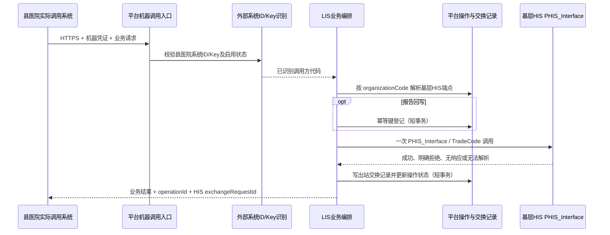

# LIS 平台侧适配调用链设计

日期：2026-09-24
状态：`600-001/002/003` 平台内部服务和 SOAP 协议适配已实现；入站 Key 管理、无状态认证及 `600-001` 平台入口/机构路由/交换记录编排已开发。`600-001` 当前按平台侧候选契约实现，县医院正式契约及真实 HIS 联调未确认；`600-002/003` 入站业务尚未实现。

## 1. 设计范围

本设计只覆盖中间接口平台到基层 HIS 的 LIS `600-001/002/003` 协议适配，以及平台已有运行记录能力如何承接该调用。不设计县医院 LIS 的医技操作页面，不推定县医院 HIS/专业系统向平台发起请求的 URL、认证方式、请求字段或响应格式，也不直接写入基层 HIS 数据库。

依据为项目已确认的 LIS 业务流程及《新版基层HIS与云平台V1.0接口文档》6.6 节（原始 PDF 印刷页 84-87；`600-002` 字段按印刷页 85-86 的原页图像核对）。公版材料是适配起点；具体 HIS 部署的交易码、字段、返回结构须经获准环境验证。

## 2. 已有平台能力和真实调用链

### 2.1 已有组件

| 组件 | 当前职责 | 对 LIS 的可复用性 |
| --- | --- | --- |
| `PhisService` / `PhisServiceImpl` | 面向业务服务；校验请求、按机构及环境解析已验证端点和授权码、统一调用、输出脱敏结果日志 | 承载 LIS 三笔强类型HIS交易；600-001已有独立候选入站编排 |
| `PhisProtocolClient` / `SoapPhisClient` | 按 `PhisTrade` 生成 `PHIS_Interface` SOAP 请求，发送一次请求并将响应转换为 `PhisResponse<T>` | SOAP 编码、验证码注入、超时和响应大小限制可复用 |
| `ExternalEndpointResolutionService` | 按 `PRIMARY_HIS`、部署环境和平台机构主键解析基层 HIS 端点及认证 | 按目标机构选连接；调用方不能提交或覆盖端点及验证码 |
| `ExchangeRuntimeRecordService` | 写入一次最终调用事实及脱敏摘要 | 由掌握真实调用方、来源业务编号的业务用例负责记录；不能在通用 SOAP 层臆造这些值 |

### 2.2 调用顺序

```text
县医院调用入口：校验外部系统 ID/Key，识别 COUNTY_HOSPITAL
  → LIS 业务用例：按 organizationCode 选择目标基层机构（路由，不做授权范围判断）
  → PhisService：按平台机构和环境解析 PRIMARY_HIS 配置
  → PhisProtocolClient：按 600-001/002/003 构造交易参数
  → SoapPhisClient：注入机构验证码并调用基层 HIS PHIS_Interface
  → PhisResponse：保留 HIS 明确业务成功/失败
  → LIS 业务用例：用来源请求编号写入脱敏 ExchangeRuntimeRecord
  → 按后续确认的县医院入口契约返回结果
```

平台机构代码来自业务请求，只用于选择对应基层 HIS 连接；平台不维护县医院调用方的机构白名单或交易权限矩阵。服务端将机构代码解析成机构主键并读取该机构端点配置，缺失或不可用时返回配置错误。HIS 源机构号、端点 URL 和验证码均从已验证端点派生，不接收县医院请求覆盖。通用协议客户端不接收端点 URL、机构验证码或日志摘要。

## 3. 编码前设计约束

### 3.1 建议的内部方法边界

已实现的平台内部 `600-001` 方法签名如下，不构成县医院对接 API：

```java
PhisResponse<List<LisItemEntry>> queryLisItems(
        long organizationId, ParameterEnvironment environment, LisItemQuery query);

PhisResponse<List<LisApplicationEntry>> queryLisApplication(
        long organizationId, ParameterEnvironment environment, LisApplicationQuery query);

PhisResponse<String> writeLisReport(
        long organizationId, ParameterEnvironment environment, LisReportWrite query);
```

协议客户端接收 `PhisInvocationContext` 和不含验证码/交易码的 DTO。三个方法都是平台到基层 HIS 的内部调用层，不是县医院可直接调用的 HTTP API。县医院只调用平台；平台负责 ID/Key 识别、机构路由、HIS 参数映射、交换编号及报告回写幂等。HIS 来源机构号必须从平台选择的已验证端点上下文派生，不能由县医院请求或上层业务 DTO 提交。

候选对象职责：

- `LisItemQuery`：机构编码、包类型。机构编码和包类型按公版约束必填；`600-001` 样例规定的中文键按现有 SOAP 参数风格原样映射。
- `LisItemEntry`：包及明细字段。公版表格把金额、单价、数量也写成字符串型，样例却给出数值；在测试 HIS 样例确认前不转换成 `BigDecimal` 或推断空值规则。
- `LisApplicationQuery`：只包含申请单 ID、业务 ID、门诊号、住院号等查询标识。原始 PDF 明确基层 HIS 交易中的机构 ID 必填、四种申请标识可空；平台从已验证端点上下文补入机构 ID。由于公版未定义组合查询及宽查询的安全边界，平台要求至少提供一种标识，并在目标部署验证多个标识如何组合。
- `LisApplicationEntry`：按原始 PDF 可辨认的33个字段映射为可空标量文本；费用、类型等数值不转换，患者与就诊数据仅在内存中返回，不公开为管理端 VO，也不写入运行记录。
- `LisReportWrite`：内部协议层只接收已编码报告字符串，并原样放入 HIS 的 `入参`，不二次编码。FHIR 版本、资源结构、报告状态和修订规则未确认前，不作临床内容校验或转换；已实现的服务方法不能替代入口侧审核状态和幂等校验。

### 3.2 鉴权、范围和副作用

1. 平台入口只校验外部系统 ID/Key 对应的外部系统已登记且启用，认证结果用于识别 `callerSystemCode`。不再叠加管理用户、交易级权限或调用方机构范围授权。请求机构代码仅用于业务路由，并须能解析到已配置、已验证的基层 HIS 端点。
2. `600-001/002` 是只读目标调用。结果若由县医院 LIS 持久化，保存位置及用途属于县医院侧契约；平台不因“查询”默认缓存患者申请或目录。
3. `600-003` 是目标写操作。目标机构由业务请求指定并按端点配置路由；只接受经县医院入口 ID/Key 识别的调用方，`callerSystemCode` 从服务端认证结果取得，不能由请求正文伪造。
4. `ExchangeRuntimeRecord` 写在业务用例层，字段仅包含 `requestId`、交易码、调用方/目标、机构代码、允许的来源记录引用、结果码、脱敏说明和耗时。完整 FHIR、患者信息、验证码、SOAP/XML 正文不得进入交换记录、普通日志或审计摘要。
5. 外部 SOAP 调用不包在数据库长事务中；交换记录是调用结果的最小留痕，不与目标 HIS 写入组成分布式事务。

### 3.3 失败语义

| 情况 | 平台现有/目标语义 | 是否重发 |
| --- | --- | --- |
| 请求 DTO 不完整或格式错误 | `PhisRequestException`；发送前失败 | 否 |
| 当前机构端点或凭证不可用 | `PhisConfigurationException`；未调用目标系统 | 否 |
| `600-001/002` 超时、断连 | `PhisCommunicationException`；查询结果未知，向调用方返回受控错误并保留调用事实 | 不自动重试；重新查询须由业务入口策略决定 |
| `600-003` 超时、断连 | 结果未知；先按经确认的 HIS 回读/核实办法确认是否已保存 | 禁止自动重发 |
| HIS 明确 `result=0` | `PhisResponse.failure` 保留业务拒绝及脱敏错误信息 | 不自动重试 |
| 成功响应字段形状不符 | `PhisProtocolException`；查询或写入结果无法按契约确认 | 尤其写报告时视作结果未知，先核实 |
| 同一请求重复到达平台 | 入口的幂等键和唯一约束须由调用入口契约定义；现有通用 SOAP 层不具备业务防重依据 | 未定幂等契约前不自动重放写操作 |

## 4. 当前实现顺序

1. **已完成：**三笔交易已接入 `PhisProtocolClient`、`SoapPhisClient`、`PhisRequestValidator`、`PhisService`、`PhisServiceImpl`。`600-001` 使用公版项目包字段；`600-002` 按原始 PDF 映射申请响应字段；`600-003` 原样发送调用方交付的已编码字符串。三者均复用机构端点解析、授权码注入、单次发送和统一错误语义。
2. **部分完成：**`POST /api/integration/v1/lis/item-packages/query` 已提供600-001只读查询候选入口；通过外部系统 ID/Key 识别调用方，按机构代码路由，从已验证端点派生HIS来源机构号，生成 `operationId`/出站 `requestId`，并在出站调用结束后写入脱敏交换记录。字段和返回结构只作为平台实现候选，尚未由县医院签收。
3. **待完成：**以获准脱敏样例固化协议兼容测试，再在隔离测试环境执行真实探测。测试替身不能替代真实联调；写报告必须使用授权测试申请并能核对目标保存状态。

## 5. 编码前反例检查

| 反例 | 设计防护 |
| --- | --- |
| 请求指定不存在或未配置的机构代码 | 将其作为路由解析失败返回，不调用 HIS；不将此检查实现为调用方机构白名单 |
| 请求正文伪造 `callerSystemCode` | 只从已验证的外部系统 ID 取得调用方代码 |
| 外部系统 ID 不存在、Key 错误或系统停用 | 入站认证失败，返回 401；不调用 HIS，也不写 HIS 交换记录 |
| HIS 已保存报告但 SOAP 响应超时 | 标记结果未知，交换记录不记成明确失败；先回读核查，不自动重发 |
| 患者/申请响应完整写入运行记录 | DTO 与日志分离；交换记录只写脱敏摘要，不保存原始响应 |
| 把 `600-002` 多个查询键擅自设为任意一个必填 | 按目标 HIS 确认的组合规则校验；公版资料未说明时保持待定 |
| 把原始 FHIR 再 Base64 编码一次 | 在县医院入口与 SOAP 入参边界明确编码所有权后只编码一次 |
| 为看似通用而让 PACS/心电共用 LIS 报告结构 | 仅抽取实际重复的传输机制；专业报告映射各自保持边界 |

## 6. 验证记录

- 执行命令：`mvn -f backend/pom.xml -Dtest=SoapPhisClientTest,PhisServiceImplTest test`
- 结果：43 项测试通过，0 失败，0 错误；Maven Checkstyle 检查通过。
- 三笔交易的 SOAP 请求和响应使用本机回环 HTTP 测试服务及合成数据，不含真实患者或生产机构数据。这验证平台报文组装和映射，不证明真实 HIS 部署已支持相同字段、值域或返回结构。
- 本次未执行真实 HIS 调用，因此 B10-13 和 B10-14 均未完成。

## 7. 阶段判断

三笔 LIS 交易的平台内部适配层已实现；`600-001` 具备平台候选入站入口、调用方认证、机构路由、目标调用编排及脱敏交换记录，使用合成响应的服务与HTTP边界测试通过。尚未连接真实 HIS 或县医院正式调用系统，因此测试不代表真实联调。`600-002` 的字段清单由原始 PDF 图像确认，目标部署的返回一致性仍待实测。`600-003` 只实现传输已编码报告字符串的内部方法；真实入口编码、FHIR配置、审核前置、结果核查和幂等仍待确认。

验证明细见[600-001平台候选入口验证记录](../verification/2026-09-24-lis-600001-platform-entry.md)。

本文件同时记录事前调用链设计和平台协议层测试证据；不代表真实 HIS 联调或业务验收已经完成。

## 8. 县医院调用入口业务设计建议

本节定义平台侧建议的业务边界，供下一轮入口设计使用；它不是已确认的县医院 API 契约。平台已经维护外部系统身份和机构端点，但现有认证凭证用于平台向外部 HIS 发起连接，不是县医院调用平台的入站 Key。入站调用可复用“外部系统”作为调用方登记对象，补充调用 Key 校验即可，不需要再建设一套独立机器身份平台。

### 8.1 县医院调用方识别

县医院系统通过独立业务入口访问平台，例如 `/api/integration/v1/lis/...`。调用方提交外部系统 ID 和 Key；平台据外部系统登记校验 ID、Key 和启停状态，认证成功后从服务端上下文取得调用方系统代码。Key 只用于证明调用方身份，不承载患者、机构或业务数据。现有管理端不得拿来承载该调用。

现有外部系统登记已有稳定 `systemCode` 和启停状态，但没有“县医院调用平台”的入站 Key 字段或校验器；机构端点凭证属于反向方向，不能拿来校验县医院。若沿用外部系统管理，需要为入站 Key 增加安全保存/轮换能力（只保存不可逆校验值，不回显 Key）。入口只需确认调用方是已登记且启用的县医院系统，不另建按交易、按机构的权限矩阵。请求中的平台 `organizationCode` 是业务路由参数：用于找到对应基层 HIS 端点并检查配置可用，不作为额外的调用权限限制。调用方身份代码由验证后的系统 ID 映射得出，不接受请求正文自行声明；源 HIS 机构号仍由平台端点配置派生。

### 8.2 机构路由与基层端点解析

请求携带平台稳定的 `organizationCode`，表示本次业务目标基层机构。平台将它解析为内部 `organizationId`，并通过已启用、已验证的 `PRIMARY_HIS` 端点读取该机构对应的 `sourceOrganizationId`。这是为完成业务路由所需的存在性和配置检查，不比较调用方的机构授权范围。交易 DTO 中 HIS 所需的“机构编码/机构ID”由端点配置生成，不从县医院请求正文采信。

`600-003` 的 HIS 报文没有独立机构字段，因此入口必须显式提供平台 `organizationCode`；平台据此解析目标端点，不从 FHIR 正文推断目标。若请求机构代码不存在、未配置或端点未通过校验，返回明确的机构/接口配置错误。

当前内部 `LisItemQuery.organizationCode` 和 `LisApplicationQuery.organizationId` 仍可承载源 HIS 机构值，是协议适配对象，不应原样作为入站 API DTO 暴露。接入 Controller 前，应改为由已解析端点上下文填入，或增加清晰的内部映射边界。

### 8.3 交易调用与编号

编号分为三层，避免把链路追踪、一次业务操作和一次实际出站混成同一个号：

- **`X-Request-Id`：**链路追踪头，可记录调用方传入值用于日志关联；不能作为授权依据或写操作幂等键。
- **`operationId`：**平台为每个入站业务操作生成 UUID 并返回调用方。报告写入状态查询使用此编号。
- **出站 `requestId`：**每次平台实际向基层 HIS 发出交易时生成 UUID，作为 `ExchangeRuntimeRecord` 唯一编号。一笔业务操作若在平台内确实产生多次出站调用，各次调用各有一条记录和独立编号。

两笔查询每次实际调用基层 HIS，都生成独立的出站 `requestId` 并记录实际发送结果；查询超时表示本次结果未取得，不在平台后台自动重发。调用方发起新查询时作为新操作处理。响应同时返回入口 `operationId` 和出站 `requestId`：前者关联一次入站操作，后者供双方定位基层 HIS 交换记录；两者都不能替代写操作幂等键。

报告回写另要求 `Idempotency-Key`。幂等范围为“认证调用方 + 平台机构 + 交易码 + 幂等键”。平台在调用 HIS 前短事务登记操作和请求摘要：

- 新键：创建 `IN_PROGRESS` 操作后最多发送一次；
- 同键同请求：若已有明确结果，返回既有结果；处理中返回操作状态，不再次发送；
- 同键不同请求：返回冲突，不执行写入；
- 发送前可确定未出平台：可由调用方用相同键重试；
- 请求可能已送达但无响应：记为 `UNKNOWN`，禁止自动重发，必须先走目标 HIS 查询/人工核实流程。

幂等操作记录应与 `ExchangeRuntimeRecord` 分开：前者管重试和结果状态，后者记录每次真实出站交换。现有 `exch_exchange_record.request_id` 唯一约束只防止同一 requestId 重复插入记录，不会防止 HIS 重复保存报告。请求摘要可保存长度及带密钥摘要用于同键内容比较；不得保存 FHIR 正文或普通哈希形式的可猜测敏感业务内容。实现前需按 SQL Server 2012 SP4 与 SQL 规范设计表、唯一键和状态迁移。

### 8.4 交换记录与敏感数据边界

每次实际发往基层 HIS 的交易，在业务编排层写一条 `ExchangeRuntimeRecord`。调用方代码取已识别的外部系统代码，目标系统固定为 `PRIMARY_HIS`，平台机构代码取本次路由机构，交易码固定为实际交易码，requestId 由平台生成。`sourceRecordId` 使用本次平台操作编号或双方约定的不含患者身份的业务引用；禁止写入患者姓名、身份证、就诊号、申请单正文。

交换摘要只写允许的低敏元数据：例如 `600-001` 项目包类型、`600-002` 返回条数而不记查询标识值、`600-003` 编码载荷字节数与受控摘要。验证码、SOAP/XML、FHIR、患者资料和报告文本不得写入交换表、普通日志或 API 错误消息。发送前认证失败或参数校验失败不是一次 HIS 交换，不应伪造出站交换记录；如需安全审计，应走独立安全审计事件。

结果映射应区分 `SUCCESS`、HIS 明确业务拒绝 `FAILURE`、连接或响应缺失 `NO_RESPONSE`、响应格式无法解析 `INVALID_RESPONSE`。报告回写在 `NO_RESPONSE`/响应不完整场景同时把幂等操作置为 `UNKNOWN`，不能将“没有收到结果”包装为“基层未保存”。记录写入使用短事务，不跨越 SOAP 调用持有数据库事务。

### 8.5 候选调用流程与 API 草案

建议的调用路径草案（尚待调用方确认，不代表冻结接口）：

| 业务 | 候选路径 | 关键输入 |
| --- | --- | --- |
| 项目包查询 | `POST /api/integration/v1/lis/item-packages/query` | 平台 `organizationCode`；LIS 下游包类型由平台固定为“检验” |
| 申请单查询 | `POST /api/integration/v1/lis/applications/query` | 平台 `organizationCode`、至少一个经确认的申请检索条件 |
| 报告回写 | `POST /api/integration/v1/lis/reports` | 平台 `organizationCode`、调用方业务操作引用、已约定编码的报告负载；HTTP `Idempotency-Key` |
| 回写状态查询 | `GET /api/integration/v1/operations/{operationId}` | 平台操作编号；校验县医院 ID/Key，机构代码只用于结果关联 |

成功响应包含平台 `operationId` 与交易结果。报告回写响应还须表达 `UNKNOWN` 及是否需要核实；不能用通用 500 让调用方自行猜测是否可以重发。申请查询响应应由县医院确认实际使用字段后做白名单裁剪，避免把协议层可辨认的全部患者字段默认透传。



### 8.6 入口契约与服务边界草案

以下是平台端可以先行固定的契约骨架。外部系统 ID 使用登记对象的稳定 `systemCode`（如 `COUNTY_HOSPITAL`），不使用数据库自增主键作为长期对接标识。建议 HTTP 请求头为 `X-External-System-Id`、`X-External-System-Key`；Key 仅在认证时使用，不放入 JSON、不回显、不写日志。外部系统管理页负责配置/重置该入站 Key，库内只保存不可逆校验值，现有服务端点认证资料仍只用于平台出站调用。

业务请求 DTO 只包含业务字段，不包含 `callerSystemCode`、基层 HIS 源机构号、端点地址或验证码：

| 交易 | 入站业务字段 | 服务端补充及调用 | 成功响应 |
| --- | --- | --- | --- |
| `600-001` | `organizationCode` | LIS 平台入口固定使用“检验”包类型；按平台机构代码解析 `organizationId` 和已验证端点；从端点取 HIS 源机构编码后调用现有 `PhisService` | `operationId`、出站 `requestId`、交易结果、项目包列表 |
| `600-002` | `organizationCode`、申请 ID/业务 ID/门诊号/住院号之一或经确认的组合 | 从端点取 HIS 源机构 ID；其余检索条件原样按正式契约校验后调用 | `operationId`、出站 `requestId`、交易结果、申请信息白名单 |
| `600-003` | `organizationCode`、幂等键、已约定编码的 FHIR 报告 | 从端点选目标；建立幂等操作后只调用一次，不重复编码报告字符串 | `operationId`、出站 `requestId`、回写结果或 `UNKNOWN` |

Controller 只负责绑定请求、Bean Validation 和取得已认证外部系统身份；`LisIntegrationService` 负责将 `organizationCode` 解析为平台 `organizationId`、派生源 HIS 机构号、调用 `PhisService`、映射响应并写交换记录。不得让 Controller 直接访问 SOAP 客户端或让县医院请求 DTO 复用内部 HIS DTO。`600-002` 的协议 DTO 只包含查询标识，目标 HIS 机构 ID 从可信端点上下文补入；LIS `600-001` 入站 DTO 不暴露其他专业的包类型。

入口应使用独立路径和认证过滤器处理 ID/Key。当前 `SecurityConfiguration` 默认要求管理端 Cookie 会话并启用 CSRF；`/api/integration/**` 需走专用无状态安全规则，关闭浏览器 CSRF 要求，由外部系统 ID/Key 过滤器完成认证。此规则仅对集成入口生效，管理端会话与 CSRF 规则保持原样。Key 比较失败统一 401；过滤器不得把 Key 写入 MDC、访问日志、异常文本或响应。

编号及记录的职责如下：

- 已有 `RequestTraceFilter` 继续接收或生成 `X-Request-Id`，用于 HTTP 链路日志和错误响应；它允许调用方传入合规值，因此不得直接作为交换记录唯一键或报告幂等键。
- 外部系统认证成功且请求通过格式校验后，Controller 生成平台 UUID `operationId`；认证失败和请求格式错误发生在操作受理前，只返回 HTTP `requestId`。路由完成、即将发起基层 HIS 调用时，业务用例另生成唯一出站 UUID `requestId`，调用结束后写入 `ExchangeRuntimeRecord`。一个入站交易目前对应一次出站交易；如业务流程拆成多笔 HIS 调用，每笔分别生成交换编号。
- `600-003` 使用单独的 `Idempotency-Key`。相同调用方、机构、交易和 Key 的相同报告返回原操作结果；同 Key 不同报告拒绝；HIS 已可能收到但平台未拿到结果时置 `UNKNOWN`，调用方不得因超时换 Key 自动重发。幂等登记/状态不由 `exch_exchange_record` 替代。
- 每条出站交换记录的 `callerSystemCode` 来自认证后的外部系统登记，`targetSystemCode=PRIMARY_HIS`，`organizationCode` 来自路由后的平台机构，`interfaceCode` 使用交易码 `600-001/002/003`。报告及患者正文不入日志或交换表；查询摘要仅写包类型、返回条数等非患者内容。

建议的入口结果语义：

| 场景 | HTTP/业务语义 | HIS 交换记录 |
| --- | --- | --- |
| ID/Key 错误，系统不存在或停用 | `401 AUTHENTICATION_FAILED`，返回 HTTP `requestId` | 不写；尚未受理业务操作 |
| 请求格式错误 | `400 INVALID_REQUEST`，返回 HTTP `requestId` | 不写；尚未受理业务操作 |
| 机构代码无法解析或该机构无可用 HIS 端点 | `404 ORGANIZATION_NOT_FOUND` 或 `409 HIS_ENDPOINT_UNAVAILABLE`，返回 `operationId`；尚未发起 HIS 调用时不生成 `exchangeRequestId` | 不写；尚未调用 HIS |
| 平台路由查询或交换记录存储不可用 | `503`，返回已生成的 `operationId`；如已发起 HIS 调用，还返回 `exchangeRequestId` | 路由不可用时不写；记录库不可用时无法持久化 |
| HIS 明确业务成功/拒绝 | HTTP `200`，业务结果分别为 `SUCCESS`/`FAILURE` | 写 `SUCCESS`/`FAILURE` |
| HIS 超时、断连或未收到响应 | `502`，返回 `operationId`、出站 `exchangeRequestId` 和结果未知语义 | 写 `NO_RESPONSE` |
| 收到但无法解析 HIS 响应 | `502`，返回 `operationId` 和出站 `exchangeRequestId` | 写 `INVALID_RESPONSE` |

管理端交换记录仍使用现有 `exchange:read` 人员权限和机构过滤；本设计没有开放县医院直接查询平台交换记录的 API。县医院只通过本次响应中的 `requestId` 联系平台定位。若后续确实要提供状态查询，应只针对 `600-003` 幂等操作结果设计，不暴露通用交换记录查询。

### 8.7 开发与页面就绪判断

**结论：业务主线已确定，县医院到平台的入口契约尚未冻结；平台到基层 HIS 的目标部署行为尚未真实验证。** 两段契约分别处理：县医院确认调用平台时提交的申请标识、报告负载及需要接收的结果；平台负责基层 HIS 交易码、HIS 参数映射、Base64 编码、目标重复处理和超时后核实能力，不要求县医院直接对接基层 HIS。

可以先进入的工作：

1. **管理页面设计与实现：**在现有“配置 / 外部系统”页面扩展调用 Key 设置，不新建独立的机器身份页面。系统资料区显示 Key“未配置/已配置”，提供生成或轮换入口；Key 明文只在本次响应和当前抽屉内存显示，关闭后清除，不进入浏览器持久化存储；与现有按机构配置的出站 HIS 凭证分区。轮换前确认旧 Key 失效，使用现有 `configuration:write`、rowversion冲突和审计模式。
2. **平台基础实现：**已新增外部系统入站 Key 哈希字段、受控生成与轮换管理 API、单向校验、管理审计及 `/api/integration/**` 独立无状态安全链。认证只识别已登记且启用的外部系统 ID/Key，不进行机构白名单或逐交易授权；Key 只证明外部系统身份。OpenAPI登记管理轮换接口及600-001平台候选入口；候选入口字段与返回仍待县医院确认。
3. **不依赖厂商契约的内部整理：**确保 LIS 源机构号只从已验证端点派生，并让内部协议 DTO 与外部请求 DTO 分离；使用合成数据验证平台端到端组装和安全错误边界。

扩展至600-002/003并冻结县医院到平台的入口契约前，需确认：

- 调用方、提供方、接口负责人、测试/生产网络路径和凭证交付方式；
- `600-001` 的目录是否满足县医院 LIS 使用场景及所需响应字段；平台内部已固定按 LIS 交易查询“检验”目录，不让县医院切换到检查或体检目录；
- 县医院 LIS 实际可提供的 `600-002` 申请标识、平台请求字段，以及它需要的申请响应白名单和平台业务结果；
- 县医院 LIS 向平台提供的 `600-003` FHIR 版本/资源、原始或已编码负载形式、审核/签发门槛、报告修订业务及平台幂等键约定；
- 县医院可访问的平台地址、认证头、HTTP 封装与各交易返回字段。

平台另外负责核实基层 HIS 公版/实际部署交易码、HIS 查询键组合和返回字段、FHIR 接受规则、报告目标端重复能力、超时回读方式、下游认证和获准测试网络。县医院不确认这些下游 HIS 技术契约，也不直接访问基层 HIS。

因此，**入站 Key 设置和平台基础认证已完成；600-001只读业务的候选平台入口已开发并通过合成数据单元/HTTP测试。管理端仍不承担县医院 LIS 业务操作页面。真实县医院契约、真实基层HIS请求、SQL交换记录真库回读以及600-002/003入站链路尚未验证。**

### 8.8 冻结入口契约前的确认项

平台侧复用外部系统登记识别县医院并校验 ID/Key；机构代码用于路由到基层 HIS 连接，不做额外机构范围授权。县医院只确认“县医院 LIS ↔ 平台”入口契约。平台单独负责“平台 ↔ 基层 HIS”的交易适配、HIS 来源机构号派生、报告编码/幂等和超时后核实。当前已在 `600-002` 内部适配中将 HIS 机构 ID 改为从所选端点上下文派生；县医院申请查询字段、报告负载与平台返回契约仍待确认。

### 8.9 对照已确认流程图的实现核对

流程图定义的是县医院专业系统只调用平台，平台再调用基层 HIS。以下核对只陈述当前代码状态，不把内部协议测试当作业务闭环：

| 流程节点 | 流程图要求 | 当前实现 | 判断 |
| --- | --- | --- | --- |
| 县医院维护基层外检项目对码 | 县医院依据 `600-001` 返回的基层检验目录，在县医院侧维护基层项目编码与本地 LIS 检验项目的对应关系；平台不决定映射 | 本平台只提供基层目录查询候选入口，没有县医院 LIS 对码页面或映射数据 | 对码责任属于县医院；平台不代维护、不裁定映射 |
| 基层开立外检申请、县医院操作员按单取单 | 基层医生开立“检验项目—外检项目”并出具单据；患者持单到县医院，科室操作员录入单据信息；县医院 LIS 经平台查询既有申请 | 本平台仓库不实现两侧临床页面；`600-002` 还没有县医院入站 Controller | 当前只存在基层 HIS 内部查询适配；未接通县医院 LIS 经平台取单 |
| 县医院专业系统调用中间接口平台 | 县医院以机器身份向平台提交业务请求 | 外部系统 ID/Key 无状态认证已实现；目前只有 `600-001` 项目包查询入口 | 认证通路存在，申请查询与报告入口未接通 |
| 平台验证机构并调用基层 HIS | 平台解析 `organizationCode`，从机构端点派生 HIS 来源机构号、地址和凭证，再调用 PHIS/TradeCode | `600-001` 编排已按此完成；`600-002/003` 只有内部 `PhisService`/SOAP 适配 | 目录链候选可走；申请与回写还未进入平台入口编排 |
| 基层 HIS 返回已开立的外检申请，平台交给 LIS | 对县医院操作员输入的单据查询信息，平台查询基层已有申请并将结果返回 LIS；结果须保留基层项目编码，供县医院应用其本地对码；本流程不创建申请 | `LisApplicationEntry` 可映射公版响应，但尚无外部响应 VO 白名单和入口 Controller | 尚未形成县医院可调用的申请查询业务；需确认返回基层项目编码；查询不得变成申请创建 |
| 县医院 LIS 解析对码并由操作员核对 | 县医院 LIS 按申请中的基层项目编码查找县医院侧对码，操作员核对患者、就诊、申请和本地执行项目；无唯一有效对码时停止 | 平台没有县医院侧对码或临床页面能力 | 属于县医院业务系统职责；平台只传递目录/申请数据，不作项目决策 |
| LIS 形成报告并交给平台 | 报告由县医院 LIS 产生，不由平台生成或修改 | `writeLisReport` 只接受内部已编码字符串；没有县医院入站接口、审核门槛或业务关联校验 | 尚未形成报告回写业务 |
| 平台调用 HIS 保存报告并回传结果 | 平台调用 `600-003`，把目标结果返回县医院 | SOAP 客户端可发送和解析；无持久幂等操作、状态查询及平台入口结果映射 | 只能证明内部协议适配，业务链未通 |
| 平台数据库保存调用事实与摘要 | 平台留存调用时间、机构/系统、交易、编号、结果及脱敏摘要，不留正文 | `600-001` 已写 `ExchangeRuntimeRecord`；`600-002/003` 编排记录尚未实现 | 仅目录交易已落入平台记录 |
| 目标无响应时结果未知 | 先核实基层 HIS 是否已保存，不自动重发 | HIS 通用 SOAP 层不自动重试；600-003 尚无入站幂等状态或受控目标端核实流程 | 自动重发已被禁止，但业务级未知状态闭环未完成 |

**流程核对结论：**当前实现没有把县医院直接连到基层 HIS；已完成的是外部系统认证、候选 `600-001` 入口和平台到基层 HIS 的目录查询/留痕。尚未完成的是 `600-002` 申请从县医院经平台取回、`600-003` 报告从县医院经平台写回，以及报告结果未知的持久状态和核实闭环。因此当前 LIS 主业务流程**还没有跑通**，不能以内部 SOAP 测试或 `600-001` 页面验证代替。
