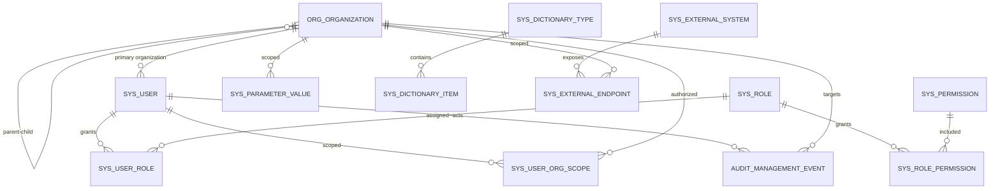

# 平台管理底座技术设计

| 属性 | 内容 |
| --- | --- |
| 版本 | V0.1 |
| 对应任务 | DEV-003 |
| 适用范围 | DEV-004至DEV-011 |
| 数据库 | Microsoft SQL Server 2012 SP4，兼容级110 |
| 验证状态 | 主版本注释已重构；待开发库按主版本重建后执行SQL Server 2012完整复验 |

## 1. 设计目标

平台管理底座先解决“谁在管理、管理哪个机构、可以执行什么功能、使用哪些受控配置、变更如何追溯”五个问题。本设计不包含基层基础数据同步、接口注册中心或医疗业务状态。

核心不变式：

1. 平台机构是管理和权限主数据，不被100-008上游机构直接覆盖。
2. 功能权限和机构数据范围独立判定，请求必须同时满足两者。
3. 客户端传入的用户、角色和机构不构成授权依据。
4. 外部凭证只在平台库保存安全引用，不保存明文密码、token、验证码或私钥。
5. 审计记录是管理变更的事实，普通业务入口不提供修改和删除。

## 2. 模块与表写入权

| 模块 | 职责 | 唯一写入对象 | 禁止事项 |
| --- | --- | --- | --- |
| `system`机构服务 | 平台机构档案、层级和启停 | `org_organization` | 不写用户、角色或上游基础数据 |
| `system`身份服务 | 本地身份、初始化、会话与改密边界 | `sys_user`及会话对象 | 不将外部业务鉴权当作管理身份 |
| `system`权限服务 | 角色、权限和用户机构范围 | `sys_role`、`sys_permission`及关联表 | 不直接写机构表 |
| `system`配置服务 | 参数、字典、外部系统和环境端点 | `sys_parameter_value`、`sys_dictionary_*`、`sys_external_*` | 不保存医疗业务目录或明文凭证 |
| `audit`服务（按需创建） | 管理操作和安全事件追溯 | `audit_management_event` | 不提供业务修改、删除或通用报文保存 |

服务间通过公开Service或不可变读模型协作，不得跨业务直接调用其他Mapper。

## 3. 核心关系模型

### 3.1 机构关系

- `org_organization.id`是平台内部主键，`organization_code`是可对外使用的唯一稳定编码。
- `parent_id`只引用本表，应用层禁止自引用和形成循环。
- 机构停用不物理删除，不得导致已有审计事实或历史关联丢失。
- 机构类型值在D-02关闭前不由数据库预置虚构枚举。

### 3.2 身份与权限关系

- `sys_user.primary_organization_id`定义用户主归属，不等于用户可访问的全部机构。
- `sys_user_role`解决用户与角色多对多，`sys_role_permission`解决角色与功能权限多对多。
- `sys_user_organization_scope`单独保存用户可访问机构，不从角色名称、前端菜单或请求参数推导。
- 机构范围采用显式授权，不因父机构范围自动获得全部后代机构；普通管理入口只能在已有范围内的父机构下新建子机构，新机构随后显式加入创建人的范围。
- 后端权限代码由功能清单注册，数据库角色只能选择已注册权限，不允许任意字符串获得服务端权限。
- 初始管理员是唯一预置管理角色的安全引导用途；不预置其他未经批准业务角色。

### 3.3 配置关系

- `sys_parameter_value`只保存代码注册的参数键，包含值类型、环境和可选机构作用域。
- `sys_dictionary_type`与`sys_dictionary_item`只服务平台管理界面和系统逻辑，不收纳药品、诊疗、耗材、诊断等业务目录。
- `sys_external_system`表示已确认系统，`sys_external_endpoint`表示该系统在某环境和机构作用域下的受控地址。
- `credential_reference`只能保存医院批准密钥来源的引用标识，API不返回完整引用值。

### 3.4 审计关系

- 审计记录保存操作人快照、机构范围、动作、目标类型/标识、结果和脱敏变更摘要。
- 已认证操作保留用户内部ID和登录名快照；登录失败只保留已脱敏主体提示，不保存密码或完整凭证。
- 审计与业务变更的一致性在具体用例中设计，不用“吞掉审计失败”换取表面业务成功。

## 4. 迁移版本计划

| 版本 | 业务域 | 对象 | 处理决定 |
| --- | --- | --- | --- |
| V0100 | `exchange` | 现有交换记录 | 正式基线评审前直接收敛主版本，不使用注释补丁掩盖基线缺陷 |
| V0200 | `organization` | `org_organization` | 先建立被用户、权限范围和配置引用的机构主数据 |
| V0300 | `identity_access` | 用户、角色、权限与机构范围 | 通过外键引用V0200机构；由身份和授权模块共同维护各自对象 |
| V0400 | `configuration` | 参数、字典、外部系统与端点 | 配置域独立主版本，避免身份主版本在共享环境执行后继续膨胀 |
| V0500 | `audit` | `audit_management_event` | 引用用户/机构只作查询关联，同时保留操作人快照 |

Flyway版本是历史执行顺序，不代表功能开发优先级。当前数据库仍处于正式基线评审前，V0100、V0200和V0300的缺陷直接收敛至各自主版本；已有开发库必须重建，不能继续使用旧校验和或残留对象。

## 5. 第一组权限代码

| 权限代码 | 用途 | 首次引入任务 |
| --- | --- | --- |
| `platform:bootstrap` | 仅在未完成安全引导时创建初始管理员 | DEV-004 |
| `organization:read` | 查询机构列表、树和详情 | DEV-005 |
| `organization:write` | 创建、修改、启用和停用机构 | DEV-005 |
| `identity:read` / `identity:write` | 查询和维护用户 | DEV-006 |
| `access:read` / `access:write` | 查询和维护角色、权限与机构范围 | DEV-006 |
| `configuration:read` / `configuration:write` | 查询和维护受控配置 | DEV-007/008 |
| `audit:read` | 在获批机构范围内查询管理审计 | DEV-009 |

`platform:bootstrap`不是普通角色可授予权限，只在平台没有任何管理员且一次性启动条件满足时由服务端判定。

## 6. API边界

| 边界 | 最小API | 服务端权限 |
| --- | --- | --- |
| 安全引导 | 初始化状态、一次性初始化 | 仅安全引导条件 |
| 会话 | 登录、登出、当前用户、修改密码 | 登录或已认证主体 |
| 机构 | 分页、树、详情、创建、修改、启停 | `organization:read/write`+机构范围 |
| 用户 | 分页、详情、创建、修改、启停、重置密码 | `identity:read/write`+机构范围 |
| 角色权限 | 角色CRUD、权限清单、用户角色、角色权限、用户机构范围 | `access:read/write`+机构范围 |
| 基础配置 | 参数、字典、外部系统和端点查询/修改/启停 | `configuration:read/write`+配置作用域 |
| 管理审计 | 分页和详情 | `audit:read`+机构范围 |

API详细请求和响应在对应实现任务中补入`contracts/openapi/platform-api-v1.yaml`。本设计不预先编造机构类型、角色名称和参数键。

## 7. 事务、并发与安全引导

- 机构、用户、角色、授权和配置修改使用`rowversion`防止无感知覆盖。
- 用户角色、角色权限和用户机构范围的替换分别在单个事务中完成。
- “至少一个有效管理员”和“用户不得授权停用机构”由应用服务锁定必要行后判定，不只依赖前端。
- 审计记录与成功的管理变更在同一本地数据库事务中保存；登录失败等无业务事务事件使用独立安全审计入口。
- 平台没有用户时，只允许读取引导状态和在一次性启动条件满足时初始化。
- 初始化事务创建第一个机构、管理员用户、平台管理角色、已注册权限和初始机构范围。
- 初始密码只保存强哈希，用户标记`must_change_password`；初始化成功后重复请求始终拒绝。
- 管理端使用服务端会话和`HttpOnly`安全Cookie；生产强制`Secure`，写请求执行CSRF校验，登出和账号停用使相关会话失效。

## 8. 待复核事项

- D-02：平台机构类型清单、最大层级及有依赖时的停用规则。
- D-03：除初始平台管理员外的预置管理角色；未复核前不预置。
- D-04：医院批准的凭证库或密钥服务；未确认前只实现凭证引用字段和脱敏边界。
- SQL Server 2012 SP4真库空库/升级迁移、并发、权限和恢复验证当前暂缓，不属于已完成证据。
