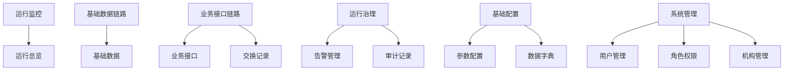

# 系统 UI 布局框架

- 日期：2026年9月16日
- 适用范围：县域接口平台管理端
- 终端：桌面端
- 视觉体系：Bootstrap Admin / Tabler
- 关联文档：[原型设计与验证](./原型设计与验证.md)

## 1. 目标与边界

本规范统一平台的应用外壳、菜单、页面结构、列表、详情、处理工作区和通用组件。后续页面不得各自设计一套标题、筛选、表格、分页或详情结构。

平台面向医院信息科、实施人员和运维人员，用于查看基础数据同步、业务接口、交换过程、运行问题和审计记录。界面不模拟业务系统，不提供诊疗业务办理入口。

平台仅设计桌面端：

- 推荐分辨率：1440×900及以上。
- 最低验收分辨率：1280×720。
- 不设计移动端菜单、移动端表格和移动端详情页。
- 小于最低宽度时不通过缩小字号、隐藏关键字段或改造成移动页面解决。

## 2. 总体信息架构



### 2.1 菜单结构

| 分组 | 页面 | 核心职责 | 管理人员 | 运维人员 |
| --- | --- | --- | --- | --- |
| 运行监控 | 运行总览 | 查看链路状态、阻断事项和待处理入口 | 可见 | 可见 |
| 基础数据链路 | 基础数据 | 查看同步结果、平台保存范围和HIS读取状态 | 可见 | 可见 |
| 业务接口链路 | 业务接口 | 维护接口关系、规则版本和新请求准入状态 | 可见 | 不显示 |
| 业务接口链路 | 交换记录 | 追踪受理、发送、回执、业务结果和保存状态 | 可见 | 可见 |
| 运行治理 | 告警管理 | 处理同步、接口、结果未知和数据到期问题 | 可见 | 可见 |
| 运行治理 | 审计记录 | 追溯配置、核查和处理动作 | 可见 | 可见 |
| 基础配置 | 参数配置 | 维护代码已注册参数在环境和机构范围内的取值 | 可见 | 不显示 |
| 基础配置 | 数据字典 | 维护平台通用代码、显示名称、顺序和启停状态 | 可见 | 不显示 |
| 系统管理 | 用户管理 | 维护登录账号、角色、机构范围和启停状态 | 可见 | 不显示 |
| 系统管理 | 角色权限 | 按职责配置后端已注册的功能权限 | 可见 | 不显示 |
| 系统管理 | 机构管理 | 维护机构主数据、层级、有效期和外部代码对应 | 可见 | 不显示 |

菜单名称必须直接对应业务对象或工作任务。只有真实存在二级页面时才显示展开箭头。菜单数量徽标只显示需要当前角色处理的数量。

### 2.2 角色边界

前端菜单只用于减少干扰，正式权限必须由服务端校验。管理人员负责配置和范围管理；运维人员负责查看运行状态、核查问题、登记依据和执行获准的受控动作。

系统能够自动完成的检测、暂停、恢复、清理和重试由系统执行。人工操作负责确认判断、登记证据、确定责任、批准受控动作和处理系统无法自动判断的情况。

### 2.3 菜单业务说明

侧栏只显示菜单名称、图标、选中状态和必要的待处理数量。菜单的完整职责说明放在进入页面后的标题区；侧栏收起时通过悬停提示显示菜单名称，不在侧栏中堆放长说明。

#### 运行总览

- **解决的问题**：当前平台是否正常运行，哪些问题需要优先进入处理。
- **主要内容**：启用机构、允许新请求的接口、待核查交换、待处理告警，以及两类待办列表。
- **主要动作**：进入基础数据、业务接口、交换记录或告警管理查看具体问题。
- **操作边界**：只负责汇总和导航，不直接修改接口状态或交换结果。
- **页面说明**：`掌握基础数据同步、业务交换和待处理告警。`

#### 基础数据

- **解决的问题**：基层基础数据是否按计划进入平台，平台保存了什么，县医院HIS是否能够读取。
- **主要对象**：基层机构、科室、人员、药品目录和公共字典等获批数据类别。
- **主要内容**：来源、取得方式、同步计划、最近结果、保存数量、HIS读取状态和同步记录。
- **主要动作**：查看数据详情、核对来源与字段、查看HIS读取范围、处理同步失败。
- **操作边界**：只管理批准的基础数据范围，不展示交换正文、患者业务正文或数据库凭证。
- **页面说明**：`核对同步结果、平台保存范围和HIS读取状态。`

#### 业务接口

- **解决的问题**：系统之间通过什么规则交换数据，当前接口是否允许新请求进入。
- **主要对象**：接口定义、提供方、调用方、源目标系统、交易码、规则版本和编码对应。
- **主要内容**：接口方向、处理方式、数据保存策略、当前版本、准入状态和关联交换记录。
- **主要动作**：查看接口定义、维护规则版本、调整启停状态、核对关联交换。
- **操作边界**：修改当前接口定义不覆盖历史交换记录保存的规则快照；不允许进入的接口不得生成新交换记录。
- **页面说明**：`维护接口规则、版本和新请求准入状态。`

#### 交换记录

- **解决的问题**：某笔业务请求从受理到发送、回执和后续核查进行到了哪一步。
- **主要对象**：业务单号、请求编号、机构、接口、受理时规则版本、发送任务、回执和处理记录。
- **主要内容**：业务结果、系统处理进度、数据保存状态、证据信息和当前责任。
- **主要动作**：查看详情、领取核查、登记核查结果、安排下次检查、进入关联接口或告警。
- **操作边界**：结果未知时不能直接重发；不能用来源最新版本替换原请求版本；人工登记不能伪造目标系统成功。
- **页面说明**：`按业务单号追踪受理、发送、回执和处理进度。`

#### 告警管理

- **解决的问题**：哪些运行问题正在影响数据同步或业务交换，当前应由谁采取什么措施。
- **主要对象**：同步失败、接口连续失败、结果未知、版本变化、数据到期和清理失败等告警。
- **主要内容**：优先级、影响范围、运行控制、故障诊断、恢复验证、责任人和处理期限。
- **主要动作**：领取告警、限制新请求、执行受控探测或重试、登记证据、转入持续观察、完成处理。
- **操作边界**：接口恢复不能批量改写受影响记录的业务结果；完成处理前必须满足对应的验证条件。
- **页面说明**：`处理结果未知、版本变化和数据到期等运行问题。`

#### 审计记录

- **解决的问题**：谁在什么时间对哪个对象执行了什么操作，操作前后发生了什么变化。
- **主要对象**：系统事件、管理人员、运维人员、配置对象、交换记录和告警。
- **主要内容**：时间、操作主体、动作、对象、变更摘要、依据和关联编号。
- **主要动作**：搜索、筛选、查看关联对象和导出获批范围内的审计摘要。
- **操作边界**：审计记录为只读，不允许在该页面修改原操作结果；不得展示敏感正文和凭证。
- **页面说明**：`追溯配置变更、人工核查和告警处理记录。`

#### 机构管理

- **解决的问题**：哪些机构和外部系统已经登记，机构代码如何对应，何时允许作为平台机构使用。
- **主要对象**：机构、平台机构代码、外部机构代码、接入系统、层级、有效期和状态。
- **主要内容**：机构基本信息、层级与有效期、外部代码对应和配置变更记录。
- **主要动作**：新增或维护机构、维护代码对应、启用或停用机构、查看变更记录。
- **操作边界**：前端配置结果必须由服务端执行身份和机构范围校验；停用机构不能继续创建新请求。
- **页面说明**：`维护接入机构主数据、层级、有效期和外部代码对应。`

#### 参数配置

- **解决的问题**：代码已注册的运行参数在不同环境或机构范围内应采用什么取值。
- **主要动作**：搜索参数、查看定义、设置或更新已注册参数值。
- **操作边界**：页面不能动态创建参数键；当前代码注册清单为空时必须展示可解释的空状态，不得虚构参数。
- **页面说明**：`维护代码已注册参数在指定环境和机构范围内的取值。`

#### 数据字典

- **解决的问题**：平台通用代码如何显示、排序和启停。
- **主要动作**：新增或维护字典类型和字典项，调整顺序与状态。
- **操作边界**：停用字典项不删除历史引用；字典编码保存后不得随意变更。
- **页面说明**：`维护平台通用代码、显示名称、顺序和启停状态。`

#### 用户、角色权限与机构管理

- **用户管理**：维护登录账号、主要机构、角色、机构范围、启停状态和密码重置要求。
- **角色权限**：维护角色职责及后端已注册权限代码，不在前端自造权限点。
- **机构管理**：在同一机构详情中维护主数据、层级、有效期和外部代码对应。机构类型在业务枚举批准前显示“待确认”，不预置枚举值。
- **权限边界**：用户使用 `identity:*`，角色使用 `access:*`，机构使用 `organization:*`，基础配置使用 `configuration:*`；服务端仍是最终授权边界。

### 2.4 菜单状态与数量规则

| 菜单 | 可显示的数量 | 数量含义 | 点击后的默认范围 |
| --- | --- | --- | --- |
| 运行总览 | 不显示 | 页面内部已经提供汇总指标 | 全部运行信息 |
| 基础数据 | 可选 | 当前同步失败或接入条件待确认的数据类别数 | 需要关注的数据 |
| 业务接口 | 可选 | 当前阻止新请求且需要处理的接口数 | 阻止新请求的接口 |
| 交换记录 | 可选 | 当前结果未知或待核查的记录数 | 待核查记录 |
| 告警管理 | 显示 | 当前角色尚未完成的告警数 | 待处理和处理中告警 |
| 审计记录 | 不显示 | 审计记录数量不代表待办 | 最近记录 |
| 参数配置 | 不显示 | 参数数量不代表待办 | 全部已注册参数 |
| 数据字典 | 不显示 | 字典数量不代表待办 | 全部字典 |
| 用户管理 | 不显示 | 用户数量不代表待办 | 全部用户 |
| 角色权限 | 不显示 | 角色数量不代表待办 | 全部角色 |
| 机构管理 | 不显示 | 机构数量不代表待办 | 全部机构 |

数量为0时不显示徽标。徽标不显示总记录数，也不同时表达多个状态。菜单点击后必须进入与徽标相同的默认筛选范围，避免数量和列表不一致。

### 2.5 菜单交互规则

- 点击菜单直接进入对应一级页面，不打开无内容的中间页。
- 当前页面使用浅色背景、强调线和加粗文字三种信号共同标识。
- 页面内页签不提升为侧栏菜单，例如基础数据的“同步记录”和详情中的“HIS读取”。
- 从告警或交换详情进入关联页面时，保留来源编号和筛选条件，提供返回原记录的入口。
- 角色切换后，如果当前菜单无权访问，返回运行总览并说明原因。
- 菜单收起后保留图标和待处理徽标，悬停显示完整菜单名称。
- 不用隐藏菜单替代权限校验；无权请求必须由服务端拒绝。

### 2.6 平台扩展菜单方案

参考常见管理平台使用“工作台、数据总览、告警管理、接口监控、数据交换、基础配置、系统管理”的方式时，必须先明确每个菜单拥有的业务对象和流程。菜单只有同时具备独立对象、独立列表、独立权限和独立操作闭环时才升级为一级页面；仅是筛选条件或详情页签的内容，不单独建立菜单。

#### 扩展后的菜单树

```text
我的工作台
运行总览

运行监控
  接口运行
  发送任务
  告警管理

数据交换
  交换记录

基础数据链路
  基础数据

接入配置
  接入机构
  业务接口
  编码对应
  数据保存规则

系统管理
  用户与角色
  操作权限
  审计记录
  系统参数
```

其中“待核查”“处理中”“同步记录”等属于页面内筛选、页签或工作队列，不建立重复的侧栏菜单。

#### 我的工作台

只有平台形成明确的任务分配机制后才启用，不能只是另一个运行总览。

**业务对象**：分配给当前用户的核查任务、告警任务、到期事项和即将超期事项。

**页面内容**：

- 我的待办；
- 我正在处理；
- 等待外部反馈；
- 今日到期；
- 最近完成。

**任务流程**：

```text
系统生成任务
→ 用户领取或负责人分配
→ 登记处理进展和证据
→ 转入持续观察或等待外部反馈
→ 完成任务
```

**启用条件**：后端已经具备任务、负责人、期限、状态、处理记录和权限模型。当前仅有静态待办统计时不启用。

#### 运行总览

对应参考菜单中的“数据总览”，建议使用“运行总览”，避免被理解为查看或分析患者业务数据。

**业务对象**：基础数据同步、业务接口、交换记录、发送任务和告警的运行摘要。

**页面内容**：

- 启用机构；
- 允许新请求的接口；
- 当前发送任务；
- 待核查交换；
- 待处理告警；
- 最近运行趋势和异常分布。

**业务边界**：只统计交换元数据、结果摘要和运行指标，不分析诊疗内容，不形成新的业务数据副本。

#### 接口运行

对应参考菜单中的“接口监控”，与“业务接口”配置页面严格区分。

**业务对象**：接口端点、连接状态、调用成功率、响应时间、连续失败次数和运行控制状态。

**页面内容**：

- 接口当前状态；
- 最近成功和失败时间；
- 调用量、失败量和响应时间；
- 当前是否允许新请求；
- 自动重试、限流和暂停状态；
- 关联告警与受影响交换记录。

**允许动作**：执行连接探测、暂停或恢复新请求、暂停或恢复自动重试、进入关联告警。

**业务边界**：接口运行页面不修改交易码、字段规则、调用关系和规则版本；这些内容由“业务接口”维护。

#### 发送任务

**业务对象**：平台内部负责实际发送、查询或回写的执行任务。

**页面内容**：任务编号、请求编号、接口、当前阶段、尝试次数、下次执行时间、锁定状态和最后错误。

**允许动作**：查看任务、暂停后续执行、在满足条件时执行受控重试、查看关联交换记录。

**业务边界**：发送任务是技术执行状态，不等于业务结果。任务执行成功也不能直接代表目标系统业务处理成功。

#### 告警管理

**业务对象**：由运行规则生成、需要确认或处理的运行问题。

**扩展内容**：

- 当前告警；
- 处理中告警；
- 持续观察；
- 已完成告警；
- 告警与接口、任务、交换记录的影响关系。

告警规则的配置入口可以放在系统参数或告警页面的管理页签中，不为每种告警单独建立菜单。

#### 数据交换

“数据交换”作为菜单分组使用，不直接作为空白中间页面。首期只包含“交换记录”。

**交换记录业务对象**：一次业务请求从受理、生成发送任务、发送、接收回执到核查结果的全过程记录。

**可扩展内容**：

- 交换记录；
- 关联发送任务；
- 请求与回执摘要；
- 业务结果；
- 数据保存状态；
- 处理记录和证据。

结果未知、版本变化和数据到期是交换记录的状态和处理场景，不拆成长期独立菜单。

#### 基础数据

保持为独立链路页面，不放入“数据交换”分组。

**业务对象**：机构、科室、人员、药品目录和公共字典等批准的基础数据类别。

**可扩展内容**：来源定义、同步计划、同步执行记录、失败处理、平台保存字段、HIS读取范围和发布版本。

同步记录保留为基础数据页面内页签，不单独建立菜单。

#### 接入配置

对应参考菜单中的“基础配置”，建议使用“接入配置”，明确配置目的。

| 子菜单 | 业务对象 | 主要职责 |
| --- | --- | --- |
| 接入机构 | 医疗机构、接入系统、机构代码 | 维护机构身份、外部代码和启停状态 |
| 业务接口 | 接口定义、系统关系、交易码和版本 | 维护调用方向、规则、准入状态和处理方式 |
| 编码对应 | 来源编码、目标编码和适用范围 | 维护接口运行需要的编码转换关系 |
| 数据保存规则 | 数据类别、保存范围、期限和清理条件 | 明确交换记录、结果摘要和临时正文的保存边界 |

“编码对应”只有形成跨接口复用、独立版本和独立权限后才作为子菜单；否则继续作为业务接口详情页签。

“数据保存规则”只有获得正式数据分类、期限、起算事件、清理条件和责任人后才启用；不得用演示默认值代替正式结论。

#### 系统管理

系统管理只负责平台自身身份、权限和运行参数，不混入业务接口、机构接入或交换处理。

| 子菜单 | 业务对象 | 主要职责 |
| --- | --- | --- |
| 用户与角色 | 平台用户、管理角色、运维角色 | 维护用户状态和角色分配 |
| 操作权限 | 菜单权限、动作权限、机构范围 | 定义角色能够查看和执行的范围 |
| 审计记录 | 系统事件和人工操作 | 只读追溯配置、核查和处理动作 |
| 系统参数 | 经批准的平台级参数 | 维护通知、任务调度和其他全局参数 |

系统参数只展示可解释、可审计和经过批准的项目；连接地址、密码、令牌和数据库凭证不得通过普通页面明文显示。

#### 参考菜单与本平台菜单的对应关系

| 参考菜单 | 本平台建议名称 | 是否首期启用 | 说明 |
| --- | --- | --- | --- |
| 工作台 | 我的工作台 | 暂不启用 | 等任务分配和期限模型完成后启用 |
| 数据总览 | 运行总览 | 启用 | 只汇总运行信息，不分析业务正文 |
| 告警管理 | 告警管理 | 启用 | 形成告警处理和责任闭环 |
| 接口监控 | 接口运行 | 后续启用 | 需要真实运行指标、探测和运行控制 |
| 数据交换 | 数据交换分组 | 启用 | 首期包含交换记录，发送任务后续加入运行监控 |
| 基础配置 | 基础配置 | 启用 | 包含参数配置和数据字典；参数键只允许代码注册 |
| 系统管理 | 系统管理 | 启用 | 包含用户、角色权限和机构管理 |

#### 分阶段扩展顺序

1. **当前原型**：运行总览、基础数据、业务接口、交换记录、告警管理、审计记录、参数配置、数据字典、用户管理、角色权限和机构管理。
2. **运行接入后**：新增接口运行和发送任务，接入真实运行指标与控制状态。
3. **任务闭环形成后**：新增我的工作台，支持领取、分配、期限和持续观察。
4. **接口联调后**：将用户、角色、机构和字典的合成数据切换为真实服务端数据。
5. **正式参数批准后**：在代码中注册参数定义，再开放对应的参数值维护入口。

任何扩展菜单上线前都必须通过本规范第12章定义的VISTA验收，确认菜单职责、角色权限、页面结构、数据来源和业务闭环均已成立。

## 3. 应用外壳

```text
┌──────── 216px 固定侧栏 ────────┬──────────── 主区域 ────────────┐
│ 品牌与平台名称                  │ 全局顶栏 72px                  │
│ 分组菜单                        ├────────────────────────────────┤
│                                │ 页面标题区                     │
│                                │ 页面工具与内容                 │
│ 当前用户、角色、收起入口        │                                │
└────────────────────────────────┴────────────────────────────────┘
```

### 3.1 固定侧栏

- 宽度：216px。
- 品牌区高度：66–72px。
- 菜单项高度：42px。
- 菜单图标：16–18px，统一使用同一图标库。
- 当前菜单：浅绿色背景、深绿色文字、左侧4px强调线。
- 分组标题：10–11px中性色文字。
- 底部固定显示当前用户、角色和收起入口。
- 用户信息和收起入口上下排列，形成独立的侧栏底部区域；不在这里放置原型重置、业务处理或配置动作。
- 收起后侧栏保留品牌图标、菜单图标、用户头像和展开入口；菜单名称通过悬停提示显示。
- 侧栏不承载页面说明、运行指标或业务详情。

### 3.2 全局顶栏

全局顶栏只显示跨页面信息：

- 当前页面所属业务分区；
- 页面标题和一句页面职责；
- 数据截止时间或环境标识；
- 当前角色；
- 用户入口。

不得使用泛化的欢迎语或重复显示平台名称。页面标题格式统一为：

```text
业务分区
页面标题    页面职责说明
```

例如：

```text
业务接口链路
交换记录    按业务单号追踪受理、发送、回执和处理进度
```

### 3.3 页面内容根

- 最大内容宽度：不限制，由主区域自适应。
- 页面左右内边距：24px。
- 顶部和底部内边距：20px / 32px。
- 区块间距：12–16px。
- 页面背景：浅灰；内容卡片：白色。
- 页面不增加与当前任务无关的介绍卡、欢迎卡或重复说明。

## 4. 页面结构类型

### 4.1 运行总览

适用页面：运行总览。

```text
页面标题
运行时间与刷新入口
关键指标
待处理告警列表 | 待核查交换列表
```

要求：

- 第一屏直接显示当前异常和待办；
- 指标卡可以进入对应页面；
- 不重复展示完整接口清单、业务链说明或配置详情；
- 不使用无法解释的数据图表装饰页面。

### 4.2 标准列表页

适用页面：基础数据、业务接口、机构管理、审计记录。

```text
页面标题
可选摘要区
筛选工具栏
数据表格
标准分页
```

要求：

- 先有列表，再从单条记录进入详情或操作；
- 搜索、状态、责任人、时间范围按实际需要出现；
- 操作列固定在表格右侧；
- 分页始终位于表格卡片底部；
- 空状态必须说明没有数据还是没有符合筛选条件的数据。

### 4.3 主从处理工作区

适用页面：交换记录、告警管理。

```text
┌──── 记录列表 340–380px ────┬──────── 详情与处理区 ────────┐
│ 搜索与筛选                  │ 对象摘要                    │
│ 当前列表                    │ 当前状态与允许动作          │
│ 当前选中记录                │ 证据、处理步骤、记录        │
│ 分页                        │ 后续责任                    │
└─────────────────────────────┴─────────────────────────────┘
```

要求：

- 不使用深色遮罩；
- 列表保持可见、可滚动、可切换；
- 当前记录具有明确选中状态；
- 处理完成后可以直接进入下一条；
- 详情主体独立滚动，底部动作固定；
- 1280px下空间不足时，详情内部双栏改为上下排列，不缩小文字。

### 4.4 列表加详情抽屉

适用页面：基础数据详情、业务接口详情、机构管理详情。

- 默认宽度：620–720px。
- 用于查看、简单编辑和少量动作。
- 可使用页签组织概况、规则、关联记录和变更记录。
- 不在抽屉中承载完整的长流程处理工作台。
- 抽屉标题、页签和底部动作保持固定，主体独立滚动。

### 4.5 确认对话框

只用于需要二次确认的单一动作，例如停止新请求或执行清理。

- 宽度：420–520px。
- 明确显示对象、影响范围和结果。
- 主按钮使用具体动作名称。
- 不在对话框内放置复杂表单或多步骤流程。

## 5. 各页面布局

| 页面 | 页面类型 | 核心内容 | 详情方式 |
| --- | --- | --- | --- |
| 运行总览 | 运行总览 | 关键指标、待处理告警、待核查交换 | 跳转对应页面 |
| 基础数据 | 标准列表页 | 数据类别、来源、同步结果、保存范围、HIS读取状态 | 详情抽屉 |
| 业务接口 | 标准列表页 | 系统关系、交易码、规则版本、准入状态、保存策略 | 详情抽屉 |
| 交换记录 | 主从处理工作区 | 业务记录、接口快照、发送回执、业务结果、数据保存 | 右侧处理区 |
| 参数配置 | 标准列表页 | 参数定义、值类型、环境、机构范围、当前值 | 详情抽屉；无注册参数时为空状态 |
| 数据字典 | 标准列表页 | 字典编码、用途、字典项、顺序和状态 | 详情抽屉 |
| 用户管理 | 标准列表页 | 登录账号、主要机构、角色、机构范围和登录要求 | 详情抽屉 |
| 角色权限 | 标准列表页 | 角色职责、用户数、权限代码和状态 | 详情抽屉 |
| 机构管理 | 标准列表页 | 机构编码、层级、类型、有效期和外部代码 | 详情抽屉 |
| 告警管理 | 主从处理工作区 | 告警范围、运行控制、诊断、验证、责任与期限 | 右侧处理区 |
| 审计记录 | 标准只读列表 | 时间、主体、动作、对象、变更摘要 | 可选只读详情 |

## 6. 标准页面组件

### 6.1 页面标题区

- 业务分区：10–11px，半粗体。
- 页面标题：18–22px。
- 页面职责：11–13px。
- 右侧只放当前页面必须的全局动作。
- 同一页面不得同时出现两套页面标题。

### 6.2 筛选工具栏

- 白色卡片或与表格连续的工具栏。
- 控件高度：36–40px。
- 关键词搜索位于最左侧，宽度280–360px。
- 其他条件按使用频率从左到右排列。
- “查询”为主按钮，“重置”为次按钮。
- 当前结果总数放在工具栏右侧或分页区，不散落在多个位置。

### 6.3 表格

- 表头高度：44px。
- 数据行高度：48–64px，允许主文本加一行辅助信息。
- 第一列优先显示业务对象，不把内部编号作为唯一主标题。
- 业务记录列采用“业务类型/名称 + 业务编号 + 请求编号”。
- 源目标列采用“来源机构/系统 → 目标机构/系统”。
- 操作列固定在右侧，宽度不小于92px。
- 表格自身横向滚动，页面根不产生横向滚动。
- 不在表格中展示长日志、正文或大段技术说明。

交换记录列表中，处理信息固定分为两列：

- **当前待办**：表达当前要解决的业务问题和责任状态，例如“核查接收结果 · 待运维人员领取”；
- **操作**：只使用“开始处理”“继续处理”“查看详情”“查看记录”四种稳定入口。具体核查、清理和协调动作在详情区按步骤执行。

平台自动停止、拦截、清理和恢复的详细结果放在右侧详情中，不在列表重复增加“平台处理”列。

操作入口必须匹配当前角色。管理角色只读时显示“查看详情”，不显示“领取”“重试”等无权执行的动作。

### 6.4 分页

所有列表统一使用同一分页组件，包含：

- 上一页、页码、下一页；
- 每页条数；
- 当前总数；
- 无数据时显示0条并禁用翻页。

分页不得被浮动提示、抽屉底部或固定按钮遮挡。

### 6.5 状态徽标

状态同时使用文字和浅色背景，不只依赖颜色：

- 正常、完成、已写入：绿色；
- 等待、未知、待确认：黄色；
- 失败、阻断、已到期：红色；
- 处理中、核查中：蓝色；
- 停用、无数据：灰色。

业务结果、系统处理进度、数据保存状态必须分别显示，不合并成一个状态。

### 6.6 按钮与动作

- 每个处理阶段最多一个实色主按钮。
- 次要动作使用描边按钮或文字按钮。
- 危险动作使用红色，并在确认对话框说明后果。
- 禁用按钮必须同时说明未满足的条件。
- 行操作使用具体动词，例如“查看详情”“开始核查”“登记结果”。
- 不使用含义模糊的“处理”“确认”作为唯一说明。

### 6.7 反馈信息

- 成功、失败和提示信息进入页面内容流，不覆盖分页和主动作。
- 操作执行期间显示进行状态，防止重复提交。
- 失败反馈说明失败对象、原因和下一步。
- 长时间任务提供任务状态和后续查看入口，不要求用户停留等待。

### 6.8 批量操作边界

- 当前阶段只允许批量分配告警责任人、调整处理期限和导出获批范围内的摘要。
- 不提供批量确认业务成功、批量重发结果未知记录、批量清理数据、批量启停接口或批量恢复历史配置。
- 列表复选框只有在页面存在获准的低风险批量动作时显示；仅用于选中查看时不展示批量工具栏。
- 批量操作必须显示选中数量、实际可执行数量和被排除原因。

## 7. 详情与处理信息层级

详情统一按以下优先级组织：

1. 当前对象与业务上下文；
2. 当前业务结果、处理进度和数据保存状态；
3. 当前风险与允许动作；
4. 证据信息；
5. 处理步骤和操作记录；
6. 后续责任人、期限和下次检查时间。

告警处理统一采用：

```text
确认告警与当前风险
→ 控制新请求和自动重试
→ 确认影响范围
→ 诊断原因
→ 执行恢复验证
→ 登记责任与期限
→ 完成处理或转入持续观察
```

交换记录处理统一采用：

```text
定位业务记录
→ 核对受理时接口规则
→ 查看发送与回执证据
→ 判断业务结果
→ 判断数据保存状态
→ 登记核查依据与后续责任
```

## 8. Bootstrap Admin / Tabler 视觉标准

| 项目 | 标准 |
| --- | --- |
| 页面背景 | `#f5f7fa`附近的浅灰 |
| 卡片背景 | `#ffffff` |
| 主文字 | `#182433`附近 |
| 辅助文字 | `#667382`附近，不低于可读对比度 |
| 分隔线 | `#e1e5e9`附近 |
| 主色 | 医疗绿色，映射到Tabler主色token |
| 卡片圆角 | 4–6px |
| 控件圆角 | 4–5px |
| 阴影 | 极轻，仅用于区分层级 |
| 页面基础字号 | 13–14px |
| 辅助字号 | 不低于11px |
| 页面间距 | 8px基础网格 |
| 图标 | Tabler Icons或Lucide二选一并统一 |

禁止使用大面积渐变、装饰性插画、过度圆角、悬浮玻璃效果和无法解释的数据可视化。界面以运行状态、业务对象、证据和动作可达性为重点。

## 9. 文案规范

- 页面标题使用业务对象名称。
- 说明文案回答“本页查看什么、用于什么判断”。
- 字段名称采用业务人员能理解的表达，技术编号作为辅助信息。
- 不使用与接口集成业务无关的财务或交易管理术语。
- “成功”必须明确是平台受理成功、发送成功还是目标系统业务处理成功。
- “已完成”必须说明完成的是系统任务、人工核查还是业务处理。
- 所有演示内容明确标记为合成数据，不使用生产可用结论。

## 10. 可访问性与桌面适配

- 所有图标按钮具有可访问名称和悬停提示。
- 键盘焦点顺序与视觉顺序一致。
- 抽屉和对话框打开时正确管理焦点；关闭后返回触发控件。
- 状态不只通过颜色传达。
- 正文和控件支持浏览器125%缩放，不遮挡关键动作。
- 固定侧栏、固定表头、固定操作列和固定底部动作不得互相覆盖。
- 最低桌面宽度下必须保留业务对象、状态和操作入口。

## 11. 页面交付检查

每个页面完成前至少确认：

- [ ] 页面属于已定义的页面类型。
- [ ] 菜单名称和业务分组正确。
- [ ] 页面标题、职责说明和数据时间清楚。
- [ ] 列表先于详情和操作出现。
- [ ] 搜索、筛选、表格和分页使用统一组件。
- [ ] 操作列在最低桌面宽度下可见。
- [ ] 业务结果、处理进度和数据保存状态没有混淆。
- [ ] 当前阶段只有一个主要动作。
- [ ] 禁用、失败、空状态和无权限状态有明确说明。
- [ ] 页面、表格、抽屉和固定反馈没有互相遮挡。
- [ ] 管理与运维角色只看到各自需要的页面和动作。
- [ ] 页面没有出现与当前平台无关的业务描述。

## 12. VISTA Web 验收流程

系统页面采用 `$vista-web-acceptance` 作为统一的项目接入和本地界面验收方法。该流程用于验证当前实现是否符合本规范，不替代真实接口联调、数据库验证、物理设备认证或发布批准。

### 12.1 使用时机

以下情况必须执行VISTA验收：

- 新增一级页面或新的页面结构类型；
- 调整侧栏、顶栏、页面标题区或全局内容边距；
- 修改搜索、筛选、表格、分页、抽屉、主从工作区或固定反馈；
- 修改管理与运维角色的菜单或操作入口；
- 完成一轮集中UI整改；
- 准备形成阶段性原型结论。

单纯修改合成数据内容、修正文字错误且不改变布局时，可以执行定向复验，不必重新检查全部页面。

### 12.2 项目接入盘点

首次验收或项目结构变化后，先形成项目接入记录，至少确认：

| 项目 | 必须记录的事实 |
| --- | --- |
| 目标页面 | origin、路由、页面名称和业务目的 |
| 运行方式 | 前端启动命令、端口和当前进程 |
| 身份与角色 | 是否登录、默认角色、角色切换和权限来源 |
| 数据来源 | 合成数据、浏览器状态、真实API或其他来源 |
| 设计权威 | 本文档、Tabler组件、本地设计token和图标库 |
| 组件权威 | 共享分页、表格、抽屉、对话框和页面组件 |
| 工程基线 | 分支、提交、已有工作区修改和必须保留的文件 |
| 写入边界 | 是否允许保存、处理、重试、清理或重置数据 |
| 证据目录 | 本轮合同、报告、截图和日志保存位置 |

接入盘点必须区分合成原型、真实服务和生产环境。页面显示成功不能自动解释为真实接口、权限或数据库已经验证。

### 12.3 验收合同

开始浏览器检查前创建验收合同，固定以下内容：

- 任务编号和验收模式；
- 目标origin、路由、页面职责和用户角色；
- 当前代码与工作区基线；
- 允许修改和必须保留的文件范围；
- 写入授权和停止条件；
- 验收环境；
- 全部可见区域；
- 每项检查的期望结果和证据类型。

只验不改时不得触发保存、重试、清理、重置或其他状态变更。允许修复时也要先保存首次失败证据，再修改实现并进行定向复验。

### 12.4 桌面验收环境

本系统不验收移动端。标准环境为：

| 环境 | 视口 | 用途 |
| --- | --- | --- |
| 推荐桌面 | 1440×900 | 检查标准工作区、主从结构和内容密度 |
| 最低桌面 | 1280×720 | 检查最低支持宽度下的字段、操作和页面末端 |

环境必须使用实际浏览器读回的视口尺寸。临时覆盖视口后，在验收结束时恢复浏览器默认尺寸。

### 12.5 区域盘点

每个环境都要完整检查以下区域：

1. 应用内容根；
2. 固定侧栏；
3. 全局顶栏；
4. 页面标题区；
5. 页面主要内容；
6. 搜索与筛选区；
7. 数据表格及横向滚动；
8. 固定操作列；
9. 标准分页；
10. 条件显示的抽屉、对话框和主从详情；
11. 操作反馈、空状态、禁用状态和错误状态；
12. 页面、表格和详情的真实末端。

区域发现同时使用DOM结构、完整滚动、条件界面触发和固定层检查。不能只检查首屏截图。

### 12.6 八类必检项目

| 检查模块 | 本系统的通过要求 |
| --- | --- |
| 组件使用 | 页面使用登记的Tabler、本地图标和共享组件，没有同类组件各自实现 |
| 主题 | 颜色、字号、间距、边框、圆角和焦点符合本规范 |
| 布局 | 页面无整体横向溢出，表格自身滚动，操作、分页和末端无遮挡 |
| 图标 | 图标来源一致，纯图标按钮具有可访问名称 |
| 内容 | 标题、说明、字段、状态、日期、数量和空值清楚一致 |
| 页面末端 | 页面、表格和详情的最后内容与动作可以到达 |
| 业务有效性 | 菜单、对象、状态、角色和动作符合本项目业务规则 |
| 数据完整性 | 合成数据与真实数据边界清楚，页面数据能追溯到定义来源 |

八类检查在每个验收环境分别判定。不得用构建成功代替界面检查，也不得用截图美观代替业务有效性。

### 12.7 本系统专项检查

除通用检查外，还必须确认：

- 页面先显示列表，再从单条记录进入详情和操作；
- 业务结果、系统处理进度和数据保存状态分别展示；
- 接口当前配置与交换记录的历史规则版本没有混淆；
- 结果未知时没有直接重发入口；
- 数据到期未完成时先停止新发送，再进入清理或后续处理；
- 告警页面先控制风险和确认影响范围，再诊断和恢复；
- 人工操作只用于判断、证据、责任和受控动作，不代替系统自动处理；
- 操作列在最低桌面宽度下始终可见；
- 所有列表具有标准分页；
- 页面和菜单不出现与当前接口集成业务无关的描述。

### 12.8 证据要求

每个结论都要能够追溯到证据：

| 证据 | 用途 |
| --- | --- |
| 页面截图 | 证明实际显示的区域、状态和布局 |
| 浏览器读回 | 记录视口、元素尺寸、滚动范围、遮挡和控制台信息 |
| 交互记录 | 记录点击、筛选、页签、抽屉和状态变化 |
| 源码追踪 | 说明UI字段、组件、状态和数据来源 |
| 工程日志 | 记录构建、测试和差异检查结果 |
| 数据回读 | 有写入授权时证明操作结果、刷新结果和清理状态 |

证据必须绑定目标路由、角色、视口、代码基线和采集时间。截图、脚本退出码或报告结构有效都不能单独提升验收结果。

### 12.9 缺陷与修复循环

```text
保存首次失败证据
→ 定位页面区域和源码责任
→ 执行最小范围修复
→ 运行构建、测试和差异检查
→ 在失败环境定向复验
→ 更新缺陷状态和证据
→ 必要时执行全页面回归
```

确认不符合要求时标记为失败；因环境或授权不足无法完成时标记为部分完成或未执行。不得因为本轮禁止修改就把已确认缺陷降级为部分完成。

### 12.10 结果判定

| 结果 | 条件 |
| --- | --- |
| 通过 | 所有必需检查通过，全部登记区域在两个桌面环境完成检查 |
| 部分完成 | 没有确认缺陷，但存在必须项因环境或授权不足未完成 |
| 未通过 | 任一必需检查或登记区域确认存在缺陷 |
| 不适用 | 开验前已有明确依据证明该项不属于当前页面 |

本地界面通过只代表当前代码基线和桌面环境符合UI合同。真实API、SQL Server、服务端权限、生产数据和正式发布必须在各自环境另行验证。

### 12.11 验收产物

每轮VISTA验收统一保存到：

```text
.codex/evidence/vista-<日期>-<路由>/
```

至少包含：

- `contract.json`：验收合同；
- `onboarding.md`：项目接入盘点；
- `report.json`：逐环境、逐区域和逐要求的结果；
- `acceptance-summary.md`：面向评审人员的结论摘要；
- `source-trace.md`：页面到组件、状态和数据来源的追踪；
- 构建、测试、差异检查和浏览器观察证据。

合同和报告使用VISTA校验脚本检查结构。结构校验通过只说明记录完整，不代表页面自动通过。

### 12.12 页面开发完成定义

页面只有同时满足以下条件才视为完成：

- 符合本文定义的页面类型和组件规范；
- 构建、相关测试和差异检查通过；
- 推荐桌面与最低桌面完成区域盘点；
- 八类必检项目全部通过；
- 已确认缺陷完成修复和复验；
- 验收合同、报告、证据和未覆盖范围记录完整；
- 没有把本地原型结果描述成真实环境或发布结论。

## 13. 二级页面业务完整性基线

### 13.1 业务接口配置

接口详情必须把配置拆成业务定义、连接与调用、执行控制、版本生效四组。除提供方、调用方、源目标系统和交易码外，还需明确服务地址或路由标识、传输方式、超时、重试规则、重复识别规则、成功判定、生效时间和审批状态。配置页不展示密码、令牌等敏感凭据。

### 13.2 机构管理

当前机构管理只维护服务端已有模型支撑的机构主数据、层级、有效期和外部代码对应。机构接口授权在服务端数据模型、接口合同和权限校验规则批准前不提供可编辑入口；后续接入时必须按“机构 + 接口”登记调用方向、服务身份、数据范围、有效期和批准依据，并由服务端逐次校验。

### 13.3 编码对应

编码对应属于接口规则的组成部分。每项对应必须绑定当前接口、规则版本、业务字段、码表、来源编码、目标编码、生效日期和状态。接口规则未声明需要转换的业务字段时，页面不得开放新增对应。

### 13.4 失败与审计证据

- 基础数据同步失败需显示失败批次、字段、校验规则、脱敏样例、来源责任方、重试范围、执行次数和错误代码；受控重试必须再次确认范围。
- 数据到期清理失败需显示发送控制、清理范围、执行结果、执行次数、最近错误和到期时间；清理结果不得改写业务结果。
- 审计列表必须提供只读详情入口，展示操作主体、时间、业务对象、动作、处理摘要、关联标识和可解释的变更前后状态。

### 13.5 场景摘要与角色显示

详情摘要的最后一项随场景变化：结果未知显示下次核查，版本变化显示外部完成期限或新请求关联，数据到期显示清理范围或清理执行，重启恢复显示恢复检查。管理视角只读；运行控制、接口探测、受控重试和状态登记仅向运维角色开放。

### 13.6 全系统状态词表

状态必须先归类，再显示名称。业务结果、处理进度、数据保存、运行告警和配置运行状态不能互相替代，也不能合并为笼统的“业务状态”或“当前状态”。

| 状态类别 | 页面标准名称 | 使用范围 |
| --- | --- | --- |
| 业务结果 | 尚未发送、结果未知、明确未写入、已确认写入、校验未通过、查询失败、越权拒绝、重复已识别 | 交换记录、告警影响范围、发送证据和版本对比 |
| 处理进度 | 待检查、待发送、待领取、待核查、核查中、处理中、等待新请求、等待外部处理、已停止发送、已拦截、已完成 | 人工事项、恢复检查、版本处置、到期处置 |
| 数据保存 | 无正文暂存、临时保存中、待清理、清理失败、已清理、已入库 | 临时数据、业务正文和清理执行 |
| 告警状态 | 待确认、处理中、已恢复 | 告警工作队列和告警详情 |
| 接口运行 | 接入条件待确认、待联调、已启用（演示）、已启用、已暂停、已停用 | 业务接口列表、配置详情和运行控制 |
| 基础数据同步 | 同步正常、同步失败、接入条件待确认 | 基础数据列表和详情 |
| HIS读取 | 未开放、待开放、可读取 | 基础数据列表和HIS读取详情 |
| 通用启停 | 已启用、已停用 | 机构、权限和编码对应 |

统一规则如下：

- “成功”不能单独作为交换业务结果，具备目标系统回执或同业务键查询证据时显示“已确认写入”。
- “无法确认”“暂时无法确认”和“仍无法确认”统一显示“结果未知”；领取后进入“核查中”，不再显示为另一种业务结果。
- “正常”必须带业务对象，例如“同步正常”；“启用”和“停用”统一显示完成态“已启用”和“已停用”。
- “到期”描述触发事实，数据保存状态显示“待清理”；发送控制状态显示“已停止发送”，二者分别记录。
- 状态徽标只表达当前状态。列表动作使用“详情”“进入处置”“处理”等动词，不能用状态名称代替动作。
- 原型内部可以保留旧值用于兼容已有演示数据，但所有页面、筛选项、详情摘要和导出内容必须经过统一显示词表转换。

### 13.7 动作准入与跨页面联动

- 人工入口必须说明人工介入原因、责任角色、允许动作、禁止动作和完成证据；系统能够按既定规则完成的处理不生成通用人工办理入口。
- 技术告警恢复条件与关联交换的业务结果分别判断。技术故障恢复后，结果未知记录可以继续核查，但必须已经形成独立事项并具有责任和期限。
- 机构接口授权功能接入后，应同时显示已配置数量与当前有效数量；未批准、未到生效日期、已经失效、机构停用或接口停用时均不得计入当前有效。
- 接口启用按钮只能在必要规则完整、存在有效期内的批准权限、启用前检查通过且操作依据已填写时启用。
- 告警时限由首次发生时间和优先级规则计算，页面同时显示等待时长、应处理时间和逾期时长。
- 同一业务动作影响交换、告警、总览或审计时，应在一次状态迁移中同步更新，不能依赖用户分别修改多个页面。
