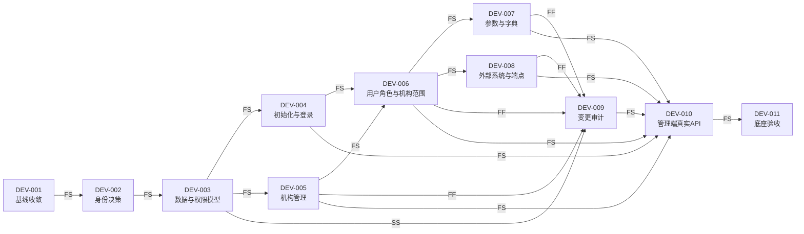

# 县域中间接口平台开发批次任务计划

| 属性 | 内容 |
| --- | --- |
| 版本 | V1.0 |
| 日期 | 2026年9月16日 |
| 任务基线 | 项目开发PRD V0.6、平台架构决策 V1.0、Java与SQL编码规范 |
| 当前事实 | 平台没有可用的基础配置、机构、用户、角色、权限和真实基础数据；其他业务数据为零 |
| 实施原则 | 先建立可运营平台，再建立基础数据闭环，最后开发业务接口 |

## 1. 计划目标

本计划将项目拆成可独立编码、复核、测试、提交和验收的开发批次。每个批次必须有明确输入、产出、依赖、阻断条件和退出标准，不得用原型合成数据、Mock成功或空表查询代替实际闭环。

开发主链为：

```text
工程基线
  → 平台初始化与身份
  → 机构管理
  → 用户、角色、权限与机构数据范围
  → 参数、字典与外部系统配置
  → 配置变更审计
  → 基础数据入库与HIS只读视图
  → 外部接口公共能力
  → 优先顺序1至3业务
```

## 2. 现有成果的处理方式

| 现有成果 | 当前判定 | 处理方式 |
| --- | --- | --- |
| Java 17 / Spring Boot / MyBatis工程骨架 | 可复用 | 作为后续批次的工程基线 |
| 请求编号、统一响应和异常转换 | 可复用 | 在管理API中继续验证脱敏与错误边界 |
| `OrganizationAccessGuard` | 仅为空壳 | 在用户、角色和机构范围落库后重构接入真实授权数据 |
| 默认拒绝所有本地用户的安全配置 | 不可运营 | 在身份方案确认后替换；确认前继续默认拒绝 |
| `V0100__exchange_main.sql`及交换记录代码 | 实现内容可保留，实施顺序错后 | 冻结功能扩展；平台底座主版本定稿时统一调整未入共享环境的迁移顺序 |
| 管理端合成原型 | 不是业务实现 | 仅作布局参考；删除或隔离与实际功能重复的本地合成状态 |

SQL Server 2012 SP4真实环境验证已按项目要求暂缓。开发期先执行迁移静态检查、应用层测试和构建验证；真库空库迁移、升级迁移、约束、索引、权限、TLS和恢复验证仍是进入基础数据真实联调前的强制门禁。

## 3. 批次总览

| 批次 | 主题 | 主要产出 | 前置依赖 | 参考工作量 | 当前状态 |
| --- | --- | --- | --- | ---: | --- |
| B00 | 需求与工程基线收敛 | 无冲突文档、构建基线、迁移顺序决定 | 无 | 1—2人日 | 已完成 |
| B01 | 平台初始化与身份入口 | 身份决策、安全初始化、登录与登出基线 | B00 | 3—5人日 | 进行中 |
| B02 | 机构管理 | 机构档案、层级、启停、查询及权限边界 | B01 | 4—6人日 | 进行中 |
| B03 | 用户、角色和机构数据范围 | 真实RBAC、最小权限、越权阻断 | B02 | 6—8人日 | 未开始 |
| B04 | 平台基础配置 | 参数、字典、外部系统和环境端点配置 | B03 | 6—8人日 | 未开始 |
| B05 | 管理底座闭环 | 变更审计、管理端对接、底座验收 | B04 | 4—6人日 | 未开始 |
| B06 | 基础数据公共模型 | 来源、批次、有效性、映射与核对边界 | B05 | 5—7人日 | 未开始 |
| B07 | 机构基础数据首个闭环 | 真实来源机构入库、映射、停用和HIS只读视图 | B06+来源合同 | 5—8人日 | 未开始 |
| B08 | 人员、科室与目录基础数据 | 综合目录、三大目录、诊断及视图 | B07+逐类合同 | 10—16人日 | 未开始 |
| B09 | 外部接口公共能力 | 客户端边界、鉴权、超时、结果判断、运行记录 | B05+正式合同 | 5—7人日 | 未开始 |
| B10 | 优先顺序1业务 | 健康档案/体检、PACS、LIS、心电真实闭环 | B08+B09+业务准入 | 逐域估算 | 未开始 |
| B11 | 优先顺序2至3业务 | 电子病历、档案摘要、双向转诊 | B10+页面及业务规则 | 逐域估算 | 未开始 |

工作量是两名平台开发人员用于排期的初始参考，不包含外部厂商等待、医院审批和真实环境排队时间。

## 4. B00：需求与工程基线收敛

| 任务 | 执行内容 | 产出/验收 |
| --- | --- | --- |
| B00-01 | 将“平台底座先行”同步到PRD和开发顺序 | PRD不再排除机构、权限和基础配置 |
| B00-02 | 盘点已有后端、前端、迁移和OpenAPI | 形成第2章的保留、冻结和重构清单 |
| B00-03 | 确认未进入共享数据库的Flyway版本可重排 | 迁移版本调整方案经评审，不在已执行环境修改历史 |
| B00-04 | 记录本地Maven稳定路径 | 使用`/Users/vliudbe/.local/opt/maven/bin/mvn`，不再误报缺少Maven |
| B00-05 | 执行与真库无关的构建门禁 | Maven测试、前端类型检查/构建和SQL静态检查通过 |

退出标准：需求、任务计划、代码现状和迁移规则之间没有已知顺序冲突。

## 5. B01—B05：平台管理底座

### 5.1 B01 平台初始化与身份入口

| 任务 | 执行内容 | 测试要点 |
| --- | --- | --- |
| B01-01 | 确认管理身份源：平台本地账号或医院统一身份 | 结论包含登录入口、账号生命周期、初始管理员交付、会话超时和应急恢复 |
| B01-02 | 实现一次性初始化门禁 | 不存在管理员时才允许初始化；重复初始化被拒绝 |
| B01-03 | 实现登录、登出和当前用户查询 | 无效账号、停用账号、错误凭证、过期会话和未登录访问全部默认拒绝 |
| B01-04 | 配置安全响应、Cookie/令牌和CSRF边界 | 凭证、会话标识和密码不进日志、错误响应或前端持久化存储 |

阻断条件：B01-01没有书面结论时，不编造统一身份协议、用户字段或密码规则；可先完成与身份提供方无关的安全边界测试。

### 5.2 B02 机构管理

平台机构是权限范围和配置归属的受控档案，不是从100-008直接覆盖的上游原始数据。后续上游机构数据必须通过明确映射绑定到平台机构，不得自动改变用户权限。

| 任务 | 执行内容 | 验收要点 |
| --- | --- | --- |
| B02-01 | 建立机构主版本迁移 | 平台机构编码唯一；父子层级、类型、启用状态、有效时间和`rowversion`边界明确 |
| B02-02 | 实现机构创建、修改、详情、树和分页查询 | 编码重复、父机构不存在、层级循环和并发覆盖被拒绝 |
| B02-03 | 实现机构启用/停用 | 有子机构、有有效用户或存在运行配置时按已确认规则阻断；不做物理删除 |
| B02-04 | 补充机构管理OpenAPI和服务测试 | 请求校验、空数据、冲突、并发和停用场景覆盖 |

### 5.3 B03 用户、角色和机构数据范围

| 任务 | 执行内容 | 验收要点 |
| --- | --- | --- |
| B03-01 | 建立用户、角色、权限、用户角色、角色权限和用户机构范围迁移 | 唯一性、外键、启停和并发边界完整；不预存业务接口权限 |
| B03-02 | 实现用户管理 | 用户必须归属机构；停用后立即不能新建会话 |
| B03-03 | 实现角色和权限授予 | 权限代码由后端功能清单提供；前端菜单隐藏不代替API授权 |
| B03-04 | 实现机构数据范围 | 当前机构、指定机构和已授权子机构的具体语义经评审；客户端传入机构代码不构成授权 |
| B03-05 | 重构`OrganizationAccessGuard` | 从已认证主体的真实机构范围判定；跨机构越权测试必须失败 |

### 5.4 B04 平台基础配置

| 子域 | 实施内容 | 数据与安全边界 |
| --- | --- | --- |
| 系统参数 | 支持明确类型、约束、环境和机构作用域的参数 | 参数键由代码或评审清单约束；不提供无边界任意键值存储 |
| 基础字典 | 管理平台自身状态、类型和展示字典 | 医疗业务目录不得混入系统字典；业务目录归B06—B08 |
| 外部系统 | 管理HIS、基层系统、健康云、PACS、LIS、心电等系统身份和启停 | 仅建立已确认的系统；不建设接口注册中心 |
| 环境端点 | 管理开发/测试/生产地址、连接与读取超时、TLS和凭证引用 | 数据库只保存凭证引用或密钥标识，不保存明文密码、token、验证码或私钥 |

B04需要完成配置列表、详情、修改、启停、并发版本控制、脱敏返回、OpenAPI和服务层测试。不实现通用表达式、动态脚本或任意SQL配置。

### 5.5 B05 管理底座闭环

| 任务 | 执行内容 | 验收要点 |
| --- | --- | --- |
| B05-01 | 建立配置变更审计 | 记录操作人、时间、机构范围、对象类型/标识、动作和脱敏变更摘要；普通用户不可修改或删除 |
| B05-02 | 将管理端从合成数据切换到真实API | 登录、机构、用户、角色、权限、参数、字典、外部系统和审计可用 |
| B05-03 | 完成服务端权限回归 | 未登录、无功能权限、跨机构、停用账号和并发修改均有明确结果 |
| B05-04 | 形成底座验收记录 | 管理员可从登录到配置一个机构和用户，授权后用户只能访问允许范围，所有变更可查 |

B05退出后才允许启动B06。“页面能打开”不等于底座完成，服务端权限和审计必须同时通过。

## 6. B06—B08：基础数据闭环

### 6.1 B06 基础数据公共模型

| 任务 | 实施要求 |
| --- | --- |
| B06-01 | 逐类确认权威来源、稳定主键、源更新时间/版本、首次全量、增量、停用/删除和核对规则 |
| B06-02 | 建立基础数据来源、同步执行事实和映射边界，不建立与实际业务无关的通用工作流状态 |
| B06-03 | 明确平台机构与上游机构的映射，上游变更不得自动改变管理权限 |
| B06-04 | 定义重复、冲突、来源回退、缺失和停用的应用层处理及测试 |

缺少某类数据的正式字段和更新语义时，该类保持`CONTRACT_BLOCKED`，不得用通用`name/code/status`字段表假装完成建模。

### 6.2 B07 机构基础数据首个闭环

开始条件：机构数据的实际来源方式已确认；如使用100-008，则同时具备100-001/100-002所需地址、鉴权和正常/失败样例。

任务顺序：

1. 实现连通与身份校验，不保存验证码和明文凭证。
2. 获取真实机构数据并按已确认字段入库。
3. 处理重复、更新、停用、来源缺失和上游失败。
4. 将上游机构映射到平台受控机构，未映射数据不自动获得访问权限。
5. 与HIS厂商确认视图最小字段、过滤范围、账号、频率、上限、版本和性能基线。
6. 版本化发布HIS只读视图，应用账号和HIS只读账号权限隔离。
7. 用真实非零数据完成来源数、平台数和视图数核对。

B07退出标准：至少一个真实机构完成“来源→平台保存→受控映射→HIS只读视图→数量核对”，空结果不计为完成。

### 6.3 B08 人员、科室和目录数据

依赖顺序：

1. 100-003科室、人员、病区和床位；
2. 100-005行数核对后执行100-004药品、诊疗和耗材目录分页取得；
3. 100-007行数核对后执行100-006诊断目录分页取得；
4. 每类数据分别完成全量、增量、重复、停用、冲突、核对和HIS只读视图；
5. 不将人员、药品、诊疗、耗材或诊断数据放入平台系统字典表。

## 7. B09—B11：外部接口和业务

### 7.1 B09 外部接口公共能力

B09不建设一个接口注册中心，只实现已批准目标系统需要的技术边界：

- 按外部系统和环境解析受控端点；
- 从获批密钥来源取得凭证，不在业务库明文保存；
- 按正式合同实现REST、SOAP/XML、签名、超时和响应解析；
- 只根据规范或联调确认的值判定成功和失败；
- 连接超时或中断记录为无响应，不自动宣称目标未处理；
- 将已有交换记录接入真实身份和机构权限。

### 7.2 B10 优先顺序1业务

业务域启动顺序不再由“哪个接口容易”决定，只按下列准入证据决定：

1. 业务使用人和实际入口已确认；
2. 调用方、目标系统和写入责任方已确认；
3. 正式合同、测试地址、凭证交付和正常/失败脱敏样例已具备；
4. HIS对象、字段、键、读写方向、授权和返回落点已确认；
5. 不再使用空表、合成业务号或Mock成功作为完成证据。

同时具备上述条件的业务域才能创建单接口任务包。健康档案/体检、PACS、LIS和心电之间不预设第一个，但必须在B05与B08门禁后启动。

### 7.3 B11 优先顺序2至3业务

- 电子病历在实际页面入口、100-009验证规则和400-003范围冲突关闭后启动。
- 健康档案摘要在患者选择、用途、结果展示和数据权限确认后启动。
- 双向转诊在县医院端发起、接收、责任人和结果落点确认后启动。
- 原清单标记“不做”的能力不进入本计划，除非项目负责人书面变更范围。

## 8. 第一开发阶段可直接建立的任务清单

以下11个任务构成第一开发阶段的完整交付网络，不并行铺开外部业务。

### 8.1 关系类型与角色定义

| 关系要素 | 含义 |
| --- | --- |
| `FS` | 完成后开始；前置任务达到退出标准后，后续任务才能进入编码 |
| `SS` | 同步开始；前置产出已稳定到可接入时，当前任务随功能开始实施 |
| `FF` | 同步完成；所有被覆盖功能完成后，当前任务才能收口 |
| 负责 `R` | 实际执行任务并产出代码或文档的角色 |
| 批准 `A` | 对范围、规则和验收结论最终负责的唯一角色 |
| 协作 `C` | 提供业务、安全、数据库、前端或测试输入的角色 |
| 复核 `V` | 执行独立代码、权限、数据或测试复核的角色 |

每个任务必须有且只有一个`A`；`R`可以多人，但不能以“开发组”代替建单时的具体负责人。

### 8.2 任务依赖图



可并行关系：DEV-004与DEV-005可在DEV-003通过后并行；DEV-007与DEV-008可在DEV-006通过后并行。DEV-009不是最后一次性补审计，它在DEV-003完成审计模型后启动，随DEV-005至DEV-008同步接入，并在这些任务都完成后收口。

### 8.3 任务关系总表

| 任务 | 前置关系 | 关键输入 | 核心输出 | 后续交接 | R / A / C / V | 当前状态 |
| --- | --- | --- | --- | --- | --- | --- |
| DEV-001 | 无 | 现有PRD、方案、规范、代码与迁移 | 无冲突基线、任务计划、迁移处置结论 | DEV-002 | 平台开发 / 项目负责人 / DBA、测试 / 项目负责人 | 已完成 |
| DEV-002 | DEV-001 `FS` | 医院身份条件、安全规则、管理使用人 | 身份源决策、初始管理员交付与恢复规则 | DEV-003、DEV-004 | 项目负责人+信息科 / 项目负责人 / 平台开发、安全运维 / 安全负责人 | 已完成（生产前复核） |
| DEV-003 | DEV-002 `FS` | 身份决策、机构口径、权限矩阵输入 | 域模型、表写入权、迁移顺序、权限代码草案、OpenAPI边界 | DEV-004、DEV-005、DEV-009 | 后端开发 / 技术负责人 / DBA、安全、测试 / 另一名开发+DBA | 设计完成，待复核 |
| DEV-004 | DEV-003 `FS` | 身份模型、初始化和会话规则 | 初始化、登录、登出、当前用户API及安全测试 | DEV-006、DEV-010 | 后端开发 / 技术负责人 / 前端、安全、测试 / 安全复核人 | 未开始 |
| DEV-005 | DEV-003 `FS` | 机构模型、层级和停用规则 | 机构迁移、应用服务、API、OpenAPI和测试 | DEV-006、DEV-009、DEV-010 | 后端开发 / 项目负责人 / 管理使用人、DBA、测试 / 另一名开发 | 开发中（待DEV-006/009收口） |
| DEV-006 | DEV-004、DEV-005 `FS` | 已登录主体、机构档案、权限矩阵 | 用户、角色、权限、机构范围和真实授权守卫 | DEV-007、DEV-008、DEV-009、DEV-010 | 后端开发 / 项目负责人 / 安全、管理使用人、测试 / 安全复核人+另一名开发 | 未开始 |
| DEV-007 | DEV-006 `FS` | 已授权主体、参数/字典清单与作用域 | 参数和系统字典迁移、API、校验及测试 | DEV-009、DEV-010 | 后端开发 / 管理使用人 / 前端、测试 / 另一名开发 | 未开始 |
| DEV-008 | DEV-006 `FS` | 外部系统清单、环境、端点、凭证引用规则 | 外部系统/端点迁移、脱敏API、校验及测试 | DEV-009、DEV-010、B09 | 后端开发 / 信息科 / 安全运维、前端、测试 / 安全复核人 | 未开始 |
| DEV-009 | DEV-003 `SS`，DEV-005至DEV-008 `FF` | 审计数据边界、操作人与各管理功能变更事件 | 不可普通篡改的审计记录、查询API和覆盖矩阵 | DEV-010、DEV-011 | 后端开发 / 信息科 / 安全、测试 / 安全复核人+测试负责人 | 未开始 |
| DEV-010 | DEV-004至DEV-009 `FS` | 已稳定OpenAPI、权限代码、错误语义和审计查询 | 真实管理页面、API对接、路由/按钮权限与端到端测试 | DEV-011 | 前端开发 / 管理使用人 / 后端、产品、测试 / 另一名开发+测试负责人 | 未开始 |
| DEV-011 | DEV-010 `FS` | DEV-001至DEV-010的输出和证据 | 验收结论、未验证项、问题清单与下一批次准入结论 | B06 | 测试负责人 / 项目负责人 / 管理使用人、平台开发、信息科 / 管理使用人+信息科 | 未开始 |

### 8.4 任务详细要素

#### DEV-001 收敛PRD、任务计划和迁移顺序

- 范围：对齐PRD、总体方案、架构决策、开发计划、代码现状和Flyway历史。
- 关键决定：确认`V0100__exchange_main.sql`是否已进入任何共享环境；未进入时才可重排主版本。
- 输出：文档基线、保留/冻结/重构清单、迁移处置记录、构建记录。
- 交接标准：DEV-002不需要再猜测第一阶段范围；未结项只保留具名责任人的决策项。
- 阻断：无法确认迁移是否已在共享库执行时，不改写已有迁移文件。

#### DEV-002 确认管理身份源与初始管理员交付

- 范围：选定平台本地账号或医院统一身份，定义账号唯一标识、会话、停用、超时和恢复边界。
- 必填输入：身份提供方、协议/接入方式、管理使用人、初始管理员交付人和应急恢复审批人。
- 输出：身份决策记录、会话与CSRF策略、初始管理员交付/失效步骤、审计要求。
- 交接标准：DEV-003可据此确定用户主键、外部身份映射和凭证数据边界。
- 阻断：没有决策时继续默认拒绝，不通过测试后门或固定开发账号绕过。
- 当前结论：开发阶段使用平台本地管理账号；基层100-002/100-009属于外部业务鉴权，不作为平台管理身份源。
- 安全基线：初始管理员通过一次性启动配置安全交付，不提供固定默认账号/密码；密码只保存强哈希；首次登录强制修改；初始化完成后启动凭证必须移除或失效。
- 会话基线：管理端使用服务端会话和`HttpOnly`安全Cookie，生产强制`Secure`，写操作执行CSRF防护；不把长期令牌保存在浏览器持久化存储。
- 生产门禁：上线前由医院信息科复核是否继续使用本地账号；如需统一身份，必须先提供正式协议和属性映射，通过身份适配边界替换，不改变机构与权限模型。

#### DEV-003 设计平台系统域和机构域数据模型

- 范围：身份、机构、用户、角色、权限、机构范围、参数、字典、外部系统、端点和审计的责任边界。
- 数据关系：一个用户归属一个主机构；用户通过角色获得功能权限；用户通过独立范围获得机构数据权限；参数和端点具有明确环境/机构作用域；审计引用操作人和目标对象，但不由目标模块反向修改。
- 输出：ER关系、字段口径、唯一键/外键/检查约束/索引、表写入模块、事务边界、迁移版本和回退方案。
- 复核点：SQL Server 2012兼容、级联停用、最后管理员保护、并发`rowversion`和密码/凭证边界。
- 交接标准：DEV-004、DEV-005和DEV-009可从同一数据及权限基线开始。

#### DEV-004 实现平台初始化和登录入口

- 范围：一次性初始化、登录、登出、当前主体、会话过期和停用失效。
- API关系：登录产生的主体是DEV-006权限判定的唯一可信输入；前端不得自行声明角色或机构。
- 输出：后端API、OpenAPI、安全配置、应用服务测试和安全测试。
- 验收场景：首次初始化、重复初始化、正常登录、错误凭证、停用账号、会话过期、登出后重放和敏感日志检查。
- 交接标准：DEV-006可从当前主体取得稳定用户标识，DEV-010可接入真实登录态。

#### DEV-005 实现机构管理后端

- 范围：机构创建、修改、详情、分页、机构树、启用和停用；不包含机构接入审批。
- 业务关系：平台机构是用户归属、数据权限和配置作用域的主数据；上游100-008机构数据后续通过映射关联，不直接覆盖本模块。
- 输出：机构迁移、应用服务、Mapper、API、OpenAPI、权限点和测试。
- 验收场景：编码重复、父机构缺失、循环层级、并发覆盖、有依赖的停用和非法跨机构访问。
- 交接标准：DEV-006可建立用户归属和机构范围；DEV-009可记录机构变更。

#### DEV-006 实现用户、角色、权限与机构范围

- 范围：用户生命周期、角色、功能权限、用户角色关联、用户机构范围和服务端授权。
- 权限关系：“能否执行功能”由角色权限判定；“能否访问某机构数据”由机构范围独立判定，两者必须同时满足。
- 输出：相关迁移、管理API、权限代码清单、重构后的`OrganizationAccessGuard`和测试。
- 验收场景：最后管理员保护、停用用户、无功能权限、有功能权限但无机构范围、伪造机构代码和已授权机构访问。
- 交接标准：DEV-007和DEV-008使用统一授权模式；DEV-010只用权限结果控制显示，不代替服务端判定。

#### DEV-007 实现参数与基础字典

- 范围：有明确注册清单的系统参数，以及平台自身展示/分类所需基础字典。
- 数据关系：参数具有数据类型、校验约束、环境和机构作用域；字典类型与字典项为一对多；医疗业务目录不进入本模块。
- 输出：迁移、参数注册/校验边界、管理API、脱敏规则、OpenAPI和测试。
- 验收场景：未注册参数键、错误类型、超出范围、重复字典编码、停用字典项和并发修改。
- 交接标准：DEV-009审计参数/字典变更；DEV-010按注册元数据构建明确表单，不提供任意键值编辑器。

#### DEV-008 实现外部系统与环境端点配置

- 范围：已确认外部系统的身份、启停、环境端点、连接/读取超时、TLS和凭证引用；不建设通用接口注册中心。
- 数据关系：一个外部系统可有多个环境端点；同一系统和环境只能有一个当前有效端点；凭证仅以引用标识关联。
- 输出：迁移、管理API、脱敏响应模型、启停/版本控制、OpenAPI和测试。
- 验收场景：重复端点、非法URL、非法超时值、缺失凭证引用、明文凭证输入、启用冲突和跨机构修改。
- 交接标准：B09只从本模块应用边界获取已授权端点，不直接读取配置表。

#### DEV-009 实现配置变更审计

- 范围：登录失败、机构、用户、角色、权限、机构范围、参数、字典、外部系统和端点变更。
- 接入关系：DEV-003确定审计模型；DEV-005至DEV-008在各自事务成功后产生审计事实；失败操作按安全需求记录，不伪造业务已变更。
- 输出：审计迁移、写入边界、脱敏变更摘要、查询API、覆盖矩阵和测试。
- 验收场景：每类变更至少一条成功记录，登录失败可定位但不泄露凭证，普通用户不可修改/删除审计记录，跨机构查询被拒绝。
- 交接标准：DEV-010只展示脱敏审计数据；DEV-011按覆盖矩阵核对功能与审计一致性。

#### DEV-010 管理端接入真实API

- 范围：登录、机构、用户、角色/权限、参数、字典、外部系统/端点和审计页面。
- 界面关系：路由和按钮根据当前主体权限显示；列表和详情使用服务端返回的机构范围；错误页面显示可定位的`requestId`，不显示内部异常和凭证。
- 输出：API客户端、页面与表单、加载/空数据/无权限/冲突/失败状态、端到端用例和取消合成状态的差异记录。
- 验收场景：管理员完整操作、只读用户、无权限菜单直接URL访问、跨机构请求、并发修改冲突和后端不可用。
- 交接标准：DEV-011可从真实管理端执行全部验收用例，不使用`localStorage`中的合成业务状态代替后端结果。

#### DEV-011 管理底座批次验收

- 范围：需求、功能、权限、机构隔离、审计、脱敏、构建、迁移静态检查和未验证项。
- 输入关系：必须使用DEV-001至DEV-010的受控版本和证据，任一功能、OpenAPI、迁移或测试版本不一致时退回对应任务。
- 输出：验收用例与结果、权限矩阵核对、审计覆盖矩阵、安全检查、未验证项、问题责任人和B06准入结论。
- 通过标准：管理员可完成配置闭环；受限用户只能使用授权功能与机构；所有变更可追溯；代码和界面无明文凭证；当前暂缓的SQL Server真库项明确标注为“未验证”。
- 失败回流：模型/迁移问题回DEV-003，身份问题回DEV-004，机构问题回DEV-005，权限问题回DEV-006，配置问题回DEV-007/008，审计问题回DEV-009，界面问题回DEV-010。

### 8.5 跨任务核心对象关系

| 对象 | 唯一写入责任 | 关联对象 | 对后续任务的约束 |
| --- | --- | --- | --- |
| 已认证主体 | DEV-004 / `system` | 用户、会话、当前机构 | DEV-006只信任服务端已认证主体 |
| 平台机构 | DEV-005 / `organization` | 父机构、用户、机构范围、参数、端点 | 不得被100-008上游机构直接覆盖 |
| 用户 | DEV-006 / `system` | 主机构、角色、机构范围、审计操作人 | 停用后不得建立新会话 |
| 角色与功能权限 | DEV-006 / `system` | 用户、后端权限代码 | 菜单和按钮只是展示结果，不是授权源 |
| 用户机构范围 | DEV-006 / `system` | 用户、平台机构 | 所有按机构读写的API都必须使用 |
| 系统参数/字典 | DEV-007 / `system` | 环境、机构、注册元数据 | 不承载医疗业务目录或明文凭证 |
| 外部系统/端点 | DEV-008 / `system` | 环境、机构范围、凭证引用 | B09通过应用服务边界取得有效端点 |
| 管理审计 | DEV-009 / `audit` | 操作人、机构范围、目标对象与脱敏变更摘要 | 业务模块不得直接修改或删除审计数据 |

### 8.6 交付物追踪矩阵

| 交付物 | 产出任务 | 消费任务 | 版本一致要求 |
| --- | --- | --- | --- |
| PRD与批次计划 | DEV-001 | DEV-002—011 | 任务变更必须回写计划和状态 |
| 身份与初始管理员决策 | DEV-002 | DEV-003、004、011 | 决策版本与安全配置、测试证据一致 |
| 数据模型与迁移版本图 | DEV-003 | DEV-004—009、011 | SQL、Mapper和OpenAPI使用同一字段口径 |
| 权限代码和机构范围矩阵 | DEV-003、006 | DEV-004—010 | 后端检查、前端显示和测试用例三方一致 |
| OpenAPI | DEV-004—009 | DEV-010、011 | 前端接入的提交必须引用对应OpenAPI版本 |
| 审计覆盖矩阵 | DEV-009 | DEV-010、011 | 每个管理变更用例对应一条审计断言 |
| 端到端用例与验收证据 | DEV-010、011 | B06 | 必须标记应用、迁移、OpenAPI和前端构建版本 |

## 9. 代码提交与复核边界

每个提交只包含一个可说明的边界，建议批次如下：

1. `docs: 校准平台底座开发顺序`
2. `feat(system): 建立平台身份与初始化基线`
3. `feat(organization): 实现机构管理基线`
4. `feat(system): 实现用户角色与机构数据范围`
5. `feat(system): 实现平台参数与基础字典`
6. `feat(system): 实现外部系统连接配置`
7. `feat(audit): 记录平台管理配置变更`
8. `feat(web-admin): 接入平台管理底座真实数据`

每次提交前至少执行：

```bash
/Users/vliudbe/.local/opt/maven/bin/mvn -f backend/pom.xml verify
npm run typecheck
npm run build
npm run verify:sql
```

与SQL Server实例相关的测试在当前暂缓，不得在提交说明中写成“已验证SQL Server 2012”。

## 10. 批次通用完成定义

任务只有同时满足以下条件才能标记完成：

1. 需求来源、数据边界、使用人和验收方已明确。
2. 后端依赖方向、表写入权和事务边界已评审。
3. 新增或修改的类、接口、枚举、`record`和方法具有准确Javadoc。
4. API完成输入校验、身份认证、功能权限和机构数据范围校验。
5. 新增迁移符合SQL Server 2012 SP4兼容级110和项目SQL规范。
6. 单元测试覆盖正常、空值、边界、重复、并发、停用和越权场景。
7. OpenAPI、部署配置示例和操作说明与代码同步。
8. 代码、数据库、日志、错误响应和前端包不包含明文凭证或医疗正文。
9. 构建、静态门禁和当前可执行测试通过；未执行的真库或联调项如实列出。
10. 代码差异只包含当前任务，没有覆盖他人未提交修改。

## 11. 必须尽早关闭的前置决策

| 编号 | 决策 | 影响批次 | 未关闭时的处理 |
| --- | --- | --- | --- |
| D-01 | 平台管理身份源与初始管理员交付 | B01、B03 | 开发基线已确认为本地管理账号+一次性安全引导；生产前由医院复核 |
| D-02 | 机构类型、层级和停用影响 | B02 | 可实现通用循环/唯一性约束，不固化未确认类型值 |
| D-03 | 管理角色和权限矩阵 | B03 | 只实现权限机制，不预置未批准业务权限 |
| D-04 | 外部凭证安全存储与轮换方式 | B04、B09 | 只保存凭证引用，不允许在平台库填写明文 |
| D-05 | 基础数据来源、字段、主键、增量和停用语义 | B06—B08 | 对应数据类别保持`CONTRACT_BLOCKED` |
| D-06 | HIS只读视图合同与账号权限 | B07—B08 | 可完成平台保存，不发布生产视图 |
| D-07 | 每个外部接口的正式合同与联调样例 | B09—B11 | 仅做离线合同准备，不宣称完成 |
