# 四川省卫生健康委员会办公室 

川卫办规划信息便函〔2025〕13 号 

## 四川省卫生健康委员会办公室 关于开放健康档案云服务平台和基层 医疗卫生机构管理信息系统应用接口的通知 

各市（州）卫生健康委、科学城卫生健康委： 

为加强基层信息化建设统筹，减轻基层医疗卫生机构负担， 省卫生健康委组织制订了省统建健康档案云服务平台和基层医 疗卫生机构管理信息系统应用接口，免费向各地开放，供各地自 建信息系统按需免费接入。现将有关事项通知如下： 

#### 一、接口覆盖范围 

应用接口涵盖基本公卫和基本医疗基础通用应用场景，共 15 类 73 个接口。主要包括健康档案云服务平台中健康档案管理、 老年人健康管理、高血压管理、糖尿病管理、家庭医生签约等基 本公共卫生应用接口 6 类 21 个（附件 1），基层医疗卫生机构 管理信息系统中便民惠民、双向转诊、电子病历、LIS、PACS、 心电、远程会诊、检查检验报告跨机构调阅等基本医疗应用接口 9 类 52 个（附件 2）。后期，我委将根据工作需要对接口实行动 态调整，原则上每两年更新公布一次。 

<!-- page: 1 -->

#### 二、接口开通流程 

各地要加强基层信息化建设统筹，原则上要按市（州）或县 （市、区）为单位开展集约化建设。要将健康档案云服务平台和 基层医疗卫生机构管理信息系统作为基层医疗卫生机构主要业 务信息系统，严禁以任何理由擅自停用、替换。各地自建信息系 统使用接口接入健康档案云服务平台和基层医疗卫生机构管理 信息系统时，可在承建厂商技术开发完成后，以市（州）为单位 填写《自建信息系统接入申请表》（附件 3），并提供与承建厂 商签署的数据保密协议，报省卫生健康委基层卫生处审批同意 后，由省卫生健康信息中心免费予以开通。 

#### 三、加强网络安全 

各地要严格落实《中华人民共和国个人信息保护法》《数据 安全法》《网络数据安全管理条例》《关键信息基础设施安全保 护条例》等法律法规，建立数据分级分类授权机制，加强接口权 限管理，确保敏感数据不出域。要加强自建信息系统网络安全保 护，严禁在境外及非授权服务器上部署、应用自建信息系统和存 储、处理医疗健康数据。各地接入健康档案云服务平台的自建信 息系统须达到信息系统安全等级保护三级水平，接入基层医疗卫 生机构管理信息系统的应不低于当地等级保护测评要求。 

联系人：省卫生健康信息中心胡沅航 联系电话：028-86781161 

附件：1.四川省健康档案云服务平台应用接口规范（V1.0） 

<!-- page: 2 -->

- 2.四川省基层医疗卫生机构管理信息系统应用接口 规范（V1.0） 

- 3.自建信息系统接入申请表 


<!-- Start of picture text -->
四川省卫生健康委员会办公室<br>2025 年 6 月 12 日<br><!-- End of picture text -->

（信息公开选项：依申请公开） 

<!-- page: 3 -->

1 附件 

### 四川省健康档案云服务平台 

### 应用接口规范（V1.0） 

###### 目录 

|1. 概述**...........................................................................................................................3**|
|---|
|2. 使用范围**................................................................................................................... 3**|
|3. 规范性引用文件**........................................................................................................ 3**|
|4. 信息安全要求**............................................................................................................3**|
|5. 通讯规范**................................................................................................................... 4**|
|5.1 通讯协议规范.......................................................................................................4|
|5.1.1 请求体格式规范............................................................................................4|
|5.1.2 数据编码格式规范........................................................................................ 4|
|5.1.4 接口安全控制规范........................................................................................ 4|
|5.2 接口和参数定义................................................................................................... 5|
|5.2.1 接口参数说明................................................................................................5|
|5.3 接口响应规范.......................................................................................................6|
|5.3.1 接口响应说明................................................................................................ 7|
|6. 接口总览**................................................................................................................... 8**|
|6.1 接口对接流程图....................................................................................................8|
|6.2 整改时限...............................................................................................................9|
|6.3 接口列表...............................................................................................................9|
|7. 接口定义说明**..........................................................................................................10**|
|7.1 基础数据类......................................................................................................... 10|
|7.1.1 登录验证......................................................................................................10|
|7.1.2 查询区划列表（包含组）............................................................................12|
|7.1.3 查询本机构用户列表................................................................................... 14|
|7.2 健康档案管理类..................................................................................................15|
|7.2.1 查询家庭档案摘要信息................................................................................15|

<!-- page: 4 -->

|7.2.2 查询健康档案摘要信息................................................................................18|
|---|
|7.2.3 上传健康档案.............................................................................................. 22|
|7.2.4 修改健康档案.............................................................................................. 37|
|7.2.5 上传个人健康教育.......................................................................................51|
|7.3 老年人健康管理..................................................................................................53|
|7.3.1 上传健康体检.............................................................................................. 53|
|7.3.2 修改健康体检.............................................................................................. 70|
|7.3.3 上传老年人中医保健................................................................................... 89|
|7.3.4 修改老年人中医保健................................................................................... 93|
|7.4 高血压管理......................................................................................................... 98|
|7.4.1 上传高血压随访...........................................................................................98|
|7.4.2 修改高血压随访.........................................................................................109|
|7.5 糖尿病管理....................................................................................................... 120|
|7.5.1 上传糖尿病随访.........................................................................................120|
|7.5.2 修改糖尿病随访.........................................................................................132|
|7.6 家庭医生签约....................................................................................................143|
|7.6.1 查询本机构用户所在家医签约团队列表....................................................143|
|7.6.2 查询本机构家医签约团队签约服务包列表................................................ 145|
|7.6.3 查询本机构家医签约团队成员列表........................................................... 147|
|7.6.4 上传家医签约信息.....................................................................................149|
|7.6.5 修改家医签约信息.....................................................................................151|

<!-- page: 5 -->

###### 1. 概述 

为满足电子健康档案无纸化、移动化、智能化服务要求，“四川省健康档案云服务平台” （简称云平台）提供标准化应用接口，支撑电子健康档案数据上传、减轻基层负担、加强信 息安全和规范化管理。 

###### 2. 使用范围 

按规定程序免费向基层医疗卫生机构自建信息系统开放，仅限用于拓展云平台电子健 康档案数据上传类应用，如医护人员移动端、健康体检、健康小屋、健康一体机等。居民电 子健康档案个案数据按政务信息资源共享流程，依申请经省全民健康信息平台向具备安全条 件的市（州）全民健康信息平台回流。 

###### 3. 规范性引用文件 

GB/T 1.1-2020 标准化工作导则第1 部分：标准化文件的结构和起草规则 GB/T 5271.8-2001 信息技术词汇第8 部分：安全 

-- RFC2616 Hypertext Transfer Protocol HTTP/1.1 

《RESTful Web APIs》 

《国家基本公共卫生服务规范》（第三版） 

###### 4. 信息安全要求 

健康档案信息处理和应用应符合法律、行政法规的规定，防止未经授权的访问以及个人 信息泄露、篡改、丢失。涉及大批量数据应用的，应在事前进行个人信息保护影响评估。居 民健康档案应用及数据相关信息系统应具备有效的网络安全等级保护三级认证证明，不得在 境外以及非授权的服务器中存储、托管、部署及处理，不得租赁在境外的服务器用于健康档 案管理工作，第三方应用信息系统应优先通过5G 远程专网访问云平台接口，确需临时通过 互联网方式访问的，通过IP 白名单严格限制接口调用权限和访问时段。严禁居民健康档案 信息用于商业用途。不得向境外机构提供居民健康档案数据。 

档案管理机构应落实信息安全有关措施：（一）制定内部管理制度和操作规程，落实技 

<!-- page: 6 -->

术防护要求；（二）对居民健康档案信息实行分级分类管理，特殊敏感档案信息应采取多重 保护；（三）采取相应的加密、去标识化等安全技术措施；（四）合理确定个人信息处理的操 作权限，并定期对从业人员进行安全教育和培训，不得擅自利用信息化技术或工具获取、处 理、泄露档案数据；（五）制定并组织实施个人信息安全事件应急预案；（六）法律、行政法 规规定的其他措施。发生或者可能发生个人信息泄露、篡改、丢失的，个人信息处理者应当 立即采取补救措施，并通知履行个人信息保护职责的部门和个人。 

###### 5. 通讯规范 

###### 5.1 通讯协议规范 

为确保接口在异构系统间的兼容性及数据传输的安全性，接口通讯统一采用与系统无关 的HTTPS 协议。 

###### 5.1.1 请求体格式规范 

接口请求体格式支持 json ，请求头需要设置 Content-Type: application/json;charset=utf-8。 

###### 5.1.2 数据编码格式规范 

为防止中文数据在接口调用传输过程中出现乱码的情况，接口传输数据统一采用UTF-8 编码。 

###### 5.1.4 接口安全控制规范 

###### 5.1.4.1 接口鉴权 

为保障接口访问安全及对访问来源进行识别，外部接口接入需走完审批流程和保密协议， 

<!-- page: 7 -->

由省信息中心统一分配接入授权，所有接口请求必须首先进行授权校验。 

###### 5.1.4.2 接口验签 

为防止接口请求参数在网络传输过程被篡改而影响请求结果，所有接口都会对接口参数 签名进行校验。 

###### 5.1.4.3 访问控制 

为防止接口被恶意请求而影响服务的稳定性，所有接口都会控制访问频率，缺省： QPS=300，省平台也可以对不同的接入商及不同的接口用途动态调整限流策略。 

###### 5.2 接口和参数定义 

###### 5.2.1 接口参数说明 

|鉴权参数名称|参数类型|必填|参数说明|
|---|---|---|---|
|hie_event_code|query 参数|是|接口事件码，用于指定访问那个业务-详见接口列表|
|hie_app_key|query 参数|是|授权id,授权下发|
|hie_time_stamp|query 参数|是|时间戳|
|hie_secret|query 参数|是|md5(hie_app_key+授权key+hie_event_code+hie_time_stamp)<br>授权key，授权下发(登录接口不需要授权key)|
|c_token|http 请求头|是|厂商令牌,授权下发|
|accesstoken|http 请求头|是|登录成功后获取到的身份令牌|


###### 接口参数示例： 

###### 1）、Query 参数（URL 参数，登录接口示例） 

http://xxx.xxx.xxx.xxx/engine/ehrc/open/v1.0/api/sys/login?hie_event_code={hie_ 

event_code}&hie_app_key={hie_app_key}&hie_time_stamp={hie_time_stamp}&hie_secre t={hie_secret} 

- 2）、Body 参数（仅POST/PUT 请求，登录接口示例） 

格式：application/json; 

{ 

"username": "xxxxxxxx", 

"password": "xxxxxxx" 

<!-- page: 8 -->

} 

###### 5.3 接口响应规范 

所有接口的响应一级参数有且只有1 个，为JSON 串，JSON 中分为code 状态和message 

消息 

返回示例： 

{ 

"code": 200, 

"data": { 

"loginId": "scehr", 

"orgName": "xxxx", 

"ownAreaIds": [ 

"51" 

], 

"userId": "1", 

"orgId": "51", 

"token": "eyJhbGciOiJSUxxzI1NiJ9xxx", 

"orgType": "29", 

"areaId": "51", 

"field10": "1", 

"areaName": "name", 

"orgCode": **null** , 

"orgArea": "51", 

"username": "user" 

}, 

"message": **null** , 

<!-- page: 9 -->

"detailMessage": **null** , 

"success": **true** , 

"requestId": "8779e7efdf1f4xxx02ab4da5d960658b548", 

"datasourceIndex": **null** , 

"serviceSuccess": **true** , 

"systemErrorCode": **null** , 

"cost": **null** 

} 

###### 5.3.1 接口响应说明 

|参数名称|数据类型(长度)|必填|参数说明|
|---|---|---|---|
|code|String|是|-200：授权id 对应的厂商令牌和当前c_token<br>头传的厂商令牌不一致，或者当前登录信息对<br>应的机构与授权信息不一致<br>-201: 请求头缺失c_token 和accesstoken<br>-202:<br>检查路径参数是否未传授权<br>key--hie_app_key<br>-203: 当前授权已经过期需要联系管理员延<br>期或者重新授权<br>-204：请求头中的accesstoken 中的值异常检<br>查是否是通过登录接口获取的数据<br>-205：签名验证失败，检查hie_secret 的值<br>是否按照规则生成<br>-206：当前授权不具备访问hie_event_code<br>对应的服务的权限<br>-207：其它未知异常<br>-208:<br>生成<br>hie_secret<br>的时间以及<br>hie_time_stamp 的值已经超过半小时或者时<br>间大于当前服务器时间|
|message|String|是|报错信息，未报错时则时响应数据|
|sub_msg|String|否|异常信息的补充说明|

<!-- page: 10 -->

6. 接口总览 

- 6.1 接口对接流程图 


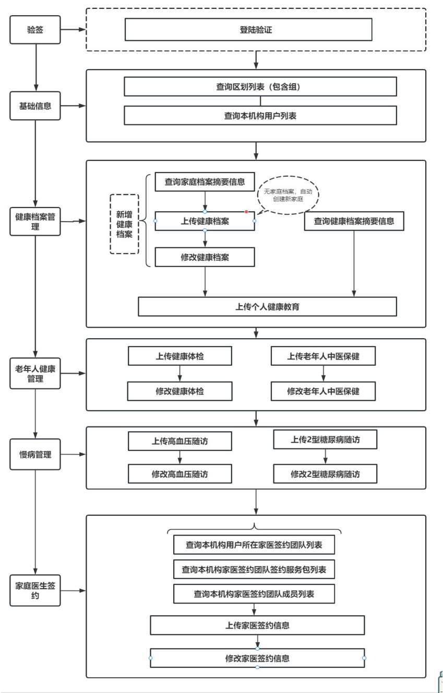

<!-- page: 11 -->

###### 6.2 整改时限 

2025 年7 月31 日前，做好自建信息系统的改造及接口调试工作，确保系统平稳运行。 

###### 6.3 接口列表 

|分类|接口名称|hie_event_c<br>ode|请求方<br>式|接口地址|
|---|---|---|---|---|
||登录验证|ACB666576D9<br>4A00B|POST|/ehrc/login/intergration|
|基础信息|查询区划列表（包含组）|ACB666576D5<br>4A002|GET|/ehr/v1.0/sys|
||查询本机构用户列表|ACB666576D9<br>4A00D|GET|/ehr/v1.0/sys|
||查询家庭档案摘要信息|ACB666576D5<br>4A003|GET|/ehr/v1.0/jkda|
||查询健康档案摘要信息|ACC588D4A91<br>4A000|GET|/ehr/v1.0/jkda|
|健康档案管<br>理|上传健康档案|ACB666576D9<br>4A008|POST|/ehr/v1.0/jkda|
||修改健康档案|ACC5893E475<br>4A000|PUT|/ehr/v1.0/jkda|
||上传个人健康教育|ACB666576D9<br>4A00C|POST|/ehr/v1.0/jkda|
||上传健康体检|ACB666576D9<br>4A000|POST|/ehr/v1.0/lnrgl|
|老年人健康|修改健康体检|ACC5899BEE5<br>4A000|PUT|/ehr/v1.0/lnrgl|
|管理|上传老年人中医保健|ACB666576D9<br>4A00F|POST|/ehr/v1.0/lnrgl|
||修改老年人中医保健|ACC589F2399<br>4A000|PUT|/ehr/v1.0/lnrgl|
|高血压管理|上传高血压随访|ACB666576D5<br>4A000|POST|/ehr/v1.0/gxy|
||修改高血压随访|ACC58A5C385<br>4A000|PUT|/ehr/v1.0/gxy|
|2 型糖尿病管|上传糖尿病随访|ACB666576D9|POST|/ehr/v1.0/tnb|

<!-- page: 12 -->

|理||4A002|||
|---|---|---|---|---|
||修改糖尿病随访|ACC58AAE029<br>4A000|PUT|/ehr/v1.0/tnb|
||查询本机构用户所在家<br>医签约团队列表|ACB666576D9<br>4A005|GET|/ehr/v1.0/jtys|
||查询本机构家医签约团<br>队签约服务包列表|ACB666576D9<br>4A007|GET|/ehr/v1.0/jtys|
|家庭医生签<br>约|查询本机构家医签约团<br>队成员列表|ACB666576D9<br>4A004|GET|/ehr/v1.0/jtys|
||上传家医签约信息|ACB666576D5<br>4A004|POST|/ehr/v1.0/jtys|
||修改家医签约信息|ACC58C11691<br>4A000|PUT|/ehr/v1.0/jtys|


###### 7. 接口定义说明 

接口服务地址（测试）：http://183.220.149.80:8083/engine 

###### 7.1 基础数据类 

###### 7.1.1 登录验证 

###### 7.1.1.1 接口地址 

POST /ehrc/open/v1.0/api/sys/login 

###### 7.1.1.2 接口说明 

请求数据类型:application/json 

响应数据类型:application/json 

通过此接口拿到token，用于其他接口调用时的header 参数，名称为accessToken。 

###### 7.1.1.3 接口请求报文 

###### 请求参数 

|参数名称|参数说明|是否必须|数据类型|
|---|---|---|---|
|username|用户名|true|string|
|password|密码|true|string|

<!-- page: 13 -->

###### 请求示例 

{ 

"username": "", 

"password": "" 

} 

###### 6.1.1.4 接口响应报文 

###### 响应参数 

|参数名称|参数说明|类型|
|---|---|---|
|code|响应码：200 成功,500 失败|integer(int32)|
|data|||
|userId|登录用户ID|string|
|loginId|登录用户账号|string|
|username|登录用户姓名|string|
|orgId|登录用户所属机构ID|string|
|orgName|登录用户所属机构名称|string|
|ownAreaIds|登录用户管辖区域ID|array|
|token|登录用户token|string|
|total|数据总数|integer(int64)|
|message|响应提示|string|


###### 响应示例 

{ 

"code": 0, 

"data": { 

"userId": "", 

"loginId": "", 

<!-- page: 14 -->

"username": "", 

"orgId": "", "orgName": "", 

"ownAreaIds": [], 

"token": "" 

}, 

"total": 1, 

"message": "" 

} 

###### 7.1.2 查询区划列表（包含组） 

###### 7.1.2.1 接口地址 

GET /ehrc/open/v1.0/api/sys/areaList 

###### 7.1.2.2 接口说明 

响应数据类型:application/json 

###### 7.1.2.3 接口请求报文 

###### 请求参数 

|参数名称|参数说明|请求类型|是否必须|数据类型|
|---|---|---|---|---|
|areaId|区划ID|query|true|string|


请求示例 

##### areaId:519902001 

###### 7.1.2.4 接口响应报文 

响应参数 

<!-- page: 15 -->

|参数名称|参数说明|类型|
|---|---|---|
|code|响应码：200 成功,500 失败|integer(int32)|
|data||OpenAreaVO|
|id|区划ID|string|
|title|区划名称|string|
|fullname|区划全称|string|
|children|下级区划列表|array|
|message|响应提示|string|


###### 响应示例 

{ 

"code": 0, 

"data": { "id": "", "title": "", "fullname": "", "children": [ { "id": "", "title": "", 

"fullname": "" 

} 

] 

}, 

"message": "" 

<!-- page: 16 -->

###### } 

###### 7.1.3 查询本机构用户列表 

###### 7.1.3.1 接口地址 

GET /ehrc/open/v1.0/api/sys/user 

###### 7.1.3.2 接口说明 

响应数据类型:application/json 

###### 7.1.3.3 接口请求报文 

###### 请求参数 

|参数名称|参数说明|是否必须|数据类型|
|---|---|---|---|
|pageNumber|页码(默认1)，从1 开始....|true|integer(int64)|
|pageSize|每页条数(默认10)|true|integer(int64)|
|orgId|机构ID（只能查询本机构）|true|string|
|keyword|用戶名/登录名|false|string|


###### 请求示例 

orgId: 517002102 

keyword: 张三 

pageNumber:1 

pageSize:2 

###### 7.1.3.4 接口响应报文 

###### 响应参数 

|参数名称|参数说明|类型|
|---|---|---|
|code|响应码：200 成功,500 失败|integer(int32)|
|data||OpenUserItemVO|
|userid|登录用户ID|string|
|name|登录用户姓名|string|
|orgName|登录用户所属机构名称|string|

<!-- page: 17 -->

|orgId|登录用户所属机构ID|string|
|---|---|---|
|total|数据总数|integer(int64)|
|message|响应提示|string|


响应示例 

{ 

"code": 0, 

"data": [ 

{ 

"userid": "", "name": "", "orgName": "", "orgId": "" } ], 

"total": 1, "message": "" 

} 

###### 7.2 健康档案管理类 

###### 7.2.1 查询家庭档案摘要信息 

###### 7.2.1.1 接口地址 

GET /ehrc/open/v1.0/api/ehr/jt 

###### 7.2.1.2 接口说明 

响应数据类型:application/json 

<!-- page: 18 -->

###### 7.2.1.3 接口请求报文 

###### 请求参数 

|参数名称|参数说明|是否必须|数据类型|
|---|---|---|---|
|pageNumber|页码(默认1)，从1 开始....|true|integer(int64)|
|pageSize|每页条数(默认10)|true|integer(int64)|
|rbh|现居地代码（支持乡镇、村社、组）|false|string|
|keyword|家庭成员姓名/证件号码（乡镇及以<br>上必填）|false|string|
|isnull|[1]表示查询空家庭|false|int|


###### 请求示例 

rbh: 519902001001 

keyword: 

isnull:1 

pageNumber: 1 

pageSize: 2 

###### 7.2.1.4 接口响应报文 

###### 响应参数 

|参数名称|参数说明|类型|
|---|---|---|
|code|响应码：200 成功,500 失败|integer(int32)|
|data|响应数据|array|
|zjhm|家庭成员-证件号码（后四位脱敏）|string|
|xm|家庭成员-姓名（名脱敏）|string|
|xb|家庭成员-性别,可用值:,[1:男],[2:女],[0:未知的<br>性别],[9:未说明的性别]|string|

<!-- page: 19 -->

|yhzgx|家庭成员-与户主关系,可用值:,[02:户主],[03:小<br>集体户主],[10: 配偶],[11: 夫],[12: 妻],[20:<br>子],[21: 独生子],[22: 长子],[23: 次子],[24: 三<br>子],[25:四子],[26:五子],[27:养子或继子],[28:<br>女婿],[29:其他儿子],[30:女],[31:独生女],[32:<br>长女],[33: 次女],[34: 三女],[35: 四女],[36: 五<br>女],[37: 养女或继女],[38: 儿媳],[39: 其他女<br>儿],[40:孙（外孙）子（女）],[41:孙子],[42:孙<br>女],[43:外孙子],[44:外孙女],[45:孙（外孙）媳<br>妇],[46:孙（外孙）女婿],[47:曾（外）孙子],[48:<br>曾（外）孙女],[50: 父母],[51: 父亲],[52: 母<br>亲],[53: 公公],[54: 婆婆],[55: 岳父],[56: 岳<br>母],[57:继父或养父],[58:继母或养母],[59:其他<br>父母关系],[60:祖（外祖）父母],[61:祖父],[62:祖<br>母],[63:外祖父],[64:外祖母],[65:配偶的祖（外<br>祖）父母],[66:曾祖父],[67:曾祖母],[68:配偶的曾<br>祖父母],[69:其他祖（外祖）父母],[70:兄弟姐<br>妹],[71:兄],[72:嫂],[73:弟],[74:弟媳],[75:姐<br>姐],[76:姐夫],[77:妹妹],[78:妹夫],[79:其他兄<br>弟姐妹],[81:伯父],[82:伯母],[83:叔父],[84:婶<br>母],[85: 舅父],[86: 舅母],[87: 姨夫],[88: 姨<br>母],[89: 姑父],[90: 姑母],[91: 堂兄弟（姐<br>妹）],[92:表兄弟（姐妹）],[93:侄子],[94:侄<br>女],[95:外甥],[96:外甥女],[98:保姆],[99:非亲<br>属]|string|
|---|---|---|
|jtId|家庭id|string|
|jtXz|家庭详细地址|string|

<!-- page: 20 -->

|hzXm|户主姓名（名脱敏）|string|
|---|---|---|
|total|数据总数|integer(int64)|
|message|响应提示|string|


###### 响应示例 

{ 

"code": 0, 

"data": [ 

{ 

"zjhm": "", "xm": "", "xb": "", "yhzgx": "", "jtId": "", "jtXz": "", "hzXm": "" 

} ], 

"total": 1, "message": "" } 

###### 7.2.2 查询健康档案摘要信息 

###### 7.2.2.1 接口地址 

GET /ehrc/open/v1.0/api/ehr/jkda 

<!-- page: 21 -->

###### 7.2.2.2 接口说明 

响应数据类型:application/json 

###### 7.2.2.3 接口请求报文 

###### 请求参数 

|参数名称|参数说明|是否必须|数据类型|
|---|---|---|---|
|pageNumber|页码(默认1)，从1 开始....|true|integer(int64<br>)|
|pageSize|每页条数(默认10)|true|integer(int64<br>)|
|keyword|证件号码/姓名/健康档案号|false|string|
|keywordType|证件号码zjhm/姓名xm/健康档案号bh|false|string|
|qhId|现居地区划代码,如果不传则默认为当前<br>用户的管辖区划|false|array|
|daZt|档案状态,可用值:,[10:正常],[01:注<br>销],[22:迁出],[21:失访],[90:死亡]|false|string|
|nlBegin|年龄begin|false|integer(int64<br>)|
|nlEnd|年龄end|false|integer(int64<br>)|


###### 请求示例 

qhId: 519902001001 

qhId: 519902001002 

keyword: 张三 

keywordType:xm 

daZt:10 

<!-- page: 22 -->

nlBegin:1 

nlEnd:100 

pageNumber: 1 

pageSize: 

###### 7.2.2.4 接口响应报文 

###### 响应参数 

|参数名称|参数说明|类型|
|---|---|---|
|code|响应码：200 成功,500 失败|integer(int32)|
|data|响应数据|array|
|daId|档案id|string|
|bh|编号|string|
|xm|姓名（名脱敏）|string|
|xb|性别, 可用值:,[1: 男],[2: 女],[0: 未知的性<br>别],[9:未说明的性别]|string|
|daztCode|档案状态,可用值:,[10:正常],[01:注销],[22:迁<br>出],[21:失访],[90:死亡]|string|
|xjdQhFullName|现居地区划全称|string|
|xjdJbhFullName|现居地组全称|string|
|xjdXz|现居地祥址|string|
|xjdJtId|现居地家庭id|string|
|peopleTags|人群标签|array|
|qyTdName|签约团队名称|string|
|total|数据总数|integer(int64)|
|message|响应提示|string|

<!-- page: 23 -->

###### 响应示例 

{ "code": 0, "data": [ { "daId": "", "bh": "", "xm": "", "xb": "", "daztCode": "", "xjdQhFullName": "", "xjdJbhFullName": "", "xjdXz": "", "xjdJtId": "", "peopleTags": ["老年人","高血压"], "qyTdName": "" } ], "total": 1, "message": "" 

} 

<!-- page: 24 -->

###### 7.2.3 上传健康档案 

###### 7.2.3.1 接口地址 

POST /ehrc/open/v1.0/api/ehr/jkda 

###### 7.2.3.2 接口说明 

请求数据类型:application/json 

响应数据类型:application/json 

###### 7.2.3.3 接口请求报文 

###### 请求参数 

|参数名称|参数说明|是否必须|数据类型|
|---|---|---|---|
|xm|姓名|true|string|
||性别: 可用值:,[1: 男],[2:|||
|xb|女],[0:未知的性别],[9:未说<br>明的性别]|true|string|
||证件类型,可用值:,[10:身份<br>证],[30:军官证],[44:港澳同|||
|zjlx|胞回乡证（通行卡）],[43:台湾<br>居民来往大陆通行证],[50:护<br>照],[60:其他]|true|string|
||证件号码-没有证件号码时把<br>zjlx 设置为60（其他）,zjhm 设|||
|zjhm|置为LS+村编码(12 位)+年月日<br>(出生日期，8 位yyyyMMdd)+2 位<br>随机数|true|string|
|csrq|出生日期|true|string(date-time)|
|mz|民族,可用值:,[01:汉族],[02:|true|string|

<!-- page: 25 -->

|蒙古族],[03: 回族],[04: 藏<br>族],[05: 维吾尔族],[06: 苗|
|---|
|族],[07: 彝族],[08: 壮|
|族],[09: 布依族],[10: 朝鲜|
|族],[11: 满族],[12: 侗|
|族],[13: 瑶族],[14: 白|
|族],[15: 土家族],[16: 哈尼|
|族],[17: 哈萨克族],[18: 傣|
|族],[19: 黎族],[20: 傈僳|
|族],[21: 佤族],[22: 畲|
|族],[23: 高山族],[24: 拉祜|
|族],[25: 水族],[26: 东乡|
|族],[27: 纳西族],[28: 景颇|
|族],[29:柯尔克孜族],[30:土|
|族],[31:达斡尔族],[32:仫佬|
|族],[33: 羌族],[34: 布朗|
|族],[35: 撒拉族],[36: 毛南|
|族],[37: 仡佬族],[38: 锡伯|
|族],[39:阿昌族],[41:塔吉克|
|族],[40: 普米族],[42: 怒|
|族],[43:乌孜别克族],[44:俄|
|罗斯族],[45:鄂温克族],[46:|
|德昴族],[47:保安族],[48:裕|
|固族],[49:京族],[50:塔塔尔|
|族],[51:独龙族],[52:鄂伦春|
|族],[53: 赫哲族],[54: 门巴|
|族],[55: 珞巴族],[56: 基诺|

<!-- page: 26 -->

||族],[57:外籍]|||
|---|---|---|---|
|zdybh|自定义编号|false|string|
|brdh|本人电话|true|string|
|lxrxm|联系人姓名|true|string|
|lxrdh|联系人电话|true|string|
|xxbm|血型,可用值:,[1:A 型],[2:B<br>型],[3:O 型],[4:AB 型],[5:不<br>详]|true|string|
|whcd|文化程度,可用值:,[10:研究<br>生],[20:大学本科],[30:大学<br>专科和专科学校],[40:中等专<br>业学校],[50:技工学校],[60:<br>高中],[70: 初中],[80: 小<br>学],[90:文盲或半文盲],[0:不<br>详]|true|string|
|zy|职业,可用值:,[0:党的机关、国<br>家机关、群众团体和社会组织、<br>企事业单位负责人],[1:专业技<br>术人员],[2:办事人员和有关人<br>员],[3:商业、服务业人员],[4:<br>农、林、牧、渔业生产及辅助人<br>员],[5:生产、运输设备操作人<br>员及有关人员],[6:军人],[7:<br>不便分类的其他从业人员],[8:<br>无职业]|true|string|
|hy|婚姻,可用值:,[10:未婚],[20:<br>已婚],[21: 初婚],[22: 再|true|string|

<!-- page: 27 -->

|rhyxbm|婚],[23: 复婚],[30: 丧<br>偶],[40:离婚],[90:未说明的<br>婚姻状况]<br>rh 阴性编码, 可用值:,[1: 阴<br>性],[2:阳性],[3:不详]|true|string|
|---|---|---|---|
|ylfyzffs|医疗费用支付方式#位运算,可<br>用值:[0:未设置],[1:城镇职工<br>基本医疗保险],[2:城镇居民基<br>本医疗保险],[4:新型农村合作<br>医疗],[8:贫困救助],[16:商业<br>医疗保险],[32:全公费],[64:<br>全自费],[128:其他],[256:城<br>乡居民基本医疗保险]|true|string|
|ylfyzffsqt|医疗费用支付方式其他|false|string|
||药物过敏史# 位运算, 可用<br>值:[0:未设置],[1:无],[2:青|||
|ywgms|霉素],[4: 磺胺],[8: 链霉<br>素],[16:其他],[32:其他药物<br>过敏],[64:食物过敏]|true|string|
|ywgmsqt|药物过敏史其它|false|string|
|ywgmsqtyw|药物过敏其他药物过敏|false|string|
|ywgmssw|药物过敏食物过敏|false|string|
||暴露史#位运算,可用值:[0:未|||
|bls|设置],[1:无],[2:化学品],[4:<br>毒物],[8:射线]|true|string|
|jzsFqjb|父亲疾病#位运算,可用值:[0:<br>未设置],[1: 无],[2: 高血|true|string|

<!-- page: 28 -->

||压],[4: 糖尿病],[8: 冠心<br>病],[16: 慢性阻塞性肺疾<br>病],[32:恶性肿瘤],[64:脑卒<br>中],[128: 严重精神障<br>碍],[256: 结核病],[512: 肝<br>炎],[1024:先天畸形],[2048:<br>其他]|||
|---|---|---|---|
|jzsFqqtjb|父亲其他疾病|false|string|
|jzsMqjb|母亲疾病#位运算,可用值:[0:<br>未设置],[1: 无],[2: 高血<br>压],[4: 糖尿病],[8: 冠心<br>病],[16: 慢性阻塞性肺疾<br>病],[32:恶性肿瘤],[64:脑卒<br>中],[128: 严重精神障<br>碍],[256: 结核病],[512: 肝<br>炎],[1024:先天畸形],[2048:<br>其他]|true|string|
|jzsMqqtjb|母亲其他疾病|false|string|
|jzsXdjmjb|兄弟姐妹疾病# 位运算, 可用<br>值:[0:未设置],[1:无],[2:高<br>血压],[4: 糖尿病],[8: 冠心<br>病],[16: 慢性阻塞性肺疾<br>病],[32:恶性肿瘤],[64:脑卒<br>中],[128: 严重精神障<br>碍],[256: 结核病],[512: 肝<br>炎],[1024:先天畸形],[2048:<br>其他]|true|string|

<!-- page: 29 -->

|jzsXdjmqtjb|兄弟姐妹其他疾病|false|string|
|---|---|---|---|
|jzsZnjb|子女疾病#位运算,可用值:[0:<br>未设置],[1: 无],[2: 高血<br>压],[4: 糖尿病],[8: 冠心<br>病],[16: 慢性阻塞性肺疾<br>病],[32:恶性肿瘤],[64:脑卒<br>中],[128: 严重精神障<br>碍],[256: 结核病],[512: 肝<br>炎],[1024:先天畸形],[2048:<br>其他]|true|string|
|jzsZnqtjb|子女其他疾病|false|string|
|cjqk|残疾情况#位运算,可用值:[0:<br>未设置],[1:无残疾],[2:视力<br>残疾],[4:听力残疾],[8:言语<br>残疾],[16:肢体残疾],[32:智<br>力残疾],[64:精神残疾],[128:<br>其他残疾]|true|string|
|cjqkqt|残疾情况其他|false|string|
|zrysId|责任医生id|true|string|
|jdRq|建档日期|true|string(date-time)|
|jdYsId|建档医生id|true|string|
|hjdQhId|户籍地区划id|true|string|
|hjdQhJbh|户籍地区划组编号,jbh|false|string|
|hjdXz|户籍地家庭祥址|false|string|
|xjdXz|现居地家庭祥址|false|string|
|xjdJtYhzgx|现居地家庭与户主关系|true|string|
|gzdw|工作单位|true|string|

<!-- page: 30 -->

|czlx|常住类型, 可用值:,[1: 户<br>籍],[2:非户籍]|true|string|
|---|---|---|---|
|jtInfo|家庭居住环境,加入家庭时家庭<br>居住环境若有变动请传入，若无<br>变动请不要传，新建档案同时新<br>家庭请传入|false|OpenJtInfoDto|
|jtId|家庭id|false|integer|
|zdybh|自定义编号|false|string|
||厨房排风措施, 可用值:,[1:|||
|cfpfss|无],[2: 油烟机],[3: 换气<br>扇],[4:烟囱]|false|string|
||燃料类型, 可用值:,[1: 液化|||
|rllx|气],[2:煤],[3:天然气],[4:沼<br>气],[5:柴火],[6:其他]|false|string|
||饮水,可用值:,[1:自来水],[2:|||
|ys|经净化过滤水],[3:井水],[4:<br>河湖水],[5:塘水],[6:其他]|false|string|
||厕所, 可用值:,[1: 卫生厕|||
|cs|所],[2: 一格或二格粪池<br>式],[3: 马桶],[4: 露天粪<br>坑],[5:简易棚厕]|false|string|
|qcl|禽畜栏,可用值:,[1:无],[2:单<br>设],[3:室内],[4:室外]|false|string|
|jpcs|距派出所|false|number|
|jwsz|距卫生站|false|number|
|jwsy|距卫生院|false|number|
|jsd|距商店|false|number|

<!-- page: 31 -->

|zfcg|住房采光,可用值:,[1:好],[2:<br>一般],[3:差]|false|string|
|---|---|---|---|
|zfmj|住房面积|false|number|
|zfqk|住房情况,可用值:,[1:自建住<br>房],[2: 自购商品房],[3: 租<br>房],[4:经济适用房],[5:安置<br>房],[7:私房],[8:公房],[0:其<br>他]|false|string|
|zflx|住房类型,可用值:,[1:普通楼<br>房],[2:高层楼房],[3:砖瓦平<br>房],[4:木棚土坯平房],[99:其<br>他]|false|string|
|bz|备注|false|string|
|gahh|公安户号|false|string|
|jtdh|家庭电话|false|string|
|jth|集体户,可用值:[1:是],[0:否]|false|string|
|knjt|困难家庭,可用值:[1:是],[0:<br>否]|false|string|
|sdjt|失独家庭,可用值:[1:是],[0:<br>否]|false|string|
|ygglr|孤寡家庭,可用值:[1:是],[0:<br>否]|false|string|
|ylset|留守家庭,可用值:[1:是],[0:<br>否]|false|string|
|dbjt|低保家庭,可用值:[1:是],[0:<br>否]|false|string|
|jtfjt|奖扶特家庭, 可用值:[1:|false|string|

<!-- page: 32 -->

||是],[0:否]|||
|---|---|---|---|
|rbh|村编码-家庭页面传入此参数才<br>会修改区划信息|true|string|
|jbh|组编码-家庭页面传入此参数才<br>会修改区划信息|true|string|
|hidxz|家庭详址|true|string|
|jb|疾病史|true|array|
|jbbm|疾病编码,可用值:,[1:无],[2:<br>高血压],[3:糖尿病],[4:冠心<br>病],[5: 慢性阻塞性肺疾<br>病],[6: 恶性肿瘤],[7: 脑卒<br>中],[8:严重精神障碍],[9:结<br>核病],[10:肝炎],[11:其他法<br>定传染病],[12:职业病],[13:<br>其他]|true|string|
|jbmc||false|string|
|qzrq|确诊日期|false|string|
|rqbx|确诊日期不详|false|integer|
|ss|手术史|true|array|
|ssmc|手术名称|true|string|
|ssrq|手术日期|false|string|
|rqbx|手术日期不详|false|integer|
|ws|外伤史|true|array|
|wsmc|外伤名称|true|string|
|wsrq|外伤日期|false|string|
|rqbx|外伤日期不详|false|integer|
|sx|输血史|true|array|

<!-- page: 33 -->

|sxyy|输血原因|true|string|
|---|---|---|---|
|sxrq|输血日期|false|string|
|rqbx|输血日期不详|false|integer|
|ycbs|遗传病史|true|array|
|ycbmc|遗传病名称|true|string|
|bz|备注|false|string|
|zyBbfl|职业不便分类|false|string|
||居住类型, 可用值:[1: 常|||
|jzlx|住],[2:暂住],[3:流动],[4:其<br>他]|true|string|


###### 请求示例 

{ 

"xm": "张三", 

"xb": "1", 

- "zjlx": "10", 

"zjhm": "513436201601018487", 

- "csrq": "", 

- "mz": "01", 

- "zdybh": "", 

"brdh": "13100000000", 

"lxrxm": "李四", 

"lxrdh": "13100000001", 

- "xxbm": "1", 

"whcd": "1", 

"zy": "2", 

<!-- page: 34 -->

"hy": "2", 

"rhyxbm": "1", "ylfyzffs": "3", 

"ylfyzffsqt": "", 

"ywgms": "6", 

"ywgmsqt": "花粉", 

"ywgmsqtyw": "", 

"ywgmssw": "", 

"bls": "12", 

"jzsFqjb": "96", "jzsFqqtjb": "", "jzsMqjb": "6", "jzsMqqtjb": "", "jzsXdjmjb": "3", "jzsXdjmqtjb": "", "jzsZnjb": "10", "jzsZnqtjb": "", 

"cjqk": "10", "cjqkqt": "", "zrysId": "", 

"jdRq": "", 

"jdYsId": "", 

"hjdQhId": "510105002007", 

"hjdQhJbh": "J510105002007001", 

<!-- page: 35 -->

"hjdXz": "", "xjdXz": "", "xjdJtYhzgx": "02", "gzdw": "", "czlx": "1", "jtInfo": { "jtId": null, "zdybh": "ZDY-001", "cfpfss": "", "rllx": "", "ys": "", "cs": "", "qcl": "", "jpcs": 0, "jwsz": 0, "jwsy": 0, "jsd": 0, "zfcg": "", "zfmj": 0, "zfqk": "4", "zflx": "", "bz": "", "gahh": "GA110", "jtdh": "028-86131320", 

<!-- page: 36 -->

"jth": "0", "knjt": "1", "sdjt": "0", "ygglr": "0", "ylset": "1", "dbjt": "0", "jtfjt": "0", "rbh": "", "jbh": "J510105002007001", "hidxz":"" }, "jb": [ { "jbbm": "2", "jbmc": "", "qzrq": "2020-01-01", "rqbx": 0 } ], "ss": [ { "ssmc": "", "ssrq": "2020-01-02", "rqbx": 0 

<!-- page: 37 -->

} ], "ws": [ { "wsmc": "", "wsrq": "2020-01-03", "rqbx": 0 } ], "sx": [ { "sxyy": "", "sxrq": "2020-01-04", "rqbx": 0 } ], "ycbs": [ { "ycbmc": "" } ], 

"bz": "", 

"zyBbfl": "", 

"jzlx": "" 

<!-- page: 38 -->

###### } 

###### 7.2.3.4 接口响应报文 

###### 响应参数 

|参数名称|参数说明|类型|
|---|---|---|
|code|响应码：200 成功,500 失败|integer(int32)|
|data||OpenId|
|id|主键ID（修改时，需要提供数据主键ID，否则无法修改）|string|
|sjlyId|数据来源ID（修改时，需要提供数据来源ID，否则无法<br>修改）|string|
|attr|扩展参数|object|
|jtId|现居地家庭ID|string|
|message|响应提示|string|


###### 响应示例 

{ 

"code": 0, 

"data": { 

"id": "", 

"sjlyId": "", 

"attr": { 

"jtId": 11 

} 

}, 

"message": "" 

<!-- page: 39 -->

###### } 

###### 7.2.4 修改健康档案 

###### 7.2.4.1 接口地址 

PUT /ehrc/open/v1.0/api/ehr/jkda 

###### 7.2.4.2 接口说明 

请求数据类型:application/json 

响应数据类型:application/json 

###### 7.2.4.3 接口请求报文 

###### 请求参数 

|参数名称|参数说明|是否必须|数据类型|
|---|---|---|---|
|xm|姓名|true|string|
|xb|性别:可用值:,[1:男],[2:女],[0:未知<br>的性别],[9:未说明的性别]|true|string|
||证件类型,可用值:,[10:身份证],[30:军|||
|zjlx|官证],[44: 港澳同胞回乡证（通行<br>卡）],[43: 台湾居民来往大陆通行|true|string|
||证],[50:护照],[60:其他]|||
|zjhm|证件号码-没有证件号码时把zjlx 设置为<br>60（其他）,zjhm设置为LS+村编码(12位)+<br>年月日(出生日期，8 位yyyyMMdd)+2 位随<br>机数|true|string|
|csrq|出生日期|true|string(date-|

<!-- page: 40 -->

||||time)|
|---|---|---|---|
||民族, 可用值:,[01: 汉族],[02: 蒙古<br>族],[03:回族],[04:藏族],[05:维吾尔<br>族],[06: 苗族],[07: 彝族],[08: 壮<br>族],[09:布依族],[10:朝鲜族],[11:满<br>族],[12: 侗族],[13: 瑶族],[14: 白<br>族],[15:土家族],[16:哈尼族],[17:哈<br>萨克族],[18:傣族],[19:黎族],[20:傈<br>僳族],[21:佤族],[22:畲族],[23:高山<br>族],[24:拉祜族],[25:水族],[26:东乡<br>族],[27:纳西族],[28:景颇族],[29:柯|||
|mz|尔克孜族],[30: 土族],[31: 达斡尔<br>族],[32:仫佬族],[33:羌族],[34:布朗<br>族],[35:撒拉族],[36:毛南族],[37:仡<br>佬族],[38:锡伯族],[39:阿昌族],[41:<br>塔吉克族],[40: 普米族],[42: 怒<br>族],[43: 乌孜别克族],[44: 俄罗斯<br>族],[45:鄂温克族],[46:德昴族],[47:<br>保安族],[48:裕固族],[49:京族],[50:<br>塔塔尔族],[51: 独龙族],[52: 鄂伦春<br>族],[53:赫哲族],[54:门巴族],[55:珞<br>巴族],[56:基诺族],[57:外籍]|true|string|
|zdybh|自定义编号|false|string|
|brdh|本人电话|true|string|
|lxrxm|联系人姓名|true|string|
|lxrdh|联系人电话|true|string|
|xxbm|血型,可用值:,[1:A 型],[2:B 型],[3:O|true|string|

<!-- page: 41 -->

||型],[4:AB 型],[5:不详]|||
|---|---|---|---|
|whcd|文化程度,可用值:,[10:研究生],[20:大<br>学本科],[30: 大学专科和专科学<br>校],[40: 中等专业学校],[50: 技工学<br>校],[60: 高中],[70: 初中],[80: 小<br>学],[90:文盲或半文盲],[0:不详]|true|string|
|zy|职业,可用值:,[0:党的机关、国家机关、<br>群众团体和社会组织、企事业单位负责<br>人],[1:专业技术人员],[2:办事人员和<br>有关人员],[3:商业、服务业人员],[4:<br>农、林、牧、渔业生产及辅助人员],[5:<br>生产、运输设备操作人员及有关人<br>员],[6:军人],[7:不便分类的其他从业<br>人员],[8:无职业]|true|string|
||婚姻, 可用值:,[10: 未婚],[20: 已|||
|hy|婚],[21: 初婚],[22: 再婚],[23: 复<br>婚],[30:丧偶],[40:离婚],[90:未说明<br>的婚姻状况]|true|string|
|rhyxbm|rh 阴性编码,可用值:,[1:阴性],[2:阳<br>性],[3:不详]|true|string|
||医疗费用支付方式#位运算,可用值:[0:<br>未设置],[1: 城镇职工基本医疗保<br>险],[2:城镇居民基本医疗保险],[4:新|||
|ylfyzffs|型农村合作医疗],[8:贫困救助],[16:商<br>业医疗保险],[32: 全公费],[64: 全自<br>费],[128:其他],[256:城乡居民基本医<br>疗保险]|true|string|

<!-- page: 42 -->

|ylfyzffsqt|医疗费用支付方式其他|false|string|
|---|---|---|---|
|ywgms|药物过敏史#位运算,可用值:[0:未设<br>置],[1:无],[2:青霉素],[4:磺胺],[8:<br>链霉素],[16: 其他],[32: 其他药物过<br>敏],[64:食物过敏]|true|string|
|ywgmsqt|药物过敏史其它|false|string|
|ywgmsqtyw|药物过敏其他药物过敏|false|string|
|ywgmssw|药物过敏食物过敏|false|string|
|bls|暴露史#位运算,可用值:[0:未设置],[1:<br>无],[2:化学品],[4:毒物],[8:射线]|true|string|
|jzsFqjb|父亲疾病# 位运算, 可用值:[0: 未设<br>置],[1: 无],[2: 高血压],[4: 糖尿<br>病],[8:冠心病],[16:慢性阻塞性肺疾<br>病],[32:恶性肿瘤],[64:脑卒中],[128:<br>严重精神障碍],[256:结核病],[512:肝<br>炎],[1024:先天畸形],[2048:其他]|true|string|
|jzsFqqtjb|父亲其他疾病|false|string|
|jzsMqjb|母亲疾病# 位运算, 可用值:[0: 未设<br>置],[1: 无],[2: 高血压],[4: 糖尿<br>病],[8:冠心病],[16:慢性阻塞性肺疾<br>病],[32:恶性肿瘤],[64:脑卒中],[128:<br>严重精神障碍],[256:结核病],[512:肝<br>炎],[1024:先天畸形],[2048:其他]|true|string|
|jzsMqqtjb|母亲其他疾病<br>兄弟姐妹疾病#位运算,可用值:[0:未设|false|string|
|jzsXdjmjb|置],[1: 无],[2: 高血压],[4: 糖尿<br>病],[8:冠心病],[16:慢性阻塞性肺疾|true|string|

<!-- page: 43 -->

||病],[32:恶性肿瘤],[64:脑卒中],[128:<br>严重精神障碍],[256:结核病],[512:肝<br>炎],[1024:先天畸形],[2048:其他]|||
|---|---|---|---|
|jzsXdjmqtjb<br>jzsZnjb|兄弟姐妹其他疾病<br>子女疾病# 位运算, 可用值:[0: 未设<br>置],[1: 无],[2: 高血压],[4: 糖尿<br>病],[8:冠心病],[16:慢性阻塞性肺疾<br>病],[32:恶性肿瘤],[64:脑卒中],[128:<br>严重精神障碍],[256:结核病],[512:肝<br>炎],[1024:先天畸形],[2048:其他]|false<br>true|string<br>string|
|jzsZnqtjb|子女其他疾病|false|string|
||残疾情况# 位运算, 可用值:[0: 未设<br>置],[1:无残疾],[2:视力残疾],[4:听力|||
|cjqk|残疾],[8: 言语残疾],[16: 肢体残<br>疾],[32: 智力残疾],[64: 精神残<br>疾],[128:其他残疾]|true|string|
|cjqkqt|残疾情况其他|false|string|
|zrysId|责任医生id|true|string|
|jdRq|建档日期|true|string(date-<br>time)|
|jdYsId|建档医生id|true|string|
|hjdQhId|户籍地区划id|true|string|
|hjdQhJbh|户籍地区划组编号,jbh|false|string|
|hjdXz|户籍地家庭祥址|false|string|
|xjdXz|现居地家庭祥址|false|string|
|xjdJtYhzgx|现居地家庭与户主关系|true|string|
|gzdw|工作单位|true|string|

<!-- page: 44 -->

|czlx|常住类型,可用值:,[1:户籍],[2:非户<br>籍]|true|string|
|---|---|---|---|
|jtInfo|家庭居住环境,加入家庭时家庭居住环境<br>若有变动请传入，若无变动请不要传，新<br>建档案同时新家庭请传入|false|OpenJtInfoDt<br>o|
|jtId|家庭id|false|integer|
|zdybh|自定义编号|false|string|
|cfpfss|厨房排风措施,可用值:,[1:无],[2:油烟<br>机],[3:换气扇],[4:烟囱]|false|string|
||燃料类型, 可用值:,[1: 液化气],[2:|||
|rllx|煤],[3: 天然气],[4: 沼气],[5: 柴<br>火],[6:其他]|false|string|
||饮水,可用值:,[1:自来水],[2:经净化过|||
|ys|滤水],[3: 井水],[4: 河湖水],[5: 塘<br>水],[6:其他]|false|string|
||厕所,可用值:,[1:卫生厕所],[2:一格或|||
|cs|二格粪池式],[3: 马桶],[4: 露天粪<br>坑],[5:简易棚厕]|false|string|
|qcl|禽畜栏,可用值:,[1:无],[2:单设],[3:<br>室内],[4:室外]|false|string|
|jpcs|距派出所|false|number|
|jwsz|距卫生站|false|number|
|jwsy|距卫生院|false|number|
|jsd|距商店|false|number|
|zfcg|住房采光, 可用值:,[1: 好],[2: 一<br>般],[3:差]|false|string|
|zfmj|住房面积|false|number|

<!-- page: 45 -->

|zfqk|住房情况,可用值:,[1:自建住房],[2:自<br>购商品房],[3: 租房],[4: 经济适用<br>房],[5: 安置房],[7: 私房],[8: 公<br>房],[0:其他]|false|string|
|---|---|---|---|
|zflx|住房类型,可用值:,[1:普通楼房],[2:高<br>层楼房],[3:砖瓦平房],[4:木棚土坯平<br>房],[99:其他]|false|string|
|bz|备注|false|string|
|gahh|公安户号|false|string|
|jtdh|家庭电话|false|string|
|jth|集体户,可用值:[1:是],[0:否]|false|string|
|knjt|困难家庭,可用值:[1:是],[0:否]|false|string|
|sdjt|失独家庭,可用值:[1:是],[0:否]|false|string|
|ygglr|孤寡家庭,可用值:[1:是],[0:否]|false|string|
|ylset|留守家庭,可用值:[1:是],[0:否]|false|string|
|dbjt|低保家庭,可用值:[1:是],[0:否]|false|string|
|jtfjt|奖扶特家庭,可用值:[1:是],[0:否]|false|string|
|rbh|村编码-家庭页面传入此参数才会修改区<br>划信息|true|string|
|jbh|组编码-家庭页面传入此参数才会修改区<br>划信息|true|string|
|hidxz|家庭详址|true|string|
|jb|疾病史|true|array|
|jbbm|疾病编码, 可用值:,[1: 无],[2: 高血<br>压],[3:糖尿病],[4:冠心病],[5:慢性阻<br>塞性肺疾病],[6: 恶性肿瘤],[7: 脑卒<br>中],[8: 严重精神障碍],[9: 结核|true|string|

<!-- page: 46 -->

||病],[10: 肝炎],[11: 其他法定传染<br>病],[12:职业病],[13:其他]|||
|---|---|---|---|
|jbmc||false|string|
|qzrq|确诊日期|false|string|
|rqbx|确诊日期不详|false|integer|
|ss|手术史|true|array|
|ssmc|手术名称|true|string|
|ssrq|手术日期|false|string|
|rqbx|手术日期不详|false|integer|
|ws|外伤史|true|array|
|wsmc|外伤名称|true|string|
|wsrq|外伤日期|false|string|
|rqbx|外伤日期不详|false|integer|
|sx|输血史|true|array|
|sxyy|输血原因|true|string|
|sxrq|输血日期|false|string|
|rqbx|输血日期不详|false|integer|
|ycbs|遗传病史|true|array|
|ycbmc|遗传病名称|true|string|
|bz|备注|false|string|
|zyBbfl|职业不便分类|false|string|
|jzlx|居住类型, 可用值:[1: 常住],[2: 暂<br>住],[3:流动],[4:其他]|true|string|
|openId|ID 包装类|false|OpenId|
|id|主键ID（修改时，需要提供数据主键ID，<br>否则无法修改）|true|string|

<!-- page: 47 -->

||数据来源ID（修改时，需要提供数据来源|||
|---|---|---|---|
|sjlyId|ID，否则无法修改）|true|string|
|请求示例||||


{ 

"xm": "张三", 

"xb": "1", 

"zjlx": "10", 

"zjhm": "513436201601018487", 

"csrq": "", 

"mz": "01", 

"zdybh": "", 

"brdh": "13100000000", 

"lxrxm": "李四", 

"lxrdh": "13100000001", 

"xxbm": "1", 

"whcd": "1", 

"zy": "2", 

"hy": "2", 

"rhyxbm": "1", "ylfyzffs": "3", 

"ylfyzffsqt": "", "ywgms": "6", 

"ywgmsqt": "", 

"ywgmsqtyw": "", 

<!-- page: 48 -->

"ywgmssw": "", 

"bls": "12", 

"jzsFqjb": "96", "jzsFqqtjb": "", "jzsMqjb": "6", "jzsMqqtjb": "", "jzsXdjmjb": "3", "jzsXdjmqtjb": "", "jzsZnjb": "10", "jzsZnqtjb": "", "cjqk": "10", "cjqkqt": "", "zrysId": "", "jdRq": "", "jdYsId": "", "hjdQhId": "510105002007", 

"hjdQhJbh": "J510105002007001", 

"hjdXz": "", "xjdXz": "", "xjdJtYhzgx": "02", "gzdw": "", "czlx": "1", 

"jtInfo": { "jtId": 1, 

<!-- page: 49 -->

"zdybh": "ZDY-001", 

"cfpfss": "", "rllx": "", "ys": "", "cs": "", "qcl": "", "jpcs": 0, "jwsz": 0, "jwsy": 0, "jsd": 0, "zfcg": "", "zfmj": 0, "zfqk": "4", "zflx": "", "bz": "", "gahh": "GA110", "jtdh": "028-86131320", "jth": "0", "knjt": "1", "sdjt": "0", "ygglr": "0", "ylset": "1", "dbjt": "0", "jtfjt": "0", 

<!-- page: 50 -->

"rbh": "", "jbh": "J510105002007001", "hidxz": "" }, "jb": [ { "jbbm": "2", "jbmc": "", "qzrq": "2020-01-01", "rqbx": 0 } ], "ss": [ { "ssmc": "", "ssrq": "2020-01-02", "rqbx": 0 } ], "ws": [ { "wsmc": "", "wsrq": "2020-01-03", "rqbx": 0 

<!-- page: 51 -->

} ], "sx": [ { "sxyy": "", "sxrq": "2020-01-04", "rqbx": 0 } ], "ycbs": [ 

{ "ycbmc": "" } ], "bz": "", "zyBbfl": "", "jzlx": "", "openId": { "id": "", "sjlyId": "" 

} 

} 

<!-- page: 52 -->

###### 7.2.4.4 接口响应报文 

###### 响应参数 

|参数名称|参数说明|类型|
|---|---|---|
|code|响应码：200 成功,500 失败|integer(int32)|
|data|响应数据|object|
|id|主键ID（修改时，需要提供数据主<br>键ID，否则无法修改）|string|
|sjlyId|数据来源ID（修改时，需要提供数<br>据来源ID，否则无法修改）|string|
|attr|扩展参数|object|
|jtId|现居地家庭ID|string|
|message|响应提示|string|


###### 响应示例 

{ 

"code": 0, 

"data": { 

"id": "", "sjlyId": "", "attr": { "jtId": 11 

} 

}, 

"message": "" 

} 

<!-- page: 53 -->

###### 7.2.5 上传个人健康教育 

###### 7.2.5.1 接口地址 

POST /ehrc/open/v1.0/api/ehr/jkjy/gr/create 

###### 7.2.5.2 接口说明 

请求数据类型:application/json 

响应数据类型:application/json 

###### 7.2.5.3 接口请求报文 

###### 请求参数 

|参数名称|参数说明|是否必须|数据类型|
|---|---|---|---|
|daId|档案ID|true|string|
|jysj|教育时间|true|string(date-ti<br>me)|
|jynr|教育内容|true|string|
||教育类型,可用值:[01:体检表],[02:<br>高血压],[03: 糖尿病],[04: 精神|||
|jylx|病],[05:老年人],[06:门诊],[07:住<br>院],[08:脑卒中],[09:COPD],[10:高<br>糖合并],[99:不限]|true|string|
|zyy|【含中医药】不能为空,可用值:[1:<br>是],[0:否]|true|string|
|zrysId|责任医生ID|false|string|


###### 请求示例 

{ 

"daId": "", 

"jysj": "", 

<!-- page: 54 -->

"jynr": "", "jylx": "", "zyy": "", "zrysId": "" 

} 

###### 7.2.5.4 接口响应报文 

###### 响应参数 

|参数名称|参数说明|类型|
|---|---|---|
|code|响应码：200 成功,500 失败|integer(int32)|
|data||OpenId|
|id|主键ID（修改时，需要提供数据主键ID，<br>否则无法修改）|string|
|sjlyId|数据来源ID（修改时，需要提供数据来源<br>ID，否则无法修改）|string|
|message|响应提示|string|


###### 响应示例 

{ 

"code": 0, 

"data": { "id": "", 

"sjlyId": "" 

}, 

"message": "" 

<!-- page: 55 -->

###### } 

###### 7.3 老年人健康管理 

###### 7.3.1 上传健康体检 

###### 7.3.1.1 接口地址 

POST /ehrc/open/v1.0/api/ehr/jktj 

###### 7.3.1.2 接口说明 

此接口用于新增健康体检。 

请求数据类型:application/json 响应数据类型:application/json 

###### 7.3.1.3 接口请求报文 

###### 请求参数 

|参数名称|参数说明|是否必须|数据类型|
|---|---|---|---|
|daId|档案ID|true|string|
|zzbm|症状,可多选，多个以逗号分隔,[1:无症<br>状],[2:头痛],[3:头晕],[4:心悸],[5:胸<br>闷],[6:胸痛],[7:慢性咳嗽],[8:咳痰],[9:<br>呼吸困难],[10:多饮],[11:多尿],[12:体重<br>下降],[13:乏力],[14:关节肿痛],[15:视力<br>模糊],[16:手脚麻木],[17:腹尿急],[18:尿<br>痛],[19:便秘],[20:腹泻],[21:恶心呕<br>吐],[22:眼花],[23:耳鸣],[24:乳房胀<br>痛],[25:其他]|true|string|
|zzqt|症状其他|false|string|
|tw|体温|false|number|
|ml|脉率|false|integer(int32)|
|hxpl|呼吸频率|false|integer(int32)|
|xyssyz|血压左侧收缩压|false|integer(int32)|
|xyszyz|血压左侧舒张压|false|integer(int32)|
|xyssyy|血压右侧收缩压|false|integer(int32)|
|xyszyy|血压右侧舒张压|false|integer(int32)|

<!-- page: 56 -->

|sg|身高|false|number|
|---|---|---|---|
|tz|体重|false|number|
|yw|腰围|false|number|
|tzzs|体质指数|false|number|
|lnrjkztz<br>p|老年人健康状态自我评估,[1:满意],[2:基本<br>满意],[3:说不清楚],[4:不太满意],[5:不满<br>意]|false|string|
|lnrzlnlz<br>p|老年人自理能力自我评估,[1:可自理（0~3<br>分）],[2:轻度依赖（4~8 分）],[3:中度依赖<br>（9~18 分）],[4:不能自理（≥19 分）]|false|string|
|lnrrzgn|老年人认知功能,[1:粗筛阴性],[2:粗筛阳<br>性,简易智力状态检查]|false|string|
|rzgnzf|认知总分|false|integer(int32)|
|lnrqgzt|老年人情感状态,[1:粗筛阴性],[2:粗筛阳<br>性,老年人抑郁评分检查]|false|string|
|qgztzf|情感状态总分|false|integer(int32)|
|tydlpl|体育锻炼频率,[1:每天],[2:每周一次以<br>上],[3:偶尔],[4:不锻炼]|false|string|
|mcdlsj|每次锻炼时间|false|string|
|jcdlsj|坚持锻炼时间|false|string|
|dlfs|锻炼方式|false|string|
|ysxg|饮食习惯,可多选，以逗号分隔,[1:荤素均<br>衡],[2:荤食为主],[3:素食为主],[4:嗜<br>盐],[5:嗜油],[6:嗜糖]|false|string|
|xyzk|吸烟状况,[1:从不吸烟],[2:已戒烟],[3:吸<br>烟]|false|string|
|rxyl|日吸烟量|false|integer(int32)|
|ksxynl|开始吸烟年龄|false|integer(int32)|
|jynl|戒烟年龄|false|integer(int32)|
|yjpl|饮酒频率,[1:从不],[2:偶尔],[3:经常],[4:<br>每天]|false|string|
|ryjl|日饮酒量|false|string|
|sfjj|是否戒酒, [1:未戒酒],[ 2:已戒酒]|false|string|
|jjnl|戒酒年龄|false|integer(int32)|

<!-- page: 57 -->

|ksyjnl|开始饮酒年龄|false|integer(int32)|
|---|---|---|---|
|jynnsfzj|近一年内是否曾醉酒,[ 1:是],[2:否]|false|string|
|yjzl|饮酒种类,[1:白酒],[2:啤酒],[3:红酒],[4:<br>黄酒],[5:其他]|false|string|
|yjzlqtmc|饮酒种类其他|false|string|
|zybwhysj<br>cs|职业病危害因素接触史[1:无],[2:有]|true|string|
|gzzl|工种|false|string|
|cysj|从业时间|false|integer(int32)|
|dwfc|毒物粉尘|false|string|
|dwfhcsbm<br>fc|粉尘防护措施,[1:是], [2:否]|false|string|
|dwfhcsfc|粉尘防护措施名称|false|string|
|dwfswz|放射物质|false|string|
|dwfhcsbm<br>fs|放射物质防护措施,[1:是], [2:否]|false|string|
|dwfhcsfs|放射物质防护措施名称|false|string|
|dwwlys|物理因素|false|string|
|dwfhcsbm<br>wl|物理因素防护措施,[1:是], [2:否]|false|string|
|dwfhcswl|物理因素防护措施名称|false|string|
|dwhxwz|化学物质|false|string|
|dwfhcsbm<br>hx|化学物质保护措施,[1:是], [2:否]|false|string|
|dwfhcshx|化学物质保护措施名称|false|string|
|dwqt|其他毒物|false|string|
|dwfhcsbm<br>qt|其他毒物保护措施,[1:是], [2:否]|false|string|
|dwfhcsqt<br>kcbm|其他毒物保护措施名称<br>口唇,[1:红润],[2:苍白],[3:发绀],[4:皲<br>裂],[5:疱疹]|false<br>false|string<br>string|
|clbm|齿列,[1:正常],[2:缺齿],[3:龋齿],[4:义齿<br>(假牙)]|false|string|
|ybbm|咽部,[1:无充血],[2:充血],[3:淋巴滤泡增|false|string|

<!-- page: 58 -->

||生]|||
|---|---|---|---|
|zysl|左眼视力|false|string|
|zyjzsl|左眼矫正视力|false|string|
|yysl|右眼视力|false|string|
|yyjzsl|右眼矫正视力|false|string|
|tlbm|左耳听力,[1:听见],[2:听不清或无法听见]|true|string|
|yetlbm|右耳听力,[1:听见],[2:听不清或无法听见]|true|string|
|ydgnbm|运动功能,[1:可顺利完成],[2:无法独立完成<br>任何一个动作]|false|string|
|ydbm|眼底,[1:未见异常],[2:异常]|false|string|
|ydyc|眼底异常|false|string|
|pfbm|皮肤,[1:正常],[2:潮红],[3:苍白],[4:发<br>绀],[5:黄染],[6:色素沉着],[7:其他]|false|string|
|pfqt|皮肤其他|false|string|
|gmbm|巩膜,[1:正常],[2:黄染],[3:充血],[4:其<br>他]|false|string|
|gmqt|巩膜其他|false|string|
|lbjbm|淋巴结,[1:未触及],[2:锁骨上],[3:腋<br>窝],[4:其他]|false|string|
|lbjqt|淋巴结其他|false|string|
|tzxbm|桶状胸,[1:否],[2:是]|false|string|
|hxybm|呼吸音,[1:正常],[2:异常]|false|string|
|hxyqt|呼吸音其他|false|string|
|lybm|罗音,[1:无], [2:干罗音],[3:湿罗音],[4:<br>其它]|false|string|
|lyqt|罗音其他|false|string|
|xlbm|心率次/分钟心律|false|string|
|xzpl|心律|false|integer(int32)|
|xzzybm|杂音,[1:无],[2:有]|false|string|
|xzzymc|心脏杂音异常|false|string|
|fbytbm|腹部压痛,[1:无],[2:有]|false|string|
|fbytmc|腹部压痛其他|false|string|
|fbbkbm|腹部包块,[1:无],[2:有]|false|string|
|fbbkmc|腹部包块其他|false|string|

<!-- page: 59 -->

|fbgdbm|腹部肝大,[1:无],[2:有]|false|string|
|---|---|---|---|
|fbgdmc|腹部肝大其他|false|string|
|fbpdbm|腹部脾大,[1:无],[2:有]|false|string|
|fbpdmc|腹部脾大其他|false|string|
|ydxzybm|移动性浊音,[1:无],[2:有]|false|string|
|ydxzymc|移动性浊音其他|false|string|
|xzszbm|下肢水肿,[1:无],[2:单侧],[3:双侧不对<br>称],[4:双侧对称]|false|string|
|zbdmbdbm|足背动脉搏动,[1:未触及],[2:触及双侧对<br>称],[3:触及左侧弱],[4:触及左消失],[5:触<br>及右侧弱],[7:触及右消失],[8:双侧减<br>弱],[9:双侧消失]|false|string|
|gmzzbm|肛门指诊,[1:未及异常],[2:触痛],[3:包<br>块],[4:前列腺异常],[5:其他]|false|string|
|gmzzqt|肛门指诊其他|false|string|
|rxbm|乳腺,[1:未见异常],[2:乳房切除],[3:异常<br>泌乳],[4:乳腺包块],[5:其他]|false|string|
|rxqt|乳腺其他|false|string|
|fkwybm|妇科外阴,[1:未见异常],[2:异常]|false|string|
|fkwyycmc|妇科外阴异常其他|false|string|
|yindbm|阴道,[1:未见异常],[2:异常]|false|string|
|yindycmc|阴道异常其他|false|string|
|fkgjbm|宫颈,[1:未见异常],[2:异常]|false|string|
|fkgjycmc|宫颈异常其他|false|string|
|fkgtbm|宫体,[1:未见异常],[2:异常]|false|string|
|fkgtycmc|宫体异常其他|false|string|
|fkfjbm|附件,[1:未见异常],[2:异常]|false|string|
|fkfjycmc|附件异常其他|false|string|
|fkqt|妇科其他|false|string|
|xhdb|血红蛋白|false|number|
|bxb|白细胞|false|string|
|xxb|血小板|false|string|
|xcgqt|血常规其它|false|string|
|ndb|尿蛋|false|string|

<!-- page: 60 -->

||白,[1:-],[2:+-],[3:+],[4:++],[5:+++],[6<br>:++++],[7:弱阳性]|||
|---|---|---|---|
||尿|||
|nt|糖,[1:-],[2:+-],[3:+],[4:++],[5:+++],[6<br>:++++],[7:弱阳性]|false|string|
||尿酮|||
|ntt|体,[1:-],[2:+-],[3:+],[4:++],[5:+++],[6<br>:++++],[7:弱阳性]|false|string|
||尿潜|||
|nqx|血,[1:-],[2:+-],[3:+],[4:++],[5:+++],[6<br>:++++],[7:弱阳性]|false|string|
|ncgqt|尿常规其它|false|string|
|kfxt|空腹血糖|false|number|
|kfxtdw|空腹血糖单位,[1: mmol/L],[2:mg/dL]|false|string|
|sjxt|随机血糖|false|number|
|sjxtdw|随机血糖单位,[1: mmol/L],[2:mg/dL]|false|string|
|xdtbm|心电图编码,[1:正常],[2:异常]|false|string|
|xdtycmc|心电图异常|false|string|
|nwldb|尿微量白蛋白|false|number|
|dbqxbm|大便潜血,[1:阴性],[2:阳性]|false|string|
|thxhdb|糖化血红蛋白|false|number|
|yxgybmky<br>bm|乙型肝炎表面抗原,,[1:阴性],[2:阳性]|false|string|
|xqgbzam|血清谷丙转氨酶|false|number|
|xqgczam|血清谷草转氨酶|false|number|
|bdb|白蛋白|false|number|
|zdhs|总胆红素|false|number|
|jhdhs|结合胆红素|false|number|
|xqjg|血清肌酐|false|number|
|xns|血尿素氮|false|number|
|xjnd|血钾浓度|false|number|
|xnnd|血钠浓度|false|number|
|zdgc|总胆固醇|false|number|
|gysz|甘油三酯|false|number|

<!-- page: 61 -->

|xqdmdzdb<br>dgc|血清低密度脂蛋白胆固醇|false|number|
|---|---|---|---|
|xqgmdzdb<br>dgc|血清高密度脂蛋白胆固醇|false|number|
|xbxxpbm|胸部X 线片,[1:正常],[2:异常]|false|string|
|xbxxpycm<br>c|胸部X 线片异常名称|false|string|
|fbbcbm|腹部B 超编码|false|string|
|fbbcycmc|腹部B 超异常名称|false|string|
|qtbcbm|其他B 超,[1:正常],[ 2:异常]|false|string|
|qtbcycmc|其他B 超异常名称|false|string|
|gjtpbm|宫颈涂片,[1:正常],[ 2:异常]|false|string|
|gjtpycmc|宫颈涂片异常|false|string|
|fzjcqtmc|辅助检查其它|false|string|
|nxgjbbm|脑血管疾病,可多选,以逗号分隔,[1:未发<br>现],[2:缺血性卒中],[3:脑出血],[4:蛛网膜<br>下腔出血],[5:短暂性脑缺血发作],[6:其他]|false|string|
|nxgjbqtm<br>c|脑血管疾病其他|false|string|
|szjbbm|肾脏疾病,可多选,以逗号分隔,[1:未发<br>现],[2:糖尿病肾病],[3:肾功能衰竭],[4:急<br>性肾炎],[5:慢性肾炎],[6:其他]|false|string|
|szjbqtmc<br>xzjbbm|肾脏疾病其他<br>心脏疾病,可多选,以逗号分隔,[1:未发<br>现],[2:心肌梗死],[3:心绞痛],[4:冠状动脉<br>血运重建],[5:充血性心力衰竭],[6:心前区<br>疼痛],[7:其他]|false<br>false|string<br>string|
|xzjbqtmc|心脏疾病其他|false|string|
|xgjbbm|血管疾病,可多选,以逗号分隔,[1:未发<br>现],[2:夹层动脉瘤],[3:动脉闭塞性疾<br>病],[4:其他]|false|string|
|xgjbqtmc|血管疾病其他|false|string|
|ybjbbm|眼部疾病,可多选,以逗号分隔,[1:未发<br>现],[2:视网膜出血或渗出],[3:视乳头水|false|string|

<!-- page: 62 -->

||肿],[4:白内障],[5:其他]|||
|---|---|---|---|
|ybjbqtmc|眼部疾病其他|false|string|
|sjxtjbbm|神经系统疾病,[1:未发现],[2:有异常]|false|string|
|sjxtjbqt<br>mc|神经系统疾病其他|false|string|
|qtxtjbbm|其他系统疾病,[1:未发现],[2:有异常]|false|string|
|qtxtjbqt<br>mc|其他系统疾病其他|false|string|
|jkpjbm|健康评价,[1:体检无异常],[2:有异常]|true|string|
|jkzdbm<br>wxyskzbm|健康指导,可多选,以逗号分隔,[1:纳入慢性<br>病患者健康管理],[2:建议复查],[3:建议转<br>诊]<br>危险因素控制,可多选,以逗号分隔,[1:戒<br>烟],[2:健康饮酒],[3:饮食],[4:锻炼],[5:<br>减体重],[6:建议接种疫苗],[7:其他]|false<br>false|string<br>string|
|jtzmb|减体重目标|false|number|
|jyjzym|建议接种疫苗|false|string|
|qtjy|其他建议|false|string|
|zrysId|责任医生ID|true|string|
|tjrq|体检日期|true|string(date-ti<br>me)|
|xctjrq|下次体检日期|true|string(date-ti<br>me)|
|lnrzlnlz<br>pbd|老年人自理能力自评表单,一共5 道题，存入<br>数据库的格式为<br>{"q1":"-1","q2":"0","q3":"-1","q4":"0,"<br>,"q5":"0"}，q1 到q5 指的是第几道题，冒号<br>后面是分数，如果一道题中有两个选项是0<br>分，则第一个0 分保存到数据库时为-1，详<br>情参考老年人生活自理能力评估表|false|string|
|lnrrzgnb<br>d|老年人认知功能表<br>单,{"rz1":0,"rz2":0,"rz3":0,"rz4":0,"rz<br>5":0,"rz6":0,"rz7":0,"rz8":0,"rz9":0,"r|false|string|
||z10":1,"rz12":1,"rz13":0,"rz14":1,"rz16<br>":0,"rz17":0,"rz18":0,"rz19":0,"rz20":0|||

<!-- page: 63 -->

|lnrqgztb<br>d|,"rz21":0,"rz22":0,"rz23":0,"rz24":1,"r<br>z25":1,"rz26":0,"rz27":0,"rz28":0,"rz29<br>":0,"rz30":0,"rz31":0,"rz33":0}<br>rz1-rz33 是题号，后面为结果，正确为1，错<br>误为0 ，详情参考简易智力状态检查量表<br>(MMSE)<br>老年人情感状态表<br>单,{"yy1":1,"yy2":1,"yy3":1,"yy4":0,"yy<br>5":0,"yy6":1,"yy7":0,"yy8":0,"yy9":0,"y<br>y10":0,"yy11":0,"yy12":0,"yy13":0,"yy14<br>":1,"yy15":1,"yy16":1,"yy17":1,"yy18":1<br>,"yy19":1,"yy20":1,"yy21":1,"yy22":0,"y<br>y23":0,"yy24":1,"yy25":0,"yy26":0,"yy27<br>":0,"yy28":1,"yy29":1,"yy30":1} 一共30<br>道题，正确为1，错误为0 详情参考老年情<br>感状态抑郁量表|false|string|
|---|---|---|---|
|clQuec|缺齿|false|string|
|clQuc|龋齿|false|string|
|clYc|义齿|false|string|
|zyzlqk|住院治疗情况-住院史|false|array|
|ryrq|入院日期|false|string|
|cyrq|出院日期|false|string|
|yy|原因|false|string|
|zyylj<br>gmc|住院医疗机构名称|false|string|
|zybah|住院病案号|false|string|
|zyjtqk|住院治疗情况-家庭病床史|false|array|
|ryrq|入院日期|false|string|
|cyrq|出院日期|false|string|
|yy|原因|false|string|
|zyylj<br>gmc|住院医疗机构名称|false|string|
|zybah|住院病案号|false|string|
|fmyData|非免疫接种信息|false|array|
|jzmc|接种名称|false|string|

<!-- page: 64 -->

|jzrq|接种日期|false|string|
|---|---|---|---|
|jzjgm<br>c|接种机构名称|false|string|
|zyyyqk|用药信息|false|array|
|ypmc|药品名称|true|string|
|dcjl|单次剂量|false|string|
|yypc|用药频次|false|string|
|yysj|用药时间|false|string|
|ypfyy<br>cx|药品服药依从性编码,1:规律，2:间断，3:不<br>服药|false|string|
|ypyf|药品用法|false|string|
|yysjd<br>w|用药时间单位.[1:天],[2:月],[3:年]|false|string|
|jkpjData|健康异常评价|false|array|
|xh|序号|false|string|
|ycsm|异常说明|true|string|
|yctyp<br>e|异常类型|true|string|
|filed01|附件1(心电图)|false|string|
|filed02|附件2(胸部X 线片)|false|string|
|filed03|附件3(B 超)|false|string|
|filed04|附件4(辅助检查)|false|string|
|jkzd|健康摘要|false|string|
|spo2|血氧饱和度|false|number|
|ua|血尿酸|false|number|


###### 请求示列 

{ "daId": "", "zzbm": "", "zzqt": "", "tw": 0, "ml": 0, "hxpl": 0, 

<!-- page: 65 -->

"xyssyz": 0, 

"xyszyz": 0, "xyssyy": 0, "xyszyy": 0, "sg": 0, "tz": 0, "yw": 0, "tzzs": 0, "lnrjkztzp": "", "lnrzlnlzp": "", "lnrrzgn": "", "rzgnzf": 0, 

"lnrqgzt": "", "qgztzf": 0, "tydlpl": "", "mcdlsj": "", "jcdlsj": "", "dlfs": "", "ysxg": "", "xyzk": "", "rxyl": 0, "ksxynl": 0, "jynl": 0, "yjpl": "", "ryjl": "", "sfjj": "", "jjnl": 0, "ksyjnl": 0, "jynnsfzj": "", "yjzl": "", "yjzlqtmc": "", 

<!-- page: 66 -->

"zybwhysjcs": "", "gzzl": "", "cysj": 0, "dwfc": "", "dwfhcsbmfc": "", "dwfhcsfc": "", "dwfswz": "", "dwfhcsbmfs": "", "dwfhcsfs": "", "dwwlys": "", "dwfhcsbmwl": "", "dwfhcswl": "", "dwhxwz": "", "dwfhcsbmhx": "", "dwfhcshx": "", "dwqt": "", "dwfhcsbmqt": "", "dwfhcsqt": "", "kcbm": "", "clbm": "", "ybbm": "", "zysl": "", "zyjzsl": "", "yysl": "", "yyjzsl": "", "tlbm": "", "yetlbm": "", "ydgnbm": "", "ydbm": "", "ydyc": "", "pfbm": "", 

<!-- page: 67 -->

"pfqt": "", 

"gmbm": "", "gmqt": "", 

"lbjbm": "", 

"lbjqt": "", "tzxbm": "", "hxybm": "", "hxyqt": "", 

"lybm": "", 

"lyqt": "", "xlbm": "", 

"xzpl": 0, 

"xzzybm": "", "xzzymc": "", "fbytbm": "", "fbytmc": "", "fbbkbm": "", "fbbkmc": "", "fbgdbm": "", "fbgdmc": "", "fbpdbm": "", "fbpdmc": "", "ydxzybm": "", "ydxzymc": "", "xzszbm": "", "zbdmbdbm": "", 

"gmzzbm": "", "gmzzqt": "", "rxbm": "", "rxqt": "", "fkwybm": "", 

<!-- page: 68 -->

"fkwyycmc": "", 

"yindbm": "", 

"yindycmc": "", 

"fkgjbm": "", 

"fkgjycmc": "", 

"fkgtbm": "", 

"fkgtycmc": "", 

"fkfjbm": "", 

"fkfjycmc": "", 

"fkqt": "", 

"xhdb": 0, 

"bxb": "", "xxb": "", "xcgqt": "", "ndb": "", "nt": "", "ntt": "", "nqx": "", "ncgqt": "", "kfxt": 0, "kfxtdw": "", "sjxt": 0, "sjxtdw": "", "xdtbm": "", "xdtycmc": "", "nwldb": 0, "dbqxbm": "", "thxhdb": 0, "yxgybmkybm": "", "xqgbzam": 0, "xqgczam": 0, 

<!-- page: 69 -->

"bdb": 0, 

"zdhs": 0, "jhdhs": 0, "xqjg": 0, "xns": 0, "xjnd": 0, "xnnd": 0, "zdgc": 0, "gysz": 0, 

"xqdmdzdbdgc": 0, 

"xqgmdzdbdgc": 0, 

"xbxxpbm": "", 

"xbxxpycmc": "", 

"fbbcbm": "", 

"fbbcycmc": "", 

"qtbcbm": "", "qtbcycmc": "", 

"gjtpbm": "", "gjtpycmc": "", "fzjcqtmc": "", "nxgjbbm": "", "nxgjbqtmc": "", 

"szjbbm": "", "szjbqtmc": "", "xzjbbm": "", "xzjbqtmc": "", 

"xgjbbm": "", "xgjbqtmc": "", 

"ybjbbm": "", "ybjbqtmc": "", "sjxtjbbm": "", 

<!-- page: 70 -->

- "sjxtjbqtmc": "", "qtxtjbbm": "", "qtxtjbqtmc": "", 

- "jkpjbm": "", 

- "jkzdbm": "", "wxyskzbm": "", 

"jtzmb": 0, 

- "jyjzym": "", "qtjy": "", "zrysId": "", 

- "tjrq": "", "xctjrq": "", 

- "lnrzlnlzpbd": "", 

"lnrrzgnbd": "", "lnrqgztbd": "", "clQuec": "", "clQuc": "", "clYc": "", "zyzlqk": [ { "ryrq": "", "cyrq": "", "yy": "", "zyyljgmc": "", "zybah": "" } ], "zyjtqk": [ { "ryrq": "", "cyrq": "", 

<!-- page: 71 -->

"yy": "", "zyyljgmc": "", "zybah": "" } ], "fmyData": [ { "jzmc": "", "jzrq": "", "jzjgmc": "" } ], "zyyyqk": [ { "ypmc": "", "dcjl": "", "yypc": "", "yysj": "", "ypfyycx": "", "ypyf": "", "yysjdw": "" } ], "jkpjData": [ { "xh": "", "ycsm": "", "yctype": "" } ], "filed01": "", 

<!-- page: 72 -->

"filed02": "", "filed03": "", 

"filed04": "", "jkzd": "", "spo2": 0, "ua": 0 

} 

###### 7.3.1.4 接口响应报文 

###### 响应参数 

|参数名称|参数说明|类型|
|---|---|---|
|code|响应码：200 成功,500 失败|integer(int32)|
|data||OpenId|
|id|主键ID（修改时，需要提供数据主键<br>ID，否则无法修改）|string|
|sjlyId|数据来源ID（修改时，需要提供数据<br>来源ID，否则无法修改）|string|
|message|响应提示|string|


响应示列 

{ "code": 0, "data": { "id": "", "sjlyId": "" }, "message": "" } 

###### 7.3.2 修改健康体检 

###### 7.3.2.1 接口地址 

PUT /ehrc/open/v1.0/api/ehr/jktj 

###### 7.3.2.2 接口说明 

此接口用于修改健康体检。 

请求数据类型:application/json 

<!-- page: 73 -->

###### 响应数据类型:application/json 

###### 7.3.2.3 接口请求报文 

请求参数 

|参数名称|参数说明|是否必须|数据类型|
|---|---|---|---|
|tjId|体检ID|true|string|
|sjlyId|需要和新增本条记录时返回的<br>sjlyId 一致，否则无法修改|true|string|
|zzbm|症状,可多选，多个以逗号分隔,[1:<br>无症状],[2:头痛],[3:头晕],[4:心<br>悸],[5:胸闷],[6:胸痛],[7:慢性咳<br>嗽],[8:咳痰],[9:呼吸困难],[10:<br>多饮],[11:多尿],[12:体重下<br>降],[13:乏力],[14:关节肿<br>痛],[15:视力模糊],[16:手脚麻<br>木],[17:腹尿急],[18:尿痛],[19:<br>便秘],[20:腹泻],[21:恶心呕<br>吐],[22:眼花],[23:耳鸣],[24:乳<br>房胀痛],[25:其他]|false|string|
|zzqt|症状其他|false|string|
|tw|体温|false|number|
|ml|脉率|false|integer(int32)|
|hxpl|呼吸频率|false|integer(int32)|
|xyssyz|血压左侧收缩压|false|integer(int32)|
|xyszyz|血压左侧舒张压|false|integer(int32)|
|xyssyy|血压右侧收缩压|false|integer(int32)|
|xyszyy|血压右侧舒张压|false|integer(int32)|
|sg|身高|false|number|
|tz|体重|false|number|
|yw|腰围|false|number|
|tzzs|体质指数|false|number|
|lnrjkztzp|老年人健康状态自我评估,[1:满<br>意],[2:基本满意],[3:说不清<br>楚],[4:不太满意],[5:不满意]|false|string|
|lnrzlnlzp|老年人自理能力自我评估,[1:可自|false|string|

<!-- page: 74 -->

||理（0~3 分）],[2:轻度依赖（4~8<br>分）],[3:中度依赖（9~18 分）],[4:<br>不能自理（≥19 分）]|||
|---|---|---|---|
|lnrrzgn|老年人认知功能,[1:粗筛阴性],[2:<br>粗筛阳性,简易智力状态检查]|false|string|
|rzgnzf|认知总分|false|integer(int32)|
|lnrqgzt|老年人情感状态,[1:粗筛阴性],[2:<br>粗筛阳性,老年人抑郁评分检查]|false|string|
|qgztzf|情感状态总分|false|integer(int32)|
|tydlpl|体育锻炼频率,[1:每天],[2:每周一<br>次以上],[3:偶尔],[4:不锻炼]|false|string|
|mcdlsj|每次锻炼时间|false|string|
|jcdlsj|坚持锻炼时间|false|string|
|dlfs|锻炼方式|false|string|
|ysxg|饮食习惯,可多选，以逗号分隔,[1:<br>荤素均衡],[2:荤食为主],[3:素食<br>为主],[4:嗜盐],[5:嗜油],[6:嗜<br>糖]|false|string|
|xyzk|吸烟状况,[1:从不吸烟],[2:已戒<br>烟],[3:吸烟]|false|string|
|rxyl|日吸烟量|false|integer(int32)|
|ksxynl|开始吸烟年龄|false|integer(int32)|
|jynl|戒烟年龄|false|integer(int32)|
|yjpl|饮酒频率,[1:从不],[2:偶尔],[3:<br>经常],[4:每天]|false|string|
|ryjl|日饮酒量|false|string|
|sfjj|是否戒酒, [1:未戒酒],[ 2:已戒酒]|false|string|
|jjnl|戒酒年龄|false|integer(int32)|
|ksyjnl|开始饮酒年龄|false|integer(int32)|
|jynnsfzj|近一年内是否曾醉酒,[ 1:是],[2:<br>否]|false|string|
|yjzl|饮酒种类,[1:白酒],[2:啤酒],[3:<br>红酒],[4:黄酒],[5:其他]|false|string|
|yjzlqtmc|饮酒种类其他|false|string|

<!-- page: 75 -->

|zybwhysjc<br>s|职业病危害因素接触史[1:无],[2:<br>有]|false|string|
|---|---|---|---|
|gzzl|工种|false|string|
|cysj|从业时间|false|integer(int32)|
|dwfc|毒物粉尘|false|string|
|dwfhcsbmf<br>c|粉尘防护措施,[1:是], [2:否]|false|string|
|dwfhcsfc|粉尘防护措施名称|false|string|
|dwfswz|放射物质|false|string|
|dwfhcsbmf<br>s|放射物质防护措施,[1:是], [2:否]|false|string|
|dwfhcsfs|放射物质防护措施名称|false|string|
|dwwlys|物理因素|false|string|
|dwfhcsbmw<br>l|物理因素防护措施,[1:是], [2:否]|false|string|
|dwfhcswl|物理因素防护措施名称|false|string|
|dwhxwz|化学物质|false|string|
|dwfhcsbmh<br>x|化学物质保护措施,[1:是], [2:否]|false|string|
|dwfhcshx|化学物质保护措施名称|false|string|
|dwqt|其他毒物|false|string|
|dwfhcsbmq<br>t|其他毒物保护措施,[1:是], [2:否]|false|string|
|dwfhcsqt|其他毒物保护措施名称|false|string|
|kcbm|口唇,[1:红润],[2:苍白],[3:发<br>绀],[4:皲裂],[5:疱疹]|false|string|
|clbm|齿列,[1:正常],[2:缺齿],[3:龋<br>齿],[4:义齿(假牙)]|false|string|
|ybbm|咽部,[1:无充血],[2:充血],[3:淋<br>巴滤泡增生]|false|string|
|zysl|左眼视力|false|string|
|zyjzsl|左眼矫正视力|false|string|
|yysl|右眼视力|false|string|
|yyjzsl|右眼矫正视力|false|string|

<!-- page: 76 -->

|tlbm|左耳听力,[1:听见],[2:听不清或无<br>法听见]|false|string|
|---|---|---|---|
|yetlbm|右耳听力,[1:听见],[2:听不清或无<br>法听见]|false|string|
|ydgnbm|运动功能,[1:可顺利完成],[2:无法<br>独立完成任何一个动作]|false|string|
|ydbm|眼底,[1:未见异常],[2:异常]|false|string|
|ydyc|眼底异常|false|string|
|pfbm|皮肤,[1:正常],[2:潮红],[3:苍<br>白],[4:发绀],[5:黄染],[6:色素沉<br>着],[7:其他]|false|string|
|pfqt|皮肤其他|false|string|
|gmbm|巩膜,[1:正常],[2:黄染],[3:充<br>血],[4:其他]|false|string|
|gmqt|巩膜其他|false|string|
|lbjbm|淋巴结,[1:未触及],[2:锁骨<br>上],[3:腋窝],[4:其他]|false|string|
|lbjqt|淋巴结其他|false|string|
|tzxbm|桶状胸,[1:否],[2:是]|false|string|
|hxybm|呼吸音,[1:正常],[2:异常]|false|string|
|hxyqt|呼吸音其他|false|string|
|lybm|罗音,[1:无], [2:干罗音],[3:湿罗<br>音],[4:其它]|false|string|
|lyqt|罗音其他|false|string|
|xlbm|心率次/分钟心律|false|string|
|xzpl|心律|false|integer(int32)|
|xzzybm|杂音,[1:无],[2:有]|false|string|
|xzzymc|心脏杂音异常|false|string|
|fbytbm|腹部压痛,[1:无],[2:有]|false|string|
|fbytmc|腹部压痛其他|false|string|
|fbbkbm|腹部包块,[1:无],[2:有]|false|string|
|fbbkmc|腹部包块其他|false|string|
|fbgdbm|腹部肝大,[1:无],[2:有]|false|string|
|fbgdmc|腹部肝大其他|false|string|

<!-- page: 77 -->

|fbpdbm|腹部脾大,[1:无],[2:有]|false|string|
|---|---|---|---|
|fbpdmc|腹部脾大其他|false|string|
|ydxzybm|移动性浊音,[1:无],[2:有]|false|string|
|ydxzymc|移动性浊音其他|false|string|
|xzszbm|下肢水肿,[1:无],[2:单侧],[3:双<br>侧不对称],[4:双侧对称]|false|string|
||足背动脉搏动,[1:未触及],[2:触及<br>双侧对称],[3:触及左侧弱],[4:触|||
|zbdmbdbm|及左消失],[5:触及右侧弱],[7:触<br>及右消失],[8:双侧减弱],[9:双侧<br>消失]|false|string|
|gmzzbm|肛门指诊,[1:未及异常],[2:触<br>痛],[3:包块],[4:前列腺异常],[5:<br>其他]|false|string|
|gmzzqt<br>rxbm|肛门指诊其他<br>乳腺,[1:未见异常],[2:乳房切<br>除],[3:异常泌乳],[4:乳腺包<br>块],[5:其他]|false<br>false|string<br>string|
|rxqt|乳腺其他|false|string|
|fkwybm|妇科外阴,[1:未见异常],[2:异常]|false|string|
|fkwyycmc|妇科外阴异常其他|false|string|
|yindbm|阴道,[1:未见异常],[2:异常]|false|string|
|yindycmc|阴道异常其他|false|string|
|fkgjbm|宫颈,[1:未见异常],[2:异常]|false|string|
|fkgjycmc|宫颈异常其他|false|string|
|fkgtbm|宫体,[1:未见异常],[2:异常]|false|string|
|fkgtycmc|宫体异常其他|false|string|
|fkfjbm|附件,[1:未见异常],[2:异常]|false|string|
|fkfjycmc|附件异常其他|false|string|
|fkqt|妇科其他|false|string|
|xhdb|血红蛋白|false|number|
|bxb|白细胞|false|string|
|xxb|血小板|false|string|
|xcgqt|血常规其它|false|string|

<!-- page: 78 -->

|ndb|尿蛋<br>白,[1:-],[2:+-],[3:+],[4:++],[5<br>:+++],[6:++++],[7:弱阳性]|false|string|
|---|---|---|---|
||尿|||
|nt|糖,[1:-],[2:+-],[3:+],[4:++],[5<br>:+++],[6:++++],[7:弱阳性]|false|string|
||尿酮|||
|ntt|体,[1:-],[2:+-],[3:+],[4:++],[5<br>:+++],[6:++++],[7:弱阳性]|false|string|
||尿潜|||
|nqx|血,[1:-],[2:+-],[3:+],[4:++],[5<br>:+++],[6:++++],[7:弱阳性]|false|string|
|ncgqt|尿常规其它|false|string|
|kfxt|空腹血糖|false|number|
|kfxtdw|空腹血糖单位,[1:<br>mmol/L],[2:mg/dL]|false|string|
|sjxt|随机血糖|false|number|
|sjxtdw|随机血糖单位,[1:<br>mmol/L],[2:mg/dL]|false|string|
|xdtbm|心电图编码,[1:正常],[2:异常]|false|string|
|xdtycmc|心电图异常|false|string|
|nwldb|尿微量白蛋白|false|number|
|dbqxbm|大便潜血,[1:阴性],[2:阳性]|false|string|
|thxhdb|糖化血红蛋白|false|number|
|yxgybmkyb<br>m|乙型肝炎表面抗原,,[1:阴性],[2:<br>阳性]|false|string|
|xqgbzam|血清谷丙转氨酶|false|number|
|xqgczam|血清谷草转氨酶|false|number|
|bdb|白蛋白|false|number|
|zdhs|总胆红素|false|number|
|jhdhs|结合胆红素|false|number|
|xqjg|血清肌酐|false|number|
|xns|血尿素氮|false|number|
|xjnd|血钾浓度|false|number|

<!-- page: 79 -->

|xnnd|血钠浓度|false|number|
|---|---|---|---|
|zdgc|总胆固醇|false|number|
|gysz|甘油三酯|false|number|
|xqdmdzdbd<br>gc|血清低密度脂蛋白胆固醇|false|number|
|xqgmdzdbd<br>gc|血清高密度脂蛋白胆固醇|false|number|
|xbxxpbm|胸部X 线片,[1:正常],[2:异常]|false|string|
|xbxxpycmc|胸部X 线片异常名称|false|string|
|fbbcbm|腹部B 超编码|false|string|
|fbbcycmc|腹部B 超异常名称|false|string|
|qtbcbm|其他B 超,[1:正常],[ 2:异常]|false|string|
|qtbcycmc|其他B 超异常名称|false|string|
|gjtpbm|宫颈涂片,[1:正常],[ 2:异常]|false|string|
|gjtpycmc|宫颈涂片异常|false|string|
|fzjcqtmc|辅助检查其它|false|string|
|nxgjbbm|脑血管疾病,可多选,以逗号分<br>隔,[1:未发现],[2:缺血性卒<br>中],[3:脑出血],[4:蛛网膜下腔出<br>血],[5:短暂性脑缺血发作],[6:其<br>他]|false|string|
|nxgjbqtmc|脑血管疾病其他|false|string|
|szjbbm|肾脏疾病,可多选,以逗号分隔,[1:<br>未发现],[2:糖尿病肾病],[3:肾功<br>能衰竭],[4:急性肾炎],[5:慢性肾<br>炎],[6:其他]|false|string|
|szjbqtmc|肾脏疾病其他|false|string|
||心脏疾病,可多选,以逗号分隔,[1:<br>未发现],[2:心肌梗死],[3:心绞|||
|xzjbbm|痛],[4:冠状动脉血运重建],[5:充<br>血性心力衰竭],[6:心前区疼<br>痛],[7:其他]|false|string|
|xzjbqtmc|心脏疾病其他|false|string|
|xgjbbm|血管疾病,可多选,以逗号分隔,[1:|false|string|

<!-- page: 80 -->

||未发现],[2:夹层动脉瘤],[3:动脉<br>闭塞性疾病],[4:其他]|||
|---|---|---|---|
|xgjbqtmc<br>ybjbbm|血管疾病其他<br>眼部疾病,可多选,以逗号分隔,[1:<br>未发现],[2:视网膜出血或渗<br>出],[3:视乳头水肿],[4:白内<br>障],[5:其他]|false<br>false|string<br>string|
|ybjbqtmc|眼部疾病其他|false|string|
|sjxtjbbm|神经系统疾病,[1:未发现],[2:有异<br>常]|false|string|
|sjxtjbqtm<br>c|神经系统疾病其他|false|string|
|qtxtjbbm|其他系统疾病,[1:未发现],[2:有异<br>常]|false|string|
|qtxtjbqtm<br>c|其他系统疾病其他|false|string|
|jkpjbm|健康评价,[1:体检无异常],[2:有异<br>常]|false|string|
|jkzdbm|健康指导,可多选,以逗号分隔,[1:<br>纳入慢性病患者健康管理],[2:建议<br>复查],[3:建议转诊]|false|string|
|wxyskzbm|危险因素控制,可多选,以逗号分<br>隔,[1:戒烟],[2:健康饮酒],[3:饮<br>食],[4:锻炼],[5:减体重],[6:建议<br>接种疫苗],[7:其他]|false|string|
|jtzmb|减体重目标|false|number|
|jyjzym|建议接种疫苗|false|string|
|qtjy|其他建议|false|string|
|zrysId|责任医生ID|false|string|
|tjrq|体检日期|false|string(date-ti<br>me)|
|xctjrq|下次体检日期|false|string(date-ti<br>me)|
|lnrzlnlzp<br>bd|老年人自理能力自评表单,一共5 道<br>题，存入数据库的格式为|false|string|

<!-- page: 81 -->

|lnrrzgnbd|{"q1":"-1","q2":"0","q3":"-1","<br>q4":"0,","q5":"0"}，q1 到q5 指的<br>是第几道题，冒号后面是分数，如果<br>一道题中有两个选项是0 分，则第一<br>个0 分保存到数据库时为-1，详情<br>参考老年人生活自理能力评估表<br>老年人认知功能表<br>单,{"rz1":0,"rz2":0,"rz3":0,"rz<br>4":0,"rz5":0,"rz6":0,"rz7":0,"r<br>z8":0,"rz9":0,"rz10":1,"rz12":1<br>,"rz13":0,"rz14":1,"rz16":0,"rz<br>17":0,"rz18":0,"rz19":0,"rz20":<br>0,"rz21":0,"rz22":0,"rz23":0,"r<br>z24":1,"rz25":1,"rz26":0,"rz27"<br>:0,"rz28":0,"rz29":0,"rz30":0,"<br>rz31":0,"rz33":0} rz1-rz33 是题<br>号，后面为结果，正确为1，错误为<br>0 ，详情参考简易智力状态检查量<br>表(MMSE)|false|string|
|---|---|---|---|
|lnrqgztbd|老年人情感状态表<br>单,{"yy1":1,"yy2":1,"yy3":1,"yy<br>4":0,"yy5":0,"yy6":1,"yy7":0,"y<br>y8":0,"yy9":0,"yy10":0,"yy11":0<br>,"yy12":0,"yy13":0,"yy14":1,"yy<br>15":1,"yy16":1,"yy17":1,"yy18":<br>1,"yy19":1,"yy20":1,"yy21":1,"y<br>y22":0,"yy23":0,"yy24":1,"yy25"<br>:0,"yy26":0,"yy27":0,"yy28":1,"<br>yy29":1,"yy30":1} 一共30 道题，<br>正确为1，错误为0 详情参考老年<br>情感状态抑郁量表|false|string|
|clQuec|缺齿|false|string|
|clQuc|龋齿|false|string|
|clYc|义齿|false|string|
|zyzlqk|住院治疗情况-住院史|false|array|

<!-- page: 82 -->

|ryrq|入院日期|false|string|
|---|---|---|---|
|cyrq|出院日期|false|string|
|yy|原因|false|string|
|zyyljg<br>mc|住院医疗机构名称|false|string|
|zybah|住院病案号|false|string|
|zyjtqk|住院治疗情况-家庭病床史|false|array|
|ryrq|入院日期|false|string|
|cyrq|出院日期|false|string|
|yy|原因|false|string|
|zyyljg<br>mc|住院医疗机构名称|false|string|
|zybah|住院病案号|false|string|
|fmyData|非免疫接种信息|false|array|
|jzmc|接种名称|false|string|
|jzrq|接种日期|false|string|
|jzjgmc|接种机构名称|false|string|
|zyyyqk|用药信息|false|array|
|ypmc|药品名称|true|string|
|dcjl|单次剂量|false|string|
|yypc|用药频次|false|string|
|yysj|用药时间|false|string|
|ypfyyc<br>x|药品服药依从性编码,1:规律，2:间<br>断，3:不服药|false|string|
|ypyf|药品用法|false|string|
|yysjdw|用药时间单位.[1:天],[2:月],[3:<br>年]|false|string|
|jkpjData|健康异常评价|false|array|
|xh|序号|false|string|
|ycsm|异常说明|true|string|
|yctype|异常类型|true|string|
|filed01|附件1(心电图)|false|string|
|filed02|附件2(胸部X 线片)|false|string|
|filed03|附件3(B 超)|false|string|

<!-- page: 83 -->

|filed04|附件4(辅助检查)|false|string|
|---|---|---|---|
|jkzd|健康摘要|false|string|
|spo2|血氧饱和度|false|number|
|ua|血尿酸|false|number|


###### 请求示列 

{ "tjId": "", "sjlyId": "", "zzbm": "", "zzqt": "", "tw": 0, "ml": 0, "hxpl": 0, "xyssyz": 0, "xyszyz": 0, "xyssyy": 0, "xyszyy": 0, "sg": 0, "tz": 0, "yw": 0, "tzzs": 0, "lnrjkztzp": "", "lnrzlnlzp": "", "lnrrzgn": "", "rzgnzf": 0, "lnrqgzt": "", "qgztzf": 0, 

"tydlpl": "", "mcdlsj": "", "jcdlsj": "", "dlfs": "", 

<!-- page: 84 -->

"ysxg": "", "xyzk": "", "rxyl": 0, "ksxynl": 0, "jynl": 0, "yjpl": "", "ryjl": "", "sfjj": "", "jjnl": 0, "ksyjnl": 0, "jynnsfzj": "", "yjzl": "", "yjzlqtmc": "", "zybwhysjcs": "", "gzzl": "", "cysj": 0, "dwfc": "", "dwfhcsbmfc": "", "dwfhcsfc": "", "dwfswz": "", "dwfhcsbmfs": "", "dwfhcsfs": "", "dwwlys": "", "dwfhcsbmwl": "", "dwfhcswl": "", "dwhxwz": "", "dwfhcsbmhx": "", "dwfhcshx": "", "dwqt": "", "dwfhcsbmqt": "", "dwfhcsqt": "", 

<!-- page: 85 -->

"kcbm": "", 

"clbm": "", "ybbm": "", "zysl": "", "zyjzsl": "", "yysl": "", "yyjzsl": "", "tlbm": "", "yetlbm": "", "ydgnbm": "", "ydbm": "", "ydyc": "", "pfbm": "", "pfqt": "", "gmbm": "", "gmqt": "", "lbjbm": "", "lbjqt": "", "tzxbm": "", "hxybm": "", "hxyqt": "", "lybm": "", "lyqt": "", "xlbm": "", "xzpl": 0, "xzzybm": "", "xzzymc": "", "fbytbm": "", "fbytmc": "", "fbbkbm": "", "fbbkmc": "", 

<!-- page: 86 -->

"fbgdbm": "", 

"fbgdmc": "", 

"fbpdbm": "", "fbpdmc": "", 

"ydxzybm": "", 

"ydxzymc": "", 

"xzszbm": "", 

"zbdmbdbm": "", 

"gmzzbm": "", 

"gmzzqt": "", 

"rxbm": "", 

"rxqt": "", 

"fkwybm": "", 

"fkwyycmc": "", 

"yindbm": "", 

"yindycmc": "", 

"fkgjbm": "", 

"fkgjycmc": "", 

"fkgtbm": "", "fkgtycmc": "", 

"fkfjbm": "", "fkfjycmc": "", 

"fkqt": "", 

"xhdb": 0, "bxb": "", "xxb": "", "xcgqt": "", "ndb": "", "nt": "", "ntt": "", "nqx": "", 

<!-- page: 87 -->

"ncgqt": "", 

"kfxt": 0, 

"kfxtdw": "", 

"sjxt": 0, 

"sjxtdw": "", 

"xdtbm": "", 

"xdtycmc": "", 

"nwldb": 0, 

"dbqxbm": "", 

"thxhdb": 0, 

"yxgybmkybm": "", 

"xqgbzam": 0, 

"xqgczam": 0, "bdb": 0, "zdhs": 0, "jhdhs": 0, "xqjg": 0, "xns": 0, "xjnd": 0, "xnnd": 0, "zdgc": 0, "gysz": 0, "xqdmdzdbdgc": 0, "xqgmdzdbdgc": 0, "xbxxpbm": "", "xbxxpycmc": "", "fbbcbm": "", "fbbcycmc": "", "qtbcbm": "", "qtbcycmc": "", "gjtpbm": "", 

<!-- page: 88 -->

"gjtpycmc": "", 

"fzjcqtmc": "", "nxgjbbm": "", "nxgjbqtmc": "", 

"szjbbm": "", 

"szjbqtmc": "", 

"xzjbbm": "", "xzjbqtmc": "", 

"xgjbbm": "", "xgjbqtmc": "", 

"ybjbbm": "", 

"ybjbqtmc": "", 

"sjxtjbbm": "", "sjxtjbqtmc": "", "qtxtjbbm": "", "qtxtjbqtmc": "", "jkpjbm": "", "jkzdbm": "", "wxyskzbm": "", "jtzmb": 0, "jyjzym": "", "qtjy": "", "zrysId": "", "tjrq": "", "xctjrq": "", "lnrzlnlzpbd": "", "lnrrzgnbd": "", "lnrqgztbd": "", "clQuec": "", "clQuc": "", "clYc": "", 

<!-- page: 89 -->

"zyzlqk": [ { "ryrq": "", "cyrq": "", "yy": "", "zyyljgmc": "", "zybah": "" } ], "zyjtqk": [ { "ryrq": "", "cyrq": "", "yy": "", "zyyljgmc": "", "zybah": "" } ], "fmyData": [ { "jzmc": "", "jzrq": "", "jzjgmc": "" } ], "zyyyqk": [ { 

"ypmc": "", "dcjl": "", "yypc": "", "yysj": "", 

<!-- page: 90 -->

"ypfyycx": "", "ypyf": "", "yysjdw": "" } ], "jkpjData": [ { "xh": "", "ycsm": "", "yctype": "" } ], "filed01": "", "filed02": "", "filed03": "", "filed04": "", "jkzd": "", "spo2": 0, "ua": 0 

} 

###### 7.3.2.4 接口响应报文 

响应参数 

|参数名称|参数说明|类型|
|---|---|---|
|code|响应码：200 成功,500 失败|integer(int32)|
|data|响应数据|object|
|message|响应提示|string|


###### 响应示列 

{ 

"code": 0, "data": {}, "message": "" 

<!-- page: 91 -->

} 

###### 7.3.3 上传老年人中医保健 

###### 7.3.3.1 接口地址 

POST /ehrc/open/v1.0/api/ehr/lnr 

###### 7.3.3.2 接口说明 

此接口用于新增老年人中医保健。 请求数据类型:application/json 响应数据类型:application/json 

###### 7.3.3.3 接口请求报文 

###### 请求参数 

|参数名称|参数说明|是否必须|数据类型|
|---|---|---|---|
|daId|档案ID|true|string|
|sfrq|随访日期|true|string(date-ti<br>me)|
|sfysId|随访医生ID|true|string|
|xcsfrq|下次随访日期|true|string(date-ti<br>me)|
|q1|问题1|true|integer(int32)|
|q2|问题2|true|integer(int32)|
|q3|问题3|true|integer(int32)|
|q4|问题4|true|integer(int32)|
|q5|问题5|true|integer(int32)|
|q6|问题6|true|integer(int32)|
|q7|问题7|true|integer(int32)|
|q8|问题8|true|integer(int32)|
|q9|问题9|true|integer(int32)|
|q10|问题10|true|integer(int32)|
|q11|问题11|true|integer(int32)|
|q12|问题12|true|integer(int32)|
|q13|问题13|true|integer(int32)|
|q14|问题14|true|integer(int32)|
|q15|问题15|true|integer(int32)|

<!-- page: 92 -->

|q16|问题16|true|integer(int32)|
|---|---|---|---|
|q17|问题17|true|integer(int32)|
|q18|问题18|true|integer(int32)|
|q19|问题19|true|integer(int32)|
|q20|问题20|true|integer(int32)|
|q21|问题21|true|integer(int32)|
|q22|问题22|true|integer(int32)|
|q23|问题23|true|integer(int32)|
|q24|问题24|true|integer(int32)|
|q25|问题25|true|integer(int32)|
|q26|问题26|true|integer(int32)|
|q27|问题27|true|integer(int32)|
|q28|问题28|true|integer(int32)|
|q29|问题29|true|integer(int32)|
|q30|问题30|true|integer(int32)|
|q31|问题31|true|integer(int32)|
|q32|问题32|true|integer(int32)|
|q33|问题33|true|integer(int32)|
|b1|气虚质指导编码,可多选,以逗号分隔，[1:<br>情志调摄],[2:饮食调养],[3:起居调<br>摄],[4:运动保健], [5,穴位保健]|false|string|
||阳虚质指导编码,可多选,以逗号分隔，[1:|||
|b2|情志调摄],[2:饮食调养],[3:起居调<br>摄],[4:运动保健], [5,穴位保健]|false|string|
|b3|阴虚质指导编码,可多选,以逗号分隔，[1:<br>情志调摄],[2:饮食调养],[3:起居调<br>摄],[4:运动保健], [5,穴位保健]|false|string|
||痰湿质指导编码,可多选,以逗号分隔，[1:|||
|b4|情志调摄],[2:饮食调养],[3:起居调<br>摄],[4:运动保健], [5,穴位保健]|false|string|
||湿热质指导编码,可多选,以逗号分隔，[1:|||
|b5|情志调摄],[2:饮食调养],[3:起居调<br>摄],[4:运动保健], [5,穴位保健]|false|string|
|b6|血瘀质指导编码,可多选,以逗号分隔，[1:|false|string|

<!-- page: 93 -->

||情志调摄],[2:饮食调养],[3:起居调<br>摄],[4:运动保健], [5,穴位保健]|||
|---|---|---|---|
|b7|气郁质指导编码,可多选,以逗号分隔，[1:<br>情志调摄],[2:饮食调养],[3:起居调<br>摄],[4:运动保健], [5,穴位保健]|false|string|
|b8|特禀质指导编码,可多选,以逗号分隔，[1:<br>情志调摄],[2:饮食调养],[3:起居调<br>摄],[4:运动保健], [5,穴位保健]|false|string|
|b9|平和质指导编码,可多选,以逗号分隔，[1:<br>情志调摄],[2:饮食调养],[3:起居调<br>摄],[4:运动保健], [5,穴位保健]|false|string|
|zybjzdq<br>t|中医保健指导其他（体质编码）<br>[QXZ:气虚质],[YQXZ:阳虚质],<br>[YXZ:阴虚质],[TSZ:痰湿质],<br>[SRZ:湿热质],[XYZ:血瘀质],<br>[QYZ:气郁质],[TBZ:特禀质],<br>[PHZ:平和质]|false|string|
|zybjzdn<br>r|中医保健指导内容|false|string|


###### 请求示列 

{ 

"daId": "", "sfrq": "", 

"sfysId": "", "xcsfrq": "", "q1": 0, "q2": 0, "q3": 0, "q4": 0, "q5": 0, "q6": 0, "q7": 0, "q8": 0, 

<!-- page: 94 -->

"q9": 0, 

"q10": 0, "q11": 0, "q12": 0, "q13": 0, "q14": 0, "q15": 0, "q16": 0, "q17": 0, "q18": 0, "q19": 0, "q20": 0, "q21": 0, "q22": 0, "q23": 0, "q24": 0, "q25": 0, "q26": 0, "q27": 0, "q28": 0, "q29": 0, "q30": 0, "q31": 0, "q32": 0, "q33": 0, "b1": "", "b2": "", "b3": "", "b4": "", "b5": "", "b6": "", 

<!-- page: 95 -->

"b7": "", "b8": "", "b9": "", "zybjzdqt": "", "zybjzdnr": "" 

} 

###### 7.3.3.4 接口响应报文 

响应参数 

|参数名称|参数说明|类型|
|---|---|---|
|code|响应码：200 成功,500 失败|integer(int32)|
|data||OpenId|
|id|主键ID（修改时，需要提供数据主键<br>ID，否则无法修改）|string|
|sjlyId|数据来源ID（修改时，需要提供数据<br>来源ID，否则无法修改）|string|
|message|响应提示|string|


响应示列 

{ "code": 0, "data": { "id": "", "sjlyId": "" }, "message": "" } 

###### 7.3.4 修改老年人中医保健 

###### 7.3.4.1 接口地址 

PUT /ehrc/open/v1.0/api/ehr/lnr 

###### 7.3.4.2 接口说明 

此接口用于修改老年人中医保健。 

请求数据类型:application/json 响应数据类型:application/json 

<!-- page: 96 -->

###### 7.3.4.3 接口请求报文 

请求参数 

|参数名称|参数说明|是否必<br>填|数据类型|
|---|---|---|---|
|lnrSfId|老年人随访ID|true|string|
|sjlyId|需要和新增本条记录时返回的sjlyId<br>一致，否则无法修改|true|string|
|sfrq|随访日期|false|string(date-time)|
|sfysId|随访医生ID|false|string|
|xcsfrq|下次随访日期|false|string(date-time)|
|q1|问题1|false|integer(int32)|
|q2|问题2|false|integer(int32)|
|q3|问题3|false|integer(int32)|
|q4|问题4|false|integer(int32)|
|q5|问题5|false|integer(int32)|
|q6|问题6|false|integer(int32)|
|q7|问题7|false|integer(int32)|
|q8|问题8|false|integer(int32)|
|q9|问题9|false|integer(int32)|
|q10|问题10|false|integer(int32)|
|q11|问题11|false|integer(int32)|
|q12|问题12|false|integer(int32)|
|q13|问题13|false|integer(int32)|
|q14|问题14|false|integer(int32)|
|q15|问题15|false|integer(int32)|
|q16|问题16|false|integer(int32)|
|q17|问题17|false|integer(int32)|
|q18|问题18|false|integer(int32)|
|q19|问题19|false|integer(int32)|
|q20|问题20|false|integer(int32)|
|q21|问题21|false|integer(int32)|
|q22|问题22|false|integer(int32)|
|q23|问题23|false|integer(int32)|
|q24|问题24|false|integer(int32)|

<!-- page: 97 -->

|q25|问题25|false|integer(int32)|
|---|---|---|---|
|q26|问题26|false|integer(int32)|
|q27|问题27|false|integer(int32)|
|q28|问题28|false|integer(int32)|
|q29|问题29|false|integer(int32)|
|q30|问题30|false|integer(int32)|
|q31|问题31|false|integer(int32)|
|q32|问题32|false|integer(int32)|
|q33<br>b1|问题33<br>气虚质指导编码,可多选,以逗号分<br>隔，[1:情志调摄],[2:饮食调养],[3:<br>起居调摄],[4:运动保健], [5,穴位保<br>健]|false<br>false|integer(int32)<br>string|
|b2|阳虚质指导编码,可多选,以逗号分<br>隔，[1:情志调摄],[2:饮食调养],[3:<br>起居调摄],[4:运动保健], [5,穴位保<br>健]|false|string|
|b3|阴虚质指导编码,可多选,以逗号分<br>隔，[1:情志调摄],[2:饮食调养],[3:<br>起居调摄],[4:运动保健], [5,穴位保<br>健]|false|string|
|b4|痰湿质指导编码,可多选,以逗号分<br>隔，[1:情志调摄],[2:饮食调养],[3:<br>起居调摄],[4:运动保健], [5,穴位保<br>健]|false|string|
|b5|湿热质指导编码,可多选,以逗号分<br>隔，[1:情志调摄],[2:饮食调养],[3:<br>起居调摄],[4:运动保健], [5,穴位保<br>健]|false|string|
|b6|血瘀质指导编码,可多选,以逗号分<br>隔，[1:情志调摄],[2:饮食调养],[3:<br>起居调摄],[4:运动保健], [5,穴位保<br>健]|false|string|
|b7|气郁质指导编码,可多选,以逗号分<br>隔，[1:情志调摄],[2:饮食调养],[3:|false|string|

<!-- page: 98 -->

||起居调摄],[4:运动保健], [5,穴位保<br>健]|||
|---|---|---|---|
|b8|特禀质指导编码,可多选,以逗号分<br>隔，[1:情志调摄],[2:饮食调养],[3:<br>起居调摄],[4:运动保健], [5,穴位保<br>健]|false|string|
|b9|平和质指导编码,可多选,以逗号分<br>隔，[1:情志调摄],[2:饮食调养],[3:<br>起居调摄],[4:运动保健], [5,穴位保<br>健]|false|string|
|zybjzdqt|中医保健指导其他（体质编码）<br>[QXZ:气虚质],[YQXZ:阳虚质],<br>[YXZ:阴虚质],[TSZ:痰湿质],<br>[SRZ:湿热质],[XYZ:血瘀质],<br>[QYZ:气郁质],[TBZ:特禀质],<br>[PHZ:平和质]|false|string|
|zybjzdnr|中医保健指导内容|false|string|


###### 请求示列 

{ 

"lnrSfId": "", 

"sjlyId": "", 

"sfrq": "", 

"sfysId": "", 

"xcsfrq": "", 

"q1": 0, 

"q2": 0, 

"q3": 0, 

"q4": 0, 

"q5": 0, 

"q6": 0, 

"q7": 0, 

"q8": 0, 

<!-- page: 99 -->

"q9": 0, 

"q10": 0, "q11": 0, "q12": 0, "q13": 0, "q14": 0, "q15": 0, "q16": 0, "q17": 0, "q18": 0, "q19": 0, "q20": 0, "q21": 0, "q22": 0, "q23": 0, "q24": 0, "q25": 0, "q26": 0, "q27": 0, "q28": 0, "q29": 0, "q30": 0, "q31": 0, "q32": 0, "q33": 0, "b1": "", "b2": "", "b3": "", "b4": "", "b5": "", "b6": "", 

<!-- page: 100 -->

"b7": "", 

"b8": "", "b9": "", "zybjzdqt": "", 

"zybjzdnr": "" 

} 

###### 7.3.4.4 接口响应报文 

响应参数 

|参数名称|参数说明|类型|
|---|---|---|
|code|响应码：200 成功,500 失败|integer(int32)|
|data|响应数据|object|
|message|响应提示|string|


###### 响应示列 

{ 

"code": 0, "data": {}, "message": "" 

} 

###### 7.4 高血压管理 

###### 7.4.1 上传高血压随访 

###### 7.4.1.1 接口地址 

POST /ehrc/open/v1.0/api/ehr/gxy/sf 

###### 7.4.1.2 接口说明 

请求数据类型:application/json 

响应数据类型:application/json 

###### 7.4.1.3 接口请求报文 

###### 请求参数 

|参数名称<br>参数说明|是否必须<br>数据类型|
|---|---|

<!-- page: 101 -->

|daId|档案ID|true|string|
|---|---|---|---|
|sfrq|随访日期|true|string(date-time)|
|sffs|随访方式, 可用值:[1:门诊],[2: 家<br>庭],[3:电话],[4:其他]|true|string|
|ssy|血压（收缩压）|true|integer(int32)|
|szy|血压（舒张压）|true|integer(int32)|
|tz|体重|true|number|
|mbtz|目标体重|true|string|
|sg|身高|true|number|
|xcsfrq|下次随访日期|true|string(date-time)|
|sfysId|随访医生ID|true|string|
||此次随访分类, 可用值:[1: 控制满|||
|ccsffl|意],[2: 控制不满意],[3: 不良反<br>应],[4:并发症]|true|string|
|zz|症状,可用值:[1:无症状],[2:头痛头<br>晕],[3:恶心呕吐],[4:眼花耳鸣],[5:<br>呼吸困难],[6:心悸胸闷],[7:鼻衄出<br>血不止],[8: 四肢发麻],[9: 下肢浮<br>肿],[10:其他]|true|string|
|zzqt|症状其他|false|string|
|tzzs|体质指数|false|number|
|mbtzzs|目标体质指数|false|number|
|xl|心率|false|integer(int32)|
|qt|其他|false|string|
|rxyl|日吸烟量|true|string|
|mbrxyl|目标日吸烟量|true|string|
|ryjl|日饮酒量|true|string|

<!-- page: 102 -->

|mbryjl|目标日饮酒量|true|string|
|---|---|---|---|
|ydc|目前运动情况（次）|true|string|
|ydqkfz|目前运动情况（持续时间）|true|string|
|mbydc|目标运动目标（次）|true|string|
|mbydqkfz|目标运动（持续时间）|true|string|
|ywblfysm|药物不良反应说明|false|string|
|syqk|摄盐情况（咸淡）,可用值:[1:轻],[2:<br>中],[3:重]|true|string|
|mbsyqk|目标摄盐情况（咸淡）,可用值:[1:<br>轻],[2:中],[3:重]|true|string|
|xltz|心理调整, 可用值:[1:良好],[2: 一<br>般],[3:差]|true|string|
|zyxw|遵医行为, 可用值:[1:良好],[2: 一<br>般],[3:差]|true|string|
|fzjc|辅助检查|false|string|
|fyycx|服药依从性,可用值:[1:规律],[2:间<br>断],[3:不服药]|true|string|
|ywblfy|药物不良反应,可用值:[1:无],[2:有]|true|string|
|zzyy|转诊原因|false|string|
|zzjgjkb|转诊机构及科别|false|string|
|jkjyzd|健康教育指导|false|string|
|sfjj|随访结局|false|string|
|fzjcData|慢病-辅助检查-数据对象|false|OpenMbFzjcDto|
|xhdb|血红蛋白|false|number|
|bxb|白细胞|false|string|
|xxb|血小板|false|string|
|xcgqt|血常规其它|false|string|

<!-- page: 103 -->

|ndb|尿蛋白|false|string|
|---|---|---|---|
|nt|尿糖|false|string|
|ntt|尿酮体|false|string|
|nqx|尿潜血|false|string|
|ncgqt|尿常规其它|false|string|
|kfxt|空腹血糖|false|number|
|kfxtdw|空腹血糖单位|false|string|
|sjxt|随机血糖|false|number|
|sjxtdw|随机血糖单位|false|string|
|xdtbm|心电图编码|false|string|
|xdtycmc|心电图异常,可用值:[1:1 正常],[2:异<br>常]|false|string|
|nwldb|尿微量白蛋白|false|number|
|dbqxbm|大便潜血,可用值:[1:阴性],[2:阳性]|false|string|
|thxhdb|糖化血红蛋白|false|number|
|yxgybmkybm|乙型肝炎表面抗原, 可用值:[1: 阴<br>性],[2:阳性]|false|string|
|xqgbzam|血清谷丙转氨酶|false|number|
|xqgczam|血清谷草转氨酶|false|number|
|bdb|白蛋白|false|number|
|zdhs|总胆红素|false|number|
|jhdhs|结合胆红素|false|number|
|xqjg|血清肌酐|false|number|
|xns|血尿素氮|false|number|
|xjnd|血钾浓度|false|number|
|xnnd|血钠浓度|false|number|

<!-- page: 104 -->

|zdgc|总胆固醇|false|number|
|---|---|---|---|
|gysz|甘油三酯|false|number|
|xqdmdzdbdgc|血清低密度脂蛋白胆固醇|false|number|
|xqgmdzdbdgc|血清高密度脂蛋白胆固醇|false|number|
|xbxxpbm|胸部X 线片,可用值:[1:1 正常],[2:异<br>常]|false|string|
|xbxxpycmc|胸部X 线片异常名称|false|string|
|fbbcbm|腹部B 超编码,可用值:[1:1 正常],[2:<br>异常]|false|string|
|fbbcycmc|腹部B 超异常名称|false|string|
|qtbcbm|其他B 超|false|string|
|qtbcycmc|其他B 超异常名称|false|string|
|gjtpbm|宫颈涂片,可用值:[1:1 正常],[2:异<br>常]|false|string|
|gjtpycmc|宫颈涂片异常|false|string|
|fzjcqtmc|辅助检查其它|false|string|
|fzjc|慢病辅助检查下拉选择项|false|string|
|yyxxList|用药信息列表|false|array|
|ypmc|药品名称|true|string|
|ypyf|药品用法|false|string|
|yypc|用药频次|false|string|
|dcjl|单次剂量|false|string|
|jldw|剂量单位|false|string|
|bz|药品备注|false|string|

<!-- page: 105 -->

|sfzzData|更新慢病随访转诊请求对象|false|OpenMbSfzzRequest|
|---|---|---|---|
|xm|姓名|false|string|
|xb|性别|false|string|
|nl|年龄|false|string|
|daNo|档案号|false|string|
|xjd|现居地|false|string|
|lxdh|联系电话|false|string|
|zcrq|转出日期|true|string|
|zcjg|转出机构|false|string|
|zcys|转出医生|true|string|
|zrjg|转入机构|false|string|
|zrys|转入医生|false|string|
|zrks|转入科室|false|string|
|cbyx|初步印象|false|string|
|xbs|现病史|false|string|
|jws|既往史|false|string|
|zljg|治疗经过|false|string|
|zcyslxdh|转出医生联系电话|false|string|
|qdrq|签单日期|false|string|


###### 请求示例 

{ 

"daId": 0, 

"sfrq": "", "sffs": "", "ssy": 0, 

<!-- page: 106 -->

"szy": 0, 

"tz": 0, 

"mbtz": "", 

"sg": 0, 

"xcsfrq": "", 

"sfysId": "", 

"ccsffl": "", 

"zz": "", 

"zzqt": "", 

"tzzs": 0, 

"mbtzzs": 0, 

"xl": 0, 

"qt": "", "rxyl": "", "mbrxyl": "", "ryjl": "", "mbryjl": "", "ydc": "", 

"ydqkfz": "", "mbydc": "", 

"mbydqkfz": "", 

"ywblfysm": "", "syqk": "", 

"mbsyqk": "", 

<!-- page: 107 -->

"xltz": "", 

"zyxw": "", "fzjc": "", 

"fyycx": "", 

"ywblfy": "", 

"zzyy": "", 

"zzjgjkb": "", 

"jkjyzd": "", 

"sfjj": "", 

"fzjcData": { 

"xhdb": 0, "bxb": "", "xxb": "", "xcgqt": "", "ndb": "", "nt": "", "ntt": "", "nqx": "", 

"ncgqt": "", 

"kfxt": 0, 

"kfxtdw": "", 

"sjxt": 0, 

"sjxtdw": "", "xdtbm": "", 

<!-- page: 108 -->

"xdtycmc": "", 

"nwldb": 0, 

"dbqxbm": "", "thxhdb": 0, "yxgybmkybm": "", "xqgbzam": 0, "xqgczam": 0, "bdb": 0, "zdhs": 0, "jhdhs": 0, "xqjg": 0, "xns": 0, "xjnd": 0, "xnnd": 0, "zdgc": 0, "gysz": 0, "xqdmdzdbdgc": 0, "xqgmdzdbdgc": 0, "xbxxpbm": "", "xbxxpycmc": "", "fbbcbm": "", "fbbcycmc": "", "qtbcbm": "", "qtbcycmc": "", 

<!-- page: 109 -->

"gjtpbm": "", 

"gjtpycmc": "", "fzjcqtmc": "", "fzjc": "" 

}, 

"yyxxList": [ 

{ 

"ypmc": "", "ypyf": "", "yypc": "", "dcjl": "", "jldw": "", 

"bz": "" 

} 

], 

"sfzzData": { 

"xm": "", "xb": "", "nl": "", 

"daNo": "", 

"xjd": "", 

"lxdh": "", 

"zcrq": "", "zcjg": "", 

<!-- page: 110 -->

"zcys": "", "zrjg": "", "zrys": "", "zrks": "", "cbyx": "", "xbs": "", "jws": "", "zljg": "", 

"zcyslxdh": "", 

"qdrq": "" 

} 

} 

###### 7.4.1.4 接口响应报文 

###### 响应参数 

|参数名称|参数说明|类型|
|---|---|---|
|code|响应码：200 成功,500 失败|integer(int32)|
|data||OpenId|
|id|主键ID（修改时，需要提供数据主键ID，<br>否则无法修改）|string|
|sjlyId|数据来源ID（修改时，需要提供数据来<br>源ID，否则无法修改）|string|
|message|响应提示|string|

<!-- page: 111 -->

###### 响应示例 

{ 

"code": 0, 

"data": { "id": "", 

"sjlyId": "" 

}, 

"message": "" 

} 

###### 7.4.2 修改高血压随访 

###### 7.4.2.1 接口地址 

PUT /ehrc/open/v1.0/api/ehr/gxy/sf 

###### 7.4.2.2 接口说明 

请求数据类型:application/json 

响应数据类型:application/json 

###### 7.4.2.3 接口请求报文 

###### 请求参数 

|参数名称|参数说明|是否必须|数据类型|
|---|---|---|---|
|daId|档案ID|true|string|
|sfrq|随访日期|true|string(date-t<br>ime)|
|sffs|随访方式,可用值:[1:门诊],[2:<br>家庭],[3:电话],[4:其他]|true|string|

<!-- page: 112 -->

|ssy|血压（收缩压）|true|integer(int32<br>)|
|---|---|---|---|
|szy|血压（舒张压）|true|integer(int32<br>)|
|tz|体重|true|number|
|mbtz|目标体重|true|string|
|sg|身高|true|number|
|xcsfrq|下次随访日期|true|string(date-t<br>ime)|
|sfysId|随访医生ID|true|string|
||此次随访分类,可用值:[1:控制满|||
|ccsffl|意],[2:控制不满意],[3:不良反<br>应],[4:并发症]|true|string|
|zz|症状,可用值:[1:无症状],[2:头<br>痛头晕],[3:恶心呕吐],[4:眼花<br>耳鸣],[5:呼吸困难],[6:心悸胸<br>闷],[7:鼻衄出血不止],[8:四肢<br>发麻],[9:下肢浮肿],[10:其他]|true|string|
|zzqt|症状其他|false|string|
|tzzs|体质指数|false|number|
|mbtzzs|目标体质指数|false|number|
|xl|心率|false|integer(int32<br>)|
|qt|其他|false|string|
|rxyl|日吸烟量|true|string|
|mbrxyl|目标日吸烟量|true|string|
|ryjl|日饮酒量|true|string|

<!-- page: 113 -->

|mbryjl|目标日饮酒量|true|string|
|---|---|---|---|
|ydc|目前运动情况（次）|true|string|
|ydqkfz|目前运动情况（持续时间）|true|string|
|mbydc|目标运动目标（次）|true|string|
|mbydqkfz|目标运动（持续时间）|true|string|
|ywblfysm|药物不良反应说明|false|string|
|syqk|摄盐情况（咸淡）,可用值:[1:<br>轻],[2:中],[3:重]|true|string|
|mbsyqk|目标摄盐情况（咸淡）,可用值:[1:<br>轻],[2:中],[3:重]|true|string|
|xltz|心理调整,可用值:[1:良好],[2:<br>一般],[3:差]|true|string|
|zyxw|遵医行为,可用值:[1:良好],[2:<br>一般],[3:差]|true|string|
|fzjc|辅助检查|false|string|
|fyycx|服药依从性, 可用值:[1: 规<br>律],[2:间断],[3:不服药]|true|string|
|ywblfy|药物不良反应, 可用值:[1:<br>无],[2:有]|true|string|
|zzyy|转诊原因|false|string|
|zzjgjkb|转诊机构及科别|false|string|
|jkjyzd|健康教育指导|false|string|
|sfjj|随访结局|false|string|
|fzjcData|慢病-辅助检查-数据对象|false|OpenMbFzjcDto|
|xhdb|血红蛋白|false|number|
|bxb|白细胞|false|string|
|xxb|血小板|false|string|

<!-- page: 114 -->

|xcgqt|血常规其它|false|string|
|---|---|---|---|
|ndb|尿蛋白|false|string|
|nt|尿糖|false|string|
|ntt|尿酮体|false|string|
|nqx|尿潜血|false|string|
|ncgqt|尿常规其它|false|string|
|kfxt|空腹血糖|false|number|
|kfxtdw|空腹血糖单位|false|string|
|sjxt|随机血糖|false|number|
|sjxtdw|随机血糖单位|false|string|
|xdtbm|心电图编码|false|string|
|xdtycmc|心电图异常, 可用值:[1:1 正<br>常],[2:异常]|false|string|
|nwldb|尿微量白蛋白|false|number|
|dbqxbm|大便潜血,可用值:[1:阴性],[2:<br>阳性]|false|string|
|thxhdb|糖化血红蛋白|false|number|
|yxgybmkybm|乙型肝炎表面抗原,可用值:[1:阴<br>性],[2:阳性]|false|string|
|xqgbzam|血清谷丙转氨酶|false|number|
|xqgczam|血清谷草转氨酶|false|number|
|bdb|白蛋白|false|number|
|zdhs|总胆红素|false|number|
|jhdhs|结合胆红素|false|number|
|xqjg|血清肌酐|false|number|
|xns|血尿素氮|false|number|

<!-- page: 115 -->

|xjnd|血钾浓度|false|number|
|---|---|---|---|
|xnnd|血钠浓度|false|number|
|zdgc|总胆固醇|false|number|
|gysz|甘油三酯|false|number|
|xqdmdzdbdgc|血清低密度脂蛋白胆固醇|false|number|
|xqgmdzdbdgc|血清高密度脂蛋白胆固醇|false|number|
|xbxxpbm|胸部X 线片, 可用值:[1:1 正<br>常],[2:异常]|false|string|
|xbxxpycmc|胸部X 线片异常名称|false|string|
|fbbcbm|腹部B 超编码,可用值:[1:1 正<br>常],[2:异常]|false|string|
|fbbcycmc|腹部B 超异常名称|false|string|
|qtbcbm|其他B 超|false|string|
|qtbcycmc|其他B 超异常名称|false|string|
|gjtpbm|宫颈涂片,可用值:[1:1正常],[2:<br>异常]|false|string|
|gjtpycmc|宫颈涂片异常|false|string|
|fzjcqtmc|辅助检查其它|false|string|
|fzjc|慢病辅助检查下拉选择项|false|string|
|yyxxList|用药信息列表|false|array|
|ypmc|药品名称|true|string|
|ypyf|药品用法|false|string|
|yypc|用药频次|false|string|
|dcjl|单次剂量|false|string|
|jldw|剂量单位|false|string|
|bz|药品备注|false|string|

<!-- page: 116 -->

|sfzzData|更新慢病随访转诊请求对象|false|OpenMbSfzzReq<br>uest|
|---|---|---|---|
|xm|姓名|false|string|
|xb|性别|false|string|
|nl|年龄|false|string|
|daNo|档案号|false|string|
|xjd|现居地|false|string|
|lxdh|联系电话|false|string|
|zcrq|转出日期|true|string|
|zcjg|转出机构|false|string|
|zcys|转出医生|true|string|
|zrjg|转入机构|false|string|
|zrys|转入医生|false|string|
|zrks|转入科室|false|string|
|cbyx|初步印象|false|string|
|xbs|现病史|false|string|
|jws|既往史|false|string|
|zljg|治疗经过|false|string|
|zcyslxdh|转出医生联系电话|false|string|
|qdrq|签单日期|false|string|
|openId|ID 包装类|false|OpenId|
|id|主键ID（修改时，需要提供数据<br>主键ID，否则无法修改）|true|string|
|sjlyId|数据来源ID（修改时，需要提供<br>数据来源ID，否则无法修改）|true|string|


###### 请求示例 

{ 

<!-- page: 117 -->

"daId": 0, 

"sfrq": "", 

"sffs": "", 

"ssy": 0, 

"szy": 0, 

"tz": 0, 

"mbtz": "", 

"sg": 0, 

"xcsfrq": "", 

"sfysId": "", 

"ccsffl": "", 

"zz": "", 

"zzqt": "", 

"tzzs": 0, 

"mbtzzs": 0, 

"xl": 0, 

"qt": "", 

"rxyl": "", 

"mbrxyl": "", 

"ryjl": "", 

"mbryjl": "", 

"ydc": "", 

"ydqkfz": "", 

"mbydc": "", 

<!-- page: 118 -->

"mbydqkfz": "", 

"ywblfysm": "", 

"syqk": "", 

"mbsyqk": "", 

"xltz": "", 

"zyxw": "", 

"fzjc": "", 

"fyycx": "", 

"ywblfy": "", 

"zzyy": "", 

"zzjgjkb": "", "jkjyzd": "", 

"sfjj": "", 

"fzjcData": { 

"xhdb": 0, "bxb": "", "xxb": "", "xcgqt": "", "ndb": "", "nt": "", "ntt": "", "nqx": "", "ncgqt": "", "kfxt": 0, 

<!-- page: 119 -->

"kfxtdw": "", 

"sjxt": 0, "sjxtdw": "", "xdtbm": "", "xdtycmc": "", "nwldb": 0, "dbqxbm": "", "thxhdb": 0, "yxgybmkybm": "", "xqgbzam": 0, "xqgczam": 0, "bdb": 0, "zdhs": 0, "jhdhs": 0, "xqjg": 0, "xns": 0, "xjnd": 0, "xnnd": 0, "zdgc": 0, "gysz": 0, "xqdmdzdbdgc": 0, "xqgmdzdbdgc": 0, "xbxxpbm": "", "xbxxpycmc": "", 

<!-- page: 120 -->

"fbbcbm": "", 

"fbbcycmc": "", 

"qtbcbm": "", "qtbcycmc": "", "gjtpbm": "", "gjtpycmc": "", "fzjcqtmc": "", "fzjc": "" 

}, 

"yyxxList": [ 

{ "ypmc": "", "ypyf": "", "yypc": "", "dcjl": "", "jldw": "", "bz": "" } 

], 

"sfzzData": { 

"xm": "", "xb": "", "nl": "", "daNo": "", 

<!-- page: 121 -->

"xjd": "", "lxdh": "", "zcrq": "", "zcjg": "", "zcys": "", "zrjg": "", "zrys": "", "zrks": "", "cbyx": "", "xbs": "", "jws": "", "zljg": "", "zcyslxdh": "", "qdrq": "" }, 

"openId": { "id": "", "sjlyId": "" 

} 

} 

###### 7.4.1.4 接口响应报文 

###### 响应参数 

|参数名称|参数说明|类型|
|---|---|---|

<!-- page: 122 -->

|code|响应码：200 成功,500 失败|integer(int32)|
|---|---|---|
|data|响应数据|object|
|message|响应提示|string|


###### 响应示例 

{ 

"code": 0, 

"data": {}, 

"message": "" 

} 

###### 7.5 糖尿病管理 

###### 7.5.1 上传糖尿病随访 

###### 7.5.1.1 接口地址 

POST /ehrc/open/v1.0/api/ehr/tnb/sf 

###### 7.5.1.2 接口说明 

请求数据类型:application/json 

响应数据类型:application/json 

###### 7.5.1.3 接口请求报文 

###### 请求参数 

|参数名称|参数说明|是否必须|数据类型|
|---|---|---|---|
|daId|档案ID|true|string|
|sfrq|随访日期|true|string(date-ti<br>me)|
|sffs|随访方式,可用值:[1:门诊],[2:家<br>庭],[3:电话],[4:其他]|true|string|
|ccsffl|此次随访分类,可用值:[1:控制满|true|string|

<!-- page: 123 -->

||意],[2: 控制不满意],[3: 不良反<br>应],[4:并发症]<br>||string(date-ti|
|---|---|---|---|
|xcsfrq|下次随访日期|true|me)|
|sfysId|随访医生ID|true|string|
||症状, 可用值:[1: 无症状],[2: 多<br>饮],[3:多食],[4:多尿],[5:视力模|||
|zz|糊],[6:感染],[7:手脚麻木],[8:下<br>肢浮肿],[9:体重明显下降],[10:其<br>他]|true|string|
|zzqt|症状其他|false|string|
|ssy|血压（收缩压）|false|integer(int32)|
|szy|血压（舒张压）|false|integer(int32)|
|tz|体重|false|number|
|sfjj|随访结局|false|string|
|mbtz|目标体重|false|string|
|sg|身高|false|number|
|tzzs|体质指数|false|number|
|mbtzzs|目标体质指数|false|number|
||足背动脉搏动, 可用值:[1: 未触<br>及],[2:触及双侧对称],[3:触及左侧|||
|zbdmbd|弱],[4:触及左消失],[5:触及右侧<br>弱],[7: 触及右消失],[8: 双侧减<br>弱],[9:双侧消失]|false|string|
|qt|其他|false|string|
|rxyl|日吸烟量|true|string|
|mbrxyl|目标日吸烟量|true|string|

<!-- page: 124 -->

|ryjl|日饮酒量|true|string|
|---|---|---|---|
|mbryjl|目标日饮酒量|true|string|
|ydc|运动（次）|true|string|
|mbydc|目标运动（次）|true|string|
|ydfz|运动（分钟）|true|string|
|mbydfz|目标运动（分钟）|true|string|
|zs|主食（克/天）|true|string|
|mbzs|目标主食（克/天）|true|string|
|xltz|心理调整,可用值:[1:良好],[2:一<br>般],[3:差]|true|string|
|zyxw|遵医行为,可用值:[1:良好],[2:一<br>般],[3:差]|true|string|
|kfxtz|空腹血糖值|false|number|
|chxtz|餐后血糖值|false|number|
|sjxtz|随机血糖值|false|number|
|thxhdb|糖化血红蛋白|false|number|
|jcrq|检查日期|false|string(date-ti<br>me)|
|jcsm|检查说明|false|string|
|fyycx|服药依从性,可用值:[1:规律],[2:间<br>断],[3:不服药]|true|string|
|ywblfy|药物不良反应,可用值:[1:无],[2:<br>有]|true|string|
|ywblfysm|药物不良反应说明|false|string|
|dxtfy|低血糖反应,可用值:[1:无],[2:偶<br>尔],[3:频繁]|true|string|
|zzyy|转诊原因|false|string|

<!-- page: 125 -->

|zzjgjkb|转诊机构及科别|false|string|
|---|---|---|---|
|bcsfysjy|本次随访医生建议|false|string|
|jkjyzd|健康教育指导|false|string|
|yyxxList|用药信息|false|array|
|ypmc|药品名称|true|string|
|ypyf|药品用法|false|string|
|yypc|用药频次|false|string|
|jldw|剂量单位|false|string|
|dcjl|单次剂量|false|string|
|bz|药品备注|false|string|
|sfsyds|是否是胰岛素,可用值:[1:是],[0:<br>否]|false|string|
|fzjcData|慢病-辅助检查-数据对象|false|OpenMbFzjcDto|
|xhdb|血红蛋白|false|number|
|bxb|白细胞|false|string|
|xxb|血小板|false|string|
|xcgqt|血常规其它|false|string|
|ndb|尿蛋白|false|string|
|nt|尿糖|false|string|
|ntt|尿酮体|false|string|
|nqx|尿潜血|false|string|
|ncgqt|尿常规其它|false|string|
|kfxt|空腹血糖|false|number|
|kfxtdw|空腹血糖单位|false|string|
|sjxt|随机血糖|false|number|
|sjxtdw|随机血糖单位|false|string|

<!-- page: 126 -->

|xdtbm|心电图编码|false|string|
|---|---|---|---|
|xdtycmc|心电图异常,可用值:[1:1 正常],[2:<br>异常]|false|string|
|nwldb|尿微量白蛋白|false|number|
|dbqxbm|大便潜血,可用值:[1:阴性],[2:阳<br>性]|false|string|
|thxhdb|糖化血红蛋白|false|number|
|yxgybmkybm|乙型肝炎表面抗原,可用值:[1:阴<br>性],[2:阳性]|false|string|
|xqgbzam|血清谷丙转氨酶|false|number|
|xqgczam|血清谷草转氨酶|false|number|
|bdb|白蛋白|false|number|
|zdhs|总胆红素|false|number|
|jhdhs|结合胆红素|false|number|
|xqjg|血清肌酐|false|number|
|xns|血尿素氮|false|number|
|xjnd|血钾浓度|false|number|
|xnnd|血钠浓度|false|number|
|zdgc|总胆固醇|false|number|
|gysz|甘油三酯|false|number|
|xqdmdzdbdgc|血清低密度脂蛋白胆固醇|false|number|
|xqgmdzdbdgc|血清高密度脂蛋白胆固醇|false|number|
|xbxxpbm|胸部X 线片,可用值:[1:1 正常],[2:<br>异常]|false|string|
|xbxxpycmc|胸部X 线片异常名称|false|string|
|fbbcbm|腹部B 超编码, 可用值:[1:1 正<br>常],[2:异常]|false|string|

<!-- page: 127 -->

|fbbcycmc|腹部B 超异常名称|false|string|
|---|---|---|---|
|qtbcbm|其他B 超|false|string|
|qtbcycmc|其他B 超异常名称|false|string|
|gjtpbm|宫颈涂片,可用值:[1:1 正常],[2:异<br>常]|false|string|
|gjtpycmc|宫颈涂片异常|false|string|
|fzjcqtmc|辅助检查其它|false|string|
|fzjc|慢病辅助检查下拉选择项|false|string|
|sfzzData|更新慢病随访转诊请求对象|false|OpenMbSfzzRequ<br>est|
|xm|姓名|false|string|
|xb|性别|false|string|
|nl|年龄|false|string|
|daNo|档案号|false|string|
|xjd|现居地|false|string|
|lxdh|联系电话|false|string|
|zcrq|转出日期|true|string|
|zcjg|转出机构|false|string|
|zcys|转出医生|true|string|
|zrjg|转入机构|false|string|
|zrys|转入医生|false|string|
|zrks|转入科室|false|string|
|cbyx|初步印象|false|string|
|xbs|现病史|false|string|
|jws|既往史|false|string|
|zljg|治疗经过|false|string|

<!-- page: 128 -->

|zcyslxdh|转出医生联系电话|false|string|
|---|---|---|---|
|qdrq|签单日期|false|string|


###### 请求示例 

{ 

"daId": 0, 

"sfrq": "", 

"sffs": "", 

"ccsffl": "", 

"xcsfrq": "", 

"sfysId": "", 

"zz": "", 

"zzqt": "", 

"ssy": 0, 

"szy": 0, 

"tz": 0, 

"sfjj": "", 

"mbtz": "", "sg": 0, 

"tzzs": 0, 

"mbtzzs": 0, 

"zbdmbd": "", "qt": "", 

"rxyl": "", "mbrxyl": "", 

<!-- page: 129 -->

"ryjl": "", 

"mbryjl": "", 

"ydc": "", 

"mbydc": "", 

"ydfz": "", 

"mbydfz": "", 

"zs": "", 

"mbzs": "", "xltz": "", "zyxw": "", 

"kfxtz": 0, 

"chxtz": 0, "sjxtz": 0, 

"thxhdb": 0, 

"jcrq": "", "jcsm": "", 

"fyycx": "", "ywblfy": "", 

"ywblfysm": "", 

"dxtfy": "", 

"zzyy": "", 

"zzjgjkb": "", "bcsfysjy": "", 

"jkjyzd": "", 

<!-- page: 130 -->

"yyxxList": [ 

{ 

"ypmc": "", "ypyf": "", "yypc": "", "jldw": "", "dcjl": "", "bz": "", 

"sfsyds": "" 

} 

], 

"fzjcData": { 

"xhdb": 0, "bxb": "", "xxb": "", "xcgqt": "", "ndb": "", "nt": "", "ntt": "", "nqx": "", 

"ncgqt": "", "kfxt": 0, "kfxtdw": "", "sjxt": 0, 

<!-- page: 131 -->

"sjxtdw": "", 

"xdtbm": "", "xdtycmc": "", "nwldb": 0, "dbqxbm": "", "thxhdb": 0, "yxgybmkybm": "", "xqgbzam": 0, "xqgczam": 0, "bdb": 0, "zdhs": 0, "jhdhs": 0, "xqjg": 0, "xns": 0, "xjnd": 0, "xnnd": 0, "zdgc": 0, "gysz": 0, "xqdmdzdbdgc": 0, "xqgmdzdbdgc": 0, "xbxxpbm": "", "xbxxpycmc": "", "fbbcbm": "", "fbbcycmc": "", 

<!-- page: 132 -->

"qtbcbm": "", 

"qtbcycmc": "", "gjtpbm": "", "gjtpycmc": "", "fzjcqtmc": "", "fzjc": "" 

}, 

"sfzzData": { 

"xm": "", "xb": "", "nl": "", "daNo": "", "xjd": "", "lxdh": "", "zcrq": "", "zcjg": "", "zcys": "", "zrjg": "", "zrys": "", "zrks": "", "cbyx": "", "xbs": "", "jws": "", "zljg": "", 

<!-- page: 133 -->

"zcyslxdh": "", 

"qdrq": "" 

} 

} 

###### 7.5.1.4 接口响应报文 

###### 响应参数 

|参数名称|参数说明|类型|
|---|---|---|
|code|响应码：200 成功,500 失败|integer(int32)|
|data||OpenId|
|id|主键ID（修改时，需要提供数据主键ID，否则无法<br>修改）|string|
|sjlyId|数据来源ID（修改时，需要提供数据来源ID，否则<br>无法修改）|string|
|message|响应提示|string|


###### 响应示例 

{ 

"code": 0, 

"data": { 

"id": "", 

"sjlyId": "" 

}, 

"message": "" 

} 

<!-- page: 134 -->

###### 7.5.2 修改糖尿病随访 

###### 7.5.2.1 接口地址 

PUT /ehrc/open/v1.0/api/ehr/tnb/sf 

###### 7.5.2.2 接口说明 

请求数据类型:application/json 

响应数据类型:application/json 

###### 7.5.2.3 接口请求报文 

###### 请求参数 

|参数名称|参数说明|是否必须|数据类型|
|---|---|---|---|
|daId|档案ID|true|string|
|sfrq|随访日期|true|string(dat<br>e-time)|
|sffs|随访方式, 可用值:[1:门诊],[2:家<br>庭],[3:电话],[4:其他]|true|string|
||此次随访分类, 可用值:[1: 控制满|||
|ccsffl|意],[2: 控制不满意],[3: 不良反<br>应],[4:并发症]|true|string|
|xcsfrq|下次随访日期|true|string(dat<br>e-time)|
|sfysId|随访医生ID|true|string|
|zz|症状, 可用值:[1: 无症状],[2: 多<br>饮],[3:多食],[4:多尿],[5:视力模<br>糊],[6:感染],[7:手脚麻木],[8:下肢<br>浮肿],[9:体重明显下降],[10:其他]|true|string|
|zzqt|症状其他|false|string|

<!-- page: 135 -->

|ssy|血压（收缩压）|false|integer(in<br>t32)|
|---|---|---|---|
|szy|血压（舒张压）|false|integer(in<br>t32)|
|tz|体重|false|number|
|sfjj|随访结局|false|string|
|mbtz|目标体重|false|string|
|sg|身高|false|number|
|tzzs|体质指数|false|number|
|mbtzzs|目标体质指数|false|number|
||足背动脉搏动, 可用值:[1: 未触<br>及],[2:触及双侧对称],[3:触及左侧|||
|zbdmbd|弱],[4: 触及左消失],[5: 触及右侧<br>弱],[7: 触及右消失],[8: 双侧减<br>弱],[9:双侧消失]|false|string|
|qt|其他|false|string|
|rxyl|日吸烟量|true|string|
|mbrxyl|目标日吸烟量|true|string|
|ryjl|日饮酒量|true|string|
|mbryjl|目标日饮酒量|true|string|
|ydc|运动（次）|true|string|
|mbydc|目标运动（次）|true|string|
|ydfz|运动（分钟）|true|string|
|mbydfz|目标运动（分钟）|true|string|
|zs|主食（克/天）|true|string|
|mbzs|目标主食（克/天）|true|string|
|xltz|心理调整, 可用值:[1:良好],[2:一|true|string|

<!-- page: 136 -->

||般],[3:差]|||
|---|---|---|---|
||遵医行为, 可用值:[1:良好],[2:一|||
|zyxw|般],[3:差]|true|string|
|kfxtz|空腹血糖值|false|number|
|chxtz|餐后血糖值|false|number|
|sjxtz|随机血糖值|false|number|
|thxhdb|糖化血红蛋白|false|number|
|jcrq|检查日期|false|string(dat<br>e-time)|
|jcsm|检查说明|false|string|
|fyycx|服药依从性,可用值:[1:规律],[2:间<br>断],[3:不服药]|true|string|
|ywblfy|药物不良反应,可用值:[1:无],[2:有]|true|string|
|ywblfysm|药物不良反应说明|false|string|
|dxtfy|低血糖反应, 可用值:[1:无],[2:偶<br>尔],[3:频繁]|true|string|
|zzyy|转诊原因|false|string|
|zzjgjkb|转诊机构及科别|false|string|
|bcsfysjy|本次随访医生建议|false|string|
|jkjyzd|健康教育指导|false|string|
|yyxxList|用药信息|false|array|
|ypmc|药品名称|true|string|
|ypyf|药品用法|false|string|
|yypc|用药频次|false|string|
|jldw|剂量单位|false|string|
|dcjl|单次剂量|false|string|
|bz|药品备注|false|string|

<!-- page: 137 -->

|sfsyds|是否是胰岛素,可用值:[1:是],[0:否]|false|string|
|---|---|---|---|
|fzjcData|慢病-辅助检查-数据对象|false|OpenMbFzjc<br>Dto|
|xhdb|血红蛋白|false|number|
|bxb|白细胞|false|string|
|xxb|血小板|false|string|
|xcgqt|血常规其它|false|string|
|ndb|尿蛋白|false|string|
|nt|尿糖|false|string|
|ntt|尿酮体|false|string|
|nqx|尿潜血|false|string|
|ncgqt|尿常规其它|false|string|
|kfxt|空腹血糖|false|number|
|kfxtdw|空腹血糖单位|false|string|
|sjxt|随机血糖|false|number|
|sjxtdw|随机血糖单位|false|string|
|xdtbm|心电图编码|false|string|
|xdtycmc|心电图异常,可用值:[1:1 正常],[2:异<br>常]|false|string|
|nwldb|尿微量白蛋白|false|number|
|dbqxbm|大便潜血,可用值:[1:阴性],[2:阳性]|false|string|
|thxhdb|糖化血红蛋白|false|number|
|yxgybmkybm|乙型肝炎表面抗原, 可用值:[1: 阴<br>性],[2:阳性]|false|string|
|xqgbzam|血清谷丙转氨酶|false|number|
|xqgczam|血清谷草转氨酶|false|number|

<!-- page: 138 -->

|bdb|白蛋白|false|number|
|---|---|---|---|
|zdhs|总胆红素|false|number|
|jhdhs|结合胆红素|false|number|
|xqjg|血清肌酐|false|number|
|xns|血尿素氮|false|number|
|xjnd|血钾浓度|false|number|
|xnnd|血钠浓度|false|number|
|zdgc|总胆固醇|false|number|
|gysz|甘油三酯|false|number|
|xqdmdzdbdgc|血清低密度脂蛋白胆固醇|false|number|
|xqgmdzdbdgc|血清高密度脂蛋白胆固醇|false|number|
|xbxxpbm|胸部X 线片,可用值:[1:1 正常],[2:异<br>常]|false|string|
|xbxxpycmc|胸部X 线片异常名称|false|string|
|fbbcbm|腹部B 超编码,可用值:[1:1 正常],[2:<br>异常]|false|string|
|fbbcycmc|腹部B 超异常名称|false|string|
|qtbcbm|其他B 超|false|string|
|qtbcycmc|其他B 超异常名称|false|string|
|gjtpbm|宫颈涂片,可用值:[1:1 正常],[2:异<br>常]|false|string|
|gjtpycmc|宫颈涂片异常|false|string|
|fzjcqtmc|辅助检查其它|false|string|
|fzjc|慢病辅助检查下拉选择项|false|string|
|sfzzData|更新慢病随访转诊请求对象|false|OpenMbSfzz<br>Request|
|xm|姓名|false|string|

<!-- page: 139 -->

|xb|性别|false|string|
|---|---|---|---|
|nl|年龄|false|string|
|daNo|档案号|false|string|
|xjd|现居地|false|string|
|lxdh|联系电话|false|string|
|zcrq|转出日期|true|string|
|zcjg|转出机构|false|string|
|zcys|转出医生|true|string|
|zrjg|转入机构|false|string|
|zrys|转入医生|false|string|
|zrks|转入科室|false|string|
|cbyx|初步印象|false|string|
|xbs|现病史|false|string|
|jws|既往史|false|string|
|zljg|治疗经过|false|string|
|zcyslxdh|转出医生联系电话|false|string|
|qdrq|签单日期|false|string|
|openId|ID 包装类|false|OpenId|
|id|主键ID（修改时，需要提供数据主键<br>ID，否则无法修改）|true|string|
|sjlyId|数据来源ID（修改时，需要提供数据<br>来源ID，否则无法修改）|true|string|


###### 请求示例 

{ 

"daId": 0, 

"sfrq": "", 

<!-- page: 140 -->

"sffs": "", 

"ccsffl": "", 

"xcsfrq": "", 

"sfysId": "", 

"zz": "", 

"zzqt": "", 

"ssy": 0, 

"szy": 0, 

"tz": 0, 

"sfjj": "", 

"mbtz": "", 

"sg": 0, 

"tzzs": 0, 

"mbtzzs": 0, 

"zbdmbd": "", 

"qt": "", 

"rxyl": "", 

"mbrxyl": "", 

"ryjl": "", 

"mbryjl": "", 

"ydc": "", 

"mbydc": "", 

"ydfz": "", 

"mbydfz": "", 

<!-- page: 141 -->

"zs": "", 

"mbzs": "", 

"xltz": "", 

"zyxw": "", 

"kfxtz": 0, 

"chxtz": 0, 

"sjxtz": 0, 

"thxhdb": 0, 

"jcrq": "", 

"jcsm": "", 

"fyycx": "", 

"ywblfy": "", 

"ywblfysm": "", 

"dxtfy": "", 

"zzyy": "", 

"zzjgjkb": "", 

"bcsfysjy": "", 

"jkjyzd": "", 

"yyxxList": [ 

{ 

"ypmc": "", 

"ypyf": "", 

"yypc": "", 

"jldw": "", 

<!-- page: 142 -->

"dcjl": "", 

"bz": "", "sfsyds": "" 

} 

], 

"fzjcData": { 

"xhdb": 0, "bxb": "", "xxb": "", "xcgqt": "", "ndb": "", "nt": "", "ntt": "", "nqx": "", "ncgqt": "", "kfxt": 0, 

"kfxtdw": "", "sjxt": 0, "sjxtdw": "", "xdtbm": "", "xdtycmc": "", "nwldb": 0, "dbqxbm": "", "thxhdb": 0, 

<!-- page: 143 -->

"yxgybmkybm": "", "xqgbzam": 0, "xqgczam": 0, "bdb": 0, "zdhs": 0, "jhdhs": 0, "xqjg": 0, "xns": 0, "xjnd": 0, "xnnd": 0, "zdgc": 0, "gysz": 0, "xqdmdzdbdgc": 0, "xqgmdzdbdgc": 0, "xbxxpbm": "", "xbxxpycmc": "", "fbbcbm": "", "fbbcycmc": "", "qtbcbm": "", "qtbcycmc": "", "gjtpbm": "", "gjtpycmc": "", "fzjcqtmc": "", "fzjc": "" 

<!-- page: 144 -->

}, 

"sfzzData": { 

"xm": "", "xb": "", "nl": "", 

"daNo": "", 

"xjd": "", 

"lxdh": "", "zcrq": "", "zcjg": "", "zcys": "", "zrjg": "", "zrys": "", "zrks": "", "cbyx": "", 

"xbs": "", "jws": "", "zljg": "", 

"zcyslxdh": "", 

"qdrq": "" 

}, 

"openId": { "id": "", 

"sjlyId": "" 

<!-- page: 145 -->

} 

} 

###### 7.5.2.4 接口响应报文 

###### 响应参数 

|参数名称|参数说明|类型|
|---|---|---|
|code|响应码：200 成功,500 失败|integer(int32)|
|data|响应数据|object|
|message|响应提示|string|


###### 响应示例 

{ 

"code": 0, 

"data": {}, 

"message": "" 

} 

###### 7.6 家庭医生签约 

###### 7.6.1 查询本机构用户所在家医签约团队列表 

###### 7.6.1.1 接口地址 

GET /ehrc/open/v1.0/api/jtys/team/list/userId 

###### 7.6.1.2 接口说明 

通过userId 查询所在可用的所有团队。 

请求数据类型:application/x-www-form-urlencoded 

响应数据类型:application/json 

###### 7.6.1.3 接口请求报文 

请求参数: 

<!-- page: 146 -->

|参数名称|参数说明|是否必须|数据类型|
|---|---|---|---|
|userId|用户ID|true|string|


请求示例： 

userId："000000000" 

###### 7.6.1.4 接口响应报文 

响应参数: 

|参数名称|参数说明|类型|
|---|---|---|
|code|响应码：200 成功,500 失败|integer(int32)|
|data|响应数据|array|
|teamId|团队ID|string|
|name|团队名称|string|
|leaderMemberId|负责人成员ID|integer(int64)|
|type|团队类型, 可用值:['01':' 专科<br>'],['02':'全科']|string|
|establishTime|成立时间|string(date-time<br>)|
|description|团队描述|string|
|message|响应提示|string|


响应示例: 

{ 

"code": 0, "data": [ { "teamId": 0, "name": "", "leaderMemberId": 0, "type": "", "establishTime": "", "description": "" } 

], 

<!-- page: 147 -->

"message": "" 

} 

###### 7.6.2 查询本机构家医签约团队签约服务包列表 

###### 7.6.2.1 接口地址 

GET /ehrc/open/v1.0/api/jtys/team/choosepack/list/simple 

###### 7.6.2.2 接口说明 

通过团队ID 查询可用服务包请求。 

请求数据类型:application/x-www-form-urlencoded 

响应数据类型:application/json 

###### 7.6.2.3 接口请求报文 

请求参数: 

|参数名称|参数说明|是否必须|数据类型|
|---|---|---|---|
|pageNumber|页码(默认1)，从1 开|true|integer(int64)|
||始....|||
|pageSize|每页条数(默认10)|true|integer(int64)|
|teamId|团队ID|true|string|
|name|团队名称|false|string|


###### 请求示例： 

teamId: "00000000000", 

name: "", 

pageNumber: 1, 

pageSize: 10 

###### 7.6.2.4 接口响应报文 

###### 响应参数： 

|参数名称|参数说明|类型|
|---|---|---|
|code|响应码：200 成功,500 失败|integer(int32)|
|data|响应数据|array|
|packId|服务项目包|integer(int64)|
|name|服务包名称|string|

<!-- page: 148 -->

|type|服务包类型,可用值:['1':'基础服务<br>包'],['2':'个性服务包']|string|
|---|---|---|
|isFree|是否免费, 可用值:[true:' 是<br>'],[false:'否']|string|
|originPrice|原价|number|
|actualPrice|实际价格|number|
|chargeAmount|收费金额|number|
|serviceTerm|服务期限|integer(int32)|
|termUnit|服务期限单位|string|
|description|服务包描述|string|
|useScope|服务包类型,可用值:['ALL':'全部<br>'],['OWN_AND_DOWN':'本机构及以下<br>'],['OWN':'本机构']|string|
|total|数据总数|integer(int64)|
|message|响应提示|string|


响应示例： { "code": 0, "data": [ { "packId": 0, "name": "", "type": "", "isFree": "", "originPrice": 0, "actualPrice": 0, "chargeAmount": 0, "serviceTerm": 0, "termUnit": "", "description": "", "useScope": "" 

<!-- page: 149 -->

} 

], "total": 0, "message": "" 

} 

###### 7.6.3 查询本机构家医签约团队成员列表 

###### 7.6.3.1 接口地址 

GET /ehrc/open/v1.0/api/jtys/team/members/teamId 

###### 7.6.3.2 接口说明 

根据团队ID 获取团队成员信息。 

请求数据类型:application/x-www-form-urlencoded 

响应数据类型:application/json 

###### 7.6.3.3 接口请求报文 

请求参数： 

|参数名称|参数说明|是否必须|数据类型|
|---|---|---|---|
|teamId|团队ID|true|string|


请求示例： 

teamId: "000000000" 

###### 7.6.3.4 接口响应报文 

响应参数： 

|参数名称|参数说明|类型|
|---|---|---|
|code|响应码：200 成功,500 失败|integer(int32)|
|data||OpenTeamMemberVo|
|teamId|团队ID|string|
|name|团队名称|string|

<!-- page: 150 -->

|leaderMemberId|负责人成员ID|integer(int64)|
|---|---|---|
|type|团队类型, 可用值:['01':' 专科<br>'],['02':'全科']|string|
|memberList|家庭医生-团队成员详情|array|
|memberId|成员ID|integer|
|description|成员描述|string|
|userId|用户ID|string|
|name|姓名|string|
|joinTime|加入时间|string|
|leaveTime|离开时间|string|
|description|团队描述|string|
|message|响应提示|string|


响应示例： 

{ 

"code": 0, 

"data": { "teamId": 0, "name": "", "leaderMemberId": 0, "type": "", "memberList": [ { "memberId": 0, 

<!-- page: 151 -->

"description": "", "userId": "", "name": "", "joinTime": "", "leaveTime": "" } ], "description": "" }, "message": "" 

} 

###### 7.6.4 上传家医签约信息 

###### 7.6.4.1 接口地址 

POST /ehrc/open/v1.0/api/jtys/contract 

###### 7.6.4.2 接口说明 

新增签约信息。 

请求数据类型:application/json 

响应数据类型:application/json 

###### 7.6.4.3 接口请求报文 

请求参数： 

|参数名称|参数说明|是否必须|数据类型|
|---|---|---|---|
|daId|档案ID|true|string|
|teamId|团队ID|true|string|
|startTime|服务开始时间|true|string(date-time)|
|endTime|服务结束时间|true|string(date-time)|
|signTime|签约时间|true|string(date-time)|
|signTerm|签约期限，单位月|true|integer(int32)|
|agentUserId|责任医生ID|true|string|
|isFree|是<br>否<br>免<br>费<br>,<br>可<br>用|true|string|
||值<br>:[true:'<br>是|||

<!-- page: 152 -->

||'],[false:'否']|||
|---|---|---|---|
|peopleTags|人群标签(多选，值相加),<br>可用值:[1:'儿童'],[2:'|false|string|
||孕产妇'],[4:' 老年人|||
||'],[8:' 高血压'],[16:'|||
||糖尿病'],[64:' 脑卒中|||
||'],[256:'<br>肺<br>结<br>核|||
||'],[2048:'<br>慢<br>阻<br>肺|||
||'],[4194304:' 五保户|||
||'],[2097152:' 已脱贫户|||
||'],[8388608:'<br>肿<br>瘤|||
||'],[16777216:' 残疾人|||
||'],[33554432:'冠心病']|||
|description|补充说明|false|string|
|attachFile|协议附件|false|string|
|packDetails|服务包列表|true|array|
|packId|服务包ID|true|integer|
|chargeAmount|服务包收费金额|false|number|


###### 请求示例： 

{ 

"daId": 0, 

"teamId": 0, 

"startTime": "", 

"endTime": "", 

"signTime": "", 

"signTerm": 0, 

"agentUserId": "", 

"isFree": "", 

"peopleTags": "", 

"description": "", 

"attachFile": "", 

"packDetails": [ 

<!-- page: 153 -->

{ "packId": 0, "chargeAmount": 0 } ] 

} 

###### 7.6.4.4 接口响应报文 

响应参数： 

|参数名称|参数说明|类型|
|---|---|---|
|code|响应码：200 成功,500 失败|integer(int32)|
|data||OpenId|
|id|主键ID（修改时，需要提供数据主键ID，<br>否则无法修改）|string|
|sjlyId|数据来源ID（修改时，需要提供数据来|string|
||源ID，否则无法修改）||
|message|响应提示|string|


响应示例： 

{ "code": 0, "data": { "id": "", "sjlyId": "" }, "message": "" } 

###### 7.6.5 修改家医签约信息 

7.6.5.1 接口地址 

PUT /ehrc/open/v1.0/api/jtys/contract 

7.6.5.2 接口说明 

修改签约信息。 

<!-- page: 154 -->

请求数据类型:application/json 响应数据类型:application/json 

###### 7.6.5.3 接口请求报文 

请求参数： 

|参数名称|参数说明|是否必须|数据类型|
|---|---|---|---|
|contractId|签约ID|true|string|
|sjlyId|数据来源ID|true|string|
|teamId|团队ID|true|string|
|signTime|签约时间|true|string(date-time)|
|signTerm|签约期限，单位月|true|integer(int32)|
|agentUserId|责任医生ID|true|string|
|peopleTags|人群标签(多选，值相<br>加),可用值:[1:'儿童|false|string|
||'],[2:'<br>孕<br>产<br>妇|||
||'],[4:'<br>老<br>年<br>人|||
||'],[8:'<br>高<br>血<br>压|||
||'],[16:'<br>糖<br>尿<br>病<br>'],[64:'<br>脑<br>卒<br>中<br>'],[256:' 肺结核<br>'],[2048:' 慢阻肺<br>'],[4194304:'五保户<br>'],[2097152:'已脱贫<br>户'],[8388608:'肿瘤<br>'],[16777216:' 残疾<br>人'],[33554432:' 冠<br>心病']|||
|description|补充说明|false|string|
|attachFile|协议附件|false|string|
|packDetails|服务包列表|true|array|
|packId|服务包ID|true|integer|
|chargeAmount|服务包收费金额|false|number|


请求示例： 

<!-- page: 155 -->

{ 

"teamId": 0, 

"signTime": "", 

"signTerm": 0, 

"agentUserId": "", 

"peopleTags": "", 

"description": "", 

"attachFile": "", 

"packDetails": [ 

{ 

"packId": 0, 

"chargeAmount": 0 

} 

] 

} 

###### 7.6.5.4 接口响应报文 

响应参数： 

|参数名称|参数说明|类型|
|---|---|---|
|code|响应码：200 成功,500 失败|integer(int32)|
|data|响应数据|object|
|message|响应提示|string|


###### 响应示例： 

{ 

"code": 0, 

"data": null, 

"message": "" 

} 

<!-- page: 156 -->

2 附件 

## 四川省基层医疗卫生机构管理信息系统 应用接口规范（V1.0） 

###### 目录 

|1.概述..............................................................................................................................................4|
|---|
|2.使用范围.......................................................................................................................................4|
|3.规范性引用文件...........................................................................................................................4|
|4.通讯规范.......................................................................................................................................4|
|4.1 通讯协议规范...................................................................................................................4|
|4.1.1 请求方法规范.......................................................................................................4|
|4.1.2 请求体格式规范...................................................................................................5|
|4.1.3 数据编码格式规范...............................................................................................5|
|4.1.4 接口安全控制规范...............................................................................................5|
|4.2 接口定义...........................................................................................................................5|
|4.2.1接口形式.................................................................................................................5|
|4.2.2接口地址.................................................................................................................6|
|4.2.3参数规范..................................................................................................................6|
|4.2.4接口参数说明.........................................................................................................6|
|4.4 接口响应规范...................................................................................................................6|
|4.4.1 接口响应说明........................................................................................................7|
|4.5.2 调用示例................................................................................................................7|
|5.接口总览.......................................................................................................................................7|
|6.交易详细说明...............................................................................................................................9|
|6.1 基础数据类........................................................................................................................9|
|6.1.1 100-001 接口测试...............................................................................................9|
|6.1.2 100-002 登录验证.............................................................................................10|
|6.1.3 100-003 医院综合目录查询(科室、医生、病区、床位)............................. 11|
|6.1.4 100-004 医院三大目录查询(药品、诊疗、耗材).........................................13|
|6.1.5 100-005 医院三大目录行数(药品、诊疗、耗材).........................................16|
|6.1.6 100-006 ICD10 数据查询..................................................................................17|
|6.1.7 100-007 ICD10 数据行数..................................................................................19|
|6.1.8 100-008 医疗机构信息查询.............................................................................20|
|6.1.9 100-009 His 单点登录验证接口......................................................................21|
|6.2 移动端挂缴查..................................................................................................................22|
|6.2.0 接入指引.............................................................................................................22|
|6.2.1 200-001 获取挂号费用类型.............................................................................25|
|6.2.2 200-002 获取机构收款账户（缴费方式）.....................................................26|
|6.2.3 200-003 查询机构挂号模板.............................................................................27|
|6.2.4 200-004 查询挂号模板下的科室.....................................................................28|
|6.2.5 200-005 查询科室下的医生.............................................................................29|

<!-- page: 157 -->

四川省基层医疗卫生机构管理信息系统应用接口规范 

|6.2.6 200-006 获取机构、人员的排班信息.............................................................30|
|---|
|6.2.7 200-007 预约挂号.............................................................................................32|
|6.2.8 200-008 撤销挂号.............................................................................................37|
|6.2.9 200-009 查询挂号记录.....................................................................................38<br>|
|6.2.10 200-010 门诊待缴费清单查询.......................................................................41|
|6.2.11 200-011 门诊缴费...........................................................................................42|
|6.2.12 200-012 已缴费列表查询...............................................................................47|
|6.2.13 200-013 查询缴费清单明细...........................................................................48|
|6.2.14 200-014 门诊退费...........................................................................................50|
|6.2.15 200-015 交易账单数据查询...........................................................................51|
|6.3 双向转诊..........................................................................................................................54|
|6.3.0 接入指引..............................................................................................................54|
|6.3.1 300-001 住院病人信息查询.............................................................................55|
|6.3.2 300-002 门诊病人信息查询.............................................................................58|
|6.3.3 300-003 接收转诊.............................................................................................60|
|6.4 电子病历..........................................................................................................................61|
|6.4.0 接入指引..............................................................................................................61|
|6.4.1 400-001 电子病历.病人住院信息...................................................................62|
|6.4.2 400-002 电子病历.病人诊断信息...................................................................66|
|6.4.3 400-003 电子病历.病历回写...........................................................................67|
|6.4.4 400-004 电子病历获取his 电子病历历史数据...........................................68|
|6.4.5 400-005 电子病历获取电子病历医生数据...................................................69|
|6.4.6 400-006 电子病历验证登录...........................................................................70|
|6.4.7 400-007 电子病历获取新生儿数据...............................................................70|
|6.4.8 400-008 电子病历获取体温单.......................................................................71|
|6.4.9 400-009 电子病历获取护理单.......................................................................74|
|6.4.10 400-010 电子病历获取手术信息.................................................................76|
|6.5PACS 系统..........................................................................................................................77|
|6.5.0 接入指引..............................................................................................................77|
|6.5.1 500-001 检查项目查询.....................................................................................77|
|6.5.2 500-002 按申请单号获取申请单.....................................................................80|
|6.5.4 500-003 回写检查报告.....................................................................................81|
|6.6LIS 系统............................................................................................................................82<br>|
|6.6.0 接入指引..............................................................................................................82|
|6.6.1 600-001 检验项目查询.....................................................................................83|
|6.6.2 600-002 按申请单号获取申请单.....................................................................85|
|6.6.3 600-003 回写检验报告.....................................................................................87|
|6.7 心电系统..........................................................................................................................87|
|6.7.0 接入指引..............................................................................................................87|
|6.7.1 700-001 心电项目查询.....................................................................................88|
|6.7.2 700-002 按申请单号获取申请单.....................................................................90|
|6.7.4 700-003 回写心电报告.....................................................................................92|
|6.8 分诊叫号..........................................................................................................................92|
|6.8.0 接入指引..............................................................................................................92|

<!-- page: 158 -->

四川省基层医疗卫生机构管理信息系统应用接口规范 

|6.8.1 800-001 获取待接诊列表.................................................................................93|
|---|
|6.8.2 800-002 获取门诊待发药/最近7 天内已发药列表.......................................95|
|6.8.3 800-003 获取待执行检查检验列表.................................................................96|
|6.8.4 800-004 接收患者签到状态回写HIS..............................................................98|
|6.9 远程会诊..........................................................................................................................99|
|6.9.0 接入指引..............................................................................................................99|
|6.9.1 300-001 住院病人信息查询..............................................................................99|
|6.9.2 300-002 门诊病人信息查询..............................................................................99|
|6.9.3 900-001 回写远程会诊结果............................................................................100|
|6.10 报告跨机构调阅..........................................................................................................101|
|6.10.0 接入指引..........................................................................................................101|

<!-- page: 159 -->

四川省基层医疗卫生机构管理信息系统应用接口规范 

###### 1. 概述 

为减轻基层信息化建设负担、规范信息化建设流程和强化数据应用安全管理,同时满足 基本医疗业务数字化、移动化、智能化发展需求，四川省基层医疗卫生机构管理信息系统（以 下简称“基层系统”）提供标准化应用接口，支撑基层医疗卫生机构自建信息系统互联互通 和数据共享工作。 

###### 2. 使用范围 

按规定程序免费向基层医疗卫生机构自建信息系统开放，用于移动端挂号缴费查询、 双向转诊、电子病历、检查检验、远程会诊等场景接入。 

###### 3. 规范性引用文件 

《全国基层医疗卫生机构信息化建设标准与规范（试行）》 

GB/T 1.1-2020 标准化工作导则第1 部分：标准化文件的结构和起草规则 

GB/T 5271.8-2001 信息技术词汇第8 部分：安全 GB/T 2260-2007 中华人民共和国行政区划代码 RFC2616 Hypertext Transfer Protocol -- HTTP/1.1 

RFC1867 Form-based File Upload in HTML 

###### 4. 通讯规范 

###### 4.1 通讯协议规范 

为确保接口在异构系统间的兼容性及数据传输的安全性，接口通讯统一采用与系统无关 的HTTPS 协议，支持HTTP1.1 版本。 

###### 4.1.1 请求方法规范 

<!-- page: 160 -->

四川省基层医疗卫生机构管理信息系统应用接口规范 

为规避同一接口不同请求方法的实现逻辑不一致而导致的接口调用错乱问题，以及某些 请求方法会受到请求参数大小及类型限制的问题，所有接口请求统一采用POST 请求方法。 

###### 4.1.2 请求体格式规范 

接口请求体格式支持xml，请求头需要设置Content-Type: text/xml;charset=utf-8。 

###### 4.1.3 数据编码格式规范 

为防止中文数据在接口调用传输过程中出现乱码的情况，接口传输数据统一采用UTF-8 编码。 

###### 4.1.4 接口安全控制规范 

###### 4.1.4.1 接口鉴权 

为保障接口访问安全及对访问来源进行识别，所有接入商需先向县(区)卫健局申请接入 验证码，由省信息中心统一分配接入验证码，所有接口请求必须首先进行授权校验。 4.1.4.2 信息安全要求 

基层医疗信息处理和应用应符合法律、行政法规的规定，防止未经授权的访问以及个人 信息泄露、篡改、丢失。涉及大批量数据应用的，应在事前进行个人信息保护影响评估。基 层医疗信息应用及数据相关信息系统应具备不低于当地基层系统的网络安全等级保护水平， 不得在境外以及非授权的服务器中存储、托管、部署及处理，不得租赁在境外的服务器用于 医疗信息管理工作，第三方应用信息系统应优先通过5G 远程专网访问接口，确需临时通过 互联网方式访问的，通过IP 白名单严格限制接口调用权限和访问时段。严禁基层医疗信息 用于商业用途。不得向境外机构提供数据。 

###### 4.2 接口定义 

###### **4.2.1** 接口形式 

接口以webservice 提供，所有接口调用函数入口为PHIS_Interface，不同业务传入不 同交易编号和交易信息。 

JSonResult OutInfo PHIS_Interface ( string TradeCode, 

string InputParameter 

<!-- page: 161 -->

四川省基层医疗卫生机构管理信息系统应用接口规范 

) 


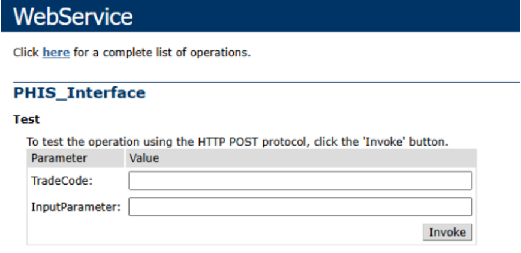


###### **4.2.2** 接口地址 

各地基层系统接口将通过以下格式的地址提供访问（默认端口为2025）： http://{基层系统应用服务器IP}:2025/WebService.asmx?op=PHIS_Interface （若实际部署中端口发生变更，将以最新通知的地址为准。） 

###### **4.2.3** 参数规范 

所有接口的一级参数有且只有2 个，分为接口交易号和业务类参数 

###### **4.2.4** 接口参数说明 

|参数名称|数据类型(长度)|必填|参数说明|
|---|---|---|---|
|TradeCode|String(32)|是|交易码|
|InputParameter|String|是|业务参数，JSON 格式|


###### 4.4 接口响应规范 

所有接口的响应一级参数有且只有1 个，为JSON 串，JSON 中分为result 状态和msg 消息，所有跟业务相关的参数都封装在该msg 参数中。 返回示例： 

<!-- page: 162 -->

四川省基层医疗卫生机构管理信息系统应用接口规范 


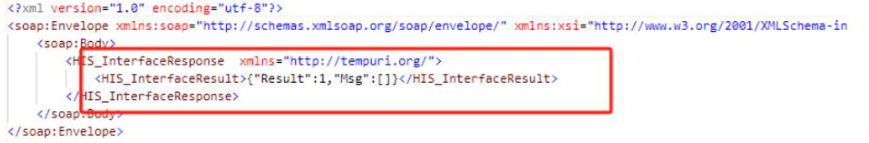


###### 4.4.1 接口响应说明 

|参数名称|数据类型(长度)|必填|参数说明|
|---|---|---|---|
|Result|Integer|是|1 成功，0 失败|
|Msg|String|否|为0 时返回报错信息，为1 是返回业务数据|


###### 4.5.2 调用示例 

curl --location 'http://183.220.195.211:6007/WebService.asmx?op=HIS_Interface%0A' \ 

--header 'Content-Type: text/xml;charset=utf-8' \ 

-- **data** '<?xml version="1.0" encoding="utf-8"?> 

<soap:Envelope 

xmlns:xsi="http://www.w3.org/2001/XMLSchema-instance" 

xmlns:xsd="http://www.w3.org/2001/XMLSchema" xmlns:soap="http://schemas.xmlsoap.org/soap/envelope/"> 

<soap:Body> 

<PHIS_Interface xmlns="http://tempuri.org/"> 

<TradeCode>03</TradeCode> 

<InputParameter> 

{" 验证码 ":"508D5EEAFA690FBBE0539401A8C0A2B0", " 目录类型 ":"3"," 机构编码 

":"8BCDCA4E11A44A9D888D7E70DD4FF44F" } 

</InputParameter> 

</PHIS_Interface> 

</soap:Body> 

</soap:Envelope> 

###### 5. 接口总览 

|分类|接口名称|交易码|
|---|---|---|
||接口测试|100-001|
||登录验证|100-002|
|基础数据类|医院综合目录查询(科室、医生、病区、床位)|100-003|
||三大目录（药品、诊疗、耗材）|100-004|
||三大目录（药品、诊疗、耗材）行数|100-005|

<!-- page: 163 -->

四川省基层医疗卫生机构管理信息系统应用接口规范 

||诊断|100-006|
|---|---|---|
||诊断行数|100-007|
||机构查询|100-008|
||单点登录|100-009|
||获取挂号费用类型|200-001|
||获取机构收款账户|200-002|
||查询机构挂号模板|200-003|
||查询挂号模板下的科室|200-004|
||查询科室下的医生|200-005|
||获取机构、人员的排班信息|200-006|
|便民惠民|预约挂号|200-007|
|（移动端挂缴查）|撤销挂号|200-008|
||查询挂号记录|200-009|
||门诊待缴费清单查询|200-010|
||门诊缴费|200-011|
||已缴费列表查询|200-012|
||查询缴费清单明细|200-013|
||保存门诊退费|200-014|
||交易账单数据查询|200-015|
||获取住院患者个案信息|300-001|
|双向转诊|获取门诊患者个案信息|300-002|
||接收上级转诊|300-003|
||获取住院患者个案信息|400-001|
||获取住院诊断|400-002|
||回写电子病历|400-003|
||获取his 电子病历历史数据|400-004|
|电子病历|获取电子病历医生数据|400-005|
||电子病历验证登录|400-006|
||获取新生儿数据|400-007|
||获取体温信息|400-008|
||获取护理信息|400-009|
||获取手术信息|400-010|
||检查项目查询|500-001|
|PACS 系统|按申请单号获取申请单|500-002|
||回写报告|500-003|
|LIS 系统|检验项目查询|600-001|

<!-- page: 164 -->

四川省基层医疗卫生机构管理信息系统应用接口规范 

||按申请单号获取申请单|600-002|
|---|---|---|
||回写报告|600-003|
||心电检查项目查询|700-001|
|心电系统|按申请单号获取申请单|700-002|
||回写检查报告|700-003|
||获取挂号列表|800-001|
|分诊叫号|获取门诊待发药患者列表|800-002|
||获取待执行检查检验列表|800-003|
||接收患者签到状态回写|800-004|
||获取门诊患者个案信息|300-002|
|远程会诊|获取住院患者个案信息|300-001|
||远程会诊回写|900-001|


###### 6. 交易详细说明 

###### 6.1 基础数据类 

###### 6.1.1 100-001 接口测试 

|交易名称|接口测试|
|---|---|
|接口说明|此接口用于检测接口客户端是否与HIS 系统中心服务器相连通|
|入口参数||
|交易编号|100-001|
|交易参数|{"厂商编号":"厂商编号"}|
|出口参数||
|交易成功|{"result":"1","msg":"接口测试成功"}|
|交易失败|{"result":"0","msg":"错误信息"}|
|参数详细说|明:|
|厂商编号：||


|代码|名称|约束|类型|说明|
|---|---|---|---|---|
|1|厂商编号|NOT NULl|VARCHAR2(10)|本编号为厂商在HIS|
|||||系统中的唯一标识，|

<!-- page: 165 -->

四川省基层医疗卫生机构管理信息系统应用接口规范 

|交易编号：<br>|<br>|||四川省信息卫生中心<br>统一编制，由各厂商<br>申请获取<br>|
|---|---|---|---|---|
|代码|名称|约束|类型|说明|
|1|交易编号|NOT NULl|VARCHAR2(10)||
|交易参数：<br>|<br>||||
|序号|名称|约束|类型|说明|
|交易输出：<br>|<br>||||
|代码|名称|约束|类型|说明|


###### 6.1.2 100-002 登录验证 

|交易名称|登录验证|
|---|---|
|接口说明|此接口用于医院用户登录医保报账客户端的安全验证，用户名与密码由<br>HIS 系统统一分配|
|入口参数||
|交易编号|100-002|
|交易参数|{"0 用户名":"用户名","1 密码":"密码","2 厂商编号":"厂商编号"}|
|出口参数||
|交易成功|{"result":"1",<br>"msg":{"0 验证码":"验证码"，<br>"1 职员ID":"职员ID",<br>"2 职员姓名":"职员姓名"，<br>"3 机构编码":"机构编码"，<br>"4 机构名称":"机构名称",<br>"5 管辖区划":"管辖区划"<br>"}|

<!-- page: 166 -->

四川省基层医疗卫生机构管理信息系统应用接口规范 

|交易失败<br>参数详细说<br>厂商编号：<br>|}<br>{"result":"0","m<br>明:<br> <br>|sg":"错误信息"<br>|}||
|---|---|---|---|---|
|代码|名称|约束|类型|说明|
|1<br>交易编号：|厂商编号<br>|NOT NULl|VARCHAR2(10)|本编号为厂商在HIS<br>系统中的唯一标识，<br>四川省信息卫生中心<br>统一编制，由各厂商<br>申请获取|
|代码|名称|约束|类型|说明|
|1|交易编号|NOT NULl|VARCHAR2(10)||
|交易参数：|||||
|序号|名称|约束|类型|说明|
|1|用户名|NOT NULl|VARCHAR2(20)||
|2|密码|NOT NULl|VARCHAR2(20)||
||厂商编号|NOTNULl|VARCHAR2(20)||
|3|||||
|交易输出：|||||
|代码|名称|约束|类型|说明|
|1|验证码|NOT NULl|VARCHAR2(32)||
|2|职员ID|NOT NULl|VARCHAR2(32)||
|3|职员姓名||VARCHAR2(20)||
|4|机构编码||VARCHAR2(32)||
|5|机构名称||VARCHAR2(200<br>)||
|6|管辖区划||VARCHAR2(32)||


###### 6.1.3 100-003 医院综合目录查询(科室、医生、病区、床位) 

|交易名称|医院综合目录查询(科室、医生、病区、床位)|
|---|---|
|接口说明|此接口用于获取HIS 系统中科室、医师、病区、床位的基本信息|

<!-- page: 167 -->

四川省基层医疗卫生机构管理信息系统应用接口规范 

|入口参数||||
|---|---|---|---|
|交易编号|100-003|||
|交易参数|{"0 验证码":"验证码",<br>"1 目录类型":"目录类型",<br>"2 目录名称":"目录名称",<br>"3 机构编码":"机构编码" }|||
|出口参数||||
|交易成功<br>交易失败|{"result":"1",<br>"msg":[{"0 目录编码":"目录编<br>"1 目录名称":"目录名<br>"2 助记码":"助记码",<br>"3 目录类别名称":"目<br>"4 备注":"备注" }]<br>}<br>{"result":"0","msg":"错误信息"|码",<br>称",<br>录类别名称",<br>}||
|参数详细说|明:|||
|交易编号：||||
|代码|名称<br>约束|类型|说明|
|1|交易编号<br>NOT NULl|VARCHAR2(10)||
|交易参数：||||
|序号|名称<br>约束|类型|说明|
|1|验证码<br>NOT NULl|VARCHAR2(32)||
|2|目录类型<br>NOT NULl|NUMBER|0 科室、1 医生、2 病<br>区、3 床位|
|3|目录名称|VARCHAR2(20)||
|4|机构编码|VARCHAR2(50)|取接口30 返回的ID|
|交易输出：||||
|代码|名称<br>约束|类型|说明|
|1|目录编码<br>NOT NULl|VARCHAR2(50)||
|2|目录名称<br>NOT NULl|VARCHAR2(50)||
|3|助记码|VARCHAR2(20)||

<!-- page: 168 -->

四川省基层医疗卫生机构管理信息系统应用接口规范 

|4|目录类别名称|VARCHAR2(20)||
|---|---|---|---|
|5|备注|VARCHAR2(100<br>)|目录类型1：返回医<br>生所在科室的编码;<br>目录类型3：返回床<br>位所在的病区编码。|
|6|科室编码|VARCHAR2(50)||
|7|科室名称|VARCHAR2(50)||
|8|病区|VARCHAR2(50)|目录类型为1 返回|
|9|机构编码|VARCHAR2(50)|目录类型为1 返回|
|10|国家医保编码|VARCHAR2(50)|目录类型为1 返回|
|11|用户账号|VARCHAR2(50)|目录类型为1 返回|
|12|医执人员执业证书编<br>码|VARCHAR2(50)|目录类型为1 返回|
|13|医执人员资格证书编<br>码|VARCHAR2(50)|目录类型为1 返回|
|14|身份证|VARCHAR2(50)|目录类型为1 返回|
|15|医执人员类别|VARCHAR2(50)|目录类型为1 返回|
|16|医护人员类型|VARCHAR2(50)|目录类型为1 返回|
|17|照片|VARCHAR2(50)|目录类型为1 返回|
|18|简介|VARCHAR2(50)|目录类型为1 返回|
|19|角色|VARCHAR2(50)|目录类型为1 返回|
|20|职称编码|VARCHAR2(50)|目录类型为1 返回|
|21|职称名称|VARCHAR2(50)|目录类型为1 返回|
|22|联系电话|VARCHAR2(50)|目录类型为1 返回|
|23|性别|VARCHAR2(50)|目录类型为1 返回|


###### 6.1.4 100-004 医院三大目录查询(药品、诊疗、耗材) 

|交易名称|医院三大目录查询(药品、诊疗、耗材)|
|---|---|
|接口说明|此接口用于获取HIS 系统中药品、诊疗、耗材三大目录的基本信息|
|入口参数||

<!-- page: 169 -->

四川省基层医疗卫生机构管理信息系统应用接口规范 

|交易编号|100-004|
|---|---|
|交易参数<br>出口参数|{"0 验证码":"验证码",<br>"1 目录类型":"目录类型",<br>"2 目录名称":"目录名称",<br>"3 开始行数":"开始行数"，<br>"4 结束行数":"结束行数"，<br>"5 开始时间":"开始时间",<br>"6 结束时间":"结束时间",<br>"7 机构编码":"机构编码"<br>}|
|交易成功|{"result":"1",<br>"msg":[{"0 目录编码":"目录编码",<br>"1 目录名称":"目录名称",<br>"2 助记码":"助记码",<br>"3 目录类别名称":"目录类别名称",<br>"4 单位":"单位",<br>"5 规格":"规格",<br>"6 剂型":"剂型",<br>"7 生产厂家名称":"生产厂家名称",<br>"8 备注":"备注"，<br>"9 创建时间":"创建时间",<br>"10 包装单位":"包装单位",<br>"11 转换系数":"转换系数",<br>"12 国药准字号":"国药准字号",<br>"13 药品本位码":"药品本位码",<br>"14 包装材质":"包装材质",<br>"15 炮制方法":"炮制方法"<br>"16 地区":"地区",<br>"17 类别":"类别",<br>"18 是否启用":"是否启用"<br>}]<br>}|

<!-- page: 170 -->

四川省基层医疗卫生机构管理信息系统应用接口规范 

|交易失败<br>参数详细说<br>交易编号：|{"result":"0","m<br>明:<br>|sg":"错误信息"|}||
|---|---|---|---|---|
|代码|名称|约束|类型|说明|
|1|交易编号|NOT NULl|VARCHAR2(10)||
|交易参数：<br>|<br>||||
|序号|名称|约束|类型|说明|
|1|验证码|NOT NULl|VARCHAR2(32)||
|2|目录类型|NOT NULl|NUMBER|0 中药、1、西药、2<br>诊疗、3 耗材、5 疫苗、<br>6 血液|
|3|目录名称||VARCHAR2(20)||
|3|开始行数|NOT NULl|NUMBER(16,2)||
|4|结束行数|NOT NULl|NUMBER(16,2)||
|5|开始时间|NOT NULl|VARCHAR2(50)|2014-01-01 15:11:22|
|6|结束时间|NOT NULl|VARCHAR2(50)|2014-01-01 23:59:59|
||机构编码||VARCHAR2(50)|取接口30 返回的ID|
|7|||||
|交易输出：|||||
|代码|名称|约束|类型|说明|
|1|目录编码|NOT NULl|VARCHAR2(50)||
|2|目录名称|NOT NULl|VARCHAR2(50)||
|3|助记码||VARCHAR2(20)||
|4|目录类别名称|NOT NULl|VARCHAR2(20)||
|5|单位||VARCHAR2(20)||
|6|规格||VARCHAR2(50)||
|7|剂型||VARCHAR2(20)||
|8|生产厂家名称||VARCHAR2(100<br>)||
|9|备注||VARCHAR2(100<br>)||
|10|创建时间|NOT NULl|VARCHAR2(50)|2014-01-01 23:59:59|

<!-- page: 171 -->

四川省基层医疗卫生机构管理信息系统应用接口规范 

###### 6.1.5 100-005 医院三大目录行数(药品、诊疗、耗材) 

|交易名称|医院三大目录行数(药品、诊疗、|耗材)||
|---|---|---|---|
|接口说明|此接口用于获取HIS 系统中药品、|诊疗、耗材三大|目录的行数|
|入口参数||||
|交易编号|100-005|||
|交易参数<br>出口参数|{"0 验证码":"验证码",<br>"1 目录类型":"目录类型",<br>"2 目录名称":"目录名称"，<br>"3 开始时间":"开始时间",<br>"4 结束时间":"结束时间",<br>"5 机构编码":"机构编码"<br>}|||
|交易成功<br>交易失败|{"result":"1",<br>"msg":[{"0 行数":"行数"<br>}]<br>}<br>{"result":"0","msg":"错误信息|"}||
|参数详细说<br>|明:<br>|||
|交易编号：||||
|代码|名称<br>约束|类型|说明|
|1|交易编号<br>NOT NULl|VARCHAR2(10)||
|交易参数：<br>|<br><br>|||
|序号|名称<br>约束|类型|说明|
|1|验证码<br>NOT NULl|VARCHAR2(32)||
|2|目录类型<br>NOT NULl|NUMBER|0 中药、1、西药、2<br>诊疗、3 耗材、5 疫苗、<br>6 血液|
|3|目录名称|VARCHAR2(20)||
|4|开始时间<br>NOT NULl|VARCHAR2(50)|2014-01-01 15:11:22|

<!-- page: 172 -->

四川省基层医疗卫生机构管理信息系统应用接口规范 

|5|结束时间|NOT NULl|VARCHAR2(50)|2014-01-01 23:59:59|
|---|---|---|---|---|
|6|机构编码||VARCHAR2(50)|取接口30 返回的ID|
|交易输出：|||||
|代码|名称|约束|类型|说明|
|1|行数|NOT NULl|NUMBER||


###### 6.1.6 100-006 ICD10 数据查询 

|交易名称|ICD10 数据查询|
|---|---|
|接口说明|此接口用于获取HIS 系统中ICD10 的基本信息|
|入口参数||
|交易编号|100-006|
|交易参数|{"0 验证码":"验证码",<br>"1 病种名称":"病种名称"，<br>"2 开始行数":"开始行数"，<br>"3 结束行数":"结束行数"，<br>"4 开始时间":"开始时间",<br>"5 结束时间":"结束时间"，<br>"6 疾病类别”:”疾病类别”,<br>"7 诊断版本”:”诊断版本”<br>病案直报系统；医保国临版<br>}|
|出口参数||
|交易成功|{“result”:”1”,<br>“msg”:[{“0 疾病编码”:”疾病编码”,<br>“1 病种名称”:”病种名称”,<br>“2 助记码”:”助记码”,<br>“3 备注”:”备注”，<br>“4 创建时间”:”创建时间”，<br>“5 疾病ID”:”疾病ID”}]|

<!-- page: 173 -->

四川省基层医疗卫生机构管理信息系统应用接口规范 

|交易失败|}<br>{“result”:”0|”,”msg”:”错|误信息”}||
|---|---|---|---|---|
|参数详细说<br>|明:<br>||||
|交易编号：|||||
|代码|名称|约束|类型|说明|
|1|交易编号|NOT NULl|VARCHAR2(10)||
|交易参数：|||||
|序号|名称|约束|类型|说明|
|1|验证码|NOT NULl|VARCHAR2(32)||
|2|病种名称||VARCHAR2(20)||
|3|开始行数|NOT NULl|NUMBER(16,2)||
|4|结束行数|NOT NULl|NUMBER(16,2)||
|5|开始时间|NOT NULl|VARCHAR2(50)|2014-01-01 15:11:22|
|6|结束时间|NOT NULl|VARCHAR2(50)|2014-01-01 23:59:59|
|7|疾病类别||NUMBER|0 西医诊断、1 中医诊<br>断、空或NULL 全部（默<br>认为空）|
|8<br>交易输出：|诊断版本<br>||Varchar2(50)|病案直报系统或者<br>医保国临版|
|代码|名称|约束|类型|说明|
|1|病种编码|NOT NULl|VARCHAR2(50)||
|2|病种名称|NOT NULl|VARCHAR2(50)||
|3|助记码||VARCHAR2(20)||
|4|备注||VARCHAR2(100<br>)||
|5|创建时间|NOT NULl|VARCHAR2(50)|2014-01-01 23:59:59|
|6|疾病ID||VARCHAR2(32)||

<!-- page: 174 -->

四川省基层医疗卫生机构管理信息系统应用接口规范 

###### 6.1.7 100-007 ICD10 数据行数 

|交易名称|ICD10 数据行数|||
|---|---|---|---|
|接口说明|此接口用于获取HIS 系统中ICD10|数据的行数||
|入口参数||||
|交易编号|100-007|||
|交易参数<br>出口参数|{"0 验证码":"验证码",<br>"1 病种名称":"病种名称"，<br>"2 开始时间":"开始时间",<br>"3 结束时间":"结束时间"，<br>"4 疾病类别":"疾病类别"，<br>"5 诊断版本”:”诊断版本”<br>}|病案直报系|统；医保国临版|
|交易成功<br>|{"result":"1",<br>"msg":[{"0 行数":"行数"<br>}]<br>}<br>|||
|交易失败|{"result":"0","msg":"错误信息|}||
|参数详细说|明:|||
|交易编号：||||
|代码|名称<br>约束|类型|说明|
|1|交易编号<br>NOT NULl|VARCHAR2(10)||
|交易参数：<br>|<br><br>|||
|序号|名称<br>约束|类型|说明|
|1|验证码<br>NOT NULl|VARCHAR2(32)||
|2|病种名称|VARCHAR2(20)||
|3|开始时间<br>NOT NULl|VARCHAR2(50)|2014-01-01 15:11:22|
|4|结束时间<br>NOT NULl|VARCHAR2(50)|2014-01-01 23:59:59|
|5|疾病类别|NUMBER|0 西医诊断、1 中医诊<br>断、空或NULL 全部（默|

<!-- page: 175 -->

四川省基层医疗卫生机构管理信息系统应用接口规范 

|||||认为空）|
|---|---|---|---|---|
|6|诊断版本|||病案直报系统或者<br>医保国临版|
|交易输出：<br>|<br>||||
|代码|名称|约束|类型|说明|
|1|行数|NOT NULl|NUMBER||
|2|目录名称|NOT NULl|VARCHAR2(50)||


###### 6.1.8 100-008 医疗机构信息查询 

|交易名称|医疗机构信息查询||
|---|---|---|
|接口说明|此接口用于获取HIS 系统中医疗机构的详细信息||
|入口参数|||
|交易编号|100-008||
|交易参数<br>出口参数|{"0 验证码":"验证码",<br>"1 医院名称":"医院名称"<br>}||
|交易成功|{"result":"1",<br>"msg":[{"0ID":"ID",<br>"1 医院名称":"医院名称",<br>"2 地址":"地址",<br>"3 联系电话":"联系电话",<br>"4 邮政编码":"邮政编码",<br>"5 联系人":"联系人"}]<br>}||
|交易失败|{"result":"0","msg":"错误信息"}||
|参数详细说|明:||
|交易编号：|||
|代码|名称<br>约束<br>类型|说明|

<!-- page: 176 -->

四川省基层医疗卫生机构管理信息系统应用接口规范 

|1|交易编号|NOT NULl|VARCHAR2(10)||
|---|---|---|---|---|
|交易参数：<br>|<br>||||
|序号|名称|约束|类型|说明|
|1|验证码|NOT NULl|VARCHAR2(32)||
|2|医院名称||VARCHAR2(100<br>)||
|交易输出：<br>|<br>||||
|代码|名称|约束|类型|说明|
|1|ID|NOT NULl|VARCHAR2(32)|其它接口中的“机构<br>编码”调用该ID|
|2|医院名称|NOT NULl|VARCHAR2(100<br>)||
|3|地址||VARCHAR2(100<br>)||
|4|联系电话||VARCHAR2(20)||
|5|邮政编码||VARCHAR2(10)||
|6|联系人||VARCHAR2(20)||


###### 6.1.9 100-009 His 单点登录验证接口 

|交易名称|His 单点登录验证接口|
|---|---|
|接口说明|His 单点登录验证接口|
|入口参数||
|交易编号|100-009|
|交易参数|{"验证码":"44200F7B173B00E136C04106FB29AA4A",<br>"Token":"161476CA0D085C1A4380FF8BA403764F660EB9DD49E281C73EE277B0B<br>EA536CCA947D3AF83A047D7335FF5B0E6E0D04EDC29FE917E35FDBF046125348A3<br>8D48334665745A772DCC8C17D8B097B89F26AB67BFD49FF2FD709B20C405E39897<br>05A1374F9CD050F12C4CDC16567D74C51199620C1D74C55D6C09940C07A0848451<br>A03187C333ADE3DA623C32FDF9803E3E944F425D901F8AD98ED9FBEF03FDD988E0<br>BF7E5E78223C82F2B670445A82FC8604163C9D62C0FE2643EC323BAE5E63645D2C<br>215634FEE139B655266D1EDDF08F1591461E13340DFADBBDE85A50322754EFA364|

<!-- page: 177 -->

四川省基层医疗卫生机构管理信息系统应用接口规范 

|出口参数<br>|AACEEB85969D857<br>|BF34982AAC116320C<br>|8DC69FA33B24276F4DECFFD3D97"}<br>|
|---|---|---|---|
|交易成功<br>交易失败<br>参数详细说<br>交易编号：<br>|{"AccountID":"9<br>**","OrgID":"8B<br>D43B5B43BD0A7EE<br>{"result":"0","<br>明:<br><br>|BABE493DC4D40F79A<br>CDCA4E11A44A9D888<br>2A9000","OrgName"<br>msg":"错误信息"}<br>|B3AFE7BFE45C1A","EmpName":"欧<br>D7E70DD4FF44F","EmpID":"76152D5621F<br>:"***中心卫生院"}<br>|
|代码|名称|约束|类型<br>说明|
|1|交易编号|NOTNULl|string<br>3102|
|交易参数：<br>||<br>||
|代码|名称|约束|类型|
|1|验证码|NOT NULl|string|
|2|Token|NOTNULl|string<br>来自his 的token|
|交易输出：||||
|代码|名称|约束|类型<br>说明|
|1|Result||int<br>1 成功,0 失败|
|2|Msg||Sting<br>错误信息|


###### 单点登录接入指引 

- 1、由第三方系统提供登录中转页，需接收 HIS 传的 url 参数 

- 2、由 HIS 调用第三方系统中转登录页，如： 

   - <a href=" 第三方系统 ip+ /LoginByHis?Token=xcvxcvxcvxcvxcv">xxx 系统</a> 

- 3、对方获取到 token 后调用 HIS 接口（交易号 9000）获取 token 

###### 6.2 移动端挂缴查 

###### 6.2.0 接入指引 

######  接入方式 

- 1）厂商按场景调用 HIS 接口，完成交易后再向 HIS 接口回写，所有回写都需和机构指 定账号绑定，需要每个机构建立一个指定的名字叫"虚拟收费人员"，后续流程会用到虚 拟收费人员 ID(请记得一定要给该人分配科室并设置当前科室，否则退号会报错)，可以 

<!-- page: 178 -->

四川省基层医疗卫生机构管理信息系统应用接口规范 

通过 100-003 交易获取人员列表，目录编码即 ID，并分配好登录账号，可通过该账号进 

去查询缴费明细等。 


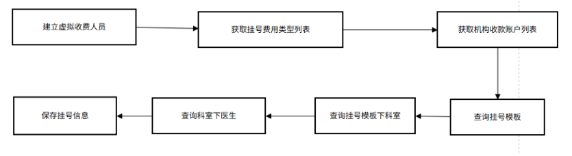


######  接入流程 

###### **1)** 常规挂号 

- 第 1 步：200-001 获取挂号费用类型列表(该接口属基础数据，可以提前拉取一次， 后期在交易中写死成:"全自费") 

- 第 2 步：200-002 获取机构收款账户（缴费方式）列表(该接口属基础数据，可以提 前拉取一次，后期已有数据不会发生变化，可能会有机构新增的自定义收款账户， 一般固定移动支付，如果列表没有，联系机构管理员启用) 

- 第 3 步：200-003 查询挂号模板(该模板由医院自定义，可为手机端写死一个：网络 挂号模板) 

- 第 4 步：200-004 查询挂号模板下科室（每个模板可以关联不同科室） 

- 第 5 步：200-005 查询科室下医生(由挂号人选择医生) 

- 第 6 步：在 HIS 端由机构管理员角色新增一个虚拟收费员并分配科室，后续 200-007 

- 和 200-011 等接口使用虚拟收费员 ID，方便区分该次挂号或缴费是通过移动支付或 者公众号产生，也方便后期对账 

第 7 步：200-007 保存挂号信息，示例如下： 

- {    "验证码": "44200F7B173B00E136C04106FB29AA4A",    "病人姓名": "xxx", 

- "病人性别": "1",    "身份证号码": "511xxx",    "收费人员 ID": 

- "3D32D7B90C7C45779D4622B99050349C",    "金额": "0.01",    "费用类型 ID": 

- "26BA8A4EAD56487F84DB51CE40DF5528",    "模板 ID": 

"24C719D1DA8748B0A0DB670879ED66C0",    "科室 ID": 

- "D6B628FA9D2F428C9192419480A732CE",    "医生 ID": 

- "76152D5621FD43B5B43BD0A7EE2A9000",    "挂号日期": "2022-09-12 18:00:00"," 

缴费方式列表": 

"[{\"PaymentID\":\"78556537BF751787E0539401A8C0A6C8\",\"OrgAccID\":\"7890A6 

1534912AF5E0539401A8C0A55E\",\"Fee\":\"0.01\"}]","厂商唯一标识": "test","地址": " 

<!-- page: 179 -->

四川省基层医疗卫生机构管理信息系统应用接口规范 

测试地址","联系电话": "-","工作单位": "测试工作单位","职业": "测试职业"} 

###### **2)** 使用预约排班挂号 

支持患者直接按科室或按医生挂号 

第 1 步：200-001 获取挂号费用类型列表(该接口属基础数据，可以提前拉取一次， 后期在交易中写死成:"全自费") 

第 2 步：200-006 获取机构、人员的排班信息 

- 第 3 步：200-003 查询挂号模板(该模板由医院自定义，可为手机端写死一个：网络 挂号模板) 

第 4 步：200-007 保存挂号信息 

###### **3)** 门诊缴费 

第 1 步： 200-002 获取机构收款账户（缴费方式）列表(该接口属基础数据，可以提 前拉取一次，后期已有数据不会发生变化，可能会有机构新增的自定义缴费方式， 一般固定移动支付，如果列表没有，联系机构管理员启用) 

第 2 步：200-010 待缴费门诊费用清单查询 

第 3 步：200-011 门诊缴费 


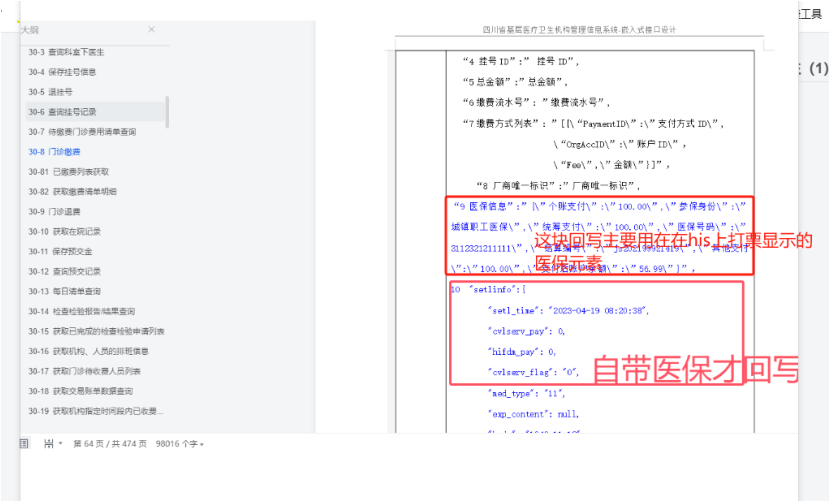


###### 4) 退挂号 

第 1 步：展示挂号记录,200-009 查询挂号记录 

- 第 2 步：厂商自行原路退费 

第 3 步：200-008 退挂号，若电票会自动冲销电票 

提醒：手机挂号单在 pc 端只能现金退号 

###### **5)** 门诊退费 

为避免医院已发药或已完成医技检查，但未及时在系统上操作造成误退损失，暂不 

<!-- page: 180 -->

四川省基层医疗卫生机构管理信息系统应用接口规范 

###### 建议手机端退费； 

移动支付可以在窗口上选择现金退费或原路退费（需厂商提供退费接口）。 

**6)** 对账 

第 1 步：200-015 获取交易账单数据查询 

第 2 步：各厂商自行拉取账单数据后，自行对账 

###### 6.2.1 200-001 获取挂号费用类型 

|交易名称|获取挂号费用类型列表||
|---|---|---|
|接口说明|此接口用于获取HIS 系统中挂号费用类型列表||
|入口参数|||
|交易编号|200-001||
|交易参数|{"0 验证码":"验证码"}||
|出口参数|||
|交易成功|{"result":"1",<br>"msg":[{<br>"1 费用类型ID":"费用类型ID",<br>"2 费用类型名称":"费用类型名称"<br>}]<br>||
|交易失败|}<br>{"result":"0""ms":"错误信息"}||
|参数详细说|,g<br>明:||
|交易编号：<br>|<br><br>||
|代码|名称<br>约束<br>类型|说明|
|1|交易编号<br>NOT NULl<br>VARCHAR2(10)||
|交易参数：|||
|序号|名称<br>约束<br>类型|说明|
|0|验证码<br>NOT NULl<br>VARCHAR2(32)||
|交易输出：|||
|代码|名称<br>约束<br>类型|说明|

<!-- page: 181 -->

四川省基层医疗卫生机构管理信息系统应用接口规范 

|1|费用类型ID|NOT NULl|VARCHAR2(32)|
|---|---|---|---|
|2|费用类型名称|NOT NULl|VARCHAR2(50)|


###### 6.2.2 200-002 获取机构收款账户（缴费方式） 

|交易名称|获取机构收款账户（缴费方式）列表||
|---|---|---|
|接口说明|此接口用于获取HIS 系统中机构支付方式列表||
|入口参数|||
|交易编号|200-002||
|交易参数|{"0 验证码":"验证码",<br>“1 机构ID”:”机构ID”<br>}||
|出口参数|||
|交易成功<br>交易失败|{"result":"1",<br>"msg":[{<br>"1 PaymentID":"支付方式ID",<br>"2 Payment":"支付方式名称",<br>"3 PayPy":"拼音简写”,<br>"4 OrgAcc":"账户列表”,<br>“5 selectedAcc”:”选中的账户ID”<br>}]<br>}<br>{"result":"0","msg":"错误信息"}||
|参数详细说|明:||
|交易编号：<br>|<br><br><br>||
|代码|名称<br>约束<br>类型|说明|
|1|交易编号<br>NOT NULl<br>VARCHAR2(10)||
|交易参数：|||
|序号|名称<br>约束<br>类型|说明|
|0|验证码<br>NOT NULl<br>VARCHAR2(32)||

<!-- page: 182 -->

四川省基层医疗卫生机构管理信息系统应用接口规范 

|1|机构ID|Not NULl|VARCHAR2(32)||
|---|---|---|---|---|
|交易输出：<br>|<br>||||
|代码|名称|约束|类型|说明|
|1|PaymentID|NOT NULl|VARCHAR2(32)||
|2|Payment|NOT NULl|VARCHAR2(50)||
|3|PayPy|Not Null|VARCHAR2(50)||
|4|OrgAcc|Not Null|Array||
|5|selectedAcc|Null|Varchar2(32)|app/公众号程序可以<br>不用理会该值|


###### 6.2.3 200-003 查询机构挂号模板 

|交易名称|查询机构挂号模板|
|---|---|
|接口说明|此接口用于获取HIS 系统中挂号模板|
|入口参数||
|交易编号|200-003|
|交易参数|{"0 验证码":"验证码",<br>"1 机构编码":"机构编码"<br>}|
|出口参数||
|交易成功|{"result":"1",<br>"msg":[{<br>"1 模板ID":"模板ID",<br>"2 模板名称":"模板名称"，<br>"3 挂号金额":"挂号金额"，<br>"4 状态":"状态"，<br>}]<br>}|

<!-- page: 183 -->

四川省基层医疗卫生机构管理信息系统应用接口规范 

|交易失败<br>参数详细说<br>交易编号：<br>|{"result":"0","<br>明:<br> <br>|msg":"错误信息"<br>|}<br>||
|---|---|---|---|---|
|代码|名称|约束|类型|说明|
|1|交易编号|NOT NULl|VARCHAR2(10)||
|交易参数：<br>|<br>||||
|序号|名称|约束|类型|说明|
|1|验证码|NOT NULl|VARCHAR2(32)||
|2|机构编码|NOT NULl|VARCHAR2(32)||
|交易输出：<br>|<br>||||
|代码|名称|约束|类型|说明|
|1|模板ID|NOT NULl|VARCHAR2(32)||
|2|模板名称|NOT NULl|VARCHAR2(50)||
|3|挂号金额|NOT NULl|VARCHAR2(50)||
|4|状态|NOT NULl|VARCHAR2(50)|0 禁用1 启用|


###### 6.2.4 200-004 查询挂号模板下的科室 

|交易名称|查询挂号模板下科室|
|---|---|
|接口说明|此接口用于获取HIS 系统中挂号模板下科室|
|入口参数<br>||
|交易编号|200-004|
|交易参数|{"0 验证码":"验证码",<br>"1 机构编码":"机构编码",<br>"2 模板ID":"模板ID"<br>}|
|出口参数||
|交易成功|{"result":"1",<br>"msg":[{<br>"1 科室编码":"科室编码”,<br>"2 科室名称":"科室名称"|

<!-- page: 184 -->

四川省基层医疗卫生机构管理信息系统应用接口规范 

|交易失败<br>参数详细说<br>交易编号：<br>|}]<br>}<br>{"result":"0","<br>明:<br> <br>|msg":"错误信息"<br>|}<br>||
|---|---|---|---|---|
|代码|名称|约束|类型|说明|
|1|交易编号|NOT NULl|VARCHAR2(10)||
|交易参数：|||||
|序号|名称|约束|类型|说明|
|1|验证码|NOT NULl|VARCHAR2(32)||
|2|机构编码|NOT NULl|VARCHAR2(32)||
|3|模板ID|NULL|VARCHAR2(32)||
|交易输出：<br>|<br>||||
|代码|名称|约束|类型|说明|
|1|科室ID|NOT NULl|VARCHAR2(32)||
|2|科室名称|NOT NULl|VARCHAR2(50)||


6.2.5 200-005 查询科室下的医生 

|交易名称<br>|查询科室下医生<br>|
|---|---|
|接口说明|此接口用于获取HIS 科室下医生|
|入口参数||
|交易编号|100-011|
|交易参数|{"0 验证码":"验证码",<br>"1 机构编码":"机构编码",<br>"2 科室ID":"科室ID"<br>}|
|出口参数||
|交易成功|{"result":"1",<br>"msg":[{|

<!-- page: 185 -->

四川省基层医疗卫生机构管理信息系统应用接口规范 

|交易失败<br>参数详细说<br>交易编号：<br>|"1 医生ID":"医生ID<br>"2 医生名称":"医生名<br>}]<br>}<br>{"result":"0","msg":"错误信息"<br>明:<br> <br><br>|",<br>称"<br>}<br>||
|---|---|---|---|
|代码|名称<br>约束|类型|说明|
|1|交易编号<br>NOTNULl|VARCHAR2(10)||
|交易参数：<br>|<br> <br><br>|||
|序号|名称<br>约束|类型|说明|
|1|验证码<br>NOT NULl|VARCHAR2(32)||
|2|机构编码<br>NOT NULl|VARCHAR2(32)||
|3|科室ID<br>NOT NULl|VARCHAR2(32)||
|交易输出：|<br>|||
|代码|名称<br>约束|类型|说明|
|1|医生ID<br>NOT NULl|VARCHAR2(32)||
|2|医生名称<br>NOT NULl|VARCHAR2(50)||


###### 6.2.6 200-006 获取机构、人员的排班信息 

|交易名称|获取机构、人员的排班信息|
|---|---|
|接口说明|此接口用于获取HIS 系统中机构、人员的排班信息|
|入口参数||
|交易编号|200-006|
|交易参数|{"0 验证码":"验证码",<br>"1 机构ID":"机构ID"<br>"2 医生ID":"医生ID"<br>"3 开始日期":"开始日期"<br>"4 结束日期":"结束日期""|

<!-- page: 186 -->

四川省基层医疗卫生机构管理信息系统应用接口规范 

|出口参数|"5 科室ID":"科室ID"<br>}|
|---|---|
|交易成功<br>交易失败|{"result":"1",<br>"msg":[{"0 排班ID":"排班ID",<br>"1 医生ID":"医生ID",<br>"2 医生姓名":"医生姓名",<br>“3 排班日期”:”排班日期”,<br>“4 班次”:”班次”,<br>“5 线上限制挂号数量”:” 线上限制挂号数量”,<br>“6 线上已挂号数量”:” 线上已挂号数量”,<br>“7 线下限制挂号数量”:” 线下限制挂号数量”,<br>“8 线下已挂号数量”:” 线下已挂号数量”,<br>“9 当前科室名称”:” 当前科室名称”,<br>“10 当前科室ID”:” 当前科室ID”<br>"}]<br>}<br>{"result":"0","msg":"错误信息"}|
|参数详细说|明:|
|交易编号：||
|代码|名称<br>约束<br>类型<br>说明|
|1|交易编号<br>NOT NULl<br>VARCHAR2(10)|
|交易参数：||
|序号|名称<br>约束<br>类型<br>说明|
|1|验证码<br>NOT NULl<br>VARCHAR2(32)|
|2|机构ID<br>NOT NULl<br>VARCHAR2(32)|
|3|医生ID<br>VARCHAR2(32)<br>医生ID 为空时查询整<br>个机构的排班信息，<br>不为空时查询指定医<br>生的排班信息|

<!-- page: 187 -->

四川省基层医疗卫生机构管理信息系统应用接口规范 

|4|开始日期|NOT NULl|VARCHAR2(10)|YYYY-MM-DD|
|---|---|---|---|---|
|5|结束日期|NOT NULl|VARCHAR2(10)|YYYY-MM-DD|
|6|科室ID||VARCHAR2(32)|科室ID 不为空时查询<br>当前科室下的排班情<br>况|
|交易输出：<br>|<br>||||
|代码|名称|约束|类型|说明|
|1|医生ID|NOT NULl|VARCHAR2(32)||
|2|医生姓名|NOT NULl|VARCHAR2(50)||
|3|排班日期|NOT NULl|VARCHAR2(10)|YYYY-MM-DD|
|4|班次|NOT NULl|VARCHAR2(50)|上午、下午|
|5|线上限制挂号数量|NOT NULl|Decimal|当前排班线上限制挂<br>号数量|
|6|线上已挂号数量|NOT NULl|Decimal|当前排班线上已挂号<br>数量|
|7|线下限制挂号数量|NOT NULl|Decimal|当前排班线下限制挂<br>号数量|
|8|线下已挂号数量|NOT NULl|Decimal|当前排班线下已挂号<br>数量|
|9|当前科室名称|NOT NULl|VARCHAR2(50)|当前科室名称|
|10|当前科室ID|NOT NULl|VARCHAR2(32)|当前科室ID|


###### 6.2.7 200-007 预约挂号 

|交易名称|门诊挂号|
|---|---|
|接口说明|保存挂号信息|
|入口参数||
|交易编号|200-007|
|交易参数|{"验证码":"验证码",|
||"病人姓名":"病人姓名",|
||“病人性别”:”病人性别”,|
||“身份证号码”:”身份证号码”,|
||“收费人员ID”:” 收费人员ID”,|

<!-- page: 188 -->

四川省基层医疗卫生机构管理信息系统应用接口规范 

||“金额”:”金额”,<br>“费用类型ID” :”费用类型ID”,<br>“模板ID” :”模板ID”,<br>“科室ID” :”科室D”,<br>“医生ID” :”医生ID”,<br>“缴费方式列表”: ”[{\“PaymentID\”:\”支付方式ID\”,<br>\“OrgAccID\”:\”账户ID\”，<br>\“Fee\”,\”金额\”}]”,<br>“挂号日期” :”挂号日期”，<br>“厂商唯一标识”:”厂商唯一标识”,<br>“缴费流水号”: ”缴费流水号”,<br>“医保信息”:”{\”个账支付\”:\”100.00\”,\”参保身份\”:\”<br>城镇职工医保\”,\” 统筹支付\”:\”100.00\”,\” 医保号码<br>\”:\”3112321211111\”,\”其他支付\”:\”100.00\”,\”支付后账<br>户余额\”:\”56.99\”,”医保就诊编号”:”1232122”}”,<br>"地址": "地址",<br>"联系电话": "联系电话",<br>"工作单位": "工作单位",<br>"职业": "职业"<br>"挂号开始时间": "挂号开始时间"<br>"挂号结束时间": "挂号结束时间"<br>"挂号类型": "挂号类型"<br>"证件类型": "证件类型"<br>"门诊分类": "门诊分类"<br>"民族": "民族"|
|---|---|
|出口参数||
|交易成功|{"result":"1",<br>"msg":[{<br>"ID":"ID",|

<!-- page: 189 -->

四川省基层医疗卫生机构管理信息系统应用接口规范 

|"CODE":"CODE",<br>"SEQ":"SEQ”,<br>"FULLCODE":"FULLCOD<br>"REG_FEE":"REG_FEE<br>"是否三日内复诊免费<br>}]<br>}|E”,<br>”,<br>挂号":"是否三|日内复诊免费挂号”|
|---|---|---|
|交易失败<br>{"result":"0","msg":"错误信息"|}||
|参数详细说明:<br>交易编号：|||
|代码<br>名称<br>约束|类型|说明|
|1<br>交易编号<br>NOT NULl|VARCHAR2(10)||
|交易参数：|||
|序号<br>名称<br>约束|类型|说明|
|1<br>验证码<br>NOT NULl|VARCHAR2(32)||
|2<br>病人姓名<br>NOT NULl|VARCHAR2(20)||
|3<br>病人性别<br>NOT NULl|VARCHAR2(10)|1 男2 女9 未知|
|5<br>身份证号码<br>NOT NULl|VARCHAR2(32)|当证件类型不为空时<br>该值表示对应证件类<br>型的证件号码|
|7<br>收费人员ID<br>NOT NULl|VARCHAR2(32)||
|8<br>金额<br>NOT NULl|Decimal(20,2<br>)||
|9<br>费用类型ID<br>NOT NULl<br>模板ID<br>NOT NULl|VARCHAR2(32)<br>VARCHAR2(32)||
|科室ID<br>NOT NULl|VARCHAR2(32)||
|医生ID|VARCHAR2(32)||
|PaymentID<br>NOT NULl|VARCHAR2(32)||
|OrgAccID<br>NOT NULl|VARCHAR2(32)||
|挂号日期|VARCHAR2(20)|格式1：YYYY-MM-DD，<br>格式2：YYYY-MM-DD<br>HH24:MI:SS(2019-10<br>-01 14:00:00 适用于|

<!-- page: 190 -->

四川省基层医疗卫生机构管理信息系统应用接口规范 

|||启用了医生排班的预<br>约挂号，时间段在下<br>午表示挂下午的号)<br>注：为空默认为当前<br>时间|
|---|---|---|
|厂商唯一标识<br>NOT NULl|VARCHAR2(32)||
|缴费流水号|VARCHAR2(20)||
|医保信息|Varchar2(500<br>)|医保自助缴费后回<br>写的医保信息，为<br>JSON 字符串（当支付<br>方式列表中含有接口<br>报账回写时，不能为<br>空）|
|地址|VARCHAR2(100<br>)||
|联系电话|VARCHAR2(20)||
|工作单位|VARCHAR2(100<br>)||
|职业|VARCHAR2(20)|幼托儿童<br>散居儿童<br>学生(大中小学)<br>教师<br>保育员及保姆<br>餐饮食品业<br>商业服务<br>医务人员<br>工人<br>民工<br>农民<br>牧民<br>渔(船民)<br>干部职员<br>离退人员<br>家务及待业<br>不详<br>其他|
|挂号开始时间|VARCHAR2(20)|YYYY-MM-DD<br>HH24:MI:SS|
|挂号结束时间|VARCHAR2(20)|YYYY-MM-DD<br>HH24:MI:SS|
|挂号类型|VARCHAR2(20)|默认值为0 正常挂号<br>1 预挂号2 挂号登记|

<!-- page: 191 -->

四川省基层医疗卫生机构管理信息系统应用接口规范 

|||默认0 正常挂号且收<br>费，1 医保移动支付预<br>挂号(医保报账成功<br>后需配合30-83 接口<br>完成挂号缴费动作)，<br>2 挂号登记（同门诊<br>接诊中的医生登记功<br>能，可直接发送至收<br>费室收挂号费）|
|---|---|---|
|证件类型|VARCHAR2(20)|传值为编码（如居民<br>身份证传01），允许<br>为空，为空时默认为<br>01 居民身份证<br>证件类型字典表如<br>下：<br>01 居民身份证<br>03 护照<br>04 军官证<br>06 港澳居民来往内<br>地通行证<br>07 台湾居民来往内<br>地通行证<br>08 外国人永居证<br>99 其他法定有效证<br>件<br>注：本次改动3.16 及<br>以上版本2025 年4 月<br>17 日以后的包有效|
|门诊分类|VARCHAR2(1)|传值为编码（如普通<br>门诊传0），允许为空，<br>为空时默认为0 普通<br>门诊<br>门诊分类字典表如<br>下：<br>0 普通门诊<br>1 急诊<br>2 发热门诊<br>3 新冠门诊<br>注：本次改动3.19 及<br>以上版本2025 年4 月<br>25 日以后的包有效|
|民族|VARCHAR2(2)|允许为空, 请参照<br>GB/T 3304-1991 传值，<br>如汉族传01|

<!-- page: 192 -->

四川省基层医疗卫生机构管理信息系统应用接口规范 

|交易输出：<br>代码|<br>名称|约束|类型|说明|
|---|---|---|---|---|
|1|ID|NOT NULl|VARCHAR2(32)|挂号ID|
|2|CODE||VARCHAR2(20)|挂号CODE（门诊号）|
|3|SEQ||VARCHAR2(20)|就诊序号|
|4|FULLCODE||VARCHAR2(30)|完整的挂号CODE|
|5|REG_FEE||VARCHAR2(20)|实际挂号费用|
|6|是否三日内复诊免费<br>挂号|||0 否1 是<br>如果机构启用了“三<br>日内复诊免费挂号”<br>的参数，病人在该机<br>构三日内存在相同的<br>挂号模板相同的科室<br>则满足条件，该值为<br>1，返回的REG_FEE 挂<br>号费为0，厂商应根据<br>这个值来判断是否应<br>该收取用户的挂号<br>费.|


###### 6.2.8 200-008 撤销挂号 

|交易名称|退挂号|
|---|---|
|接口说明|此接口用于厂商在HIS 系统中退挂号|
|入口参数||
|厂商编号|本编号为厂商在HIS 系统中的唯一标识，四川省信息卫生中心统一编制，<br>由各厂商申请获取|
|交易编号|200-008|
|交易参数|{ "0 验证码":"验证码",|

<!-- page: 193 -->

四川省基层医疗卫生机构管理信息系统应用接口规范 

|出口参数<br>|"1 挂号ID":"挂号ID"，<br>“2 收费人员ID”:” 收费人员<br>}<br>|ID”，||
|---|---|---|---|
|交易成功<br>交易失败<br>参数详细说<br>厂商编号：<br>|{"result":"1",<br>"msg":{}<br>}<br>{"result":"0","msg":"错误信息"<br>明:<br> <br><br>|}<br>||
|代码|名称<br>约束|类型|说明|
|1|厂商编号<br>NOT NULl|string||
|交易编号：||||
|代码|名称<br>约束|类型|说明|
|1|交易编号<br>NOT NULl|string||
|交易参数：<br>|<br><br>|||
|序号|名称<br>约束|类型|说明|
|0|验证码<br>NOT NULl|VARCHAR2(32)||
|1|挂号ID<br>NOT NULl|VARCHAR2(32)|挂号ID|
|2|收费人员ID<br>NOT NULl|VARCHAR2(32)||
|交易输出：||||
|代码|名称<br>约束|类型|说明|


###### 6.2.9 200-009 查询挂号记录 

|交易名称|查询挂号记录|
|---|---|
|接口说明|此接口用于获取HIS 系统中的挂号记录|
|入口参数||
|交易编号|200-009|
|交易参数|{"0 验证码":"验证码",|
||"身份证号码":"身份证号码",|

<!-- page: 194 -->

四川省基层医疗卫生机构管理信息系统应用接口规范 

||“机构编码”: ”机构ID”,<br>“开始日期”: ”开始日期””,<br>“结束日期”: ”结束日期”,<br>“是否获取收费信息”: ”否”<br>}|
|---|---|
|出口参数||
|交易成功|{"result":"1",<br>"msg":[{<br>"1 挂号ID":"挂号ID",<br>"2 挂号时间":"挂号时间",<br>"3 科室":"科室",<br>"4 医生":"医生",<br>"5 医院名称":"医院名称",<br>"6 门诊号":"门诊号",<br>"7 就诊序号":"就诊序号",<br>"8 是否可退":"是否可退"，<br>"9 姓名":"姓名"，<br>"10 身份证号码":"身份证号码"，<br>"11 状态":"状态"，<br>"12 金额":"金额"，<br>"13 缴费流水号":"缴费流水号"，<br>"14 挂号模板ID":"挂号模板ID "，<br>"15 来源":"来源"，<br>}]<br>|
|交易失败|}<br>{"result":"0","msg":"错误信息"}|
|参数详细说|明:|
|交易编号：||

<!-- page: 195 -->

四川省基层医疗卫生机构管理信息系统应用接口规范 

|代码|名称|约束|类型|说明|
|---|---|---|---|---|
|1|交易编号|NOT NULl|VARCHAR2(10)||
|交易参数：<br>|<br>||||
|序号|名称|约束|类型|说明|
|1|验证码|NOT NULl|VARCHAR2(32)||
|2|身份证号|NOT NULl|VARCHAR2(18)|可为空，为空时查询<br>该机构下指定时间段<br>内的所有挂号信息|
|3|机构编码|NOT NULl|VARCHAR2(32)||
|4|开始日期|NOT NULl|VARCHAR2(10)|YYYY-MM-DD|
|5|结束日期|NOT NULl|VARCHAR2(10)|YYYY-MM-DD|
|6|是否获取收费信息||VARCHAR2(10)|可为空，默认为"否"，<br>如需获取缴费流水号<br>请传入"是"|
|交易输出：|||||


|交易输出：<br>代码|<br>名称|约束|类型|说明|
|---|---|---|---|---|
|1|挂号ID|NOT NULl|VARCHAR2(32)||
|2|挂号时间|NOT NULl|VARCHAR2(20)||
|3|科室|NOT NULl|VARCHAR2(50)||
|4|医生|NOT NULl|VARCHAR2(50)||
|5|医院名称|NOT NULl|VARCHAR2(50)||
|6|门诊号||VARCHAR2(50)||
|7|就诊序号||VARCHAR2(50)||
|8|是否可退|NOT NULl|VARCHAR2(1)|0 否1 是|
|9|姓名|NOT NULl|VARCHAR2(20)||
|10|身份证号码|NOT NULl|VARCHAR2(20)||
|11|状态||VARCHAR2(1)|-1'已退号'<br>0'待接诊'<br>1'接诊中'<br>2,'完成接诊'<br>其他,'未知状态'|
|12|金额||VARCHAR2(10)||
|13|缴费流水号||VARCHAR2(50)|入参"是否获取收费|

<!-- page: 196 -->

四川省基层医疗卫生机构管理信息系统应用接口规范 

|||||信息"不传或值为"否<br>"时，不返回缴费流水<br>号|
|---|---|---|---|---|
|14|挂号模板ID|NOT NULl|VARCHAR2(50)||
|15|来源|NOT NULl|VARCHAR2(10)|返回值：线上、线下|


###### 6.2.10 200-010 门诊待缴费清单查询 

|交易名称|查询费用清单|
|---|---|
|接口说明|此接口用于获取HIS 系统中的费用清单|
|入口参数||
|交易编号|200-010|
|交易参数|{"0 验证码":"验证码",<br>"挂号ID":"挂号ID"<br>}|
|出口参数||
|交易成功|{"result":"1",<br>"msg":[{<br>"1 CFFee":"处方费用",<br>"2 CFID":"处方ID",<br>"3 CFCODE":"处方号",<br>"4 Oper":"开单人",<br>"5 OperDept":"开单科室",<br>"6 OperDate":"开单时间"<br>“7 QdList”: ”清单明细”<br>}]<br>}|
|交易失败|{"result":"0","msg":"错误信息"}|
|参数详细说|明:|

<!-- page: 197 -->

四川省基层医疗卫生机构管理信息系统应用接口规范 

|交易编号：<br>代码|<br>名称|约束|类型|说明|
|---|---|---|---|---|
|1|交易编号|NOT NULl|VARCHAR2(10)||
|交易参数：<br>|<br>||||
|序号|名称|约束|类型|说明|
|1|验证码|NOT NULl|VARCHAR2(32)||
|2|挂号ID|NOT NULl|VARCHAR2(32)||
|交易输出：<br>|<br>||||
|代码|名称|约束|类型|说明|
|1|CFFee|NOT NULl|Decimal(20,4<br>)|处方费用合计|
|2|CFID|NOT NULl|VARCHAR2(32)|处方ID|
|3|CFCODE|NOT NULl|VARCHAR2(50)|处方号|
|4|Oper|NOT NULl|Varchar2(50)|开单人|
|5|OperDept|NOT NULl|Varchar2(50)|开单科室|
|6|OperDate|NOT NULl|Date|开单时间|
|7|QdList|NOT NULl|Array|该处方的清单明细|


###### 6.2.11 200-011 门诊缴费 

|交易名称|门诊缴费|
|---|---|
|接口说明|此接口用于HIS 中的门诊收费|
|入口参数<br>||
|交易编号|200-011|
|交易参数|{"0 验证码":"验证码",|
||"1 处方IDS":"处方IDS ",|
||“2 收费人员ID”:” 收费人员ID”,|
||“3 机构ID”:” 机构ID”,|
||“4 挂号ID”:” 挂号ID”,|
||“5 总金额”:”总金额”,|
||“6 缴费流水号”: ”缴费流水号”,|

<!-- page: 198 -->

四川省基层医疗卫生机构管理信息系统应用接口规范 

|“7 缴费方式列表”: ”[{\“PaymentID\”:\”支付方式ID\”,<br>\“OrgAccID\”:\”账户ID\”，<br>\“Fee\”,\”金额\”}]”，<br>“8 厂商唯一标识”:”厂商唯一标识”,<br>“9 医保信息”:”{\”个账支付\”:\”100.00\”,\”参保身份\”:\”<br>城镇职工医保\”,\”统筹支付\”:\”100.00\”,\”医保号码\”:\”<br>3112321211111\”,\”结算编号\”:\”js202199921419\”,\”其他支付\”:\”<br>100.00\”,\”支付后账户余额\”:\”56.99\”}”，|
|---|
|10  "setlinfo":{<br>"setl_time": "2023-04-19 08:20:38",|
|"cvlserv_pay": 0,|
|"hifdm_pay": 0,|
|"cvlserv_flag": "0",<br>"med_type": "11",|
|"exp_content": null,<br>"brdy": "1949-11-12",<br>"naty": "01",|
|"psn_cash_pay": 9.13,<br>"certno": "510623******2126",|
|"hifmi_pay": 0,<br>"psn_no": "51000051060012316003668876",|
|"act_pay_dedc": 0,<br>"mdtrt_cert_type": "03",|
|"balc": 0,<br>"medins_setl_id": "H51062300343202304190820370038",<br>"psn_cert_type": "01",<br>"acct_mulaid_pay": 0,<br>"clr_way": "1",|
|"hifob_pay": 0,|

<!-- page: 199 -->

四川省基层医疗卫生机构管理信息系统应用接口规范 

|"oth_pay": 0,|
|---|
|"medfee_sumamt": 26.31,|
|"hifes_pay": 0,<br>"gend": "1",<br>"mdtrt_id": "510600G000001242236",|
|"acct_pay": 0,<br>"fund_pay_sumamt": 17.18,<br>"fulamt_ownpay_amt": 0,<br>"hosp_part_amt": 0,<br>"setl_id": "510600G002311232228",|
|"inscp_scp_amt": 22.91,<br>"insutype": "390",<br>"maf_pay": 0,<br>"psn_name": "张ee",|
|"psn_part_amt": 9.13,<br>"clr_optins": "510623",<br>"pool_prop_selfpay": 0.75,<br>"psn_type": "15",<br>"hifp_pay": 17.18,|
|"overlmt_selfpay": 0,<br>"preselfpay_amt": 3.4,<br>"age": 73,<br>"clr_type": "99939",<br>"mdtrtarea_admvs":"510623",<br>"insuplc_admdvs":"510600"<br>}<br>}|
|出口参数|

<!-- page: 200 -->

四川省基层医疗卫生机构管理信息系统应用接口规范 

|交易成功|{"result":"1",<br>"msg":{"0 门诊ID":"门诊ID",<br>"1 总费用":"成功收费费用",<br>“2 收费记录ID”:” 收费记录ID”,|
|---|---|
||“3 电子票据信息”:”JSON 字符串，机构对接电子票据后|
||才有”<br>"}<br>|
|交易失败|}<br>{"result":"0","msg":"错误信息"}|
|参数详细说|明:|


|交易参数：<br>序号<br>名称|约束|类型|说明|
|---|---|---|---|
|0<br>验证码|NOT NULl|VARCHAR2(32)||
|1<br>处方IDS|NOT NULl|Varchar2|处方ID 用, 分隔|
|2<br>虚拟收费人员ID|NOT NULl|VARCHAR2(32)||
|3<br>机构ID|NOT NULl|VARCHAR2(32)||
|4<br>挂号ID|NOT NULl|VARCHAR2(32)||
|5<br>总金额|NOT NULl|Decimal(20,2<br>)||
|6<br>缴费流水号|NOT NULl|VARCHAR2(20)||
|7<br>缴费方式列表|NOT Null|Array|方式字典通过30-99<br>获取|
|8<br>厂商唯一标识|Not NUll|Varchar2(50)|厂商唯一标识退费<br>时会验证，标识不一<br>样不允许退费|
|9<br>医保信息<br>交易输出：<br><br>||Varchar2(500<br>)<br>|医保自助缴费后回<br>写的医保信息，为<br>JSON 字符串（当支付<br>方式列表中含有接口<br>报账回写时，不能为<br>空）<br>|
|代码<br>名称|约束|类型|说明|
|0<br>门诊ID|NOT NULl|Varchar(32)||

<!-- page: 201 -->

四川省基层医疗卫生机构管理信息系统应用接口规范 

|1|总费用|NOT Null|||
|---|---|---|---|---|
|2|收费记录ID|NOT NULL|Varchar(32)|可用于门诊退费入参|
|3|电子票据信息||Varchar2|机构对接电子票据后<br>才有,这里可能会有<br>三种情形，只有普通<br>门诊票，只有通用非<br>税票和两种类型的票<br>据都有，示例：|


Version:1.0 StartHTML:000000214 EndHTML:000004957 StartFragment:000000270 EndFragment:000004930 StartSelection:000000350 EndSelection:000004930 SourceURL:http://localhost:6793/WebService.asmx/HIS_Interface {"Result":1,"Msg":{"门诊ID":"7144FADDD0C9440E9B0936C513CF853B","总费用 ":20,"收费记录ID":"B82BFA69C1CF4A1B853C3EE5A2377074","电子票据信息":"[{\" 门诊票据代码\":\"51060118\",\"门诊票据号码\":\"0000519604\",\"门诊校验码 \":\"c2ac70\",\"二维码\":\"iVBORw0KGgoAAAANSUhEUgAAAK8.....\",\"备注\":\" 请登录http://czt.sc.gov.cn/pjfw 查验。\"},{\"非税票据代码 

\":\"51010120\",\"非税票据号码\":\"0000060730\",\"非税校验码 

\":\"9b620b\",\"二维码 

\":\"iVBORw0KGgoAAAANSUhEUgAAAK8AAACvCAIAAAAE8BkiAAAFsklEQVR42u3dSXIbQQwFU d7/0vLKEfJEFfATKMrMXlJq9VCPUZjCfnx4ePw8Hr4Cj981PLLj2QUqZ/35o/D00o2VbqP0Bxd +GVlBNahBDWo40VDbZg7eI7+3tTCV7vAESglT+CPq9C/PUoMa1KCGkgb8sUvxBxWahDffC5XmV hoPudSgBjWo4aIGap8Os75eSNFjSv1yL+hRgxrUoIbvomFTzFxsEYYLYSkTz67VoAY1qGFIA5U 4hQ2bcFem6FDtKyoi+R6VaTWoQQ3/qYZwN/WT65+80LSLn6jB9fi/NMxNIVDjCFTWF6aj1GxHG NBMrZoa1KAGNfxbw0ITBc8552qad2+D0tBYHTWoQQ1qeKIBjwDCbgoFbmHj70Ub4Vzg0OCFGtS gBjWUNGwOBIQEqaG0V0tZw5iAjBvUoAY1qGEg76LoPOiDCjLwkIKKq5KFU4Ma1KCGngb8LudKm VT8gWe8vWCFmjU5vzE1qEENaihp6JX8wl0ZeaQqyqE9uH0beK/r/HQ1qEENasA1UEXAzeEDvO6 50LXCM/lyLVINalCDGgYyKKqjj7eCNpO9uaS6d4fl+QY1qEENaijON4QlNjyJpa5FydvMeKkMv D/togY1qEENRRa9FcLnCeYKfOFwBlW9nf76qUENalBDrxYZ7nn4X6b6YXNFSSoCwEMcoDKtBjW oQQ0DmzpVNZt7j2EWilPGy53lWqQa1KAGNcQaqLper+D4Ij2huTS7F7UgMZwa1KAGNZRqkeH18 LYTVY+bW06qCTcXUgA9TDWoQQ1q2E2lQjFz+zSVYeKPgwdYf88w1aAGNajhafUJ7+jjWejmRru ZxIZPGn6j1KAGNajhXEO4/YQZHa4KT5ivRD/UJU4zTDWoQQ1qKGpYeLNs6wW8erg943npXBlXD WpQgxoaGsKZrTDrw3dT6n7C/R4PetgUWg1qUIMaehrCVzMXHAzV4z4GJsiR4YN2rfb86mpQgxr UcKIhXFe8Pojnk3j+Rg0ozD1FvxapBjWoQQ2fNOC1P3zPC+MG6g4XCqDhAyYVATWoQQ1qKGmga pFUA54qkl6Z5Jj7RrHJsBrUoAY1hLNPmw2thWWgcjwq1aTGI5J0XQ1qUIManmhY6KnjiSVelJw bPrjYiCpdVA1qUIManmiYayBdaVaF2yqV34ZvYzOpVoMa1KCGpGtFPTbe68LTtvBdzzlbiEjUo AY1qOFLDQvbfFjXC7PHodf3MfD/lyx0rU4r02pQgxrUUNSwUHmkQoEQN5W7IivUfmNkLVINalC DGrhNfa63FFZCqRGKcIHxaulS3KAGNahBDQP/YuOVIiAeJWxOVyw84Mh8gxrUoIa30TC35809f 3g/Yc8MD1bmvhLndNSgBjWo4UTDQkxArfRCm2cu354LTZIlUIMa1KCG0uxTuL/OlfxeZKNdwE2 98KV6gxrUoIb307CZ2lEVw1erYIYE98vBalCDGtRwkmGGO/fmdkiliHhnK1yYzRdVrkyrQQ1qe GMNm1kflb+Fdc8wsZybkwi5J0+qBjWoQQ2ljnZYULubGeJdIqqiSg1VUI260x6mGtSgBjVMzhZ 

<!-- page: 202 -->

四川省基层医疗卫生机构管理信息系统应用接口规范 

TdObaYL1aJN4Pw8dHGpGEGtSgBjWcaMD7PXdnBaja6FwA0SNI3Y8a1KAGNSAZJjUoRhXU8DeyG QGExU2quagGNahBDWsa8N78XJkyBHe3/DpXyix3rdSgBjW8sYa5fClsIG3WNMOz5r4/veRzqRa pBjWo4f00hBlmGCXgu/LcZMBcx24hLDuNG9SgBjWo4Wy+obfjUs2q3kNSVTx87IPqog1VXdWgB jWoYUHD3bGGuamIMFQKG1GhvPMbU4Ma1KCGBQ1zPRi8EdVb8vBH4VhDmGZ/+Yka1KAGNZQ0LMw KbE4zUOVFChNVY6ViLzWoQQ1qONdAlerCd02tPXUtPLsOvy2hvNNapBrUoAY1fNLg4aEGj1+OH 1VlqUfC2SClAAAAAElFTkSuQmCC\",\"备注\":\"请登录http://czt.sc.gov.cn/pjfw 查验。\"}]"}} 

###### 6.2.12 200-012 已缴费列表查询 


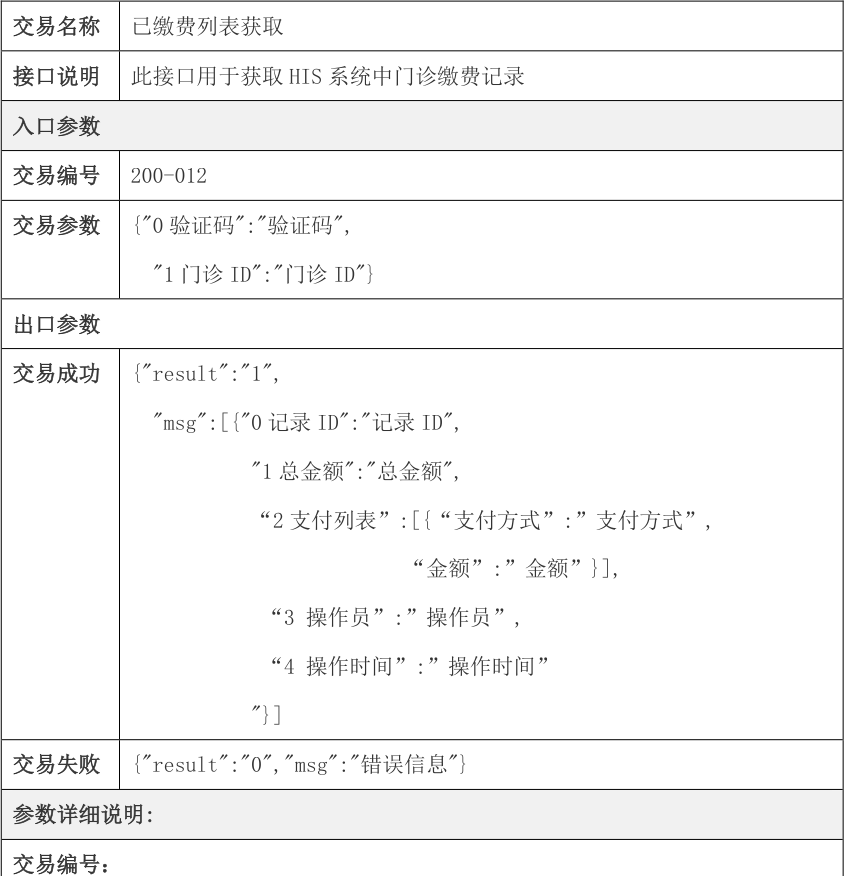


<!-- Start of picture text -->
交易名称 已缴费列表获取<br>接口说明 此接口用于获取HIS 系统中门诊缴费记录<br>入口参数<br>交易编号 200-012<br>交易参数 {"0 验证码":"验证码",<br>"1 门诊ID":"门诊ID"}<br>出口参数<br>交易成功 {"result":"1",<br>"msg":[{"0 记录ID":"记录ID",<br>"1 总金额":"总金额",<br>“2 支付列表”:[{“支付方式”:”支付方式”,<br>“金额”:”金额”}],<br>“3 操作员”:”操作员”,<br>“4 操作时间”:”操作时间”<br>"}]<br>交易失败 {"result":"0","msg":"错误信息"}<br>参数详细说明:<br>交易编号：<br><!-- End of picture text -->

|代码|名称|约束|类型|说明|
|---|---|---|---|---|
|1|交易编号|NOT NULl|VARCHAR2(10)||
|交易参数：|||||

<!-- page: 203 -->

四川省基层医疗卫生机构管理信息系统应用接口规范 

|序号|名称|约束|类型|说明|
|---|---|---|---|---|
|1|验证码|NOT NULl|VARCHAR2(32)||
|2|门诊ID|NOT NULl|Varchar(32)||
|交易输出：<br>|<br>||||
|代码|名称|约束|类型|说明|
|0|记录ID|NOT NULl|Varchar2(32)|收费记录ID|
|1|总金额|NOT NULL|Decimal(20,4)|费用总额|
|2|支付列表|NOT null|Array|支付明细|
|3|操作员|NOT NULL|Varchar2(50)|操作人员|
|4|操作时间|NOT NUll|Date||


###### 6.2.13 200-013 查询缴费清单明细 

|交易名称|获取缴费的清单明细|
|---|---|
|接口说明|此接口用于获取HIS 中的缴费清单明细|
|入口参数<br>||
|交易编号|200-013|
|交易参数|{<br>"0 验证码":"验证码",<br>"1 收费记录ID":"收费记录ID"<br>}|
|出口参数||
|交易成功|{"result":"1",<br>"msg": [{<br>“0 ID”:”清单ID”,<br>"1 CFID":"处方ID",<br>"2 CFCODE":"处方号",<br>“3 FeeName”:”费用名称”,<br>“4 ItemName”:”项目名称”,<br>“5 Spec”:”规格”,|

<!-- page: 204 -->

四川省基层医疗卫生机构管理信息系统应用接口规范 

“6 Unit”:”单位”, “7 Price”:”单价”, “8 Amount”:”数量”, “9 Fee”:”小计”, "10 Oper":"开单人", "11 OperDept":"开单科室", "12 OperDate":"开单时间" }] } 

交易失败 {"result":"0","msg":"错误信息"} 

###### 参数详细说明: 

|交易编号：<br>代码|<br>名称|约束|类型|说明|
|---|---|---|---|---|
|1|交易编号|NOT NULl|VARCHAR2(10)||
|交易参数：<br>|<br>||||
|序号|名称|约束|类型|说明|
|1|验证码|NOT NULl|VARCHAR2(32)||
|2|收费记录ID|NOT NULl|Varchar(32)||
|交易输出：<br>|<br>||||
|代码|名称|约束|类型|说明|
|0|ID|NOT NULl|Varchar2(32)|清单ID|
|1|CFID|NOT NULL|Varchar2(32)|处方ID|
|2|CFCODE|NOT null|Varchar2(50)|处方号|
|3|FeeName|NOT NUll|Varchar2(20)|费用名称|
|4|ItemName|NOT NULL|Varchar2(50)|项目名称|
|5|Spec|NUll|Varchar2(50)|规格|
|6|Unit|NUll|Varchar2(50)||
|7|Price|Not Null|Decimal||
|8|Amount|Not Null|Decimal||
|9|Fee|Not Null|Decimal||

<!-- page: 205 -->

四川省基层医疗卫生机构管理信息系统应用接口规范 

|10|Oper|Not Null|Varchar2(50)|
|---|---|---|---|
|11|OperDept|Not NULL|Varchar2(50)|
|12|OperDate|NOT Null|Date|


###### 6.2.14 200-014 门诊退费 

|交易名称|门诊退费|
|---|---|
|接口说明|此接口用于退APP 或微信公众号收取的费用整退|
|入口参数||
|交易编号|200-014|
|交易参数<br>出口参数|{<br>"0 验证码":"验证码",<br>"1 收费记录ID":"收费记录ID",<br>“2 虚拟收费人员ID”:” 虚拟收费人员ID”,<br>“3 退费金额”: “退费金额”,<br>“4 厂商唯一标识”:”厂商唯一标识”,<br>“5 退费流水号”: “退费流水号”<br>}|
|交易成功|{"result":"1",<br>"msg":{“0 退费总额”：”退费总额”,<br>“1 退费流水号”:”退费流水ID”,<br>“2 退费单号”:”退费单号”}|
|交易失败|{"result":"0","msg":"错误信息"}|
|参数详细说|明:|
|交易编号：||
|代码|名称<br>约束<br>类型<br>说明|
|1|交易编号<br>NOT NULl<br>VARCHAR2(10)|
|交易参数：||

<!-- page: 206 -->

四川省基层医疗卫生机构管理信息系统应用接口规范 

|序号|名称|约束|类型|说明|
|---|---|---|---|---|
|1|验证码|NOT NULl|VARCHAR2(32)||
|2|收费记录ID|NOT NULl|Varchar(32)||
|3|虚拟收费员ID|Not NULL|VarChar2(32)||
|4|退费金额|NOT null|Decimal|主要用于验证费用<br>是否相符|
|5|厂商标识|NOT null|Varchar2(50)||
|交易输出：|||||
|代码|名称|约束|类型|说明|
|0|退费总额|NOT NUll|Decimal||
|1|退费流水记录|Not Null|Varchar2(32)||
|2|退费单号|NOT null|Varchar2(30)||


###### 6.2.15 200-015 交易账单数据查询 

|交易名称|交易账单数据查询|
|---|---|
|接口说明|获取基于接口交易的清单的详细信息|
|入口参数<br>||
|交易编号|200-015|
|交易参数|{"0 验证码":"验证码",<br>"1 厂商唯一标识":"厂商唯一标识",<br>"2 开始日期":"开始日期",<br>"3 结束日期":"结束日期",<br>"4 机构ID":"机构ID"<br>}|
|出口参数||
|交易成功|{"result":"1",<br>"msg":[{" 0 支付总金额":"支付总金额",<br>"1 支付总比数":支付总比数,|

<!-- page: 207 -->

四川省基层医疗卫生机构管理信息系统应用接口规范 

"2 总退款金额":总退款金额, "3 退款总比数":退款总比数, "4 实收":实收, "5 支付记录":[{"7 病人卡号":"病人卡号", "8 机构ID":"机构ID", "9 平台交易流水号":"平台交易流水号", "10 支付方式":"支付方式", "11 费用类型":"费用类型", "12 费用":"费用", "13 交易时间":"交易时间", "14 身份证号":"身份证号", "15 姓名":"姓名", "16 业务ID":"业务ID", "17 费用记录ID":"费用记录ID" }], "6 退款记录":[{"病人卡号":"病人卡号", "机构ID":"机构ID", "平台交易流水号":"平台交易流水号", "支付方式":"支付方式", "费用类型":"费用类型", "费用":"费用", "交易时间":"交易时间", "身份证号":"身份证号", "姓名":"姓名", "业务ID":"业务ID", "费用记录ID":"费用记录ID",}] } 交易失败 {"result":"0","msg":"错误信息"} 参数详细说明: 

<!-- page: 208 -->

四川省基层医疗卫生机构管理信息系统应用接口规范 

|交易编号<br>代码|：<br>名称|约束|类型|说明|
|---|---|---|---|---|
|1|交易编号|NOT NULl|VARCHAR2(10)||
|交易参数|：||||
|序号|名称|约束|类型|说明|
|1|验证码|NOT NULl|VARCHAR2(32)||
|2|厂商唯一标识|NOT NULl|VARCHAR2(50)||
|3|机构ID||VARCHAR2(32)|如果为空，返回厂商<br>所有交易<br>如果非空则返回此<br>厂商此机构的交易|
|4|开始时间|NOT NULl|VARCHAR2(50)|开<br>始<br>时<br>间<br>：<br>2014-01-01 15:11:22|
|5|结束时间|NOT NULl|VARCHAR2(50)|结<br>束<br>时<br>间<br>：|
|||||2014-01-01 15:11:22|
|交易输出<br>|：<br>||||
|代码|名称|约束|类型|说明|
|0|支付总金额|NOT NULl|Decimal(20,2<br>)||
|1|支付总比数|NOT NULl|Int32||
|2|总退款金额|NOT NULl|Decimal(20,2<br>)||
|3|退款总比数|NOT NULl|Int32||
|4|实收|NOT NULl|Decimal(20,2<br>)||
|5|支付记录|||为json 数组|
|6|退款记录|||为json 数组|
|7|病人卡号||VARCHAR2(32)||
|9|机构ID||VARCHAR2(32)||
|10|平台交易流水号||VARCHAR2(50)||
|11|支付方式||VARCHAR2(50)||
|12|费用类型||VARCHAR2(2)|1 挂号费<br>2 门诊缴费<br>3 住院预缴|
|13|费用||Decimal(20,2<br>)|正数表示收费|

<!-- page: 209 -->

四川省基层医疗卫生机构管理信息系统应用接口规范 

||||负数表示退费|
|---|---|---|---|
|14|交易时间|VARCHAR2(50)||


###### 6.3 双向转诊 

###### 6.3.0 接入指引 

######  接入方式 

由转诊平台调用 HIS 接口 


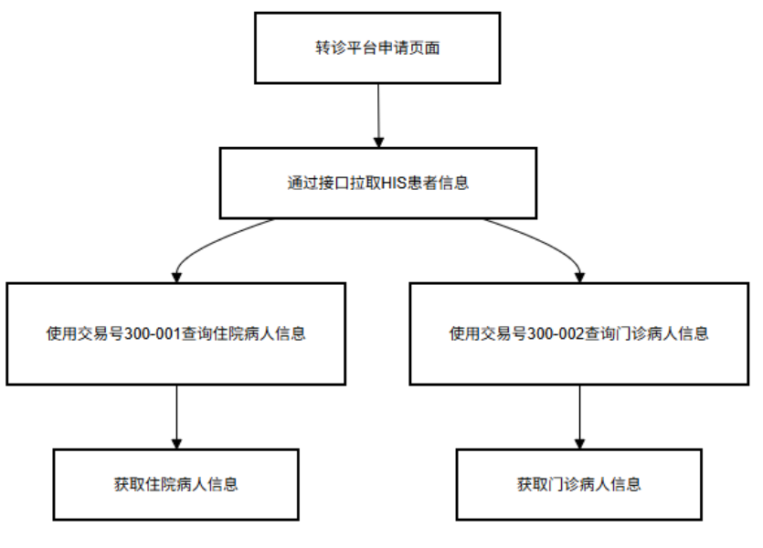


- 接入流程 

上转：转诊平台申请页面 通过接口拉取 his 患者信息，交易号 300-001 住院病人信息查询， 

300-002 门诊病人信息查询。 

下转： 

- 第 1 步：获取某机构科室列表交易号 100-008 

- 第 2 步：调用转诊接口 300-003 给 his 传递转诊记录。 

<!-- page: 210 -->

四川省基层医疗卫生机构管理信息系统应用接口规范 

###### 6.3.1 300-001 住院病人信息查询 

|交易名称|住院病人信息查询|
|---|---|
|接口说明|此接口用于获取HIS 系统中住院病人的基本信息|
|入口参数||
|交易编号|300-001|
|交易参数<br>出口参数|{"0 验证码":"验证码",<br>"1 身份证号码":"身份证号码",<br>"2 机构编码":"机构编码",<br>"3 开始时间":"开始时间",<br>"4 结束时间":"结束时间"，<br>"5 状态":"状态",<br>"6 TYPE":"查询方式"，<br>"7 业务ID":"住院ID"，<br>"8 住院号":”住院号"，<br>"9 人员ID":”人员ID"，<br>}|
|交易成功|{"result":"1",<br>"msg":[{"0 医院名称":"医院名称",<br>"1 入院日期":"入院日期",<br>"2 出院日期":"出院日期",<br>"3 住院号":"住院号",<br>"4 业务ID":"业务ID",<br>"5 姓名":"姓名",<br>"6 身份证号":"身份证号",<br>"7 性别":"性别",<br>"8 出生日期":"出生日期",<br>"9 联系人姓名:"联系人姓名",<br>"10 联系电话":"联系电话",<br>"11 家庭地址":"家庭地址",<br>"12 入院科室":"入院科室",<br>"13 入院科室编码":"入院科室编码",<br>"14 入院诊断医生":"入院诊断医生",<br>"15 入院床位":"入院床位",<br>"16 入院主诊断":"入院主诊断",<br>"17 入院主诊断ICD10":"入院主诊断ICD10",<br>"18 入院次诊断":"入院次诊断",<br>"19 入院次诊断ICD10":"入院次诊断ICD10"<br>"20 入院病区":"入院病区",<br>"21 入院经办人":"入院经办人",<br>"22 入院经办时间":"入院经办时间",|

<!-- page: 211 -->

四川省基层医疗卫生机构管理信息系统应用接口规范 

|交易失败|"23 住院总费用":"住院总费用",<br>"24 备注":"备注",<br>"25 出院科室名称":"出院科室",<br>"26 出院科室编码":"出院科室编码",<br>"27 出院病区":"出院病区",<br>"28 出院床位":"出院床位",<br>"29 出院主诊断":"出院主诊断",<br>"30 出院主诊断ICD10":"出院主诊断ICD10",<br>"31 出院次诊断":"出院次诊断",<br>"32 出院次诊断ICD10":"出院次诊断ICD10"，<br>"33 在院状态":"在院状态",<br>"34 入院诊断医生编码":"入院诊断医生编码",<br>"35 入院床位编码":"入院床位编码",<br>"36 入院病区编码":"入院病区编码",<br>"37 出院床位编码":"出院床位编码",<br>"38 出院病区编码":"出院病区编码"，<br>"39 住院总预交":"住院总预交"}]<br>}<br>{"result":"0","msg":"错误信息"}||
|---|---|---|
|参数详细说<br>交易编号：<br>|明:<br><br><br><br>||
|代码|名称<br>约束<br>类型|说明|
|1|交易编号<br>NOT NULl<br>VARCHAR2(10)||
|交易参数：|||
|序号|名称<br>约束<br>类型|说明|
|1|验证码<br>NOT NULl<br>VARCHAR2(32)||
|2|身份证号码<br>VARCHAR2(20)|身份证号码和业务ID<br>为空时查询该机构下<br>指定时间段内的出入<br>院信息|
|3|机构编码<br>NOT NULl<br>VARCHAR2(50)|取接口30 返回的ID|
|4|开始时间<br>NOT NULl<br>VARCHAR2(50)|2014-01-01 15:11:22|
|5|结束时间<br>NOT NULl<br>VARCHAR2(50)|2014-01-01 15:11:22|
|6|状态<br>NUMBER|0 表示清单不包含退<br>药、退费等产生的负<br>数记录；1 表示清单包<br>含退药、退费等产生<br>的负数记录。（非必<br>填项：默认为0 ）|
|7|业务ID<br>VARCHAR2(32)|允许传入业务ID 精准<br>查询|
|8|TYPE<br>Varchar2(1)|默认按入院时间段查<br>询，”1”表示按出院<br>时间段查询|

<!-- page: 212 -->

四川省基层医疗卫生机构管理信息系统应用接口规范 

|9<br>住院号||VARCHAR2(50)|患者住院号|
|---|---|---|---|
|10<br>人员ID||VARCHAR2(32)|患者健康档案ID|
|交易输出：<br><br>||||
|代码<br>名称|约束|类型|说明|
|1<br>医院名称|NOT NULl|VARCHAR2(50)||
|2<br>入院日期|NOT NULl|VARCHAR2(50)||
|3<br>出院日期||VARCHAR2(20)||
|4<br>住院号|NOT NULl|VARCHAR2(50)||
|5<br>业务ID|NOT NULl|VARCHAR2(32)||
|6<br>姓名|NOT NULl|VARCHAR2(20)||
|7<br>身份证号|NOT NULl|VARCHAR2(20)||
|8<br>性别|NOT NULl|VARCHAR2(20)||
|9<br>出生日期|NOT NULl|VARCHAR2(20)||
|10<br>联系人姓名||VARCHAR2(20)||
|11<br>联系电话||VARCHAR2(20)||
|12<br>家庭地址||VARCHAR2(100<br>)||
|13<br>入院科室|NOT NULl|VARCHAR2(50)||
|14<br>入院科室编码|NOT NULl|VARCHAR2(32)||
|15<br>入院诊断医生||VARCHAR2(20)||
|16<br>入院床位||VARCHAR2(20)||
|17<br>入院主诊断||VARCHAR2(50)||
|18<br>入院主诊断ICD10||VARCHAR2(20)||
|19<br>入院次诊断||VARCHAR2(50)||
|20<br>入院次诊断ICD10||VARCHAR2(20)||
|21<br>入院病区||VARCHAR2(20)||
|22<br>入院经办人|NOT NULl|VARCHAR2(20)||
|23<br>入院经办时间|NOT NULl|VARCHAR2(20)||
|24<br>住院总费用||NUMBER(16,2)||
|25<br>备注||VARCHAR2(100<br>)||
|26<br>出院科室||VARCHAR2(50)||
|27<br>出院科室编码||VARCHAR2(32)||
|28<br>出院病区||VARCHAR2(20)||
|29<br>出院床位||VARCHAR2(20)||
|30<br>出院主诊断||VARCHAR2(50)||
|31<br>出院主诊断ICD10||VARCHAR2(20)||
|32<br>出院次诊断||VARCHAR2(50)||
|33<br>出院次诊断ICD10||VARCHAR2(20)||
|34<br>在院状态|||0 在院无床、1 在院有<br>床、2 出院未结算、3<br>出院已结算、-1 撤销<br>入院|

<!-- page: 213 -->

四川省基层医疗卫生机构管理信息系统应用接口规范 

|35|入院诊断医生编码|VARCHAR2(50)|
|---|---|---|
|36|入院床位编码|VARCHAR2(32)|
|37|入院病区编码|VARCHAR2(32)|
|38|出院床位编码|VARCHAR2(32)|
|39|出院病区编码|VARCHAR2(32)|
|40|住院总预交|NUMBER(16,2)|


###### 6.3.2 300-002 门诊病人信息查询 

交易名称 门诊病人信息查询 接口说明 此接口用于获取HIS 系统中门诊病人的基本信息 <mark>入口参数</mark> 交易编号 300-002 交易参数 {"0 验证码":"验证码", "1 身份证号码":"身份证号码", "2 机构编码":"机构编码", "3 开始时间":"开始时间", "4 结束时间":"结束时间", "5 业务ID":"业务ID", "6 门诊号":"门诊号", "6 科室ID":"科室ID" } 出口参数 交易成功 {"result":"1", "msg":[{"0 姓名":"姓名", "1 身份证号码":"身份证号码", "2 性别":"性别", "3 业务ID":"业务ID", "4 门诊号":"门诊号", "5 就诊日期":"就诊日期", "6 科室":"科室", "7 科室编码":"科室编码", "8 诊断医生":"诊断医生", "9 诊断疾病编码":"诊断疾病编码", "10 诊断疾病名称":"诊断疾病名称", "11 主要病情描述":"主要病情描述", "12 经办人":"经办人", "13 就诊总费用":"就诊总费用", "14 备注":"备注"， "15 接诊状态":"接诊状态"}] } 交易失败 {"result":"0","msg":"错误信息"} <mark>参数详细说明:</mark> 

<!-- page: 214 -->

四川省基层医疗卫生机构管理信息系统应用接口规范 

|交易编号<br>代码|：<br>名称|约束|类型|说明|
|---|---|---|---|---|
|1|交易编号|NOT NULl|VARCHAR2(10)||
|交易参数|：||||
|序号|名称|约束|类型|说明|
|1|验证码|NOT NULl|VARCHAR2(32)||
|2|身份证号码||VARCHAR2(20)||
|3|机构编码|NOT NULl|VARCHAR2(50)|取接口30 返回的ID|
|4|开始时间|NOT NULl|VARCHAR2(50)|2014-01-01 15:11:22|
|5|结束时间|NOT NULl|VARCHAR2(50)|2014-01-01 15:11:22|
|6|业务ID||VARCHAR2(32)||
|7|门诊号||VARCHAR2(50)|不支持模糊查询|
|8|科室ID||VARCHAR2(32)||
|交易输出|：||||
|代码|名称|约束|类型|说明|
|1|姓名|NOT NULl|VARCHAR2(20)||
|2|身份证号|NOT NULl|VARCHAR2(20)||
|3|性别|NOT NULl|VARCHAR2(20)||
|4|业务ID||VARCHAR2(32)||
|5|门诊号||VARCHAR2(50)||
|6|就诊日期||VARCHAR2(20)||
|7|科室|NOT NULl|VARCHAR2(50)||
|8|科室编码|NOT NULl|VARCHAR2(32)||
|9|诊断医生||VARCHAR2(20)||
|10|诊断疾病编码||VARCHAR2(32)||
|11|诊断疾病名称||VARCHAR2(100<br>)||
|12|主要病情描述||VARCHAR2(100<br>)||
|13|经办人||VARCHAR2(20)||
|14|就诊总费用||NUMBER(16,2)||
|15|备注||VARCHAR2(100<br>)||
|16|接诊状态||NUMBER(16,2)|0 未截至、1 接诊中、<br>2 已接诊|
|17|挂号费||NUMBER(16,2)||
|18|诊断医生编码||VARCHAR2(100<br>)||
|19|机构编码||VARCHAR2(32)||
|20|医师国家编码||VARCHAR2(100<br>)||
|21|患者ID||VARCHAR2(32)||
|22|联系电话||VARCHAR2(100||

<!-- page: 215 -->

四川省基层医疗卫生机构管理信息系统应用接口规范 

|||)|
|---|---|---|
|23|地址|VARCHAR2(100<br>)|
|24|工作单位|VARCHAR2(100<br>)|
|25|职业|VARCHAR2(100<br>)|


###### 6.3.3 300-003 接收转诊 

|交易名称|双向转诊向下转诊|
|---|---|
|接口说明|此接口用于双向转诊向下转诊|
|入口参数||
|交易编<br>号|300-003|
|交易参<br>数|{"验证码":"44200F7B173B00E136C04106FB29AA4A",<br>"Xml":" fhir xml 的base64 字符传（参考重点对接指引文档数据集基层系<br>统部分生态应用参数数据集）","type":"base64"<br>}|
|出口参数||
|交易成<br>功|<string xmlns="http://tempuri.org/">{"Result":1,"Msg":"\u003c?xml<br>version=\"1.0\"<br>encoding=\"utf-8\"<br>?\u003e\u003cAppointmentResponse<br>xmlns=\"http://hl7.org/fhir\"\u003e \u003c!-- 0..1 住院转诊预约回<br>复<br>逻<br>辑<br>ID--\u003e<br>\u003cid<br>value=\"8311278D394F4C0DBEF5844DC79AA08B\"/\u003e\u003cmeta\u003e<br>\u003cprofile<br>value=\"https://fhir.scwjxx.cn/Sichuan/fhir/StructureDefinition/h<br>ospital-referral-response\"/\u003e<br>\u003c/meta\u003e<br>\u003c!--|
||1..1<br>Reference(Appointment)<br>申<br>请<br>编<br>号<br>--\u003e<br>\u003cappointment\u003e<br>\u003creference<br>value=\"8311278D394F4C0DBEF5844DC79AA08B\"/\u003e|
||\u003c/appointment\u003e<br>\u003c!--<br>0..1<br>备<br>注<br>--\u003e<br>\u003ccomment<br>value=\"[string]\"/\u003e<br>\u003c/AppointmentResponse\u003e "}</string>|

<!-- page: 216 -->

四川省基层医疗卫生机构管理信息系统应用接口规范 

|交易失<br>败<br>参数详细<br>交易编号<br>|{"result":"0","ms<br>说明:<br>：<br>|g":"错误信息"}<br>|||
|---|---|---|---|---|
|代码|名称|约束|类型|说明|
|1|交易编号|NOT NULl|string|fhir-001|
|交易参数<br>|：<br>||||
|序号|名称|约束|类型|说明|
|1|验证码|NOT NULL|string||
|2|Xml|NOT NULL|string|Fhir base64 字符串|
|3|type|not null|string|base64 编码类型|
|交易输出<br>|：<br>||||
|代码|名称|约束|类型|说明|
|1|Result||int|0 成功,1 失败|
|2|Msg||Sting|错误信息或fhir回执<br>资源|


###### 6.4 电子病历 

###### 6.4.0 接入指引 

######  对接方式 

###### HIS 调用第三方电子病历页面 


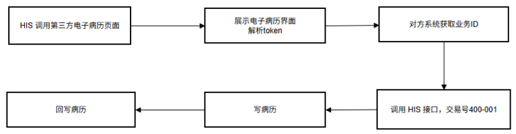


 对接流程 

<!-- page: 217 -->

四川省基层医疗卫生机构管理信息系统应用接口规范 

第 **1** 步 ：his 调用示例代码，对方系统按要求提供中转接口 

`ip:port//emrservice/index?bid=` 业务 `ID&token=` 单点登录 `&type=(0` 住院 `1` 

门诊 `)` 

业务 `ID` 该就诊唯一主键 `(` 也就是门诊记录 `ID,` 住院记录 `ID)` 

对方系统通过业务 ID 调用 his 接口获取相关数据。 

第 **2** 步 ：对方系统通过 token 调用 his 接口 100-009 交易获取明文 

###### 第 **3** 步 ：机构管理员启用配置 


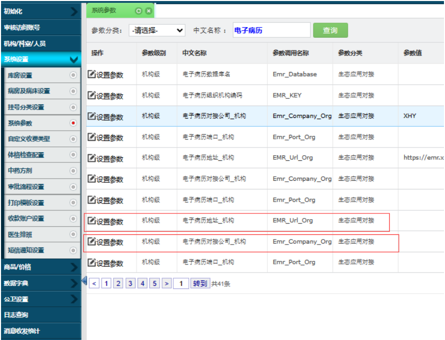


提醒：病历需要回写到 HIS 

###### 6.4.1 400-001 电子病历.病人住院信息 

|交易名称|获取病人信息|
|---|---|
|接口说明|此接口用于获取HIS 系统中住院病人信息|
|入口参数||
|交易编号|400-001|
|交易参数|{"0 验证码":"验证码",|

<!-- page: 218 -->

四川省基层医疗卫生机构管理信息系统应用接口规范 

||"1 业务ID":"住院ID/门诊ID "<br>}|
|---|---|
|出口参数<br>|""|
|交易成功|{Result:1,|
||"Msg":[{"住院号":"20190328004",<br>"机构编码":"8BCDCA4E11A44A9D888D7E70DD4FF44F",<br>"患者过敏信息":null,<br>"住院费用":31,<br>"患者姓名":"思**",<br>"患者性别":"男",<br>"患者出生日期":"\/Date(162230400000)\/",<br>"入院情况":"2",<br>"入院途径代码":"2",<br>"入院来源":null,<br>"住院次数":1,<br>"支付方式编码":"01",<br>"支付方式名称":"现金",<br>"身份证号":"511xxx",<br>"工作单位名称":null,<br>"入院时间":"\/Date(1553760540000)\/",<br>"入院科室编码":"D6B628FA9D2F428C9192419480A732CE",<br>"入院科室名称":"中医科",<br>"门急诊西医诊断疾病名称":null,<br>"门急诊医医诊断疾病编码":null,<br>"出院诊断名称":null,<br>"出院诊断编码":null,<br>"出院原因":1,<br>"开据医师":"胡**",<br>"患者诊疗状况":"O",<br>"床号":"10-+8",<br>"医疗类别":null,<br>"出院时间":"\/Date(1556260020000)\/",<br>"结算时间":"\/Date(1556260020000)\/",<br>"操作员工号":null,<br>"操作员姓名":null,<br>"操作时间":null,<br>"健康档案ID":"8CD1910645CD4753B18C93305ED2C42D",<br>"健康卡号":"511xxx",<br>"手机号":null,<br>"病区编码":"001",<br>"病区名称":"住院部",<br>"住院医师USERCODE":null,<br>"院医师名称":null,<br>"主治医生USERCODE":"B83D6A7B6A544A688D9E783A9403F72A",|

<!-- page: 219 -->

四川省基层医疗卫生机构管理信息系统应用接口规范 

"主治医生名称":"胡**", "任医生UERSCODE":null, "任医生名称":"帅**", "责任护士代码":null, "责任护士名称":null, "病人等级":null, "机构名称":"***中心卫生院", "护理级别":null, "业务级别":null, "病人入病区时间":null, "医保卡号":null, "支付方式":null, "婴儿月数":null, "婴儿天数":null, "国籍":"CHN", "国籍名称":"中国", "新生儿出生体重":null, "新生儿入院体重":null, "成年人体重":null, "民族名称":"汉族", "职业编码":"5", "职业":null, "婚姻状态":"4", "出生地":"***街39 号", "出生省":null, "出生市":null, "出生县":null, "籍贯省":null, "籍贯市":null, "现住地址":"***39 号", "现住地省":null, "现住地市":null, "现住地电话":"无", "户口省":null, "户口市":null, "户口县":null, "户口电话":"无", "工作单位地址":"**村3 组", "联系人名称":null, "联系人电话":null, "联系人地址":null, "住院天数":1, "损伤中毒的外部编码":null, "损伤中毒的外部":null, 

<!-- page: 220 -->

四川省基层医疗卫生机构管理信息系统应用接口规范 

"病理诊断":null, "病理诊断编码":null, "病理标本编号":null, "过敏药物标记":1, "过敏药物名":null, "死亡患者尸检":null, "RH 血型代码":3, "血型代码":5, "科主任姓名":"帅**", "进行医生姓名":null, "实习医生名称":null, "编码员姓名":"胡**", "病案质量代码":3, "质控医生名称":"舒**", "质控护士姓名":"帅*", "质控日期":"\/Date(1553788800000)\/", "离院方式代码":1, "拟接收医疗机构名称医嘱转院":null, "拟接收医疗机构名称医嘱转社":null, "是否有出院31 天内在院":1, "再住院计划目的":null, "入院前颅脑损伤患者昏迷天":0, "入院前颅脑损伤患者昏迷时":0, "入院前颅脑损伤患者昏迷分":0, "入院后颅脑损伤患者昏迷天":0, "入院后颅脑损伤患者昏迷时":0, "入院后颅脑损伤患者昏迷分":0, "总费用":31, "自费金额":31, "自费金额未结":null, "自费金额医保":null, "母亲标识":null, "母亲住院号":null, "身高":null, "血压收缩舒张":null, "胎方位":null, "预产期":null, "骨盆":null, "科主任编码":null, "进行医生编码":null, "实习医生编码":null, "编码员编码":null, "质控医生编码":null, "质控护士编码":null}]} 

<!-- page: 221 -->

四川省基层医疗卫生机构管理信息系统应用接口规范 

|交易失败|{"result":"0","msg":"错误信息"|}||
|---|---|---|---|
|参数详细说<br>交易编号：<br>|明:<br><br><br>|||
|代码|名称<br>约束|类型|说明|
|1|交易编号<br>NOT NULl|VARCHAR2(10)||
|交易参数：<br>||||
|序号|名称<br>约束|类型|说明|
|1|验证码<br>NOT NULl|VARCHAR2(32)||
|2|住院ID<br>NOT NULl|VARCHAR2(32)||
|交易输出：||||
|代码|名称<br>约束|类型|说明|
|1|中文JSON|||


###### 6.4.2 400-002 电子病历.病人诊断信息 

|交易名称|获取病人诊断信息|
|---|---|
|接口说明|此接口用于获取HIS 系统中住院病人诊断信息|
|入口参数<br>||
|交易编号|400-002|
|交易参数|{"0 验证码":"验证码",<br>"1 业务ID":"住院ID /门诊ID"<br>}|
|出口参数||
|交易成功|{ "Result": 1, "Msg": "{"Result":1,<br>"Msg":[{<br>"类别":"西医",<br>"住院号":"E4343F100ADE4E3895C14BF1883C3720",<br>"诊断ID":"A875A6B1752B4B46A310B81C068FA0D5",<br>"诊断序号":0,<br>"诊断名":"咯血",<br>"诊断编码":"R04.200",<br>"诊断类型":"出院诊断",<br>"住院费用":31,<br>"诊断医生名称":"胡**",<br>"诊断医生ID":"B83D6A7B6A544A688D9E783A9403F72A",<br>"备注":null,<br>"出院情况":1,<br>"诊断日期":"\/Date(1553760540000)\/",<br>"机构ID":"8BCDCA4E11A44A9D888D7E70DD4FF44F",<br>"机构名称":"***中心卫生院",<br>"机构编码":"451238747",<br>"操作人姓名":"胡**",<br>"操作人ID":"B83D6A7B6A544A688D9E783A9403F72A",|

<!-- page: 222 -->

四川省基层医疗卫生机构管理信息系统应用接口规范 

|"<br>操<br>作<br>时<br>间<br>":"\/Date<br>":"E4343F100ADE4E3895C14BF1883<br>"诊断ID":"14386EA9E19B4003AA5<br>"诊断序号":0,<br>"诊断名":"内斜V 征",<br>"诊断编码":"H50.806",<br>"诊断类型":"入院诊断",<br>"住院费用":31,<br>"诊断医生名称":"胡**",<br>"诊断医生ID":"B83D6A7B6A544A6<br>"备注":"(无)",<br>"出院情况":1,<br>"诊断日期":"\/Date(15537605400<br>"机构ID":"8BCDCA4E11A44A9D888<br>"机构名称":"***中心卫生院",<br>"机构编码":"451238747",<br>"操作人姓名":"胡**",<br>"操作人ID":"B83D6A7B6A544A688<br>"操作时间":"\/Date(15537605400|(1553760540000)\/"},{"<br>C3720",<br>7840FD1B4C048",<br>88D9E783A9403F72A",<br>00)\/",<br>D7E70DD4FF44F",<br>D9E783A9403F72A",<br>00)\/"}]}" }|住|院|号|
|---|---|---|---|---|
|交易失败<br>{"result":"0","msg":"错误信息"|}||||
|参数详细说明:|||||
|交易编号：|||||
|代码<br>名称<br>约束|类型<br>说明||||
|1<br>交易编号<br>NOTNULl|VARCHAR2(10)||||
|<br>交易参数：<br><br><br>|||||
|序号<br>名称<br>约束|类型<br>说明||||
|1<br>验证码<br>NOT NULl|VARCHAR2(32)||||
|2<br>住院ID<br>NOT NULl|VARCHAR2(32)||||
|交易输出：|||||
|代码<br>名称<br>约束|类型<br>说明||||
|1<br>中文JSON|||||


###### 6.4.3 400-003 电子病历.病历回写 

|交易名称|病历回写|
|---|---|
|接口说明|此接口用于回写病历数据|
|入口参数||
|交易编号|400-003|
|交易参数|{<br>“验证码”:”验证码”,|
||"业务ID":"住院ID/门诊ID",|
||"模板名字":"模板名字",<br>"模板内容":"病历内容",|

<!-- page: 223 -->

四川省基层医疗卫生机构管理信息系统应用接口规范 

|出口参数<br>交易成功|“医生ID”:”医生ID”,<br>“电子病历ID”:”对方系统的病<br>“创建时间”:”创建时间”<br>}<br>{"result":"1"}|历ID”||
|---|---|---|---|
|交易失败|{"result":"0","msg":"错误信息"|}||
|参数详细说<br>交易编号：<br>|明:<br><br><br>|||
|代码|名称<br>约束|类型|说明|
|1|交易编号<br>NOTNULl|string||
|交易参数：<br>|<br><br><br>|||
|序号|名称<br>约束|类型|说明|
|1|验证码<br>NOT NULL|string||
|2|业务ID<br>NOT NULL|Raw(32)||
|3|模板名字<br>NOT NULL|string||
|4|病历内容<br>NOT NULL|String||
|5|电子病历ID<br>NOT NULL|string||
|6|医生ID<br>NOT NULL|Raw(32)||
|7|创建时间<br>NOT NULL|string|Yyyy-MM-dd HH:mm:ss|
|交易输出：<br>||||
|代码|名称<br>约束|类型|说明|


###### 6.4.4 400-004 电子病历 获取his 电子病历历史数据 

|交易名称|his 电子病历历史数据||
|---|---|---|
|接口说明|此接口用于获取his 电子病历历史|数据|
|入口参数<br>|||
|交易编号|400-004||
|交易参数<br>出口参数<br>|{{"<br>验<br>证<br>码<br>":"44200F7B1<br>ID":"9631788191BC4A53BCF3F94AF<br>|73B00E136C04106FB29AA4A","<br>业<br>务<br>DA4C1ED"}<br>|
|交易成功|返回结果json 中Content 节点为|xml 字符串7zip 压缩需解压|
|交易失败<br>参数详细说<br>交易编号：<br>|{"result":"0","msg":"错误信息"<br>明:<br><br>|}<br><br>|
|代码|名称<br>约束|类型<br>说明|
|1|交易编号<br>NOT NULl|string|
|交易参数：<br>|||
|序号|名称<br>约束|类型<br>说明|
|1|验证码<br>NOT NULL|string|
|2|业务ID<br>NOT NULL|Raw(32)|

<!-- page: 224 -->

四川省基层医疗卫生机构管理信息系统应用接口规范 

|3|开始时间|Null|YYYY-MM-dd|入院时间|
|---|---|---|---|---|
|4|结束时间|Null|YYYY-MM-dd|入院时间|
|交易输出：<br>|||||
|代码|名称|约束|类型|说明|
|EmrId|电子病历id||||
|Name|病历名称||||
|Content|电子病历内容||||
|入院时间|||||
|业务ID|||||
|书写时间|||||
|住院号|||||


###### 6.4.5 400-005 电子病历 获取电子病历医生数据 

|交易名称|获取电子病历医生数据||
|---|---|---|
|接口说明|此接口用于获取电子病历医生数据||
|入口参数|||
|交易编号|400-005||
|交易参数|{"<br>验|证<br>码|
||":"44200F7B173B00E136C04106FB2<br>D7E70DD4FF44F"}|9AA4A","OrgId":"BCDCA4E11A44A9D888|
|出口参数|||
|交易成功|{"Result":1,"Msg":"[{\"<br>ID\":\"9BF4A6F0EFBA469EA308472<br>所在机构ID\":\"09F444EF7D614|医<br>生<br>375E2CE27\",\"医生名\":\"何*\",\"<br>AE5ACEA2646903295CD\",\"所在机构名|
||\":\"***<br>卫<br>生<br>院|\",\"<br>所<br>属<br>科<br>室|
||ID\":\"154C77D91F3E49E09C24D15<br>部\"}]”}|6F8AC50D6\",\"所属科室名\":\"护理|
|交易失败|{"result":"0""msg":"错误信息"|}|
|参数详细说|,<br>明:||
|交易编号：<br>|||
|代码|名称<br>约束|类型<br>说明|
|1|交易编号<br>NOT NULl|string|
|交易参数：<br>|||
|序号|名称<br>约束|类型<br>说明|
|1|验证码<br>NOT NULL|string|
|交易输出：<br>|||
|代码|名称<br>约束|类型<br>说明|

<!-- page: 225 -->

四川省基层医疗卫生机构管理信息系统应用接口规范 

###### 6.4.6 400-006 电子病历 验证登录 

|交易名称|获取检查检验单结果||
|---|---|---|
|接口说明|此接口用于电子病历验证登录||
|入口参数|||
|交易编号|400-006||
|交易参数|{"<br>验<br>证<br>码<br>":"44200F7B1<br>":"RDA3QTZCRTZGOTRDODg0NUI0Nzc<br>EFFNUFDRUEyNjQ2OTAzMjk1Q0R8MTU<br>zUwRDZ8MQ=="}|73B00E136C04106FB29AA4A","<br>密<br>码<br>4MTk5NDcyMzk3Q0J8MDlGNDQ0RUY3RDYxN<br>0Qzc3RDkxRjNFNDlFMDlDMjREMTU2RjhBQ|
|出口参数|||
|交易成功|{"Result":1,"Msg":"{\"|医<br>生|
||ID\":\"00000000000000000000000<br>登录机构ID\":\"09F444EF7D614<br>\":\"***<br>卫<br>生<br>院|000322531\",\"医生名\":\"***\",\"<br>AE5ACEA2646903295CD\",\"登录机构名<br>\",\"<br>登<br>记<br>科<br>室|
||ID\":\"154C77D91F3E49E09C24D15<br>部\",\"是否管理员\":\"是\"}"}|6F8AC50D6\",\"登录科室名\":\"护理|
|交易失败|{"result":"0","msg":"错误信息"|}|
|参数详细说|明:||
|交易编号：<br>|||
|代码|名称<br>约束|类型<br>说明|
|1|交易编号<br>NOT NULl|string|
|交易参数：|||
|序号|名称<br>约束|类型<br>说明|
|1|验证码<br>NOT NULL|string|
|2|密码<br>NOT NULL|String|
|交易输出：<br>|||
|代码<br>6.4.7 400|名称<br>约束<br>-007 电子病历 获取新生儿数据|类型<br>说明|
|交易名称|获取新生儿数据||
|接口说明|此接口用于获取新生儿数据||
|入口参数|||
|交易编号|400-007||
|交易参数|{"<br>验<br>证<br>码<br>":"44200F7B1<br>ID":"B42612A20AA941D2B6416FED6|73B00E136C04106FB29AA4A","<br>业<br>务<br>891E674"}|
|出口参数|||
|交易成功|{"Result":1,"Msg":"[{\"<br>母|亲<br>的<br>住<br>院<br>登<br>记|
||ID\":\"B42612A20AA941D2B6416FE|D6891E674\",\"性别\":\"男\",\"新生|
||儿ID\":\"7F35BB6F838945F1894D|14A521D33B90\",\"新生儿姓名或者编|

<!-- page: 226 -->

四川省基层医疗卫生机构管理信息系统应用接口规范 

|交易失败<br>参数详细说<br>交易编号：<br>|码\":\"111\",\" 血型<br>\":\"2020-11-04 17:24:00<br>{"result":"0","msg":"错误<br>明:<br><br>|\":nul<br>\",\"<br>信息"<br>|l,\" 体重\":1111,\" 出生<br>身高\":111}]"}<br>}<br><br>|日期|
|---|---|---|---|---|
|代码|名称<br>约束||类型<br>说明||
|1|交易编号<br>NOT|NULl|string||
|交易参数：<br>|||||
|序号|名称<br>约束||类型<br>说明||
|1|验证码<br>NOT|NULL|string||
|2|业务ID<br>NOT|NULL|String||
|交易输出：<br>|||||
|代码|名称<br>约束||类型<br>说明||


###### 6.4.8 400-008 电子病历 获取体温单 

|交易名称|获取体温单|
|---|---|
|接口说明|此接口用于获取体温单|
|入口参数||
|交易编号|400-008|
|交易参数|{" 验证码":"44200F7B173B00E136C04106FB29AA4A",  " 业务<br>ID":"90922C4A76CA4C55ACA861EA43AE3B5D"}|
|出口参数||
|交易成功|{"Result":1,"Msg":[" 业务<br>ID":"90922C4A76CA4C55ACA861EA43AE3B5D<br>",{"<br>主<br>体<br>":{"ID":"4AECDE67EAC34B06A7A2D3F7DFF57CE8","EmrID":"DFD6861257A2<br>424BA8BFA309B45B29AA","Name":"住院病人01","Gender":1,"Age":"29<br>岁<br>","Room":"<br>十<br>一<br>病<br>室<br>(+9<br>床)","HospitalizeCode":"511xxx","AdmissionTime":"\/Date(15730290<br>60000)\/","BornId":"00000000000000000000000000000000"},"呼吸记录<br>":[{"ID":"FBAA54A7808B4533BC3B08386EF67C09","TemperatureSheetID"<br>:"4AECDE67EAC34B06A7A2D3F7DFF57CE8","RespiratoryRate":20,"Type":<br>1,"RecTime":"\/Date(1572991200000)\/","RecIndex":2},{"ID":"80745<br>7F11EB742138273A57F6A3E4413","TemperatureSheetID":"4AECDE67EAC34<br>B06A7A2D3F7DFF57CE8","RespiratoryRate":61,"Type":0,"RecTime":"\/<br>Date(1573005600000)\/","RecIndex":3}],"<br>标<br>记<br>":[{"ID":"A118F040770F4C55B8C998C465A0FD38","TemperatureSheetID"<br>:"4AECDE67EAC34B06A7A2D3F7DFF57CE8","RecTime":"\/Date(1573029060<br>000)\/","Mark":"<br>入<br>院<br>","RecIndex":null},{"ID":"DE9F536163184FB897F6B5FC7486E358","Tem<br>peratureSheetID":"4AECDE67EAC34B06A7A2D3F7DFF57CE8","RecTime":"\<br>/Date(1573043460000)\/","Mark":"手术","RecIndex":null}],"其他记|

<!-- page: 227 -->

四川省基层医疗卫生机构管理信息系统应用接口规范 

###### 录 

":[{"ID":"717BE82467AE4A7594907FA88E616952","TemperatureSheetID" :"4AECDE67EAC34B06A7A2D3F7DFF57CE8","RecTime":"\/Date(1572969600 000)\/","DefecateTimes":"1","UrineVolume":null,"SputumVolume":nu ll,"DrainageVolume":null,"VomitingVolume":null,"Intake":null,"Sy stolicBloodPressure":null,"SystolicBloodPressure2":null,"Systoli cBloodPressure3":null,"DiastolicBloodPressure":null,"DiastolicBl oodPressure2":null,"DiastolicBloodPressure3":null,"Weight":"50", "Height":null,"OpAfterDays":null,"HospitalizeDays":1,"Remark":nu ll,"Explains":null,"DnSpO21":96,"DnSpO22":96,"DnSpO23":95,"DnSpO 24":null,"DnSpO25":null,"DnSpO26":null}]," 脉 搏 记 录 ":[{"ID":"5B03FAE98F2A4631A0DEEAB11D804607","TemperatureSheetID" :"4AECDE67EAC34B06A7A2D3F7DFF57CE8","PulseRate":22,"HeartRate":2 20,"RecTime":"\/Date(1572976800000)\/","RecIndex":1},{"ID":"20A1 967D2D8947569500A0750DF99249","TemperatureSheetID":"4AECDE67EAC3 4B06A7A2D3F7DFF57CE8","PulseRate":220,"HeartRate":220,"RecTime": "\/Date(1572991200000)\/","RecIndex":2},{"ID":"3980F2C54204430F8 04E236768810178","TemperatureSheetID":"4AECDE67EAC34B06A7A2D3F7D FF57CE8","PulseRate":220,"HeartRate":22,"RecTime":"\/Date(157300 5600000)\/","RecIndex":3},{"ID":"E27B9DB5FCE449B0A823FC15336CD77 B","TemperatureSheetID":"4AECDE67EAC34B06A7A2D3F7DFF57CE8","Puls eRate":220,"HeartRate":null,"RecTime":"\/Date(1573020000000)\/", "RecIndex":4}]," 体 温 记 录 ":[{"ID":"5F17EDDF065F47829D73A08B1E94B8D3","TemperatureSheetID" :"4AECDE67EAC34B06A7A2D3F7DFF57CE8","Type":0,"BodyTemperature":3 8,"IsSuddenChange":1,"PhysicalCoolingTemp":37,"RecTime":"\/Date( 1572976800000)\/","RecIndex":1,"Remark":null},{"ID":"F6493A5A0E4 24699AE30B9EFDEC53741","TemperatureSheetID":"4AECDE67EAC34B06A7A 2D3F7DFF57CE8","Type":0,"BodyTemperature":37,"IsSuddenChange":-1 ,"PhysicalCoolingTemp":null,"RecTime":"\/Date(1572991200000)\/", "RecIndex":2,"Remark":null},{"ID":"78D8CF8CCD5D45AEA035F87052A73 E07","TemperatureSheetID":"4AECDE67EAC34B06A7A2D3F7DFF57CE8","Ty pe":0,"BodyTemperature":-1,"IsSuddenChange":-1,"PhysicalCoolingT emp":-1,"RecTime":"\/Date(1573034400000)\/","RecIndex":5,"Remark ":" 外 出 "},{"ID":"6779B8A427714D0882FAC17CD4B7A753","TemperatureSheetID" :"4AECDE67EAC34B06A7A2D3F7DFF57CE8","Type":0,"BodyTemperature":1,"IsSuddenChange":-1,"PhysicalCoolingTemp":-1,"RecTime":"\/Date (1573048800000)\/","RecIndex":6,"Remark":"外出"}]}]} 交易失败 {"result":"0","msg":"错误信息"} <mark>参数详细说明:</mark> 交易编号： 代码 名称 约束 类型 说明 1 交易编号 NOT NULl string 

<!-- page: 228 -->

四川省基层医疗卫生机构管理信息系统应用接口规范 

|交易参数：<br>||||
|---|---|---|---|
|序号|名称<br>约束|类型|说明|
|1|验证码<br>NOT NULL|string||
|2|业务ID<br>NOT NULL|String||
|交易输出：||||
|代码|名称<br>约束|类型|说明|
|主体||||
|呼吸记录||||
|标记||||


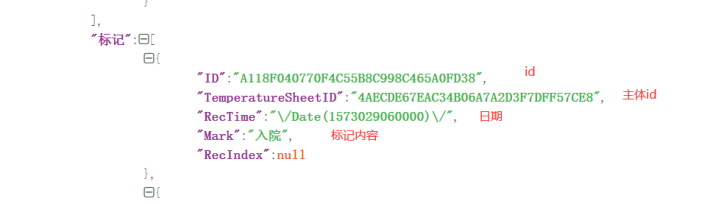

<!-- page: 229 -->

四川省基层医疗卫生机构管理信息系统应用接口规范 

|其他记录<br>脉搏记录<br>体温记录|
|---|


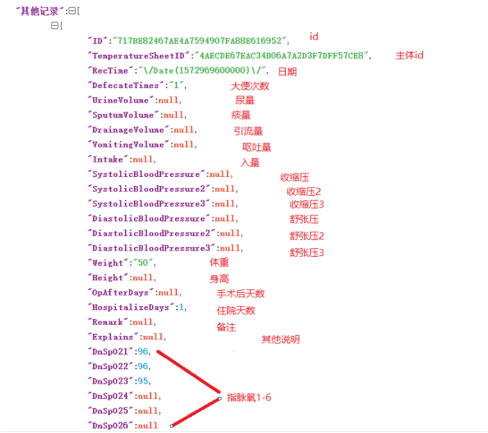


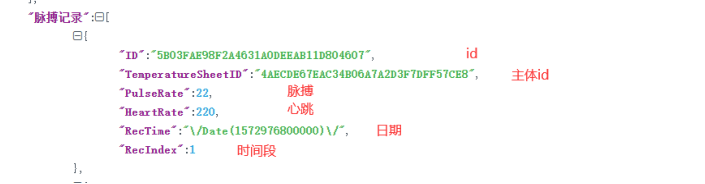


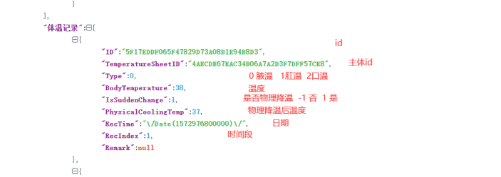


###### 6.4.9 400-009 电子病历 获取护理单 

|交易名称|获取护理单|
|---|---|
|接口说明|此接口用于获取护理单|
|入口参数||
|交易编号|400-009|

<!-- page: 230 -->

四川省基层医疗卫生机构管理信息系统应用接口规范 

|交易参数<br>出口参数|{" 验证码":"44200F7B173B00E136C04106FB29AA4A",  " 业务<br>ID":"90922C4A76CA4C55ACA861EA43AE3B5D"}|
|---|---|
|交易成功|{"Result":1,"Msg":["业务ID"："90922C4A76CA4C55ACA861EA43AE3B5D<br>","<br>护<br>理<br>记<br>录<br>":[{"ID":"C6A5D64B7CF54982AE6C562C4BE12BB4","RecordsID":"DEDE592<br>E2DE14D16B9D2A50CCB4C6120","Date":null,"Time":null,"Awareness":n<br>ull,"BodyTemperature":null,"Pulse":null,"Breathing":null,"BloodP<br>ressure":"111/111","OxygenSaturation":null,"Oxygen":null,"SkinCo<br>nditions":null,"PipelineCare":null,"ObservationMeasures":null,"N<br>urseSignature":"<br>欧<br>**","NUM":1,"AmName":null,"AmAmount":null,"AmColorCharacter":nul<br>l,"InName":null,"InIntake":null,"InWay":null,"OthName":null,"Oth<br>Desciption":null,"OrgID":"8BCDCA4E11A44A9D888D7E70DD4FF44F","Org<br>Num":6,"ARCHIVED_FLAG":200}]]}|
|交易失败|{"result":"0","msg":"错误信息"}|
|参数详细说<br>交易编号：<br>|明:<br><br><br><br>|
|代码|名称<br>约束<br>类型<br>说明|
|1|交易编号<br>NOT NULl<br>string|
|交易参数：||
|序号|名称<br>约束<br>类型<br>说明|
|1|验证码<br>NOT NULL<br>string|
|2|业务ID<br>NOT NULL<br>String|
|交易输出：||
|代码|名称<br>约束<br>类型<br>说明|

<!-- page: 231 -->

四川省基层医疗卫生机构管理信息系统应用接口规范 


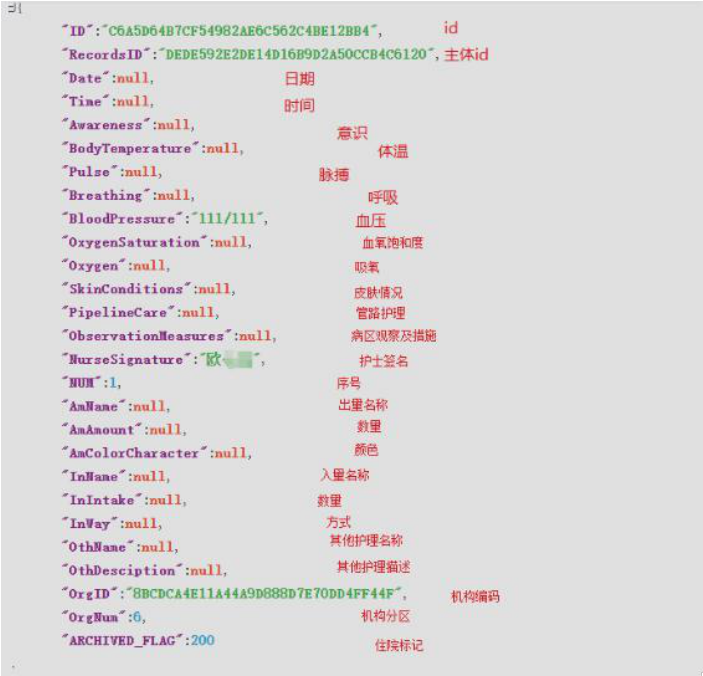


###### 6.4.10 400-010 电子病历 获取手术信息 

|交易名称|获取手术信息|
|---|---|
|接口说明|此接口用于获取手术信息|
|入口参数<br>||
|交易编号|400-010|
|交易参数|{" 验证码":"44200F7B173B00E136C04106FB29AA4A",  " 业务<br>ID":"90922C4A76CA4C55ACA861EA43AE3B5D"}|
|出口参数||
|交易成功|{"Result":1,"Msg":[{"<br>住<br>院<br>ID":"90922C4A76CA4C55ACA861EA43AE3B5D","<br>病<br>人<br>ID":"7E1411F248524CB8B458C4E60B48C3BB","<br>手<br>术<br>ID":"2F8BD265A8754F92BC4A5E60514A5651","手术编码":"60.29001","手<br>术名称":"经尿道前列腺气化电切术[TEVAP 手术]","手术开始时间<br>":"2020-03-01 18:19","手术结束时间":null,"手术医生":"周*","手术<br>医生编码":"16B5E6701A9F41ADA6918F4A594CDAE3","麻醉医师":null,"手<br>术一助":"周*","手术二助":null,"手术切口清洁度":null,"切口愈合等<br>级":null,"麻醉方式":"基础麻醉","手术持续时间":null,"手术科室编码<br>":"9326AC55AE194D358FD0AE73C509DBD4","手术科室名称":"外科","手术<br>类型":"Ⅱ"}]}|
|交易失败|{"result":"0","msg":"错误信息"}|

<!-- page: 232 -->

四川省基层医疗卫生机构管理信息系统应用接口规范 

|参数详细说<br>交易编号：<br>|明:<br>||||
|---|---|---|---|---|
|代码|名称|约束|类型|说明|
|1|交易编号|NOT NULl|string||
|交易参数：|||||
|序号|名称|约束|类型|说明|
|1|验证码|NOT NULL|string||
|2|业务ID|NOT NULL|String||
|交易输出：|||||
|代码|名称|约束|类型|说明|


###### 6.5PACS 系统 

###### 6.5.0 接入指引 

- 对接方式 

由对方系统调用HIS 接口 

- 对接流程 


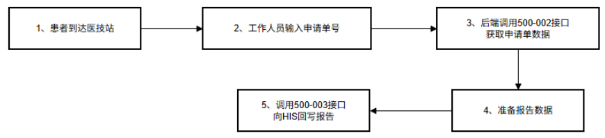


第一步：患者到医技站后，由工作人员输入申请单号，后端调用500-002 交易接口获取申请 单数据。 

第二步：调用500-003 向HIS 回写报告。 

###### 6.5.1 500-001 检查项目查询 

|交易名称|检查项目查询|
|---|---|
|接口说明|此接口用于获取HIS 系统中指定机构下的LIS 和PACS 检验检查包和明细清<br>单|

<!-- page: 233 -->

四川省基层医疗卫生机构管理信息系统应用接口规范 

|入口参数||
|---|---|
|交易编号|500-001|
|交易参数|{"0 验证码":"验证码",<br>"1 机构编码":"机构编码",<br>“2 包类型”:” 包类型”<br>}<br>例子：<br>{<br>"验证码":"44200F7B173B00E136C04106FB29AA4A",<br>"机构编码":"8BCDCA4E11A44A9D888D7E70DD4FF44F",<br>"包类型":"检验"<br>}|
|出口参数||
|交易成功|{"result":"1",<br>"msg":[{<br>"包名称":"乙肝标志物定量",<br>"包ID":"104D9251EC914D048B4F3762CBE63EFD",<br>"包编码":"SC202",<br>"包类型":"检验",<br>"包总金额":55.2,<br>"明细名称":"乙型肝炎表面抗原定量(HBsAg)测定",<br>"明细ID":"21DAC0AC1F434FC28C4E7F82864F0B6D",<br>"明细单价":10.4,<br>"明细数量":1,<br>"明细单位":"项",<br>"机构名称":"xxx 中心卫生院",<br>"机构ID":"8BCDCA4E11A44A9D888D7E70DD4FF44F"<br>}]<br>}|

<!-- page: 234 -->

四川省基层医疗卫生机构管理信息系统应用接口规范 

|交易失败<br>参数详细说<br>交易编号：|{"result":"0","m<br>明:<br>|sg":"错误信息"|}||
|---|---|---|---|---|
|代码|名称|约束|类型|说明|
|1|交易编号|NOT NULl|VARCHAR2(10)||
|交易参数：|||||
|序号|名称|约束|类型|说明|
|1|验证码|NOT NULl|VARCHAR2(32)||
|2|机构编码|NOT NULl|VARCHAR2(50)||
|2|包类型|NOT NULl|VARCHAR2(50)|检验、检查、体检|
|交易输出：|||||
|代码|名称|约束|类型|说明|
|1|包名称|NOT NULl|VARCHAR2(100<br>)||
|2|包ID|NOT NULl|VARCHAR2(100<br>)||
|3|包编码|NOT NULl|VARCHAR2(50)||
|4|包类型|NOT NULl|VARCHAR2(50)||
|5|包总金额|NOT NULl|VARCHAR2(100<br>)||
|6|明细名称|NOT NULl|VARCHAR2(50)||
|7|明细ID|NOT NULl|VARCHAR2(100<br>)||
|8|明细单价|NOT NULl|VARCHAR2(100<br>)||
|9|明细数量|NOT NULl|VARCHAR2(100<br>)||
|10|明细单位|NOT NULl|VARCHAR2(100<br>)||
|11|机构名称|NOT NULl|VARCHAR2(100<br>)||
|12|机构ID|NOT NULl|VARCHAR2(100<br>)||

<!-- page: 235 -->

四川省基层医疗卫生机构管理信息系统应用接口规范 

###### 6.5.2 500-002 按申请单号获取申请单 

交易名称 通过申请单号获取申请单 接口说明 通过申请单号获取申请单 入口参数 交易编号 500-002 { 交易参数 "机构ID": "", "申请单ID": "", "业务ID": "", "门诊号": "", "住院号": "", "验证码": "40890989D79446788CE30AC273F8F8A4" } 出口参数 { 交易成功 "Result": 1, "Msg": [ { "BILLID": "AA6E357E1DDC4B82B2DE975F486F3B9E", "OTHERTYPE": null, "CSTYPE": null, "ITEMCODE": "02", "ITEMNAME": "肾功", "FEE": 13, "PERSONID": "B6B78E8F0CC647629AA381EC26A96D41", "PERSONNAME": "新*", "CREATETIME": "2018-02-06 09:29:39", "OPERATERID": "3FBD6C8CD5C64C6797502A807D7D10DA", "OPERATERNAME": "杨**", "ORGID": "D79C14EFC47B4D9395C09242B3C5B8B2", "ORGNAME": "xxx 分院", "DIAGNOSIS": "", "BWINFO": "", "BUSINESSID": "DAB976AA8B864564AA27C2E5DB1ACAC8", "JZCODE": "02018020402", "SOURCETYPE": 6, "SOURCETYPENAME": "住院", 

<!-- page: 236 -->

四川省基层医疗卫生机构管理信息系统应用接口规范 

|交易失败|"URGENCY": null,<br>"OPERATERDEPTID": "44451<br>"OPERATERDEPTNAME": "全<br>"CURRENTBEDID": "4030669<br>"BEDCODE": "2",<br>"BEDNAME": "2",<br>"CARDTYPE": "01",<br>"CARDTYPENAME": "居民身<br>"CARDID": "511xxxxxxxxxx<br>"TEL": "无",<br>"GENDER": "男",<br>"BIRTHDAY": "1934-10-11"<br>"ACTDEPTID": "10BD31A636<br>"ACTDEPTNAME": "检验科"<br>}<br>]<br>}<br>{"result":"0","msg":"错误信息"|4DCA266452EB06C3E563A570836",<br>科",<br>7B4D74044B34147BE79E85891",<br>份证",<br>x",<br>,<br>574204B56ED6D7FA6F2DC3",<br>}|
|---|---|---|
|参数详细说|明:||
|交易编号：|||
|代码|名称<br>约束|类型<br>说明|
|1|交易编号<br>NOTNULl|VARCHAR2(10)|
|交易参数：|<br>||
|序号|名称<br>约束|类型<br>说明|
|1|验证码<br>NOT Null|VARCHAR2(32)|
|2|机构ID<br>NOT NULl|VARCHAR2(32)|
|3|申请单ID<br>NULl|VARCHAR2(32)|
|4|业务ID<br>NULL|VARCHAR2(32)|
|5|门诊号<br>NULL|VARCHAR2(50)|
|6|住院号<br>NULL|VARCHAR2(50)|


6.5.4 500-003 回写检查报告 

<!-- page: 237 -->

四川省基层医疗卫生机构管理信息系统应用接口规范 

|接口说明|FHIR 格式的检查报告推送|
|---|---|
|入口参数||
|交易编号|500-004|
|交易参数|{<br>"验证码": "40890989D79446788CE30AC273F8F8A4",<br>"入参": "检查报告字符串(base64 编码)"<br>}|
|出口参数||
|调用成功|{<br>"Result": 1,<br>"Msg": "报告保存成功"<br>}|
|调用失败|{"Result":"0","msg":"错误信息"}|
|备注||


###### 6.6LIS 系统 

###### 6.6.0 接入指引 

- 对接方式 

由对方系统调用HIS 接口 

- 对接流程 


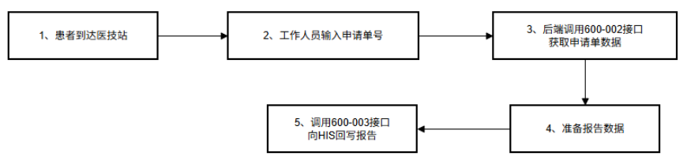


第一步：患者到医技站后，由工作人员输入申请单号，后端调用600-002 交易接口获取申请 单数据。 

第二步：调用600-003 向HIS 回写报告。 

<!-- page: 238 -->

四川省基层医疗卫生机构管理信息系统应用接口规范 

###### 6.6.1 600-001 检验项目查询 

|交易名称|检验项目查询|
|---|---|
|接口说明|此接口用于获取HIS 系统中指定机构下的LIS 和PACS 检验检查包和明细清<br>单|
|入口参数||
|交易编号|600-001|
|交易参数|{"0 验证码":"验证码",<br>"1 机构编码":"机构编码",<br>“2 包类型”:” 包类型”<br>}<br>例子：<br>{<br>"验证码":"44200F7B173B00E136C04106FB29AA4A",<br>"机构编码":"8BCDCA4E11A44A9D888D7E70DD4FF44F",<br>"包类型":"检验"<br>}|
|出口参数||
|交易成功|{"result":"1",<br>"msg":[{<br>"包名称":"乙肝标志物定量",<br>"包ID":"104D9251EC914D048B4F3762CBE63EFD",<br>"包编码":"SC202",<br>"包类型":"检验",<br>"包总金额":55.2,<br>"明细名称":"乙型肝炎表面抗原定量(HBsAg)测定",<br>"明细ID":"21DAC0AC1F434FC28C4E7F82864F0B6D",<br>"明细单价":10.4,|

<!-- page: 239 -->

四川省基层医疗卫生机构管理信息系统应用接口规范 

"明细数量":1, "明细单位":"项", "机构名称":"xxx 中心卫生院", "机构ID":"8BCDCA4E11A44A9D888D7E70DD4FF44F" }] } 交易失败 {"result":"0","msg":"错误信息"} 参数详细说明: 

|交易编号：<br>代码|名称|约束|类型|说明|
|---|---|---|---|---|
|1|交易编号|NOT NULl|VARCHAR2(10)||
|交易参数：<br>|||||
|序号|名称|约束|类型|说明|
|1|验证码|NOT NULl|VARCHAR2(32)||
|2|机构编码|NOT NULl|VARCHAR2(50)||
|2|包类型|NOT NULl|VARCHAR2(50)|检验、检查、体检|
|交易输出：<br>|||||
|代码|名称|约束|类型|说明|
|1|包名称|NOT NULl|VARCHAR2(100<br>)||
|2|包ID|NOT NULl|VARCHAR2(100<br>)||
|3|包编码|NOT NULl|VARCHAR2(50)||
|4|包类型|NOT NULl|VARCHAR2(50)||
|5|包总金额|NOT NULl|VARCHAR2(100<br>)||
|6|明细名称|NOT NULl|VARCHAR2(50)||
|7|明细ID|NOT NULl|VARCHAR2(100<br>)||
|8|明细单价|NOT NULl|VARCHAR2(100<br>)||
|9|明细数量|NOT NULl|VARCHAR2(100<br>)||
|10|明细单位|NOT NULl|VARCHAR2(100||

<!-- page: 240 -->

四川省基层医疗卫生机构管理信息系统应用接口规范 

|11|机构名称|NOT NULl|)<br>VARCHAR2(100<br>)|
|---|---|---|---|
|12|机构ID|NOT NULl|VARCHAR2(100<br>)|


###### 6.6.2 600-002 按申请单号获取申请单 

交易名称 通过申请单号获取申请单 接口说明 通过申请单号获取申请单 入口参数 交易编号 600-002 { 交易参数 "机构ID": "", "申请单ID": "", "业务ID": "", "门诊号": "", "住院号": "", "验证码": "40890989D79446788CE30AC273F8F8A4" } 出口参数 { 交易成功 "Result": 1, "Msg": [ { "BILLID": "AA6E357E1DDC4B82B2DE975F486F3B9E", "OTHERTYPE": null, "CSTYPE": null, "ITEMCODE": "02", "ITEMNAME": "肾功", "FEE": 13, "PERSONID": "B6B78E8F0CC647629AA381EC26A96D41", "PERSONNAME": "新*", "CREATETIME": "2018-02-06 09:29:39", "OPERATERID": "3FBD6C8CD5C64C6797502A807D7D10DA", "OPERATERNAME": "杨**", "ORGID": "D79C14EFC47B4D9395C09242B3C5B8B2", "ORGNAME": "xxx 分院", "DIAGNOSIS": "", "BWINFO": "", 

<!-- page: 241 -->

四川省基层医疗卫生机构管理信息系统应用接口规范 

|交易失败|"BUSINESSID": "DAB976AA8<br>"JZCODE": "02018020402",<br>"SOURCETYPE": 6,<br>"SOURCETYPENAME": "住院"<br>"URGENCY": null,<br>"OPERATERDEPTID": "44451<br>"OPERATERDEPTNAME": "全<br>"CURRENTBEDID": "4030669<br>"BEDCODE": "2",<br>"BEDNAME": "2",<br>"CARDTYPE": "01",<br>"CARDTYPENAME": "居民身<br>"CARDID": "511xxx",<br>"TEL": "无",<br>"GENDER": "男",<br>"BIRTHDAY": "1934-10-11"<br>"ACTDEPTID": "10BD31A636<br>"ACTDEPTNAME": "检验科"<br>}<br>]<br>}<br>{"result":"0","msg":"错误信息"|B864564AA27C2E5DB1ACAC8",<br> <br>,<br>4DCA266452EB06C3E563A570836",<br>科",<br>7B4D74044B34147BE79E85891",<br>份证",<br>,<br>574204B56ED6D7FA6F2DC3",<br>}|
|---|---|---|
|参数详细说|明:||
|交易编号：|||
|代码|名称<br>约束|类型<br>说明|
|1|交易编号<br>NOT NULl|VARCHAR2(10)|
|交易参数：|||
|序号|名称<br>约束|类型<br>说明|
|1|验证码<br>NOT Null|VARCHAR2(32)|
|2|机构ID<br>NOT NULl|VARCHAR2(32)|
|3|申请单ID<br>NULl|VARCHAR2(32)|
|4|业务ID<br>NULL|VARCHAR2(32)|
|5|门诊号<br>NULL|VARCHAR2(50)|
|6|住院号<br>NULL|VARCHAR2(50)|

<!-- page: 242 -->

四川省基层医疗卫生机构管理信息系统应用接口规范 

###### 6.6.3 600-003 回写检验报告 


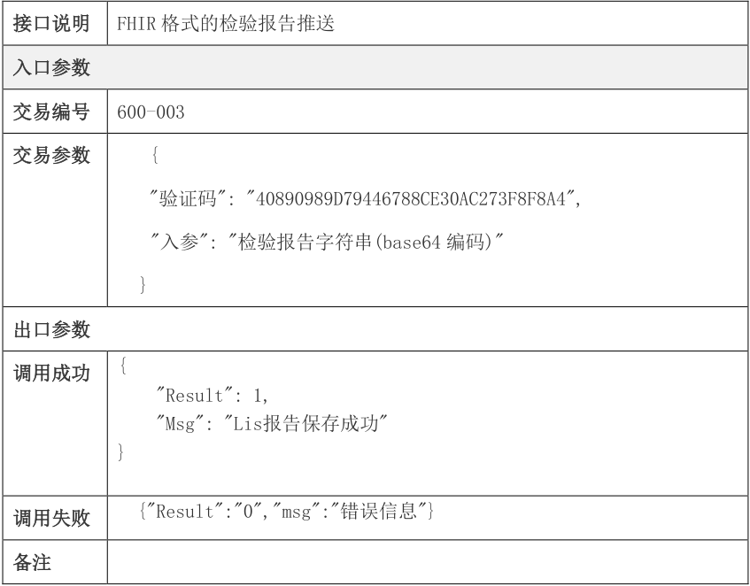


<!-- Start of picture text -->
接口说明 FHIR 格式的检验报告推送<br>入口参数<br>交易编号 600-003<br>交易参数 {<br>"验证码": "40890989D79446788CE30AC273F8F8A4",<br>"入参": "检验报告字符串(base64 编码)"<br>}<br>出口参数<br>{<br>调用成功<br>"Result": 1,<br>"Msg": "Lis报告保存成功"<br>}<br>{"Result":"0","msg":"错误信息"}<br>调用失败<br>备注<br><!-- End of picture text -->

###### 6.7 心电系统 

###### 6.7.0 接入指引 


<!-- Start of picture text -->
 对接方式<br>由对方系统调用HIS 接口<br> 对接流程<br><!-- End of picture text -->


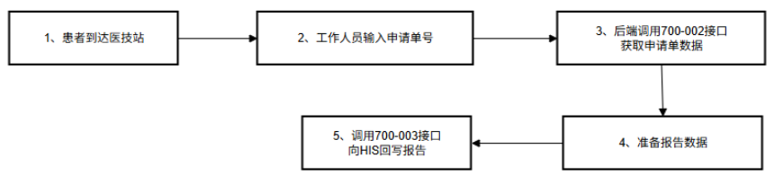


第一步：患者到医技站后，由工作人员输入申请单号，后端调用700-002 交易接口获取申请 

<!-- page: 243 -->

四川省基层医疗卫生机构管理信息系统应用接口规范 

单数据。 

第二步：调用700-003 向HIS 回写报告。 

###### 6.7.1 700-001 心电项目查询 

|交易名称|检验项目查询|
|---|---|
|接口说明|此接口用于获取HIS 系统中指定机构下的LIS 和PACS 检验检查包和明细清<br>单|
|入口参数||
|交易编号|700-001|
|交易参数|{"验证码":"验证码",<br>"机构编码":"机构编码",<br>“包类型”:” 包类型”<br>}<br>例子：<br>{<br>"验证码":"44200F7B173B00E136C04106FB29AA4A",<br>"机构编码":"8BCDCA4E11A44A9D888D7E70DD4FF44F",<br>"包类型":"检验"<br>}|
|出口参数||
|交易成功|{"result":"1",<br>"msg":[{<br>"包名称":"乙肝标志物定量",<br>"包ID":"104D9251EC914D048B4F3762CBE63EFD",<br>"包编码":"SC202",<br>"包类型":"检验",<br>"包总金额":55.2,<br>"明细名称":"乙型肝炎表面抗原定量(HBsAg)测定",|

<!-- page: 244 -->

四川省基层医疗卫生机构管理信息系统应用接口规范 

|"明细ID":"21DAC<br>"明细单价":10.4,<br>"明细数量":1,<br>"明细单位":"项",<br>"机构名称":"xxx<br>"机构ID":"8BCDC<br>}]<br>}<br>交易失败<br>{"result":"0","msg":"错误信息"|0AC1F434FC28C4E<br><br><br>中心卫生院",<br>A4E11A44A9D888D<br>}|7F82864F0B6D",<br>7E70DD4FF44F"|
|---|---|---|
|参数详细说明:<br>交易编号：|||
|代码<br>名称<br>约束|类型|说明|
|1<br>交易编号<br>NOT NULl|VARCHAR2(10)||
|交易参数：<br><br><br>|||
|序号<br>名称<br>约束|类型|说明|
|1<br>验证码<br>NOT NULl|VARCHAR2(32)||
|2<br>机构编码<br>NOT NULl|VARCHAR2(50)||
|2<br>包类型<br>NOT NULl|VARCHAR2(50)|检验、检查、体检|
|交易输出：|||
|代码<br>名称<br>约束|类型|说明|
|1<br>包名称<br>NOT NULl|VARCHAR2(100<br>)||
|2<br>包ID<br>NOT NULl|VARCHAR2(100<br>)||
|3<br>包编码<br>NOT NULl|VARCHAR2(50)||
|4<br>包类型<br>NOT NULl|VARCHAR2(50)||
|5<br>包总金额<br>NOT NULl|VARCHAR2(100<br>)||
|6<br>明细名称<br>NOT NULl|VARCHAR2(50)||
|7<br>明细ID<br>NOT NULl|VARCHAR2(100<br>)||
|8<br>明细单价<br>NOT NULl|VARCHAR2(100<br>)||

<!-- page: 245 -->

四川省基层医疗卫生机构管理信息系统应用接口规范 

|9|明细数量|NOT NULl|VARCHAR2(100<br>)|
|---|---|---|---|
|10|明细单位|NOT NULl|VARCHAR2(100<br>)|
|11|机构名称|NOT NULl|VARCHAR2(100<br>)|
|12|机构ID|NOT NULl|VARCHAR2(100<br>)|


###### 6.7.2 700-002 按申请单号获取申请单 

|交易名称|通过申请单号获取申请单|
|---|---|
|接口说明|通过申请单号获取申请单|
|入口参数<br>||
|交易编号|700-002|
|交易参数|{<br>"机构ID": "",<br>"申请单ID": "",<br>"业务ID": "",<br>"门诊号": "",<br>"住院号": "",<br>"验证码": "40890989D79446788CE30AC273F8F8A4"<br>}|
|出口参数||
|交易成功|{<br>"Result": 1,<br>"Msg": [<br>{<br>"BILLID": "AA6E357E1DDC4B82B2DE975F486F3B9E",<br>"OTHERTYPE": null,<br>"CSTYPE": null,<br>"ITEMCODE": "02",<br>"ITEMNAME": "肾功",<br>"FEE": 13,<br>"PERSONID": "B6B78E8F0CC647629AA381EC26A96D41",<br>"PERSONNAME": "新*",<br>"CREATETIME": "2018-02-06 09:29:39",<br>"OPERATERID": "3FBD6C8CD5C64C6797502A807D7D10DA",|

<!-- page: 246 -->

四川省基层医疗卫生机构管理信息系统应用接口规范 

"OPERATERNAME": "杨xxx", "ORGID": "D79C14EFC47B4D9395C09242B3C5B8B2", "ORGNAME": "xxx 分院", "DIAGNOSIS": "", "BWINFO": "", "BUSINESSID": "DAB976AA8B864564AA27C2E5DB1ACAC8", "JZCODE": "02018020402", "SOURCETYPE": 6, "SOURCETYPENAME": "住院", "URGENCY": null, "OPERATERDEPTID": "444514DCA266452EB06C3E563A570836", "OPERATERDEPTNAME": "全科", "CURRENTBEDID": "40306697B4D74044B34147BE79E85891", "BEDCODE": "2", "BEDNAME": "2", "CARDTYPE": "01", "CARDTYPENAME": "居民身份证", "CARDID": "511xxx", "TEL": "无", "GENDER": "男", "BIRTHDAY": "1934-10-11", "ACTDEPTID": "10BD31A636574204B56ED6D7FA6F2DC3", "ACTDEPTNAME": "检验科" } ] } 交易失败 {"result":"0","msg":"错误信息"} 参数详细说明: 交易编号： 

|代码|名称|约束|类型|说明|
|---|---|---|---|---|
|1|交易编号|NOT NULl|VARCHAR2(10)||
|交易参数：<br>|||||
|序号|名称|约束|类型|说明|
|1|验证码|NOT Null|VARCHAR2(32)||
|2|机构ID|NOT NULl|VARCHAR2(32)||
|3|申请单ID|NULl|VARCHAR2(32)||
|4|业务ID|NULL|VARCHAR2(32)||
|5|门诊号|NULL|VARCHAR2(50)||

<!-- page: 247 -->

|||四川省基层医疗卫生机构管理信息系统应用接口规范|
|---|---|---|
|6<br>住院号|NULL|VARCHAR2(50)|


###### 6.7.4 700-003 回写心电报告 

|接口说明|FHIR 格式的心电报告推送|
|---|---|
|入口参数||
|交易编号|700-004|
|交易参数|{<br>"验证码": "40890989D79446788CE30AC273F8F8A4",<br>"入参": "心电报告字符串(base64 编码)"<br>}|
|出口参数||
|调用成功|{<br>"Result": 1,<br>"Msg": "Pacs报告保存成功"<br>}|
|调用失败|{"Result":"0","msg":"错误信息"}|
|备注||


###### 6.8 分诊叫号 

###### 6.8.0 接入指引 

######  对接方式 

由叫号系统定时调用 HIS 接口获取待接诊患者列表数据，实现叫号功能。 

- 对接流程 

定时拉取待接诊患者列表接口 800-001 。 

<!-- page: 248 -->

四川省基层医疗卫生机构管理信息系统应用接口规范 

###### 6.8.1 800-001 获取待接诊列表 

|交易名称|查询待接诊列表|
|---|---|
|接口说明|此接口用于获取HIS 系统中的待接诊记录|
|入口参数||
|交易编号|800-001|
|交易参数|{"验证码":"验证码",<br>"身份证号码":"身份证号码",<br>“机构编码”: ”机构ID”<br>}|
|出口参数||
|交易成功|{"result":"1",<br>"msg":[{<br>"1 挂号ID":"挂号ID",<br>"2 挂号时间":"挂号时间",<br>"3 科室":"科室",<br>"4 医生":"医生",<br>"5 医院名称":"医院名称",<br>"6 门诊号":"门诊号",<br>"7 就诊序号":"就诊序号",<br>"8 是否可退":"是否可退"，<br>"9 姓名":"姓名"，<br>"10 身份证号码":"身份证号码"，<br>"11 状态":"状态"，<br>"12 金额":"金额"，<br>"13 缴费流水号":"缴费流水号"，<br>"14 挂号模板ID":"挂号模板ID "，<br>"15 来源":"来源"，|

<!-- page: 249 -->

四川省基层医疗卫生机构管理信息系统应用接口规范 

|}]<br>}<br>交易失败<br>{"result":"0","m<br>参数详细说明:<br>交易编号：|sg":"错误信息"|}||
|---|---|---|---|
|代码<br>名称|约束|类型|说明|
|1<br>交易编号|NOT NULl|VARCHAR2(10)||
|交易参数：||||
|序号<br>名称|约束|类型|说明|
|1<br>验证码|NOT NULl|VARCHAR2(32)||
|2<br>身份证号|NOT NULl|VARCHAR2(18)|可为空，为空时查询<br>该机构下指定时间段<br>内的所有挂号信息|
|3<br>机构编码|NOT NULl|VARCHAR2(32)||
|交易输出：||||
|代码<br>名称|约束|类型|说明|
|1<br>挂号ID|NOT NULl|VARCHAR2(32)||
|2<br>挂号时间|NOT NULl|VARCHAR2(20)||
|3<br>科室|NOT NULl|VARCHAR2(50)||
|4<br>医生|NOT NULl|VARCHAR2(50)||
|5<br>医院名称|NOT NULl|VARCHAR2(50)||
|6<br>门诊号||VARCHAR2(50)||
|7<br>就诊序号||VARCHAR2(50)||
|8<br>是否可退|NOT NULl|VARCHAR2(1)|0 否1 是|
|9<br>姓名|NOT NULl|VARCHAR2(20)||
|10<br>身份证号码|NOT NULl|VARCHAR2(20)||
|11<br>状态||VARCHAR2(1)|-1'已退号'<br>0'待接诊'<br>1'接诊中'<br>2,'完成接诊'<br>其他,'未知状态'|
|12<br>金额||VARCHAR2(10)||

<!-- page: 250 -->

四川省基层医疗卫生机构管理信息系统应用接口规范 

|13|缴费流水号||VARCHAR2(50)|入参"是否获取收费<br>信息"不传或值为"否<br>"时，不返回缴费流水<br>号|
|---|---|---|---|---|
|14|挂号模板ID|NOT NULl|VARCHAR2(50)||
|15|来源|NOT NULl|VARCHAR2(10)|返回值：线上、线下|


###### 6.8.2 800-002 获取门诊待发药/最近7 天内已发药列表 

|交易名称|获取待发药/最近7 天内已发药列表|
|---|---|
|接口说明|此接口可用于药房排队叫号|
|入口参数<br>||
|交易编号|800-002|
|交易参数|{"验证码":"验证码",|
|出口参数|"OrgID":"机构32 位GUID",<br>“StartTime”:”2012-1-1”,<br>“EndTime”:”2012-1-2”,<br>“Status”:”发药状态0 或1”<br>}|
|交易成功|{"Result":1,"Msg":[{"<br>就<br>诊|
||ID":"A45F67A307704425BC984DDC5AE2F6B3"," 病人姓名":"xxx"," 年龄<br><br><br><br><br><br><br><br><br><br>|
||":"34<br>岁<br>","<br>性<br>别<br>":"<br>男<br>","<br>机<br>构|
||ID":"8BCDCA4E11A44A9D888D7E70DD4FF44F","<br>时<br>间<br><br><br><br><br><br><br><br><br>|
||":"\/Date(1634109046000)\/","<br>科<br>室<br>":"<br>外<br>科<br>"},{"<br>就<br>诊|
||ID":"D89C4A77D2244E848CA99F14C863EF89"," 病人姓名":"xxx"," 年龄<br><br><br><br><br><br><br><br><br><br>|
||":"34<br>岁<br>","<br>性<br>别<br>":"<br>男<br>","<br>机<br>构|
||ID":"8BCDCA4E11A44A9D888D7E70DD4FF44F","<br>时<br>间|
||":"\/Date(1634445253000)\/","<br>科<br>室<br>":"<br>外<br>科<br>"},{"<br>就<br>诊|

<!-- page: 251 -->

四川省基层医疗卫生机构管理信息系统应用接口规范 

|ID":"B42612A20AA941D2B6416FED|6891E674","病人姓名":"测试体温单","|
|---|---|
|年<br>龄<br>":"23<br>岁<br>","|性<br>别<br>":"<br>女<br>","<br>机<br>构|
|ID":"8BCDCA4E11A44A9D888D7E70<br>":"\/Date(1634520694000)\/","<br>ID":"53F5E85878C74E15A9D25B6E|DD4FF44F","<br>时<br>间<br>科<br>室<br>":"<br>外<br>科<br>"},{"<br>就<br>诊<br>7B4B80A5"," 病人姓名":" 林*"," 年龄<br>|
|":"59<br>岁<br>","<br>性|别<br>":"<br>男<br>","<br>机<br>构|
|ID":"8BCDCA4E11A44A9D888D7E70|DD4FF44F","<br>时<br>间|
|":"\/Date(1634717931000)\/","|科室":"内科"}]"}|
|交易失败<br>{"result":"0","msg":"错误信息|"}|
|参数详细说明:<br>||
|交易编号：||
|代码<br>名称<br>约束|类型<br>说明|
|1<br>交易编号<br>NOTNULl|VARCHAR2(10)|
|<br>交易参数：||
|序号<br>名称<br>约束|类型<br>说明|
|1<br>验证码<br>NOT NULl|VARCHAR2(32)|
|2<br>OrgID<br>NOT NULl|VARCHAR2(32)<br>机构ID|
|3<br>Status<br>Null|int<br>0 待发药,1 已发药|
|4<br>StartTime<br>Null|VARCHAR2<br>Yyyy-MM-dd|
|5<br>EndTime<br>Null|VARCHAR2<br>Yyyy-MM-dd|
|交易输出：||
|代码<br>名称<br>约束|类型<br>说明|
|1<br>Result|int<br>1 成功,0 失败|
|2<br>Msg|Sting<br>错误信息|


###### 6.8.3 800-003 获取待执行检查检验列表 

|交易名称|获取待执行检查检验列表|
|---|---|
|接口说明|此接口可用于获取待执行的检查检验列表|
|入口参数||
|交易编号|800-003|

<!-- page: 252 -->

四川省基层医疗卫生机构管理信息系统应用接口规范 

|交易参数|{<br>"验证码": "验证码",<br>"Type": "1",<br>"OrgID": "8BCDCA4E11A44A9D<br>"BID": "5E619E958B574744AF<br>"BeginTime": "2024-01-01",<br>"EndTime": "2024-12-01"<br>}|888D7E70DD4FF4<br>EA6702755239FC<br>|4F",<br>",|
|---|---|---|---|
|出口参数||||
|交易成功|{<br>"Result": 1,<br>"Msg": [{<br>"申请单ID": "17EE2069<br>"项目名称": "心电测试<br>"患者姓名": "xxx",<br>"性别": "女",<br>"年龄": "82 岁",<br>"身份证号": "512927***<br>"业务编号": "M20241126<br>"类型": "门诊",<br>"开单时间": "2024/11/2<br>"执行科室ID": "428C81<br>"执行科室名称": "影像<br>}]<br>|8F4E425497B690D<br>包",<br>*****022",<br>0001",<br>6 09:41",<br>605F3E4510B5F25<br>科"|E6CECCEE3",<br>9A46E30CF54",|
|交易失败|}<br>{"result":"0","msg":"错误信息"|}||
|参数详细说|明:|||
|交易编号：||||
|代码|名称<br>约束|类型|说明|
|1|交易编号<br>NOT NULl|VARCHAR2(10)||
|交易参数：||||
|序号|名称<br>约束|类型|说明|
|1|验证码<br>NOT NULl|VARCHAR2(32)||
|2|Type<br>NOT NULl|int|1:检查2：检验|
|3|OrgID<br>not Null|VARCHAR2(32)|机构ID|
|4|BID<br>Null|VARCHAR2(32)|业务ID|
|5|BeginTime<br>not Null|VARCHAR2|yyyy-MM-dd|

<!-- page: 253 -->

四川省基层医疗卫生机构管理信息系统应用接口规范 

|6|EndTime|not null|VARCHAR2|yyyy-MM-dd|
|---|---|---|---|---|
|交易输出：|||||
|代码|名称|约束|类型|说明|
|1|||||


###### 6.8.4 800-004 接收患者签到状态回写HIS 

|交易名称|接收患者签到状态回写HIS|||
|---|---|---|---|
|接口说明|此接口可用于患者签到时将签到信|息同步到HIS||
|入口参数||||
|交易编号|800-004|||
|交易参数|{<br>"验证码":<br>"验证码（必<br>"业务ID":<br>"在接口12<br>"机构ID":<br>"机构编码（<br>"科室ID":<br>"科室编码（<br>"签到编码":<br>"自定义的<br>}|填）",<br>返回的业务ID（<br>必填）",<br>必填）",<br>字符串"|必填）",|
|出口参数||||
|交易成功<br>交易失败|{<br>"Result":<br>1,<br>"Msg":<br>"信息保存成功！<br>}<br>{"result":"0","msg":"错误信息"|"<br>}||
|参数详细说<br>交易编号：<br>|明:<br> <br><br>|||
|代码|名称<br>约束|类型|说明|
|1|交易编号<br>NOT NULl|VARCHAR2(10)||
|交易参数：||||
|序号|名称<br>约束|类型|说明|
|1|验证码<br>NOT NULL|VARCHAR2(32)||
|2|业务ID<br>NOT NULL|VARCHAR2(32)|业务ID|
|3|机构ID<br>NOT NULL|VARCHAR2(32)|机构ID|
|4|科室ID<br>NOT NULL|VARCHAR2(32)|科室ID|

<!-- page: 254 -->

四川省基层医疗卫生机构管理信息系统应用接口规范 

|5|签到编码|NULL|VARCHAR2(500<br>)|自定义的字符串|
|---|---|---|---|---|
|交易输出：<br>|<br>||||
|代码|名称|约束|类型|说明|
|1|Result||int|1 成功,0 失败|
|2|Msg||Sting|错误信息|


###### 6.9 远程会诊 

###### 6.9.0 接入指引 

- 接入方式 

由远程会诊系统调用 HIS 接口获取患者数据 

######  接入流程 

第一步：在 HIS 中配置远程会诊系统地址 


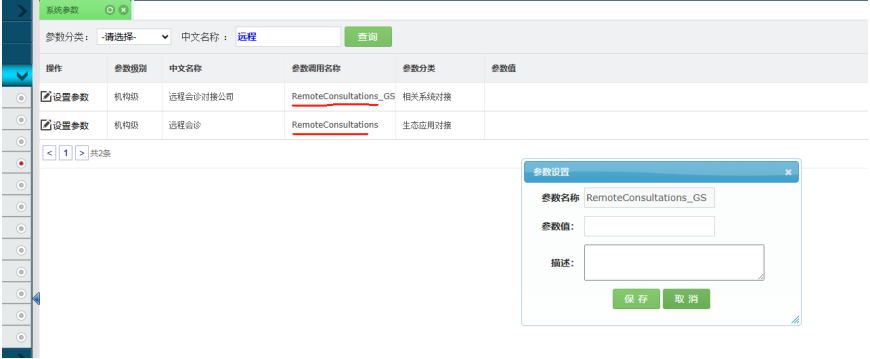


第二步：调用 HIS 6.3.1 住院病人信息查询和6.3.2 门诊病人信息查询接口 

###### 6.9.1 300-001 住院病人信息查询 

接口详情同双向转诊6.3.1 

###### 6.9.2 300-002 门诊病人信息查询 

接口详情同双向转诊6.3.2 

<!-- page: 255 -->

四川省基层医疗卫生机构管理信息系统应用接口规范 

###### 6.9.3 900-001 回写远程会诊结果 

|交易名称|远程会诊回写接口|
|---|---|
|接口说明|此接口用于远程会诊回写接口|
|入口参数||
|交易编<br>号|900-001|
|交易参<br>数|{     "验证码":"44200F7B173B00E136C04106FB29AA4A",     "code":"会<br>诊编码",     "orgname":"申请机构名称",     "applydoctor":"申请医<br>生",     "applytime":"申请时间",     "personname":"患者姓名",<br>"personage":" 患者年龄",     "persongender":" 患者性别",<br>"personcardID":" 患者身份证",     "diagnosis":" 初步诊断",<br>"abstracts":" 病历摘要",     "objective":" 会诊目的",<br>"reason":"会诊原因",     "time":"会诊时间",     "opinion":"诊断意<br>见",     "conclusion":" 会诊结论",     "doctor":" 报告医生",<br>"reporttime":"报告时间" }|
|出口参数||
|交易成<br>功|{"Result":”1”,"Msg":”回写成功。”}|
|交易失<br>败|{"result":"0","msg":"错误信息"}|
|参数详细<br>交易编号<br>|说明:<br>：<br><br><br><br>|
|代码|名称<br>约束<br>类型<br>说明|
|1|交易编号<br>NOT NULl<br>string<br>1002|
|交易参数|：|
|序号|名称|

<!-- page: 256 -->

四川省基层医疗卫生机构管理信息系统应用接口规范 


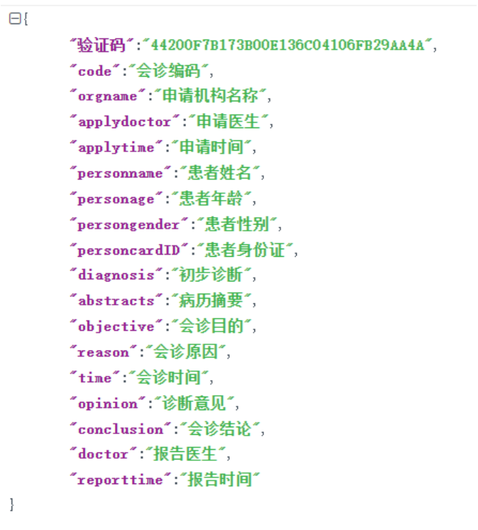


|交易输出|：||||
|---|---|---|---|---|
|代码|名称|约束|类型|说明|
|1|Result||int|1 成功,0 失败|
|2|Msg||Sting|错误信息|


###### 6.10 报告跨机构调阅 

###### 6.10.0 接入指引 

 接入方式 

诊间调阅患者在互认平台的报告 

- 接入流程 

1. his 设置互认报告调阅接口 

使用【县级管理员】在系统参数【是否启用辅检报告互认】描述中配置的 IP 和端口号。 

2. 获取互认报告的接口地址 

请求参数示例 `(JSON)` ： 

```
{
```

<!-- page: 257 -->

四川省基层医疗卫生机构管理信息系统应用接口规范 

医疗机构代码 `:"",` 身份证 `:"",` 姓名 `:"" }` 返回参数某厂商示例（ `JSON` ）： `{ "` 返回状态 `": "0000", "` 错误信息 `": "", "` 有无报告 `": "1", "` 报告地址 `": [{ "hrxxxq": "http://10.254.8.8:8180/show?cardid=xxxxxxxxx" }] }` 

1. 查看患者是否有报告 

当返回参数包含互认报告的地址时，HIS 界面则显示（有）报告，否则显示（无）报告。 

2. 由互认平台提供按身份证展示报告的页面 

`his` 调用 `http://x.x.x.x:xxxx/show?cardid=xxxxxxxxx` 


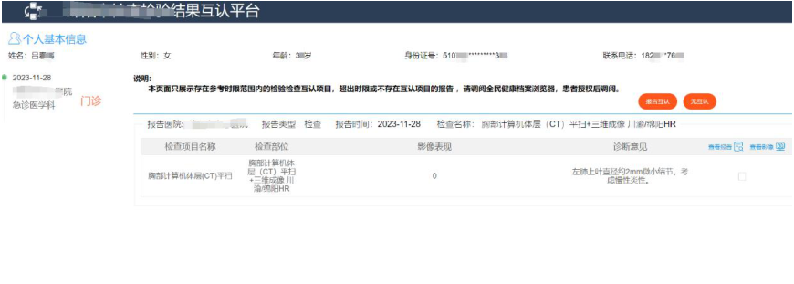


1. 由 HIS 发起调互认报告页面 

<!-- page: 258 -->

四川省基层医疗卫生机构管理信息系统应用接口规范 


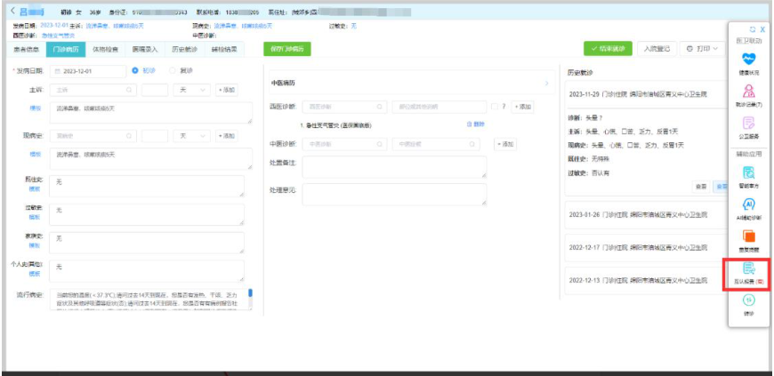


###### 2. 县级参数设置： 


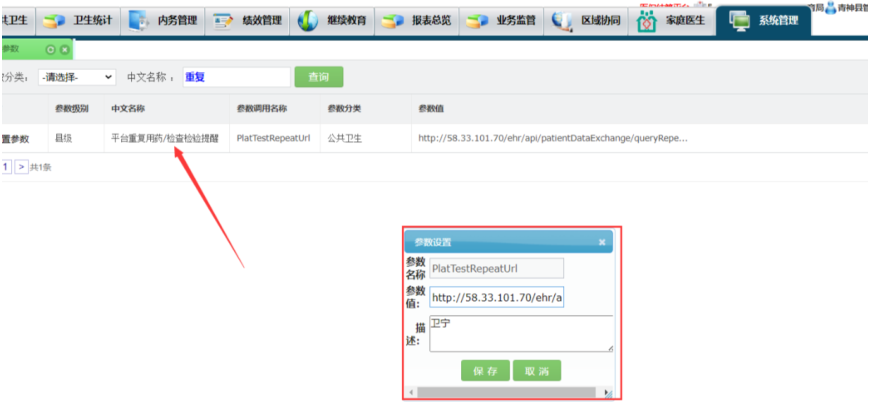

<!-- page: 259 -->

#### 附件3 

## 自建业务信息系统接入申请表 

|申请单位|市（州）或县（市、区）<br>卫健部门<br>申请时间|
|---|---|
|联系人姓名|联系电话|
|系统接入内容|系统名称：自建信息系统名称<br>厂商名称：自建信息系统承建厂商<br>接口范围：使用的具体接口名称<br>机构名单：授权使用接口的基层医疗卫生机构名单<br>使用期限：x 年x 月x 日- x 年x 月x 日<br>等保测评：信息安全等保级别及证明<br>云网设施：系统部署的云服务厂商及存储位置、接入网络类型|
|系统接入用途||
|申请单位签章||
||年<br>月<br>日|
|备注||


说明：每个承建厂商的每种系统填写一张申请表。 

<!-- page: 260 -->

